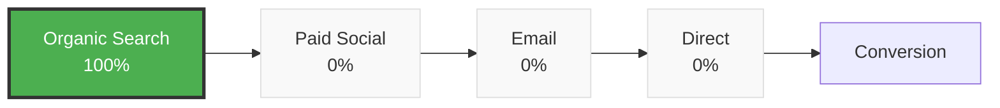
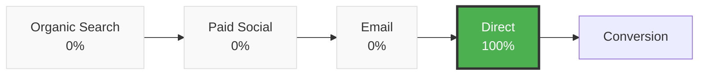
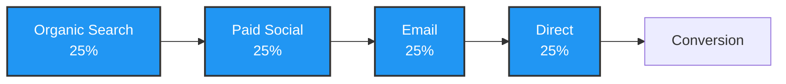
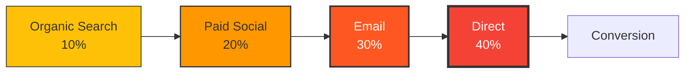
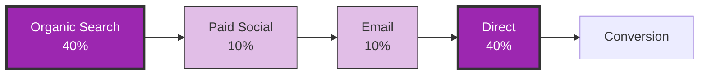
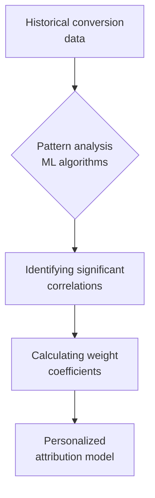
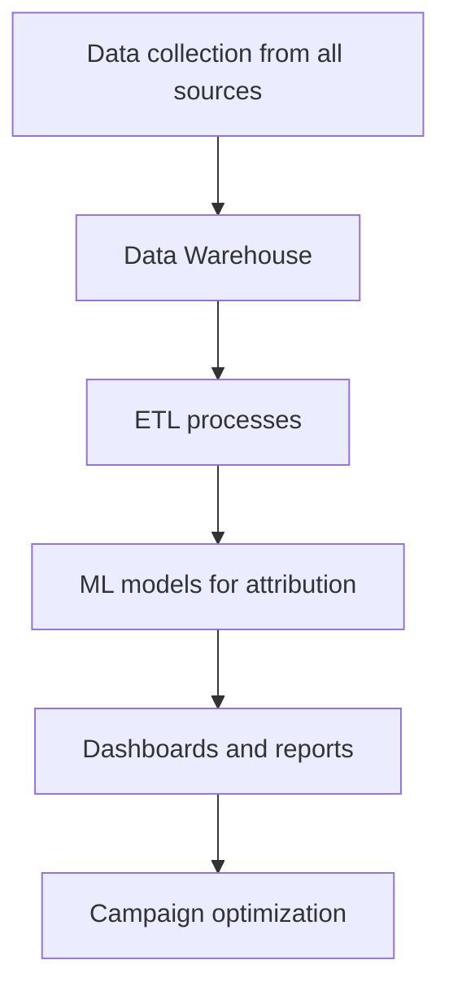

# Attribution Models in Web Analytics: Complete Guide to Conversion Value Distribution

An attribution model determines which marketing channel gets credit for a conversion when users interact with a brand through multiple traffic sources. This is a critically important mechanism for understanding the effectiveness of different acquisition channels and optimizing marketing budgets.

In modern web analytics, simple scenarios where users see an ad and immediately make a purchase are rare. On average, seven touchpoints are needed for a purchase, with each channel having more or less influence on the user's decision. Attribution models help fairly distribute value across all stages of the user's path to conversion.

## Core Attribution Principles

An attribution model is an algorithm by which an analytics system assigns a conversion, or achievement of a specific goal, to a particular marketing channel. The entire conversion path is taken as 100%, and each interaction point receives a value from 0 to 100% depending on the chosen model.

!!! info "User Journey Example"
    
    **Scenario:** Online course purchase
    
    1. **Search query** → blog visit (Organic Search)
    2. **Social network** → ad view, subscription (Paid Social)  
    3. **Email newsletter** → discount received (Email Marketing)
    4. **Direct visit** → final purchase (Direct)
    
    Each attribution model will distribute the value of this conversion differently across the four channels.

### Types of Attribution Models

All attribution models fall into two main categories:

=== "Single-Touch Models"

    **Characteristics:**

    - Assign 100% value to one channel
    - Simple to understand and implement
    - Ignore other interactions
    - Suitable for short sales cycles

=== "Multi-Touch Models"

    **Characteristics:**

    - Distribute value across multiple channels
    - More complex but realistic
    - Consider the entire user journey
    - Optimal for long sales cycles

## Single-Touch Attribution Models

### First-Touch Attribution

The model assigns 100% of conversion value to the first channel of user interaction.



**Optimal Application:**

!!! tip "When to Use First-Touch"

    - **New audience acquisition campaigns:** evaluating the effectiveness of brand introduction channels
    - **Content marketing:** analyzing primary traffic sources
    - **Branding campaigns:** understanding awareness-building channels

**Limitations:** The model overvalues the role of top-funnel channels and completely ignores the influence of nurturing channels on purchase decisions.

### Last-Touch Attribution

Last click attribution can still be found in Google Analytics — the model name and logic will be the same as in other analytical systems. The model assigns all conversion value to the last channel before the target action.



**Advantages:**

- Simplicity of implementation and understanding
- Focus on channels that directly lead to conversion
- Standard for most analytics platforms

**Disadvantages:** Last click is not suitable for companies with many advertising sources. Large marketing budgets, complex user acquisition scenarios, long deal cycles — this model will not show the real picture of what's happening.

### Last Non-Direct Click

An improved version of the last-touch model that excludes direct visits and assigns value to the second-to-last marketing channel.

!!! note "Logic of Excluding Direct Traffic"
    
    **Problem:** Users often return to the site via direct visit after getting acquainted through advertising
    
    **Solution:** The model ignores Direct and gives value to the last measurable marketing channel
    
    **Result:** More accurate assessment of paid acquisition channel effectiveness

## Multi-Touch Attribution Models

### Linear Attribution

Evenly distributes conversion value among all touchpoints in the user journey.



**Application:** The model is suitable for understanding the overall contribution of all channels and identifying undervalued traffic sources.

**Limitation:** Not all touchpoints have equal influence on purchase decisions, so even distribution may be inaccurate.

### Time-Decay Attribution

Assigns greater weight to touchpoints that occurred closer to conversion. Each previous channel receives exponentially less value.



!!! example "Practical Time-Decay Example"
    
    **B2B software purchase (3-month cycle):**
    
    - **Month 1:** Google search (research) → 5%
    - **Month 2:** LinkedIn advertising (comparison) → 15% 
    - **Month 3:** Email with commercial offer → 35%
    - **Final:** Direct visit for purchase → 45%

**Optimal Application:** Long sales cycles, B2B segment, expensive goods with lengthy decision-making processes.

### Position-Based Attribution (U-shaped model)

Distributes 40% of value to first touch, 40% to last touch, remaining 20% evenly among intermediate points.



**Model Logic:** Recognizes the critical importance of acquisition (awareness) and conversion (decision) channels while considering the role of nurturing channels.

**Ideal Scenarios:**

- E-commerce with active retargeting
- SaaS products with trial periods
- Services with lengthy consideration cycles

### W-Shaped Attribution

Evolution of the U-shaped model with addition of a third key point — lead generation moment. Distributes 30% each among first touch, lead creation, and conversion.

| Stage | Value Share | Rationale |
|-------|-------------|-----------|
| First touch | 30% | Attention attraction |
| Lead creation | 30% | Interest manifestation |
| Conversion | 30% | Decision making |
| Other touches | 10% | Process support |

**Application:** B2B companies with clear Sales Funnel stages where lead generation is a separate measurable goal.

### Data-Driven Attribution

Data-driven attribution uses machine learning to analyze historical data and determine the real impact of each channel on conversion.

**Working Principle:**



**Implementation Requirements:**

!!! warning "Minimum Requirements"
    
    **Data Volume:** Minimum 15,000 clicks and 600 conversions over 30 days for statistical significance
    
    **Technical Infrastructure:** Advanced analytics platforms with ML capabilities
    
    **Expertise:** Data science team for setup and result interpretation

**Advantages:** Maximum accuracy through accounting for unique business characteristics and audience behavior.

**Limitations:** High implementation complexity, requirement for large data volumes, "black box" for understanding distribution logic.

## Attribution Model Selection Criteria

### Sales Cycle Length Analysis

Customer journey duration critically affects model choice:

=== "Short cycle (up to 7 days)"

    **Purchase behavior characteristics:**

    - Impulse purchases
    - Minimal number of touchpoints (1-3)
    - Quick decision making
    
    **Recommended models:**

    - Last-Touch Attribution for direct sales
    - First-Touch for acquisition channel evaluation

=== "Medium cycle (7-30 days)"

    **Characteristics:**

    - Considered purchases
    - Alternative comparison
    - 3-7 touchpoints
    
    **Recommended models:**

    - Linear Attribution for even evaluation
    - Position-Based for key stage emphasis

=== "Long cycle (30+ days)"

    **Characteristics:**

    - Complex decisions (B2B, real estate, automobiles)
    - Multiple research phases
    - 7+ touchpoints
    
    **Recommended models:**

    - Time-Decay for decision approach consideration
    - Data-Driven for maximum accuracy

### Business Model Specifics

| Business Type | Decision Cycle | Recommended Model | Rationale |
|---------------|----------------|------------------|-----------|
| E-commerce (fast-moving goods) | 1-7 days | Last-Touch | Focus on conversion channels |
| SaaS B2B | 30-90 days | Position-Based / Data-Driven | Importance of first touch and nurturing |
| Real Estate | 90-365 days | Time-Decay | Decisions made closer to purchase |
| Educational Courses | 14-60 days | W-Shaped | Clear stages: interest → lead → purchase |
| Financial Services | 30-180 days | Linear / Data-Driven | Multiple influence factors |

### Number of Marketing Channels

!!! tip "Channel Number Recommendations"
    
    **1-3 channels:** Single-Touch models may be sufficient
    
    **4-7 channels:** Multi-Touch models become necessary  
    
    **8+ channels:** Data-Driven Attribution provides best accuracy

### Data and Resource Availability

**Basic Analytics Level:**

- Standard Google Analytics reports
- UTM campaign tagging  
- Models: First-Touch, Last-Touch, Linear

**Advanced Level:**

- Custom dimensions and events
- CRM integration
- Models: Position-Based, Time-Decay, W-Shaped

**Enterprise Level:**

- Own data infrastructure
- Data science team
- Models: Data-Driven, Custom ML models

## Practical Attribution Model Implementation

### Tracking Setup

Quality attribution requires proper technical implementation:

**1. UTM parameterization of all campaigns**

!!! example "UTM Tagging Standard"
    
    ```
    https://example.com/landing?utm_source=facebook&utm_medium=cpc&utm_campaign=spring_sale&utm_content=video_creative&utm_term=running_shoes
    ```
    
    **Required parameters for correct attribution:**

    - `utm_source`: traffic source
    - `utm_medium`: channel type  
    - `utm_campaign`: campaign name

**2. Conversion goal setup**

Define all significant user actions:

- Macro-conversions: purchases, applications, subscriptions
- Micro-conversions: downloads, content views, registrations

**3. CRM integration**

CRM connection allows tracking the full path from first touch to deal closure and LTV calculation.

### Comparative Model Analysis

For optimal model selection, comparing results of several approaches is recommended:

| Channel | Last-Touch | First-Touch | Linear | Position-Based | Recommendations |
|---------|-----------|-------------|--------|----------------|-----------------|
| Google Ads | 45% | 15% | 25% | 30% | Overvalued in Last-Touch |
| Facebook Ads | 20% | 35% | 25% | 30% | Undervalued in Last-Touch |
| Organic Search | 15% | 25% | 25% | 20% | Stable contribution |
| Email Marketing | 12% | 8% | 25% | 15% | Undervalued everywhere except Linear |
| Direct | 8% | 17% | 0% | 5% | Overvalued without touch consideration |

**Optimization Conclusions:**

- Increase Facebook Ads budget (undervalued)
- Reconsider Google Ads strategy (possibly overvalued)
- Strengthen email marketing (undervalued in most models)

## Attribution Tools

### Google Analytics 4

GA4 provides built-in attribution models and comparative analysis capabilities:

**Available models:**

- Last-click (default)
- First-click  
- Linear
- Time-decay
- Position-based
- Data-driven (with sufficient data volume)

**Setup:** Reports → Attribution → Model comparison tool

### Specialized Platforms

**Adobe Analytics:** Advanced attribution with custom models and machine learning.

**Google Ads Attribution:** Integration with Google Ads for bid optimization based on attribution data.

**Facebook Attribution:** (Discontinued) Cross-channel attribution analysis between Facebook and other channels.

**Alternative Solutions:** Mixpanel, Amplitude, Segment for more flexible attribution model configuration.

### Custom Solutions

For large companies with unique needs, custom attribution model development is possible:



## Modern Attribution Limitations and Challenges

### Cross-Device Tracking Problem  

Users utilize multiple devices throughout customer journey:

**Scenario:** Research on mobile → purchase on desktop

**Problem:** Traditional cookie-based attribution cannot link actions of one user across different devices.

**Solutions:**# Attribution Models in Web Analytics: Complete Guide to Conversion Value Distribution

An attribution model determines which marketing channel gets credit for a conversion when users interact with a brand through multiple traffic sources. This is a critically important mechanism for understanding the effectiveness of different acquisition channels and optimizing marketing budgets.

In modern web analytics, simple scenarios where users see an ad and immediately make a purchase are rare. On average, seven touchpoints are needed for a purchase, with each channel having more or less influence on the user's decision. Attribution models help fairly distribute value across all stages of the user's path to conversion.

## Core Attribution Principles

An attribution model is an algorithm by which an analytics system assigns a conversion, or achievement of a specific goal, to a particular marketing channel. The entire conversion path is taken as 100%, and each interaction point receives a value from 0 to 100% depending on the chosen model.

!!! info "User Journey Example"
    
    **Scenario:** Online course purchase
    
    1. **Search query** → blog visit (Organic Search)
    2. **Social network** → ad view, subscription (Paid Social)  
    3. **Email newsletter** → discount received (Email Marketing)
    4. **Direct visit** → final purchase (Direct)
    
    Each attribution model will distribute the value of this conversion differently across the four channels.

### Types of Attribution Models

All attribution models fall into two main categories:

=== "Single-Touch Models"

    **Characteristics:**

    - Assign 100% value to one channel
    - Simple to understand and implement
    - Ignore other interactions
    - Suitable for short sales cycles

=== "Multi-Touch Models"

    **Characteristics:**

    - Distribute value across multiple channels
    - More complex but realistic
    - Consider the entire user journey
    - Optimal for long sales cycles

## Single-Touch Attribution Models

### First-Touch Attribution

The model assigns 100% of conversion value to the first channel of user interaction.


**Optimal Application:**

!!! tip "When to Use First-Touch"

    - **New audience acquisition campaigns:** evaluating the effectiveness of brand introduction channels
    - **Content marketing:** analyzing primary traffic sources
    - **Branding campaigns:** understanding awareness-building channels

**Limitations:** The model overvalues the role of top-funnel channels and completely ignores the influence of nurturing channels on purchase decisions.

### Last-Touch Attribution

Last click attribution can still be found in Google Analytics — the model name and logic will be the same as in other analytical systems. The model assigns all conversion value to the last channel before the target action.


**Advantages:**

- Simplicity of implementation and understanding
- Focus on channels that directly lead to conversion
- Standard for most analytics platforms

**Disadvantages:** Last click is not suitable for companies with many advertising sources. Large marketing budgets, complex user acquisition scenarios, long deal cycles — this model will not show the real picture of what's happening.

### Last Non-Direct Click

An improved version of the last-touch model that excludes direct visits and assigns value to the second-to-last marketing channel.

!!! note "Logic of Excluding Direct Traffic"
    
    **Problem:** Users often return to the site via direct visit after getting acquainted through advertising
    
    **Solution:** The model ignores Direct and gives value to the last measurable marketing channel
    
    **Result:** More accurate assessment of paid acquisition channel effectiveness

## Multi-Touch Attribution Models

### Linear Attribution

Evenly distributes conversion value among all touchpoints in the user journey.


**Application:** The model is suitable for understanding the overall contribution of all channels and identifying undervalued traffic sources.

**Limitation:** Not all touchpoints have equal influence on purchase decisions, so even distribution may be inaccurate.

### Time-Decay Attribution

Assigns greater weight to touchpoints that occurred closer to conversion. Each previous channel receives exponentially less value.


!!! example "Practical Time-Decay Example"
    
    **B2B software purchase (3-month cycle):**
    
    - **Month 1:** Google search (research) → 5%
    - **Month 2:** LinkedIn advertising (comparison) → 15% 
    - **Month 3:** Email with commercial offer → 35%
    - **Final:** Direct visit for purchase → 45%

**Optimal Application:** Long sales cycles, B2B segment, expensive goods with lengthy decision-making processes.

### Position-Based Attribution (U-shaped model)

Distributes 40% of value to first touch, 40% to last touch, remaining 20% evenly among intermediate points.


**Model Logic:** Recognizes the critical importance of acquisition (awareness) and conversion (decision) channels while considering the role of nurturing channels.

**Ideal Scenarios:**

- E-commerce with active retargeting
- SaaS products with trial periods
- Services with lengthy consideration cycles

### W-Shaped Attribution

Evolution of the U-shaped model with addition of a third key point — lead generation moment. Distributes 30% each among first touch, lead creation, and conversion.

| Stage | Value Share | Rationale |
|-------|-------------|-----------|
| First touch | 30% | Attention attraction |
| Lead creation | 30% | Interest manifestation |
| Conversion | 30% | Decision making |
| Other touches | 10% | Process support |

**Application:** B2B companies with clear Sales Funnel stages where lead generation is a separate measurable goal.

### Data-Driven Attribution

Data-driven attribution uses machine learning to analyze historical data and determine the real impact of each channel on conversion.

**Working Principle:**


**Implementation Requirements:**

!!! warning "Minimum Requirements"
    
    **Data Volume:** Minimum 15,000 clicks and 600 conversions over 30 days for statistical significance
    
    **Technical Infrastructure:** Advanced analytics platforms with ML capabilities
    
    **Expertise:** Data science team for setup and result interpretation

**Advantages:** Maximum accuracy through accounting for unique business characteristics and audience behavior.

**Limitations:** High implementation complexity, requirement for large data volumes, "black box" for understanding distribution logic.

## Attribution Model Selection Criteria

### Sales Cycle Length Analysis

Customer journey duration critically affects model choice:

=== "Short cycle (up to 7 days)"

    **Purchase behavior characteristics:**

    - Impulse purchases
    - Minimal number of touchpoints (1-3)
    - Quick decision making
    
    **Recommended models:**

    - Last-Touch Attribution for direct sales
    - First-Touch for acquisition channel evaluation

=== "Medium cycle (7-30 days)"

    **Characteristics:**

    - Considered purchases
    - Alternative comparison
    - 3-7 touchpoints
    
    **Recommended models:**

    - Linear Attribution for even evaluation
    - Position-Based for key stage emphasis

=== "Long cycle (30+ days)"

    **Characteristics:**

    - Complex decisions (B2B, real estate, automobiles)
    - Multiple research phases
    - 7+ touchpoints
    
    **Recommended models:**

    - Time-Decay for decision approach consideration
    - Data-Driven for maximum accuracy

### Business Model Specifics

| Business Type | Decision Cycle | Recommended Model | Rationale |
|---------------|----------------|------------------|-----------|
| E-commerce (fast-moving goods) | 1-7 days | Last-Touch | Focus on conversion channels |
| SaaS B2B | 30-90 days | Position-Based / Data-Driven | Importance of first touch and nurturing |
| Real Estate | 90-365 days | Time-Decay | Decisions made closer to purchase |
| Educational Courses | 14-60 days | W-Shaped | Clear stages: interest → lead → purchase |
| Financial Services | 30-180 days | Linear / Data-Driven | Multiple influence factors |

### Number of Marketing Channels

!!! tip "Channel Number Recommendations"
    
    **1-3 channels:** Single-Touch models may be sufficient
    
    **4-7 channels:** Multi-Touch models become necessary  
    
    **8+ channels:** Data-Driven Attribution provides best accuracy

### Data and Resource Availability

**Basic Analytics Level:**

- Standard Google Analytics reports
- UTM campaign tagging  
- Models: First-Touch, Last-Touch, Linear

**Advanced Level:**

- Custom dimensions and events
- CRM integration
- Models: Position-Based, Time-Decay, W-Shaped

**Enterprise Level:**

- Own data infrastructure
- Data science team
- Models: Data-Driven, Custom ML models

## Practical Attribution Model Implementation

### Tracking Setup

Quality attribution requires proper technical implementation:

**1. UTM parameterization of all campaigns**

!!! example "UTM Tagging Standard"
    
    ```
    https://example.com/landing?utm_source=facebook&utm_medium=cpc&utm_campaign=spring_sale&utm_content=video_creative&utm_term=running_shoes
    ```
    
    **Required parameters for correct attribution:**

    - `utm_source`: traffic source
    - `utm_medium`: channel type  
    - `utm_campaign`: campaign name

**2. Conversion goal setup**

Define all significant user actions:

- Macro-conversions: purchases, applications, subscriptions
- Micro-conversions: downloads, content views, registrations

**3. CRM integration**

CRM connection allows tracking the full path from first touch to deal closure and LTV calculation.

### Comparative Model Analysis

For optimal model selection, comparing results of several approaches is recommended:

| Channel | Last-Touch | First-Touch | Linear | Position-Based | Recommendations |
|---------|-----------|-------------|--------|----------------|-----------------|
| Google Ads | 45% | 15% | 25% | 30% | Overvalued in Last-Touch |
| Facebook Ads | 20% | 35% | 25% | 30% | Undervalued in Last-Touch |
| Organic Search | 15% | 25% | 25% | 20% | Stable contribution |
| Email Marketing | 12% | 8% | 25% | 15% | Undervalued everywhere except Linear |
| Direct | 8% | 17% | 0% | 5% | Overvalued without touch consideration |

**Optimization Conclusions:**

- Increase Facebook Ads budget (undervalued)
- Reconsider Google Ads strategy (possibly overvalued)
- Strengthen email marketing (undervalued in most models)

## Attribution Tools

### Google Analytics 4

GA4 provides built-in attribution models and comparative analysis capabilities:

**Available models:**

- Last-click (default)
- First-click  
- Linear
- Time-decay
- Position-based
- Data-driven (with sufficient data volume)

**Setup:** Reports → Attribution → Model comparison tool

### Specialized Platforms

**Adobe Analytics:** Advanced attribution with custom models and machine learning.

**Google Ads Attribution:** Integration with Google Ads for bid optimization based on attribution data.

**Facebook Attribution:** (Discontinued) Cross-channel attribution analysis between Facebook and other channels.

**Alternative Solutions:** Mixpanel, Amplitude, Segment for more flexible attribution model configuration.

### Custom Solutions

For large companies with unique needs, custom attribution model development is possible:


## Modern Attribution Limitations and Challenges

### Cross-Device Tracking Problem  

Users utilize multiple devices throughout customer journey:

**Scenario:** Research on mobile → purchase on desktop

**Problem:** Traditional cookie-based attribution cannot link actions of one user across different devices.

**Solutions:**

- User ID tracking for authenticated users
- Probabilistic matching based on behavioral patterns  
- Deterministic linking through email/phone

### Privacy Regulation Impact

**GDPR, iOS 14.5+, Third-party cookie deprecation** dramatically change attribution landscape:

!!! warning "New Limitations"
    
    **iOS 14.5+ App Tracking Transparency:**

    - Users can opt out of tracking
    - Limited tracking in Safari
    - Facebook/Instagram attribution becomes less accurate
    
    **Chrome Third-party cookie phase-out:**

    - Planned for 2025
    - Will require transition to first-party data
    - Will complicate cross-site attribution

### Server-Side Tracking as Solution

Server analytics becomes standard for bypassing browser limitations:

**Advantages:**

- Independence from client-side limitations
- Greater data control
- Increased tracking accuracy
- Privacy requirement compliance

**Implementation:** Requires technical expertise and infrastructure changes.

## Future of Attribution Modeling

### Privacy-First Attribution

Industry moves toward solutions balancing insights and privacy:

**Privacy Sandbox (Google):**

- Attribution Reporting API
- Trust Tokens for fraud prevention
- Topics API instead of third-party cookies

**Apple Privacy-First Solutions:**

- SKAdNetwork for app attribution
- Private Click Measurement for web
- On-device machine learning

### AI-Powered Attribution

Machine Learning revolutionizes attribution model accuracy:

**Algorithmic Attribution 2.0:**

- Real-time model adjustment
- Predictive attribution for future campaigns
- Cross-channel optimization automation
- Incremental lift measurement

Attribution models are a fundamental tool of modern marketing, allowing fair distribution of conversion value among all marketing touchpoints. The right model choice depends on business specifics, sales cycle length, number of channels used, and data availability. 

Under conditions of growing privacy limitations and complicating customer journeys, attribution modeling evolution continues toward more sophisticated, privacy-compliant solutions using AI and machine learning for maximum insight accuracy while respecting user privacy rights.

We are working on solutions that will help webmasters get the most accurate picture of their marketing efforts' effectiveness considering modern digital marketing landscape challenges.

--8<-- "snippets/ai.md"

!!! success "Optimize Marketing Campaigns with Proper Attribution"
    
    Register for free testing of our web analytics tool and get detailed insights about your users' customer journey. Our attribution models will help you make informed decisions about marketing budget allocation.

- User ID tracking for authenticated users
- Probabilistic matching based on behavioral patterns  
- Deterministic linking through email/phone

### Privacy Regulation Impact

**GDPR, iOS 14.5+, Third-party cookie deprecation** dramatically change attribution landscape:

!!! warning "New Limitations"
    
    **iOS 14.5+ App Tracking Transparency:**

    - Users can opt out of tracking
    - Limited tracking in Safari
    - Facebook/Instagram attribution becomes less accurate
    
    **Chrome Third-party cookie phase-out:**

    - Planned for 2025
    - Will require transition to first-party data
    - Will complicate cross-site attribution

### Server-Side Tracking as Solution

Server analytics becomes standard for bypassing browser limitations:

**Advantages:**

- Independence from client-side limitations
- Greater data control
- Increased tracking accuracy
- Privacy requirement compliance

**Implementation:** Requires technical expertise and infrastructure changes.

## Future of Attribution Modeling

### Privacy-First Attribution

Industry moves toward solutions balancing insights and privacy:

**Privacy Sandbox (Google):**

- Attribution Reporting API
- Trust Tokens for fraud prevention
- Topics API instead of third-party cookies

**Apple Privacy-First Solutions:**

- SKAdNetwork for app attribution
- Private Click Measurement for web
- On-device machine learning

### AI-Powered Attribution

Machine Learning revolutionizes attribution model accuracy:

**Algorithmic Attribution 2.0:**

- Real-time model adjustment
- Predictive attribution for future campaigns
- Cross-channel optimization automation
- Incremental lift measurement

Attribution models are a fundamental tool of modern marketing, allowing fair distribution of conversion value among all marketing touchpoints. The right model choice depends on business specifics, sales cycle length, number of channels used, and data availability. 

Under conditions of growing privacy limitations and complicating customer journeys, attribution modeling evolution continues toward more sophisticated, privacy-compliant solutions using AI and machine learning for maximum insight accuracy while respecting user privacy rights.

We are working on solutions that will help webmasters get the most accurate picture of their marketing efforts' effectiveness considering modern digital marketing landscape challenges.

--8<-- "snippets/ai.md"

!!! success "Optimize Marketing Campaigns with Proper Attribution"
    
    Register for free testing of our web analytics tool and get detailed insights about your users' customer journey. Our attribution models will help you make informed decisions about marketing budget allocation.