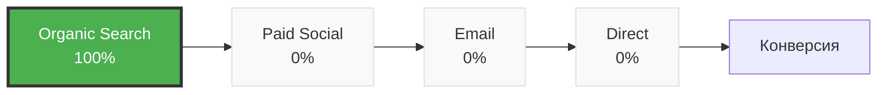
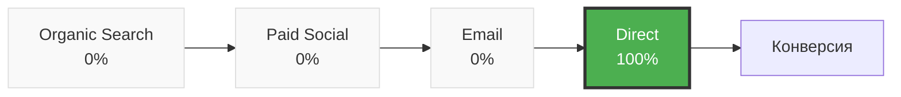
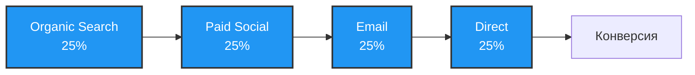
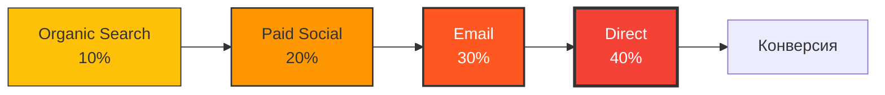
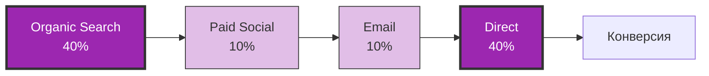
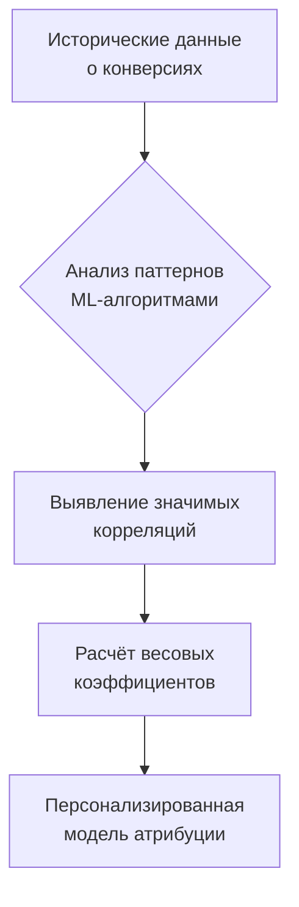
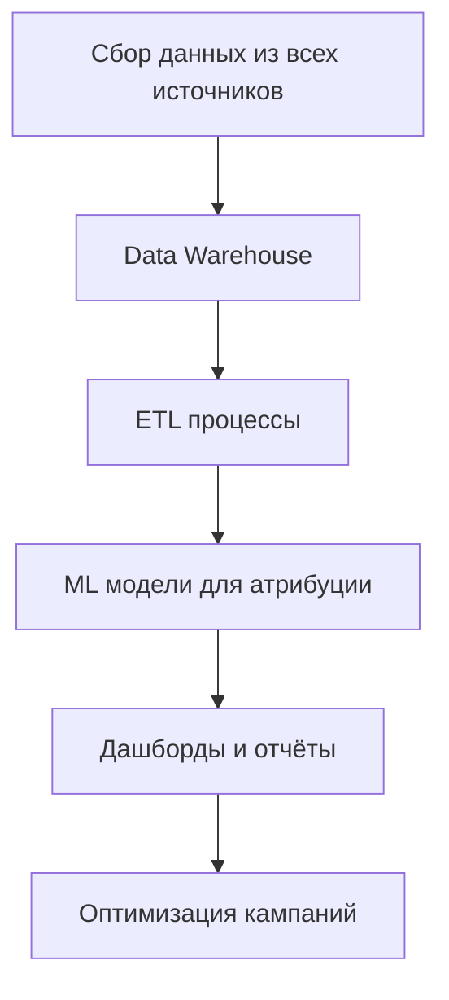

# Модели атрибуции в веб-аналитике: полное руководство по распределению ценности конверсий

Модель атрибуции определяет, какому маркетинговому каналу присваивается заслуга за конверсию когда пользователь взаимодействует с брендом через несколько источников трафика. Это критически важный механизм для понимания эффективности различных каналов привлечения и оптимизации маркетинговых бюджетов.

В современной веб-аналитике редко встречаются простые сценарии, когда пользователь видит рекламу и сразу совершает покупку. В среднем, для покупки нужно семь касаний, где каждый канал будет больше или меньше влиять на решение пользователя. Модели атрибуции помогают справедливо распределить ценность между всеми этапами пользовательского пути к конверсии.

## Основные принципы атрибуции

Модель атрибуции — это алгоритм, по которому система аналитики присваивает конверсию, или достижение определённой цели, тому или иному маркетинговому каналу. Весь путь конверсии принимается за 100%, а каждая точка взаимодействия получает значение от 0 до 100% в зависимости от выбранной модели.

!!! info "Пример пользовательского пути"
    
    **Сценарий:** Покупка курса онлайн-обучения
    
    1. **Поисковый запрос** → переход на блог (Organic Search)
    2. **Социальная сеть** → просмотр рекламы, подписка (Paid Social)  
    3. **Email-рассылка** → получение скидки (Email Marketing)
    4. **Прямой переход** → финальная покупка (Direct)
    
    Каждая модель атрибуции по-разному распределит ценность этой конверсии между четырьмя каналами.

### Типы моделей атрибуции

Все модели атрибуции делятся на две основные категории:

=== "Одноканальные модели (Single-Touch)"

    **Характеристики:**

    - Присваивают 100% ценности одному каналу
    - Простые в понимании и реализации
    - Игнорируют остальные взаимодействия
    - Подходят для коротких циклов продаж

=== "Многоканальные модели (Multi-Touch)"

    **Характеристики:**

    - Распределяют ценность между несколькими каналами
    - Более сложные, но реалистичные
    - Учитывают весь путь пользователя
    - Оптимальны для длинных циклов продаж

## Одноканальные модели атрибуции

### First-Touch Attribution (Первое касание)

Модель присваивает 100% ценности конверсии первому каналу взаимодействия с пользователем.



**Оптимальное применение:**

!!! tip "Когда использовать First-Touch"

    - **Кампании по привлечению новой аудитории:** оценка эффективности каналов знакомства с брендом
    - **Контент-маркетинг:** анализ источников первичного трафика
    - **Брендинговые кампании:** понимание каналов формирования узнаваемости

**Ограничения:** Модель переоценивает роль каналов верхней воронки и полностью игнорирует влияние nurturing-каналов на принятие решения о покупке.

### Last-Touch Attribution (Последнее касание)

Атрибуция last click ещё можно найти в Google Analytics — название модели и её логика будут такими же, как и в других аналитических системах. Модель присваивает всю ценность конверсии последнему каналу перед целевым действием.



**Преимущества:**

- Простота внедрения и понимания
- Фокус на каналах, которые непосредственно приводят к конверсии
- Стандарт большинства аналитических платформ

**Недостатки:** Last click не подходит для компаний, у которых много рекламных источников. Большие маркетинговые бюджеты, сложные сценарии привлечения пользователей, длинные циклы сделки — эта модель не покажет реальную картину происходящего.

### Last Non-Direct Click

Усовершенствованная версия модели последнего касания, которая исключает прямые переходы и присваивает ценность предпоследнему маркетинговому каналу.

!!! note "Логика исключения Direct трафика"
    
    **Проблема:** Пользователи часто возвращаются на сайт через прямой переход после знакомства через рекламу
    
    **Решение:** Модель игнорирует Direct и отдаёт ценность последнему измеримому маркетинговому каналу
    
    **Результат:** Более точная оценка эффективности платных каналов привлечения

## Многоканальные модели атрибуции

### Linear Attribution (Линейная модель)

Равномерно распределяет ценность конверсии между всеми точками касания в пользовательском пути.



**Применение:** Модель подходит для понимания общего вклада всех каналов и выявления недооценённых источников трафика.

**Ограничение:** Не все точки касания оказывают одинаковое влияние на решение о покупке, поэтому равномерное распределение может быть неточным.

### Time-Decay Attribution (Модель временного затухания)

Присваивает больший вес точкам касания, которые произошли ближе к конверсии. Каждый предыдущий канал получает экспоненциально меньшую ценность.



!!! example "Практический пример Time-Decay"
    
    **B2B покупка программного обеспечения (цикл 3 месяца):**
    
    - **Месяц 1:** Поиск в Google (исследование) → 5%
    - **Месяц 2:** LinkedIn реклама (сравнение) → 15% 
    - **Месяц 3:** Email с коммерческим предложением → 35%
    - **Финал:** Прямой переход для покупки → 45%

**Оптимальное применение:** Длинные циклы продаж, B2B сегмент, дорогостоящие товары с длительным процессом принятия решения.

### Position-Based Attribution (U-образная модель)

Распределяет 40% ценности первому касанию, 40% последнему, оставшиеся 20% равномерно между промежуточными точками.



**Логика модели:** Признаёт критическую важность каналов привлечения (awareness) и конверсии (decision), при этом учитывая роль nurturing-каналов.

**Идеальные сценарии:**

- E-commerce с активным ретаргетингом
- SaaS-продукты с пробным периодом
- Услуги с длительным циклом рассмотрения

### W-Shaped Attribution (W-образная модель)

Развитие U-образной модели с добавлением третьей ключевой точки — момента генерации лида. Распределяет по 30% между первым касанием, созданием лида и конверсией.

| Этап | Доля ценности | Обоснование |
|------|---------------|-------------|
| Первое касание | 30% | Привлечение внимания |
| Создание лида | 30% | Проявление интереса |
| Конверсия | 30% | Принятие решения |
| Остальные касания | 10% | Поддержка процесса |

**Применение:** B2B компании с чёткими этапами Sales Funnel, где лид-генерация является отдельной измеримой целью.

### Data-Driven Attribution (Атрибуция на основе данных)

Атрибуция на основе данных (data-driven attribution) использует машинное обучение для анализа исторических данных и определения реального влияния каждого канала на конверсию.

**Принцип работы:**



**Требования для внедрения:**

!!! warning "Минимальные требования"
    
    **Объём данных:** Минимум 15,000 кликов и 600 конверсий за 30 дней для статистической значимости
    
    **Техническая инфраструктура:** Advanced аналитические платформы с ML-возможностями
    
    **Экспертиза:** Команда data scientists для настройки и интерпретации результатов

**Преимущества:** Максимальная точность за счёт учёта уникальных особенностей бизнеса и поведения аудитории.

**Ограничения:** Высокая сложность внедрения, требование больших объёмов данных, "чёрный ящик" для понимания логики распределения.

## Критерии выбора модели атрибуции

### Анализ длины цикла продаж

Длительность customer journey критически влияет на выбор модели:

=== "Короткий цикл (до 7 дней)"

    **Характеристики покупательского поведения:**

    - Импульсные покупки
    - Минимальное количество касаний (1-3)
    - Быстрое принятие решений
    
    **Рекомендуемые модели:**

    - Last-Touch Attribution для прямых продаж
    - First-Touch для оценки каналов привлечения

=== "Средний цикл (7-30 дней)"

    **Характеристики:**

    - Обдуманные покупки
    - Сравнение альтернатив
    - 3-7 точек касания
    
    **Рекомендуемые модели:**

    - Linear Attribution для равномерной оценки
    - Position-Based для акцента на ключевые этапы

=== "Длинный цикл (30+ дней)"

    **Характеристики:**

    - Сложные решения (B2B, недвижимость, автомобили)
    - Множественные исследования
    - 7+ точек касания
    
    **Рекомендуемые модели:**

    - Time-Decay для учёта приближения к решению
    - Data-Driven для максимальной точности

### Специфика бизнес-модели

| Тип бизнеса | Цикл решения | Рекомендуемая модель | Обоснование |
|-------------|--------------|---------------------|-------------|
| E-commerce (товары быстрого потребления) | 1-7 дней | Last-Touch | Фокус на конверсионных каналах |
| SaaS B2B | 30-90 дней | Position-Based / Data-Driven | Важность первого касания и nurturing |
| Недвижимость | 90-365 дней | Time-Decay | Решения принимаются ближе к покупке |
| Образовательные курсы | 14-60 дней | W-Shaped | Чёткие этапы: интерес → лид → покупка |
| Финансовые услуги | 30-180 дней | Linear / Data-Driven | Множественные факторы влияния |

### Количество маркетинговых каналов

!!! tip "Рекомендации по количеству каналов"
    
    **1-3 канала:** Single-Touch модели могут быть достаточными
    
    **4-7 каналов:** Multi-Touch модели становятся необходимыми  
    
    **8+ каналов:** Data-Driven Attribution обеспечивает наилучшую точность

### Доступность данных и ресурсов

**Базовый уровень аналитики:**

- Стандартные отчёты Google Analytics
- UTM-разметка кампаний  
- Модели: First-Touch, Last-Touch, Linear

**Продвинутый уровень:**

- Custom dimensions и events
- Интеграция с CRM
- Модели: Position-Based, Time-Decay, W-Shaped

**Enterprise уровень:**

- Собственная дата-инфраструктура
- Команда data scientists
- Модели: Data-Driven, Custom ML models

## Практическая реализация моделей атрибуции

### Настройка отслеживания

Качественная атрибуция требует правильной технической реализации:

**1. UTM-параметризация всех кампаний**

!!! example "Стандарт UTM-разметки"
    
    ```
    https://example.com/landing?utm_source=facebook&utm_medium=cpc&utm_campaign=spring_sale&utm_content=video_creative&utm_term=running_shoes
    ```
    
    **Обязательные параметры для корректной атрибуции:**

    - `utm_source`: источник трафика
    - `utm_medium`: тип канала  
    - `utm_campaign`: название кампании

**2. Настройка конверсионных целей**

Определите все значимые действия пользователей:

- Macro-conversions: покупки, заявки, подписки
- Micro-conversions: скачивания, просмотры контента, регистрации

**3. Интеграция с CRM**

Подключение CRM позволяет отслеживать полный путь от первого касания до закрытия сделки и расчёта LTV.

### Сравнительный анализ моделей

Для выбора оптимальной модели рекомендуется сравнить результаты нескольких подходов:

| Канал | Last-Touch | First-Touch | Linear | Position-Based | Рекомендации |
|-------|-----------|-------------|--------|----------------|--------------|
| Google Ads | 45% | 15% | 25% | 30% | Переоценён в Last-Touch |
| Facebook Ads | 20% | 35% | 25% | 30% | Недооценён в Last-Touch |
| Organic Search | 15% | 25% | 25% | 20% | Стабильный вклад |
| Email Marketing | 12% | 8% | 25% | 15% | Недооценён везде кроме Linear |
| Direct | 8% | 17% | 0% | 5% | Переоценён без учёта касаний |

**Выводы для оптимизации:**

- Увеличить бюджет Facebook Ads (недооценён)
- Пересмотреть стратегию Google Ads (возможно переоценён)
- Усилить email-маркетинг (недооценён в большинстве моделей)

## Инструменты для работы с атрибуцией

### Google Analytics 4

GA4 предоставляет встроенные модели атрибуции и возможности для сравнительного анализа:

**Доступные модели:**

- Last-click (по умолчанию)
- First-click  
- Linear
- Time-decay
- Position-based
- Data-driven (при достаточном объёме данных)

**Настройка:** Reports → Attribution → Model comparison tool

### Специализированные платформы

**Adobe Analytics:** Advanced attribution с custom моделями и машинным обучением.

**Google Ads Attribution:** Интеграция с Google Ads для оптимизации ставок на основе атрибуционных данных.

**Facebook Attribution:** (Прекращена) Анализ cross-channel attribution между Facebook и другими каналами.

**Альтернативные решения:** Mixpanel, Amplitude, Segment для более гибкой настройки атрибуционных моделей.

### Собственные решения

Для крупных компаний с уникальными потребностями возможна разработка custom attribution models:



## Ограничения и вызовы современной атрибуции

### Проблема межустройного отслеживания  

Пользователи используют множественные устройства в течение customer journey:

**Сценарий:** Исследование на мобильном → покупка на десктопе

**Проблема:** Традиционная cookie-based атрибуция не может связать действия одного пользователя на разных устройствах.

**Решения:**

- User ID tracking для авторизованных пользователей
- Probabilistic matching на основе поведенческих паттернов  
- Deterministic linking через email/phone

### Влияние privacy-регулирования

**GDPR, iOS 14.5+, Third-party cookie deprecation** кардинально изменяют landscape атрибуции:

!!! warning "Новые ограничения"
    
    **iOS 14.5+ App Tracking Transparency:**

    - Пользователи могут отказаться от отслеживания
    - Ограничено отслеживание в Safari
    - Facebook/Instagram attribution становится менее точной
    
    **Chrome Third-party cookie phase-out:**

    - Планируется к 2025 году
    - Потребует перехода на first-party данные
    - Усложнит cross-site attribution

### Server-Side Tracking как решение

Серверная аналитика становится стандартом для обхода browser-ограничений:

**Преимущества:**

- Независимость от client-side ограничений
- Больший контроль над данными
- Повышенная точность отслеживания
- Compliance с privacy требованиями

**Внедрение:** Требует технической экспертизы и инфраструктурных изменений.

## Будущее атрибуционного моделирования

### Privacy-First Attribution

Индустрия движется к решениям, которые балансируют insights и privacy:

**Privacy Sandbox (Google):**

- Attribution Reporting API
- Trust Tokens для fraud prevention
- Topics API вместо третьих cookies

**Apple Privacy-First Solutions:**

- SKAdNetwork для app attribution
- Private Click Measurement для web
- On-device machine learning

### AI-Powered Attribution

Machine Learning revolutionизирует точность атрибуционных моделей:

**Algorithmic Attribution 2.0:**

- Real-time model adjustment
- Predictive attribution для будущих кампаний
- Cross-channel optimization автоматизация
- Incremental lift измерение

Модели атрибуции являются фундаментальным инструментом современного маркетинга, позволяя fair распределить ценность конверсий между всеми маркетинговыми touchpoints. Правильный выбор модели зависит от специфики бизнеса, длины sales cycle, количества используемых каналов и доступности данных. 

В условиях растущих privacy ограничений и усложнения customer journeys, evolution атрибуционного моделирования продолжается в направлении более sophisticated, privacy-compliant решений с использованием AI и machine learning для максимальной точности insights при соблюдении пользовательских прав на privacy.

Мы работаем над решениями, которые помогут веб-мастерам получить максимально точную картину эффективности своих маркетинговых усилий с учётом современных вызовов digital marketing landscape.

--8<-- "snippets/ai.ru.md"

!!! success "Оптимизируйте маркетинговые кампании с правильной атрибуцией"
    
    Зарегистрируйтесь для бесплатного тестирования нашего инструмента веб-аналитики и получите детальные insights о customer journey ваших пользователей. Наши модели атрибуции помогут вам принимать обоснованные решения о распределении маркетинговых бюджетов.