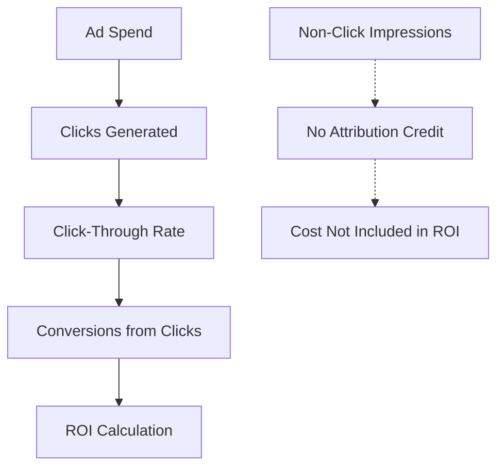

# Click-Through Attribution: Direct Interaction Credit Assignment

**Click-Through Attribution** assigns conversion credit exclusively to marketing touchpoints where users actively clicked on advertisements, links, or promotional content. This direct-engagement attribution model focuses on measurable user intent and immediate response behaviors, providing clear ROI calculations for paid advertising campaigns and performance marketing initiatives.

## Understanding Click-Through Attribution

### Core Attribution Mechanism

Click-through attribution operates on the principle that active engagement (clicks) demonstrates user intent and should receive conversion credit:

**Attribution criteria:**
- User must actively click on advertisement or promotional link
- Direct navigation from click to conversion tracking
- Excludes passive impressions and view-through interactions
- Focuses on immediate response marketing performance

**Practical example:**

Customer journey: `Display Ad Impression → Social Media Click → Email Open → Search Ad Click → Purchase`

**Click-through attribution result:**
- Social Media Click: 50% credit (first click)
- Search Ad Click: 50% credit (last click)
- Display Ad Impression: 0% credit (no click)
- Email Open: 0% credit (no click tracked)

### Technical Implementation

**Click tracking infrastructure:**

```javascript
// Click-through attribution tracking system
function trackClickThroughAttribution(clickData) {
    return {
        timestamp: Date.now(),
        source: clickData.source,
        medium: clickData.medium,
        campaign: clickData.campaign,
        creative_id: clickData.creative_id,
        placement: clickData.placement,
        click_id: generateUniqueClickId(),
        user_agent: navigator.userAgent,
        referrer: document.referrer
    };
}

// Enhanced click attribution with conversion tracking
class ClickAttributionSystem {
    constructor() {
        this.clickEvents = [];
        this.attributionWindow = 30; // days
    }
    
    recordClick(userId, clickData) {
        const attribution = {
            user_id: userId,
            click_timestamp: Date.now(),
            source: clickData.source,
            campaign: clickData.campaign,
            creative: clickData.creative,
            cost: clickData.cost || 0,
            click_id: this.generateClickId()
        };
        
        this.storeClickAttribution(attribution);
        return attribution.click_id;
    }
    
    attributeConversion(userId, conversionValue) {
        const clicks = this.getClicksInWindow(userId);
        
        if (clicks.length === 0) return null;
        
        return this.distributeCredit(clicks, conversionValue);
    }
}
```

**UTM parameter tracking:**
```html
<!-- Click-through attribution URL structure -->
<a href="https://example.com/landing?
    utm_source=facebook
    &utm_medium=cpc
    &utm_campaign=summer_sale
    &utm_content=video_ad
    &utm_term=running_shoes
    &click_id=abc123xyz789">
    Shop Now
</a>
```

## Advantages of Click-Through Attribution

### Direct ROI Measurement

**Clear performance correlation:**

Click-through attribution provides transparent connections between advertising spend and conversion outcomes:

**Campaign performance clarity:**


**Performance metrics transparency:**
| Campaign | Ad Spend | Clicks | Click-Through Conversions | CPC | CPA | ROI |
|----------|----------|--------|--------------------------|-----|-----|-----|
| **Search Campaign A** | $5,000 | 2,500 | 125 | $2.00 | $40 | 250% |
| **Display Campaign B** | $3,000 | 600 | 18 | $5.00 | $167 | 60% |
| **Social Campaign C** | $2,500 | 1,250 | 75 | $2.00 | $33 | 300% |

### Intent-Based Optimization

**User engagement quality:**

Click-through attribution prioritizes active user engagement over passive exposure:

**Engagement quality indicators:**
- Higher conversion rates from clicked traffic
- Improved cost-per-acquisition for active engagement
- Better audience targeting validation
- Enhanced creative performance insights

**Optimization focus areas:**
```python
# Click-through performance optimization
def optimize_click_performance():
    campaigns = get_active_campaigns()
    
    for campaign in campaigns:
        click_data = analyze_click_patterns(campaign)
        
        optimization_actions = []
        
        # Low click-through rate optimization
        if click_data['ctr'] < 0.02:
            optimization_actions.append('improve_creative')
            optimization_actions.append('refine_targeting')
        
        # High click, low conversion optimization
        if click_data['conversion_rate'] < 0.05:
            optimization_actions.append('optimize_landing_page')
            optimization_actions.append('align_messaging')
        
        # High cost per click optimization
        if click_data['cpc'] > campaign['target_cpc']:
            optimization_actions.append('bid_adjustment')
            optimization_actions.append('keyword_refinement')
        
        implement_optimizations(campaign, optimization_actions)
```

### Performance Marketing Alignment

**Paid advertising focus:**

Click-through attribution aligns perfectly with performance marketing objectives:

**Channel optimization benefits:**
- Paid search performance measurement
- Social media advertising effectiveness
- Display advertising ROI calculation
- Email marketing click-based attribution
- Affiliate marketing commission tracking

**Budget allocation insights:**
```
Click-Through Attribution Budget Analysis:
Channel A: 1,000 clicks → 50 conversions = 5% conversion rate
Channel B: 500 clicks → 40 conversions = 8% conversion rate
Channel C: 750 clicks → 22 conversions = 2.9% conversion rate

Optimization Decision: 
- Increase budget for Channel B (highest conversion rate)
- Optimize or reduce Channel C (lowest performance)
- Maintain Channel A (baseline performance)
```

## Limitations and Challenges

### View-Through Impact Blindness

**Passive influence undervaluation:**

Our analysis revealed significant gaps in understanding passive advertising influence:

**Impression impact ignored:**
- Display advertising brand awareness effects
- Video advertisement exposure influence
- Social media organic reach impact
- Retargeting impression frequency effects

**Research findings:**
```
View-Through vs Click-Through Analysis:
Total Conversions: 1,000
Click-Through Attributed: 600 (60%)
View-Through + Click-Through: 850 (85%)
Pure View-Through: 250 (25%)

Lost Attribution: 25% of conversions have no click-through path
```

### Attribution Window Complications

**Click timing and conversion delays:**

**Technical challenges:**
```javascript
// Challenge: Managing click attribution windows
function validateClickAttribution(clickTimestamp, conversionTimestamp) {
    const daysDifference = (conversionTimestamp - clickTimestamp) / (1000 * 60 * 60 * 24);
    
    // Different attribution windows by channel
    const attributionWindows = {
        'google_ads': 30,
        'facebook_ads': 7,
        'display': 90,
        'email': 7
    };
    
    // Issue: Different windows create attribution conflicts
    return daysDifference <= getAttributionWindow(channel);
}
```

**Cross-session attribution complexity:**
- Mobile app to web conversion tracking
- Multiple device click-through paths
- Session timeout and attribution persistence
- Cookie limitations and privacy restrictions

### Creative and Targeting Bias

**Optimization limitations:**

**Click-focused optimization risks:**
- Clickbait creative development over brand alignment
- Short-term engagement over long-term brand building
- Targeting narrow, high-intent audiences exclusively
- Neglecting upper-funnel awareness generation

**Performance distortion examples:**
```
Creative Performance Distortion:
Creative A: High CTR (3.5%) + Low Brand Recall (15%)
Creative B: Medium CTR (2.1%) + High Brand Recall (65%)

Click-through attribution favors Creative A
Brand-building objectives favor Creative B
```

## Implementation Best Practices

### Optimal Use Cases

**Business scenarios favoring click-through attribution:**

**Performance marketing organizations:**
- Companies with primary focus on paid advertising ROI
- E-commerce businesses optimizing acquisition costs
- Lead generation organizations measuring campaign effectiveness
- Affiliate marketing programs requiring click-based commission tracking

**Campaign types ideal for click-through attribution:**
- Search engine marketing (SEM) campaigns
- Social media advertising with clear calls-to-action
- Email marketing with click-based engagement tracking
- Display advertising focused on direct response

### Google Ads Implementation

**Platform-specific configuration:**

```javascript
// Google Ads click-through attribution setup
gtag('config', 'AW-CONVERSION_ID', {
    'transport_type': 'beacon',
    'allow_ad_personalization_signals': true
});

// Enhanced conversion tracking with click IDs
gtag('event', 'conversion', {
    'send_to': 'AW-CONVERSION_ID/CONVERSION_LABEL',
    'value': conversionValue,
    'currency': 'USD',
    'click_id': getGoogleClickId(), // GCLID
    'attribution_model': 'click_through'
});

// Custom click attribution tracking
function trackCustomClickAttribution() {
    const urlParams = new URLSearchParams(window.location.search);
    const clickId = urlParams.get('gclid') || urlParams.get('fbclid') || urlParams.get('click_id');
    
    if (clickId) {
        // Store click attribution data
        localStorage.setItem('click_attribution', JSON.stringify({
            click_id: clickId,
            source: determineTrafficSource(),
            timestamp: Date.now(),
            landing_page: window.location.href
        }));
    }
}
```

### Facebook Ads Integration

**Social media click tracking:**

```javascript
// Facebook Pixel click-through attribution
fbq('init', 'PIXEL_ID', {
    'external_id': getUserId()
});

// Click-based conversion tracking
fbq('track', 'Purchase', {
    value: purchaseValue,
    currency: 'USD',
    click_id: getFacebookClickId()
});

// Custom Facebook click attribution system
class FacebookClickAttribution {
    constructor(pixelId) {
        this.pixelId = pixelId;
        this.attributionWindow = 7; // Facebook default
    }
    
    trackClick(campaignData) {
        const clickData = {
            fbclid: this.extractFacebookClickId(),
            campaign_id: campaignData.campaign_id,
            ad_set_id: campaignData.ad_set_id,
            ad_id: campaignData.ad_id,
            timestamp: Date.now()
        };
        
        this.storeClickData(clickData);
        return clickData;
    }
    
    attributeConversion(conversionData) {
        const clickData = this.getStoredClickData();
        
        if (this.isWithinWindow(clickData.timestamp)) {
            return {
                attributed_source: 'facebook_ads',
                click_id: clickData.fbclid,
                campaign_id: clickData.campaign_id,
                conversion_value: conversionData.value
            };
        }
        
        return null;
    }
}
```

### Cross-Platform Attribution System

**Unified click tracking architecture:**

```python
# Comprehensive click-through attribution system
class UnifiedClickAttribution:
    def __init__(self):
        self.platforms = {
            'google_ads': GoogleAdsAttribution(),
            'facebook_ads': FacebookAttribution(),
            'bing_ads': BingAttribution(),
            'twitter_ads': TwitterAttribution()
        }
        
    def process_click(self, platform, click_data):
        if platform in self.platforms:
            return self.platforms[platform].track_click(click_data)
        else:
            return self.generic_click_tracking(click_data)
    
    def attribute_conversion(self, user_id, conversion_data):
        attributions = []
        
        for platform_name, platform in self.platforms.items():
            attribution = platform.check_attribution(user_id, conversion_data)
            if attribution:
                attributions.append({
                    'platform': platform_name,
                    'attribution': attribution
                })
        
        return self.resolve_multi_platform_attribution(attributions)
    
    def resolve_multi_platform_attribution(self, attributions):
        if len(attributions) == 1:
            return attributions[0]
        elif len(attributions) > 1:
            # Last-click among click-through attributions
            return max(attributions, key=lambda x: x['attribution']['timestamp'])
        else:
            return None
```

## Advanced Click-Through Applications

### Creative Performance Analysis

**Click-based creative optimization:**

```python
# Creative performance analysis system
def analyze_creative_performance():
    campaigns = get_campaign_data()
    
    creative_analysis = {}
    
    for campaign in campaigns:
        creatives = get_campaign_creatives(campaign['id'])
        
        for creative in creatives:
            performance = {
                'impressions': creative['impressions'],
                'clicks': creative['clicks'],
                'click_through_rate': creative['clicks'] / creative['impressions'],
                'conversions': get_click_conversions(creative['id']),
                'conversion_rate': 0,
                'cost_per_click': creative['spend'] / creative['clicks'],
                'cost_per_conversion': 0
            }
            
            if performance['clicks'] > 0:
                performance['conversion_rate'] = performance['conversions'] / performance['clicks']
                performance['cost_per_conversion'] = creative['spend'] / performance['conversions']
            
            creative_analysis[creative['id']] = performance
    
    return optimize_creative_allocation(creative_analysis)
```

### Audience Quality Assessment

**Click-based audience validation:**

```sql
-- Audience quality analysis through click-through attribution
SELECT 
    audience_segment,
    COUNT(DISTINCT user_id) as unique_clickers,
    SUM(clicks) as total_clicks,
    SUM(conversions) as click_conversions,
    ROUND(SUM(conversions) / SUM(clicks) * 100, 2) as click_conversion_rate,
    ROUND(SUM(conversion_value) / SUM(ad_spend), 2) as click_roas
FROM click_attribution_data 
WHERE click_timestamp >= DATE_SUB(CURDATE(), INTERVAL 30 DAY)
GROUP BY audience_segment
ORDER BY click_conversion_rate DESC;
```

### Bid Optimization Strategy

**Click-based bidding optimization:**

```python
# Automated bid optimization based on click-through attribution
class ClickBasedBidOptimizer:
    def __init__(self, target_cpa, min_bid, max_bid):
        self.target_cpa = target_cpa
        self.min_bid = min_bid
        self.max_bid = max_bid
    
    def calculate_optimal_bid(self, keyword_data):
        current_cpa = keyword_data['cost'] / keyword_data['conversions']
        current_bid = keyword_data['max_cpc']
        
        if current_cpa < self.target_cpa * 0.8:
            # Performance is good, increase bid
            new_bid = min(current_bid * 1.2, self.max_bid)
        elif current_cpa > self.target_cpa * 1.2:
            # Performance is poor, decrease bid
            new_bid = max(current_bid * 0.8, self.min_bid)
        else:
            # Performance is acceptable, maintain bid
            new_bid = current_bid
        
        return {
            'keyword': keyword_data['keyword'],
            'current_bid': current_bid,
            'recommended_bid': new_bid,
            'current_cpa': current_cpa,
            'target_cpa': self.target_cpa,
            'bid_change_reason': self.get_bid_reason(current_cpa)
        }
```

Our implementation experience demonstrates that click-through attribution excels in performance marketing environments where direct response and measurable ROI are primary objectives. While it undervalues passive brand influence and view-through conversions, it provides clear insights for optimizing paid advertising campaigns and improving click-based engagement strategies.

We recommend click-through attribution for organizations with significant investment in paid advertising, affiliate marketing, and direct response campaigns. The model works best when combined with brand awareness measurement tools to ensure a balanced understanding of both direct engagement and passive influence on customer behavior.

--8<-- "snippets/ai.md"

!!! success "Ready to optimize click-based advertising performance?"
    
    Sign up for a free trial of our platform and get access to comprehensive click-through attribution tracking, creative performance analysis, and bid optimization tools that help maximize your paid advertising ROI and campaign effectiveness.