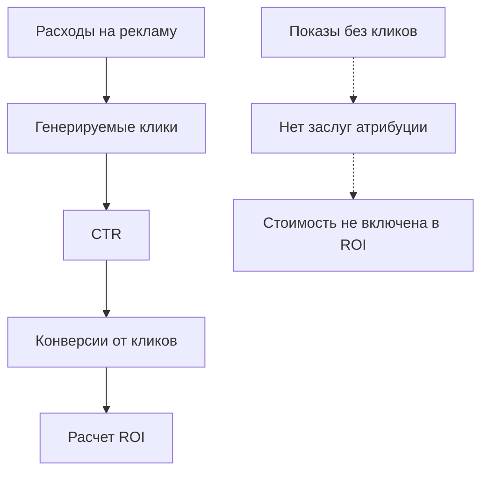

# Атрибуция кликов: Присвоение заслуг за прямое взаимодействие

**Атрибуция кликов** присваивает заслуги за конверсию исключительно маркетинговым точкам касания, где пользователи активно кликнули по рекламе, ссылкам или рекламному контенту. Эта модель атрибуции прямого взаимодействия фокусируется на измеримом намерении пользователя и поведении немедленного отклика, обеспечивая четкие расчеты ROI для кампаний платной рекламы и инициатив производительного маркетинга.

## Понимание атрибуции кликов

### Основной механизм атрибуции

Атрибуция кликов работает по принципу, что активное взаимодействие (клики) демонстрирует намерение пользователя и должно получать заслуги за конверсию:

**Критерии атрибуции:**
- Пользователь должен активно кликнуть по рекламе или промо-ссылке
- Прямая навигация от клика к отслеживанию конверсии
- Исключает пассивные показы и взаимодействия через просмотр
- Фокусируется на производительности маркетинга немедленного отклика

**Практический пример:**

Путь клиента: `Показ медийной рекламы → Клик в социальных сетях → Открытие email → Клик по поисковой рекламе → Покупка`

**Результат атрибуции кликов:**
- Клик в социальных сетях: 50% заслуг (первый клик)
- Клик по поисковой рекламе: 50% заслуг (последний клик)
- Показ медийной рекламы: 0% заслуг (нет клика)
- Открытие email: 0% заслуг (клик не отслежен)

### Техническая реализация

**Инфраструктура отслеживания кликов:**

```javascript
// Система отслеживания атрибуции кликов
function trackClickThroughAttribution(clickData) {
    return {
        timestamp: Date.now(),
        source: clickData.source,
        medium: clickData.medium,
        campaign: clickData.campaign,
        creative_id: clickData.creative_id,
        placement: clickData.placement,
        click_id: generateUniqueClickId(),
        user_agent: navigator.userAgent,
        referrer: document.referrer
    };
}

// Расширенная система атрибуции кликов с отслеживанием конверсий
class ClickAttributionSystem {
    constructor() {
        this.clickEvents = [];
        this.attributionWindow = 30; // дни
    }
    
    recordClick(userId, clickData) {
        const attribution = {
            user_id: userId,
            click_timestamp: Date.now(),
            source: clickData.source,
            campaign: clickData.campaign,
            creative: clickData.creative,
            cost: clickData.cost || 0,
            click_id: this.generateClickId()
        };
        
        this.storeClickAttribution(attribution);
        return attribution.click_id;
    }
    
    attributeConversion(userId, conversionValue) {
        const clicks = this.getClicksInWindow(userId);
        
        if (clicks.length === 0) return null;
        
        return this.distributeCredit(clicks, conversionValue);
    }
}
```

**Отслеживание UTM-параметров:**
```html
<!-- Структура URL для атрибуции кликов -->
<a href="https://example.com/landing?
    utm_source=facebook
    &utm_medium=cpc
    &utm_campaign=summer_sale
    &utm_content=video_ad
    &utm_term=running_shoes
    &click_id=abc123xyz789">
    Купить сейчас
</a>
```

## Преимущества атрибуции кликов

### Прямое измерение ROI

**Четкая корреляция производительности:**

Атрибуция кликов обеспечивает прозрачные связи между расходами на рекламу и результатами конверсии:

**Ясность производительности кампании:**


**Прозрачность метрик производительности:**
| Кампания | Расходы | Клики | Конверсии от кликов | CPC | CPA | ROI |
|----------|---------|-------|-------------------|-----|-----|-----|
| **Поисковая кампания A** | $5,000 | 2,500 | 125 | $2.00 | $40 | 250% |
| **Медийная кампания B** | $3,000 | 600 | 18 | $5.00 | $167 | 60% |
| **Социальная кампания C** | $2,500 | 1,250 | 75 | $2.00 | $33 | 300% |

### Оптимизация на основе намерений

**Качество вовлечения пользователей:**

Атрибуция кликов приоритизирует активное взаимодействие пользователя над пассивным воздействием:

**Индикаторы качества вовлечения:**
- Более высокие коэффициенты конверсии от трафика по кликам
- Улучшенная стоимость привлечения для активного взаимодействия
- Лучшая валидация таргетинга аудитории
- Расширенные инсайты производительности креативов

**Области фокуса оптимизации:**
```python
# Оптимизация производительности кликов
def optimize_click_performance():
    campaigns = get_active_campaigns()
    
    for campaign in campaigns:
        click_data = analyze_click_patterns(campaign)
        
        optimization_actions = []
        
        # Оптимизация низкого CTR
        if click_data['ctr'] < 0.02:
            optimization_actions.append('improve_creative')
            optimization_actions.append('refine_targeting')
        
        # Оптимизация много кликов, мало конверсий
        if click_data['conversion_rate'] < 0.05:
            optimization_actions.append('optimize_landing_page')
            optimization_actions.append('align_messaging')
        
        # Оптимизация высокой стоимости клика
        if click_data['cpc'] > campaign['target_cpc']:
            optimization_actions.append('bid_adjustment')
            optimization_actions.append('keyword_refinement')
        
        implement_optimizations(campaign, optimization_actions)
```

### Согласование с производительным маркетингом

**Фокус на платной рекламе:**

Атрибуция кликов идеально согласуется с целями производительного маркетинга:

**Преимущества оптимизации каналов:**
- Измерение производительности платного поиска
- Эффективность рекламы в социальных сетях
- Расчет ROI медийной рекламы
- Атрибуция email-маркетинга на основе кликов
- Отслеживание комиссий партнерского маркетинга

**Инсайты распределения бюджета:**
```
Анализ бюджета атрибуции кликов:
Канал A: 1,000 кликов → 50 конверсий = 5% коэффициент конверсии
Канал B: 500 кликов → 40 конверсий = 8% коэффициент конверсии
Канал C: 750 кликов → 22 конверсии = 2.9% коэффициент конверсии

Решение по оптимизации:
- Увеличить бюджет для Канала B (самый высокий коэффициент конверсии)
- Оптимизировать или сократить Канал C (самая низкая производительность)
- Поддерживать Канал A (базовая производительность)
```

## Ограничения и вызовы

### Слепота к влиянию просмотров

**Недооценка пассивного влияния:**

Наш анализ выявил значительные пробелы в понимании пассивного влияния рекламы:

**Игнорируемое влияние показов:**
- Эффекты повышения узнаваемости бренда медийной рекламой
- Влияние воздействия видеорекламы
- Влияние органического охвата в социальных сетях
- Эффекты частоты показов ретаргетинга

**Результаты исследования:**
```
Анализ просмотров vs кликов:
Общие конверсии: 1,000
Атрибутированы по кликам: 600 (60%)
Просмотры + клики: 850 (85%)
Чистые просмотры: 250 (25%)

Потерянная атрибуция: 25% конверсий не имеют пути кликов
```

### Осложнения окна атрибуции

**Время кликов и задержки конверсии:**

**Технические вызовы:**
```javascript
// Вызов: Управление окнами атрибуции кликов
function validateClickAttribution(clickTimestamp, conversionTimestamp) {
    const daysDifference = (conversionTimestamp - clickTimestamp) / (1000 * 60 * 60 * 24);
    
    // Разные окна атрибуции по каналам
    const attributionWindows = {
        'google_ads': 30,
        'facebook_ads': 7,
        'display': 90,
        'email': 7
    };
    
    // Проблема: Разные окна создают конфликты атрибуции
    return daysDifference <= getAttributionWindow(channel);
}
```

**Сложность межсессионной атрибуции:**
- Отслеживание конверсий с мобильного приложения на веб
- Пути кликов на нескольких устройствах
- Таймаут сессии и сохранение атрибуции
- Ограничения cookie и приватность

### Смещение креативов и таргетинга

**Ограничения оптимизации:**

**Риски оптимизации, ориентированной на клики:**
- Разработка кликбейт-креативов вместо соответствия бренду
- Краткосрочное взаимодействие вместо долгосрочного создания бренда
- Таргетинг исключительно на узкие аудитории с высокими намерениями
- Игнорирование генерации осведомленности верхней воронки

**Примеры искажения производительности:**
```
Искажение производительности креативов:
Креатив A: Высокий CTR (3.5%) + Низкое запоминание бренда (15%)
Креатив B: Средний CTR (2.1%) + Высокое запоминание бренда (65%)

Атрибуция кликов благоволит Креативу A
Цели создания бренда благоволят Креативу B
```

## Лучшие практики реализации

### Оптимальные случаи использования

**Бизнес-сценарии, благоприятствующие атрибуции кликов:**

**Организации производительного маркетинга:**
- Компании с основным фокусом на ROI платной рекламы
- E-commerce бизнесы, оптимизирующие затраты на привлечение
- Организации генерации лидов, измеряющие эффективность кампаний
- Партнерские маркетинговые программы, требующие отслеживания комиссий по кликам

**Типы кампаний, идеальные для атрибуции кликов:**
- Кампании поискового маркетинга (SEM)
- Реклама в социальных сетях с четкими призывами к действию
- Email-маркетинг с отслеживанием взаимодействия по кликам
- Медийная реклама, ориентированная на прямой отклик

### Реализация в Google Ads

**Конфигурация для конкретной платформы:**

```javascript
// Настройка атрибуции кликов Google Ads
gtag('config', 'AW-CONVERSION_ID', {
    'transport_type': 'beacon',
    'allow_ad_personalization_signals': true
});

// Расширенное отслеживание конверсий с ID кликов
gtag('event', 'conversion', {
    'send_to': 'AW-CONVERSION_ID/CONVERSION_LABEL',
    'value': conversionValue,
    'currency': 'USD',
    'click_id': getGoogleClickId(), // GCLID
    'attribution_model': 'click_through'
});

// Пользовательское отслеживание атрибуции кликов
function trackCustomClickAttribution() {
    const urlParams = new URLSearchParams(window.location.search);
    const clickId = urlParams.get('gclid') || urlParams.get('fbclid') || urlParams.get('click_id');
    
    if (clickId) {
        // Сохранить данные атрибуции кликов
        localStorage.setItem('click_attribution', JSON.stringify({
            click_id: clickId,
            source: determineTrafficSource(),
            timestamp: Date.now(),
            landing_page: window.location.href
        }));
    }
}
```

### Интеграция с Facebook Ads

**Отслеживание кликов в социальных сетях:**

```javascript
// Атрибуция кликов Facebook Pixel
fbq('init', 'PIXEL_ID', {
    'external_id': getUserId()
});

// Отслеживание конверсий на основе кликов
fbq('track', 'Purchase', {
    value: purchaseValue,
    currency: 'USD',
    click_id: getFacebookClickId()
});

// Пользовательская система атрибуции кликов Facebook
class FacebookClickAttribution {
    constructor(pixelId) {
        this.pixelId = pixelId;
        this.attributionWindow = 7; // По умолчанию Facebook
    }
    
    trackClick(campaignData) {
        const clickData = {
            fbclid: this.extractFacebookClickId(),
            campaign_id: campaignData.campaign_id,
            ad_set_id: campaignData.ad_set_id,
            ad_id: campaignData.ad_id,
            timestamp: Date.now()
        };
        
        this.storeClickData(clickData);
        return clickData;
    }
    
    attributeConversion(conversionData) {
        const clickData = this.getStoredClickData();
        
        if (this.isWithinWindow(clickData.timestamp)) {
            return {
                attributed_source: 'facebook_ads',
                click_id: clickData.fbclid,
                campaign_id: clickData.campaign_id,
                conversion_value: conversionData.value
            };
        }
        
        return null;
    }
}
```

Наш опыт реализации показывает, что атрибуция кликов превосходна в средах производительного маркетинга, где прямой отклик и измеримый ROI являются основными целями. Хотя она недооценивает пассивное влияние бренда и конверсии через просмотр, она предоставляет четкие инсайты для оптимизации кампаний платной рекламы и улучшения стратегий взаимодействия на основе кликов.

Мы рекомендуем атрибуцию кликов для организаций со значительными инвестициями в платную рекламу, партнерский маркетинг и кампании прямого отклика. Модель работает лучше всего в сочетании с инструментами измерения узнаваемости бренда для обеспечения сбалансированного понимания как прямого взаимодействия, так и пассивного влияния на поведение клиентов.

--8<-- "snippets/ai.ru.md"

!!! success "Готовы оптимизировать производительность рекламы на основе кликов?"
    
    Зарегистрируйтесь для бесплатной пробной версии нашей платформы и получите доступ к комплексному отслеживанию атрибуции кликов, анализу производительности креативов и инструментам оптимизации ставок, которые помогают максимизировать ROI платной рекламы и эффективность кампаний.