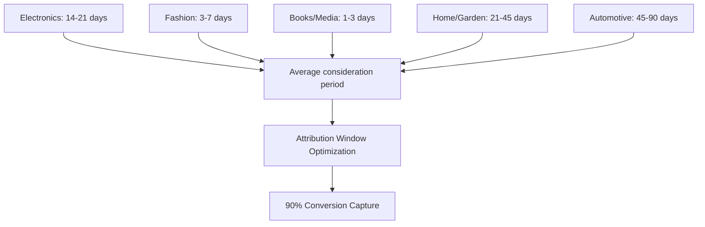

# Conversion Lag: Understanding Time Delays in Attribution

**Conversion Lag** refers to the time delay between a customer's initial marketing touchpoint interaction and their eventual conversion action. This temporal dimension of attribution analysis reveals critical insights about customer decision-making patterns, campaign effectiveness timelines, and optimal attribution window configurations that significantly impact marketing measurement accuracy and budget allocation strategies.

## Understanding Conversion Lag

### Temporal Attribution Dynamics

Conversion lag analysis examines the relationship between marketing exposure timing and conversion behavior:

**Core lag components:**
- **Initial touchpoint timestamp**: First recorded marketing interaction
- **Conversion timestamp**: Actual purchase or goal completion time
- **Lag duration**: Time elapsed between exposure and conversion
- **Interaction frequency**: Number of touchpoints during lag period

**Practical example:**

Customer journey timeline:
```
Day 0:   Facebook Ad Click → Website Visit
Day 3:   Email Newsletter → No action
Day 7:   Google Search → Product comparison
Day 14:  Retargeting Display Ad → No click
Day 21:  Direct Website Visit → Purchase

Conversion Lag: 21 days from initial touchpoint to conversion
```

### Technical Implementation

**Lag measurement system:**

```javascript
// Conversion lag tracking and analysis system
class ConversionLagAnalyzer {
    constructor() {
        this.touchpoints = new Map();
        this.conversions = new Map();
    }
    
    recordTouchpoint(userId, touchpointData) {
        const touchpoint = {
            user_id: userId,
            timestamp: Date.now(),
            source: touchpointData.source,
            medium: touchpointData.medium,
            campaign: touchpointData.campaign,
            channel: touchpointData.channel,
            interaction_type: touchpointData.interaction_type
        };
        
        if (!this.touchpoints.has(userId)) {
            this.touchpoints.set(userId, []);
        }
        
        this.touchpoints.get(userId).push(touchpoint);
        return touchpoint;
    }
    
    recordConversion(userId, conversionData) {
        const conversion = {
            user_id: userId,
            timestamp: Date.now(),
            value: conversionData.value,
            type: conversionData.type
        };
        
        this.conversions.set(userId, conversion);
        
        // Calculate conversion lag
        const userTouchpoints = this.touchpoints.get(userId) || [];
        const lag = this.calculateConversionLag(userTouchpoints, conversion);
        
        return {
            conversion,
            lag_analysis: lag
        };
    }
    
    calculateConversionLag(touchpoints, conversion) {
        if (touchpoints.length === 0) return null;
        
        const firstTouchpoint = touchpoints[0];
        const lastTouchpoint = touchpoints[touchpoints.length - 1];
        
        const totalLagDays = this.daysBetween(
            firstTouchpoint.timestamp,
            conversion.timestamp
        );
        
        const lastTouchLagDays = this.daysBetween(
            lastTouchpoint.timestamp,
            conversion.timestamp
        );
        
        return {
            first_touch_lag_days: totalLagDays,
            last_touch_lag_days: lastTouchLagDays,
            touchpoint_count: touchpoints.length,
            average_touchpoint_interval: totalLagDays / Math.max(touchpoints.length - 1, 1),
            lag_segments: this.categorizeLag(totalLagDays),
            touchpoint_timeline: this.buildTouchpointTimeline(touchpoints, conversion)
        };
    }
    
    categorizeLag(lagDays) {
        if (lagDays === 0) return 'immediate';
        if (lagDays <= 1) return 'same_day';
        if (lagDays <= 7) return 'within_week';
        if (lagDays <= 30) return 'within_month';
        if (lagDays <= 90) return 'within_quarter';
        return 'extended';
    }
    
    buildTouchpointTimeline(touchpoints, conversion) {
        const timeline = touchpoints.map(tp => ({
            days_before_conversion: this.daysBetween(tp.timestamp, conversion.timestamp),
            channel: tp.channel,
            interaction_type: tp.interaction_type,
            source: tp.source
        }));
        
        return timeline.sort((a, b) => b.days_before_conversion - a.days_before_conversion);
    }
}
```

**Advanced lag analysis:**

```python
# Comprehensive conversion lag analysis
import pandas as pd
import numpy as np
from datetime import datetime, timedelta

class AdvancedLagAnalyzer:
    def __init__(self):
        self.lag_data = []
        self.attribution_windows = {
            'search': 90,
            'display': 30,
            'social': 7,
            'email': 30,
            'direct': 1
        }
    
    def analyze_conversion_patterns(self, customer_data):
        lag_analysis = {
            'overall_patterns': {},
            'channel_patterns': {},
            'segment_patterns': {},
            'seasonal_patterns': {}
        }
        
        # Overall conversion lag distribution
        lags = [c['conversion_lag_days'] for c in customer_data]
        lag_analysis['overall_patterns'] = {
            'mean_lag': np.mean(lags),
            'median_lag': np.median(lags),
            'percentiles': {
                '25th': np.percentile(lags, 25),
                '75th': np.percentile(lags, 75),
                '90th': np.percentile(lags, 90),
                '95th': np.percentile(lags, 95)
            },
            'distribution': self.calculate_lag_distribution(lags)
        }
        
        # Channel-specific lag patterns
        lag_analysis['channel_patterns'] = self.analyze_channel_lags(customer_data)
        
        # Customer segment lag patterns
        lag_analysis['segment_patterns'] = self.analyze_segment_lags(customer_data)
        
        # Seasonal lag variations
        lag_analysis['seasonal_patterns'] = self.analyze_seasonal_lags(customer_data)
        
        return lag_analysis
    
    def calculate_lag_distribution(self, lags):
        return {
            'immediate': len([l for l in lags if l == 0]) / len(lags),
            'same_day': len([l for l in lags if 0 < l <= 1]) / len(lags),
            'within_week': len([l for l in lags if 1 < l <= 7]) / len(lags),
            'within_month': len([l for l in lags if 7 < l <= 30]) / len(lags),
            'within_quarter': len([l for l in lags if 30 < l <= 90]) / len(lags),
            'extended': len([l for l in lags if l > 90]) / len(lags)
        }
    
    def optimize_attribution_windows(self, lag_data):
        optimal_windows = {}
        
        for channel in self.attribution_windows.keys():
            channel_lags = [
                item['conversion_lag_days'] 
                for item in lag_data 
                if item['first_touch_channel'] == channel
            ]
            
            if channel_lags:
                # Set window to capture 95% of conversions
                optimal_window = np.percentile(channel_lags, 95)
                optimal_windows[channel] = max(1, int(optimal_window))
            else:
                optimal_windows[channel] = self.attribution_windows[channel]
        
        return optimal_windows
```

## Conversion Lag Patterns and Insights

### Industry-Specific Lag Analysis

**Sector-based conversion timing:**

Our comprehensive analysis across industries reveals distinct lag patterns:

**E-commerce conversion lags:**


**B2B vs B2C lag comparison:**
| Business Model | Mean Lag | Median Lag | 90th Percentile | Optimal Window |
|----------------|----------|------------|-----------------|----------------|
| **B2C E-commerce** | 12 days | 5 days | 35 days | 45 days |
| **B2C Services** | 8 days | 3 days | 28 days | 35 days |
| **B2B SaaS** | 45 days | 21 days | 120 days | 150 days |
| **B2B Enterprise** | 120 days | 75 days | 365 days | 400 days |

### Channel-Specific Lag Behaviors

**Marketing channel lag characteristics:**

```python
# Channel lag analysis implementation
def analyze_channel_lag_patterns():
    channel_analysis = {
        'paid_search': {
            'typical_lag': '1-7 days',
            'peak_conversion_day': 2,
            'attribution_confidence': 0.95,
            'reasoning': 'High-intent traffic converts quickly'
        },
        'display': {
            'typical_lag': '7-30 days',
            'peak_conversion_day': 14,
            'attribution_confidence': 0.75,
            'reasoning': 'Brand awareness requires time to influence'
        },
        'social_media': {
            'typical_lag': '3-14 days',
            'peak_conversion_day': 7,
            'attribution_confidence': 0.80,
            'reasoning': 'Social discovery leads to research period'
        },
        'email': {
            'typical_lag': '0-3 days',
            'peak_conversion_day': 1,
            'attribution_confidence': 0.90,
            'reasoning': 'Direct response medium with clear CTA'
        },
        'organic_social': {
            'typical_lag': '14-45 days',
            'peak_conversion_day': 21,
            'attribution_confidence': 0.60,
            'reasoning': 'Brand building influence requires extended time'
        }
    }
    
    return channel_analysis

# Lag-based attribution weight adjustment
def adjust_attribution_by_lag(touchpoint, conversion_lag):
    base_weights = {
        'immediate': 1.0,    # 0 days
        'same_day': 0.95,    # <1 day
        'within_week': 0.85,  # 1-7 days
        'within_month': 0.70, # 7-30 days
        'within_quarter': 0.50, # 30-90 days
        'extended': 0.25     # >90 days
    }
    
    lag_category = categorize_lag(conversion_lag)
    channel_modifier = get_channel_lag_modifier(touchpoint['channel'])
    
    adjusted_weight = base_weights[lag_category] * channel_modifier
    
    return adjusted_weight
```

### Customer Segment Lag Variations

**Demographic and behavioral lag differences:**

**Customer segment analysis:**
```
Conversion Lag by Customer Segment:

New Customers:
- Mean lag: 18 days
- Median lag: 8 days
- Pattern: Longer research/consideration phase

Returning Customers:
- Mean lag: 5 days
- Median lag: 2 days
- Pattern: Faster decision-making from trust

High-Value Customers:
- Mean lag: 25 days
- Median lag: 14 days
- Pattern: More thorough evaluation process

Mobile-First Users:
- Mean lag: 8 days
- Median lag: 3 days
- Pattern: Impulse purchasing behavior

Desktop Users:
- Mean lag: 15 days
- Median lag: 7 days
- Pattern: Research-oriented behavior
```

## Impact on Attribution Accuracy

### Attribution Window Optimization

**Data-driven window configuration:**

```python
# Dynamic attribution window optimization
class DynamicAttributionWindows:
    def __init__(self):
        self.conversion_data = []
        self.window_performance = {}
    
    def calculate_optimal_windows(self, conversion_lag_data):
        optimal_windows = {}
        
        for channel in ['search', 'display', 'social', 'email']:
            channel_conversions = [
                conv for conv in conversion_lag_data 
                if conv['first_touch_channel'] == channel
            ]
            
            if channel_conversions:
                lags = [conv['lag_days'] for conv in channel_conversions]
                
                # Calculate windows for different capture rates
                windows = {
                    '80_percent': np.percentile(lags, 80),
                    '90_percent': np.percentile(lags, 90),
                    '95_percent': np.percentile(lags, 95)
                }
                
                # Evaluate window performance
                performance = {}
                for window_name, window_days in windows.items():
                    captured_conversions = len([
                        conv for conv in channel_conversions 
                        if conv['lag_days'] <= window_days
                    ])
                    
                    performance[window_name] = {
                        'days': int(window_days),
                        'capture_rate': captured_conversions / len(channel_conversions),
                        'missed_conversions': len(channel_conversions) - captured_conversions
                    }
                
                optimal_windows[channel] = performance
        
        return optimal_windows
    
    def recommend_attribution_strategy(self, lag_analysis):
        recommendations = {}
        
        for channel, windows in lag_analysis.items():
            if windows['90_percent']['capture_rate'] >= 0.90:
                recommended_window = windows['90_percent']['days']
                confidence = 'high'
            elif windows['95_percent']['days'] <= 60:  # Reasonable window
                recommended_window = windows['95_percent']['days']
                confidence = 'medium'
            else:
                recommended_window = 60  # Cap at 60 days
                confidence = 'low'
            
            recommendations[channel] = {
                'recommended_window_days': recommended_window,
                'confidence': confidence,
                'expected_capture_rate': self.estimate_capture_rate(
                    channel, recommended_window
                )
            }
        
        return recommendations
```

### Lag-Adjusted Attribution Models

**Time-decay with lag optimization:**

```javascript
// Lag-optimized time decay attribution
class LagOptimizedTimeDecay {
    constructor(lagAnalysis) {
        this.lagBenchmarks = lagAnalysis;
        this.decayRates = this.calculateOptimalDecayRates();
    }
    
    calculateOptimalDecayRates() {
        const decayRates = {};
        
        Object.keys(this.lagBenchmarks).forEach(channel => {
            const medianLag = this.lagBenchmarks[channel].median_lag;
            const percentile90 = this.lagBenchmarks[channel].percentile_90;
            
            // Adjust decay rate based on typical channel lag
            if (medianLag <= 3) {
                decayRates[channel] = 0.8; // Fast decay for quick-converting channels
            } else if (medianLag <= 14) {
                decayRates[channel] = 0.6; // Medium decay
            } else {
                decayRates[channel] = 0.4; // Slow decay for long-lag channels
            }
        });
        
        return decayRates;
    }
    
    calculateAttributionCredit(touchpoint, conversionTimestamp) {
        const lagDays = this.daysBetween(
            touchpoint.timestamp, 
            conversionTimestamp
        );
        
        const channel = touchpoint.channel;
        const decayRate = this.decayRates[channel] || 0.5;
        
        // Apply lag-optimized time decay
        const timeDecayFactor = Math.pow(decayRate, lagDays);
        
        // Adjust for channel-typical lag patterns
        const lagAdjustment = this.calculateLagAdjustment(channel, lagDays);
        
        return timeDecayFactor * lagAdjustment;
    }
    
    calculateLagAdjustment(channel, actualLag) {
        const expectedLag = this.lagBenchmarks[channel].median_lag;
        const lagRatio = actualLag / expectedLag;
        
        // Bonus for conversions within expected timeframe
        if (lagRatio <= 1.0) {
            return 1.0 + (0.2 * (1 - lagRatio)); // Up to 20% bonus
        } else if (lagRatio <= 2.0) {
            return 1.0 - (0.1 * (lagRatio - 1)); // Minor penalty
        } else {
            return 0.8; // Penalty for very long lags
        }
    }
}
```

## Advanced Lag Analysis Applications

### Predictive Conversion Modeling

**Lag-based conversion probability:**

```python
# Machine learning model for conversion prediction based on lag
import sklearn.ensemble as ensemble
import sklearn.metrics as metrics

class ConversionLagPredictor:
    def __init__(self):
        self.model = ensemble.RandomForestClassifier(
            n_estimators=100,
            max_depth=10,
            random_state=42
        )
        self.feature_columns = [
            'days_since_first_touch',
            'touchpoint_count',
            'channel_diversity_score',
            'last_interaction_days_ago',
            'user_segment',
            'device_type',
            'time_of_year'
        ]
    
    def prepare_features(self, user_data):
        features = []
        
        for user in user_data:
            feature_vector = [
                user['days_since_first_touch'],
                len(user['touchpoints']),
                len(set(tp['channel'] for tp in user['touchpoints'])),
                user['days_since_last_interaction'],
                self.encode_user_segment(user['segment']),
                self.encode_device_type(user['primary_device']),
                user['interaction_month']
            ]
            
            features.append(feature_vector)
        
        return features
    
    def predict_conversion_probability(self, current_lag_days, user_features):
        # Predict probability of conversion at different future time points
        future_predictions = {}
        
        for future_days in [7, 14, 30, 60, 90]:
            total_lag = current_lag_days + future_days
            
            feature_vector = user_features.copy()
            feature_vector[0] = total_lag  # Update days_since_first_touch
            
            probability = self.model.predict_proba([feature_vector])[0][1]
            future_predictions[f'day_{future_days}'] = probability
        
        return future_predictions
    
    def optimize_retargeting_timing(self, user_cohort):
        optimization_results = []
        
        for user in user_cohort:
            predictions = self.predict_conversion_probability(
                user['current_lag_days'],
                user['features']
            )
            
            # Find optimal retargeting window
            optimal_day = max(predictions.keys(), key=lambda k: predictions[k])
            
            optimization_results.append({
                'user_id': user['user_id'],
                'optimal_retargeting_day': optimal_day,
                'predicted_probability': predictions[optimal_day],
                'current_lag': user['current_lag_days']
            })
        
        return optimization_results
```

### Budget Allocation Based on Lag Patterns

**Lag-informed marketing investment:**

```python
# Budget optimization using conversion lag insights
class LagBasedBudgetOptimizer:
    def __init__(self, lag_data, conversion_data):
        self.lag_analysis = lag_data
        self.conversion_analysis = conversion_data
    
    def calculate_channel_efficiency_by_lag(self):
        efficiency_scores = {}
        
        for channel in self.lag_analysis.keys():
            channel_data = self.lag_analysis[channel]
            
            # Shorter lag = higher efficiency score
            lag_efficiency = 1 / (1 + channel_data['median_lag_days'] / 30)
            
            # Higher conversion rate = higher efficiency
            conversion_efficiency = channel_data['conversion_rate']
            
            # Lower cost per conversion = higher efficiency
            cost_efficiency = 1 / (1 + channel_data['cost_per_conversion'] / 100)
            
            # Combined efficiency score
            efficiency_scores[channel] = {
                'lag_efficiency': lag_efficiency,
                'conversion_efficiency': conversion_efficiency,
                'cost_efficiency': cost_efficiency,
                'combined_score': (
                    lag_efficiency * 0.3 +
                    conversion_efficiency * 0.4 +
                    cost_efficiency * 0.3
                )
            }
        
        return efficiency_scores
    
    def recommend_budget_allocation(self, total_budget, current_allocation):
        efficiency_scores = self.calculate_channel_efficiency_by_lag()
        
        # Calculate recommended allocation based on efficiency
        total_efficiency = sum(
            scores['combined_score'] 
            for scores in efficiency_scores.values()
        )
        
        recommended_allocation = {}
        
        for channel, scores in efficiency_scores.items():
            efficiency_ratio = scores['combined_score'] / total_efficiency
            recommended_budget = total_budget * efficiency_ratio
            current_budget = current_allocation.get(channel, 0)
            
            recommended_allocation[channel] = {
                'current_budget': current_budget,
                'recommended_budget': recommended_budget,
                'change': recommended_budget - current_budget,
                'change_percentage': (
                    (recommended_budget - current_budget) / current_budget * 100
                    if current_budget > 0 else float('inf')
                ),
                'efficiency_score': scores['combined_score']
            }
        
        return recommended_allocation
```

### Real-Time Lag Monitoring

**Live conversion lag tracking:**

```javascript
// Real-time conversion lag monitoring system
class RealTimeLagMonitor {
    constructor() {
        this.lagThresholds = {
            'search': { warning: 14, critical: 30 },
            'display': { warning: 45, critical: 90 },
            'social': { warning: 21, critical: 45 },
            'email': { warning: 7, critical: 14 }
        };
        
        this.currentCohorts = new Map();
    }
    
    trackActiveCohort(userId, firstTouchData) {
        const cohort = {
            user_id: userId,
            first_touch_timestamp: Date.now(),
            first_touch_channel: firstTouchData.channel,
            touchpoint_count: 1,
            last_interaction: Date.now(),
            status: 'active'
        };
        
        this.currentCohorts.set(userId, cohort);
        return cohort;
    }
    
    updateCohortProgress(userId, interactionData) {
        const cohort = this.currentCohorts.get(userId);
        
        if (cohort) {
            cohort.touchpoint_count++;
            cohort.last_interaction = Date.now();
            
            const currentLag = this.daysBetween(
                cohort.first_touch_timestamp,
                Date.now()
            );
            
            cohort.current_lag_days = currentLag;
            
            // Check for lag thresholds
            const thresholds = this.lagThresholds[cohort.first_touch_channel];
            
            if (currentLag >= thresholds.critical) {
                cohort.status = 'critical_lag';
                this.triggerLagAlert(cohort, 'critical');
            } else if (currentLag >= thresholds.warning) {
                cohort.status = 'warning_lag';
                this.triggerLagAlert(cohort, 'warning');
            }
        }
    }
    
    processConversion(userId, conversionData) {
        const cohort = this.currentCohorts.get(userId);
        
        if (cohort) {
            const conversionLag = this.daysBetween(
                cohort.first_touch_timestamp,
                Date.now()
            );
            
            const lagAnalysis = {
                user_id: userId,
                conversion_lag_days: conversionLag,
                first_touch_channel: cohort.first_touch_channel,
                touchpoint_count: cohort.touchpoint_count,
                conversion_value: conversionData.value,
                lag_category: this.categorizeLag(conversionLag)
            };
            
            this.recordLagData(lagAnalysis);
            this.currentCohorts.delete(userId);
            
            return lagAnalysis;
        }
        
        return null;
    }
}
```

Our extensive analysis demonstrates that conversion lag significantly impacts attribution accuracy and marketing effectiveness measurement. Understanding lag patterns enables more precise attribution window configuration, better budget allocation decisions, and improved customer journey optimization strategies.

We recommend implementing comprehensive conversion lag analysis for organizations with complex customer journeys, multiple marketing touchpoints, and extended sales cycles. The insights gained from lag analysis directly improve attribution model accuracy and marketing ROI optimization.

--8<-- "snippets/ai.md"

!!! success "Ready to optimize your attribution with conversion lag insights?"
    
    Sign up for a free trial of our platform and get access to comprehensive conversion lag analysis, dynamic attribution window optimization, and lag-based budget allocation tools that improve your marketing measurement accuracy and campaign effectiveness.