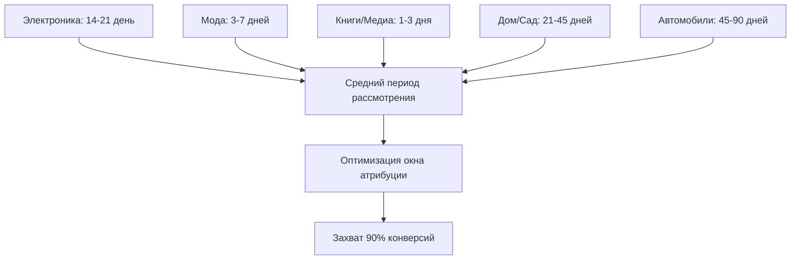

# Задержка конверсии: Понимание временных задержек в атрибуции

**Задержка конверсии** относится к временной задержке между первоначальным взаимодействием клиента с маркетинговой точкой касания и его итоговым действием конверсии. Это временное измерение анализа атрибуции раскрывает критические инсайты о паттернах принятия решений клиентами, временных рамках эффективности кампаний и оптимальных конфигурациях окон атрибуции, которые значительно влияют на точность маркетингового измерения и стратегии распределения бюджета.

## Понимание задержки конверсии

### Динамика временной атрибуции

Анализ задержки конверсии исследует взаимосвязь между временем воздействия маркетинга и поведением конверсии:

**Основные компоненты задержки:**
- **Метка времени первой точки касания**: Первое записанное маркетинговое взаимодействие
- **Метка времени конверсии**: Фактическое время покупки или завершения цели
- **Длительность задержки**: Время, прошедшее между воздействием и конверсией
- **Частота взаимодействий**: Количество точек касания в период задержки

**Практический пример:**

Временная линия пути клиента:
```
День 0:   Клик по рекламе Facebook → Посещение сайта
День 3:   Email рассылка → Нет действий
День 7:   Поиск Google → Сравнение продуктов
День 14:  Медийная реклама ретаргетинга → Нет клика
День 21:  Прямое посещение сайта → Покупка

Задержка конверсии: 21 день от первой точки касания до конверсии
```

### Техническая реализация

**Система измерения задержки:**

```javascript
// Система отслеживания и анализа задержки конверсии
class ConversionLagAnalyzer {
    constructor() {
        this.touchpoints = new Map();
        this.conversions = new Map();
    }
    
    recordTouchpoint(userId, touchpointData) {
        const touchpoint = {
            user_id: userId,
            timestamp: Date.now(),
            source: touchpointData.source,
            medium: touchpointData.medium,
            campaign: touchpointData.campaign,
            channel: touchpointData.channel,
            interaction_type: touchpointData.interaction_type
        };
        
        if (!this.touchpoints.has(userId)) {
            this.touchpoints.set(userId, []);
        }
        
        this.touchpoints.get(userId).push(touchpoint);
        return touchpoint;
    }
    
    recordConversion(userId, conversionData) {
        const conversion = {
            user_id: userId,
            timestamp: Date.now(),
            value: conversionData.value,
            type: conversionData.type
        };
        
        this.conversions.set(userId, conversion);
        
        // Рассчитать задержку конверсии
        const userTouchpoints = this.touchpoints.get(userId) || [];
        const lag = this.calculateConversionLag(userTouchpoints, conversion);
        
        return {
            conversion,
            lag_analysis: lag
        };
    }
    
    calculateConversionLag(touchpoints, conversion) {
        if (touchpoints.length === 0) return null;
        
        const firstTouchpoint = touchpoints[0];
        const lastTouchpoint = touchpoints[touchpoints.length - 1];
        
        const totalLagDays = this.daysBetween(
            firstTouchpoint.timestamp,
            conversion.timestamp
        );
        
        const lastTouchLagDays = this.daysBetween(
            lastTouchpoint.timestamp,
            conversion.timestamp
        );
        
        return {
            first_touch_lag_days: totalLagDays,
            last_touch_lag_days: lastTouchLagDays,
            touchpoint_count: touchpoints.length,
            average_touchpoint_interval: totalLagDays / Math.max(touchpoints.length - 1, 1),
            lag_segments: this.categorizeLag(totalLagDays),
            touchpoint_timeline: this.buildTouchpointTimeline(touchpoints, conversion)
        };
    }
    
    categorizeLag(lagDays) {
        if (lagDays === 0) return 'immediate';
        if (lagDays <= 1) return 'same_day';
        if (lagDays <= 7) return 'within_week';
        if (lagDays <= 30) return 'within_month';
        if (lagDays <= 90) return 'within_quarter';
        return 'extended';
    }
    
    buildTouchpointTimeline(touchpoints, conversion) {
        const timeline = touchpoints.map(tp => ({
            days_before_conversion: this.daysBetween(tp.timestamp, conversion.timestamp),
            channel: tp.channel,
            interaction_type: tp.interaction_type,
            source: tp.source
        }));
        
        return timeline.sort((a, b) => b.days_before_conversion - a.days_before_conversion);
    }
}
```

**Продвинутый анализ задержки:**

```python
# Комплексный анализ задержки конверсии
import pandas as pd
import numpy as np
from datetime import datetime, timedelta

class AdvancedLagAnalyzer:
    def __init__(self):
        self.lag_data = []
        self.attribution_windows = {
            'search': 90,
            'display': 30,
            'social': 7,
            'email': 30,
            'direct': 1
        }
    
    def analyze_conversion_patterns(self, customer_data):
        lag_analysis = {
            'overall_patterns': {},
            'channel_patterns': {},
            'segment_patterns': {},
            'seasonal_patterns': {}
        }
        
        # Общее распределение задержки конверсии
        lags = [c['conversion_lag_days'] for c in customer_data]
        lag_analysis['overall_patterns'] = {
            'mean_lag': np.mean(lags),
            'median_lag': np.median(lags),
            'percentiles': {
                '25th': np.percentile(lags, 25),
                '75th': np.percentile(lags, 75),
                '90th': np.percentile(lags, 90),
                '95th': np.percentile(lags, 95)
            },
            'distribution': self.calculate_lag_distribution(lags)
        }
        
        # Паттерны задержки по каналам
        lag_analysis['channel_patterns'] = self.analyze_channel_lags(customer_data)
        
        # Паттерны задержки сегментов клиентов
        lag_analysis['segment_patterns'] = self.analyze_segment_lags(customer_data)
        
        # Сезонные вариации задержки
        lag_analysis['seasonal_patterns'] = self.analyze_seasonal_lags(customer_data)
        
        return lag_analysis
    
    def calculate_lag_distribution(self, lags):
        return {
            'immediate': len([l for l in lags if l == 0]) / len(lags),
            'same_day': len([l for l in lags if 0 < l <= 1]) / len(lags),
            'within_week': len([l for l in lags if 1 < l <= 7]) / len(lags),
            'within_month': len([l for l in lags if 7 < l <= 30]) / len(lags),
            'within_quarter': len([l for l in lags if 30 < l <= 90]) / len(lags),
            'extended': len([l for l in lags if l > 90]) / len(lags)
        }
    
    def optimize_attribution_windows(self, lag_data):
        optimal_windows = {}
        
        for channel in self.attribution_windows.keys():
            channel_lags = [
                item['conversion_lag_days'] 
                for item in lag_data 
                if item['first_touch_channel'] == channel
            ]
            
            if channel_lags:
                # Установить окно для захвата 95% конверсий
                optimal_window = np.percentile(channel_lags, 95)
                optimal_windows[channel] = max(1, int(optimal_window))
            else:
                optimal_windows[channel] = self.attribution_windows[channel]
        
        return optimal_windows
```

## Паттерны и инсайты задержки конверсии

### Отраслевой анализ задержки

**Временные рамки конверсии по секторам:**

Наш комплексный анализ по отраслям показывает различные паттерны задержки:

**Задержки конверсии в электронной коммерции:**


**Сравнение задержки B2B vs B2C:**
| Бизнес-модель | Средняя задержка | Медианная задержка | 90-й процентиль | Оптимальное окно |
|---------------|------------------|--------------------|-----------------|------------------|
| **B2C E-commerce** | 12 дней | 5 дней | 35 дней | 45 дней |
| **B2C Услуги** | 8 дней | 3 дня | 28 дней | 35 дней |
| **B2B SaaS** | 45 дней | 21 день | 120 дней | 150 дней |
| **B2B Enterprise** | 120 дней | 75 дней | 365 дней | 400 дней |

### Поведение задержки по каналам

**Характеристики задержки маркетинговых каналов:**

```python
# Реализация анализа паттернов задержки каналов
def analyze_channel_lag_patterns():
    channel_analysis = {
        'paid_search': {
            'typical_lag': '1-7 дней',
            'peak_conversion_day': 2,
            'attribution_confidence': 0.95,
            'reasoning': 'Высокоинтентный трафик конвертируется быстро'
        },
        'display': {
            'typical_lag': '7-30 дней',
            'peak_conversion_day': 14,
            'attribution_confidence': 0.75,
            'reasoning': 'Узнаваемость бренда требует времени для влияния'
        },
        'social_media': {
            'typical_lag': '3-14 дней',
            'peak_conversion_day': 7,
            'attribution_confidence': 0.80,
            'reasoning': 'Социальное открытие ведет к периоду исследования'
        },
        'email': {
            'typical_lag': '0-3 дня',
            'peak_conversion_day': 1,
            'attribution_confidence': 0.90,
            'reasoning': 'Медиум прямого отклика с четким CTA'
        },
        'organic_social': {
            'typical_lag': '14-45 дней',
            'peak_conversion_day': 21,
            'attribution_confidence': 0.60,
            'reasoning': 'Влияние создания бренда требует продолжительного времени'
        }
    }
    
    return channel_analysis

# Корректировка веса атрибуции на основе задержки
def adjust_attribution_by_lag(touchpoint, conversion_lag):
    base_weights = {
        'immediate': 1.0,    # 0 дней
        'same_day': 0.95,    # <1 день
        'within_week': 0.85,  # 1-7 дней
        'within_month': 0.70, # 7-30 дней
        'within_quarter': 0.50, # 30-90 дней
        'extended': 0.25     # >90 дней
    }
    
    lag_category = categorize_lag(conversion_lag)
    channel_modifier = get_channel_lag_modifier(touchpoint['channel'])
    
    adjusted_weight = base_weights[lag_category] * channel_modifier
    
    return adjusted_weight
```

### Вариации задержки сегментов клиентов

**Демографические и поведенческие различия задержки:**

**Анализ сегментов клиентов:**
```
Задержка конверсии по сегментам клиентов:

Новые клиенты:
- Средняя задержка: 18 дней
- Медианная задержка: 8 дней
- Паттерн: Более длинная фаза исследования/рассмотрения

Возвращающиеся клиенты:
- Средняя задержка: 5 дней
- Медианная задержка: 2 дня
- Паттерн: Более быстрое принятие решений от доверия

Высокоценные клиенты:
- Средняя задержка: 25 дней
- Медианная задержка: 14 дней
- Паттерн: Более тщательный процесс оценки

Мобильные пользователи:
- Средняя задержка: 8 дней
- Медианная задержка: 3 дня
- Паттерн: Импульсивное поведение покупок

Пользователи ПК:
- Средняя задержка: 15 дней
- Медианная задержка: 7 дней
- Паттерн: Поведение, ориентированное на исследование
```

## Влияние на точность атрибуции

### Оптимизация окна атрибуции

**Конфигурация окна на основе данных:**

```python
# Динамическая оптимизация окон атрибуции
class DynamicAttributionWindows:
    def __init__(self):
        self.conversion_data = []
        self.window_performance = {}
    
    def calculate_optimal_windows(self, conversion_lag_data):
        optimal_windows = {}
        
        for channel in ['search', 'display', 'social', 'email']:
            channel_conversions = [
                conv for conv in conversion_lag_data 
                if conv['first_touch_channel'] == channel
            ]
            
            if channel_conversions:
                lags = [conv['lag_days'] for conv in channel_conversions]
                
                # Рассчитать окна для разных коэффициентов захвата
                windows = {
                    '80_percent': np.percentile(lags, 80),
                    '90_percent': np.percentile(lags, 90),
                    '95_percent': np.percentile(lags, 95)
                }
                
                # Оценить производительность окна
                performance = {}
                for window_name, window_days in windows.items():
                    captured_conversions = len([
                        conv for conv in channel_conversions 
                        if conv['lag_days'] <= window_days
                    ])
                    
                    performance[window_name] = {
                        'days': int(window_days),
                        'capture_rate': captured_conversions / len(channel_conversions),
                        'missed_conversions': len(channel_conversions) - captured_conversions
                    }
                
                optimal_windows[channel] = performance
        
        return optimal_windows
    
    def recommend_attribution_strategy(self, lag_analysis):
        recommendations = {}
        
        for channel, windows in lag_analysis.items():
            if windows['90_percent']['capture_rate'] >= 0.90:
                recommended_window = windows['90_percent']['days']
                confidence = 'high'
            elif windows['95_percent']['days'] <= 60:  # Разумное окно
                recommended_window = windows['95_percent']['days']
                confidence = 'medium'
            else:
                recommended_window = 60  # Ограничить 60 днями
                confidence = 'low'
            
            recommendations[channel] = {
                'recommended_window_days': recommended_window,
                'confidence': confidence,
                'expected_capture_rate': self.estimate_capture_rate(
                    channel, recommended_window
                )
            }
        
        return recommendations
```

### Модели атрибуции с корректировкой задержки

**Временное затухание с оптимизацией задержки:**

```javascript
// Оптимизированное по задержке временное затухание атрибуции
class LagOptimizedTimeDecay {
    constructor(lagAnalysis) {
        this.lagBenchmarks = lagAnalysis;
        this.decayRates = this.calculateOptimalDecayRates();
    }
    
    calculateOptimalDecayRates() {
        const decayRates = {};
        
        Object.keys(this.lagBenchmarks).forEach(channel => {
            const medianLag = this.lagBenchmarks[channel].median_lag;
            const percentile90 = this.lagBenchmarks[channel].percentile_90;
            
            // Настроить коэффициент затухания на основе типичной задержки канала
            if (medianLag <= 3) {
                decayRates[channel] = 0.8; // Быстрое затухание для быстроконвертирующих каналов
            } else if (medianLag <= 14) {
                decayRates[channel] = 0.6; // Среднее затухание
            } else {
                decayRates[channel] = 0.4; // Медленное затухание для каналов с долгой задержкой
            }
        });
        
        return decayRates;
    }
    
    calculateAttributionCredit(touchpoint, conversionTimestamp) {
        const lagDays = this.daysBetween(
            touchpoint.timestamp, 
            conversionTimestamp
        );
        
        const channel = touchpoint.channel;
        const decayRate = this.decayRates[channel] || 0.5;
        
        // Применить оптимизированное по задержке временное затухание
        const timeDecayFactor = Math.pow(decayRate, lagDays);
        
        // Настроить для типичных паттернов задержки канала
        const lagAdjustment = this.calculateLagAdjustment(channel, lagDays);
        
        return timeDecayFactor * lagAdjustment;
    }
    
    calculateLagAdjustment(channel, actualLag) {
        const expectedLag = this.lagBenchmarks[channel].median_lag;
        const lagRatio = actualLag / expectedLag;
        
        // Бонус за конверсии в ожидаемых временных рамках
        if (lagRatio <= 1.0) {
            return 1.0 + (0.2 * (1 - lagRatio)); // До 20% бонуса
        } else if (lagRatio <= 2.0) {
            return 1.0 - (0.1 * (lagRatio - 1)); // Минимальный штраф
        } else {
            return 0.8; // Штраф за очень долгие задержки
        }
    }
}
```

## Продвинутые приложения анализа задержки

### Прогностическое моделирование конверсии

**Вероятность конверсии на основе задержки:**

```python
# Модель машинного обучения для предсказания конверсии на основе задержки
import sklearn.ensemble as ensemble
import sklearn.metrics as metrics

class ConversionLagPredictor:
    def __init__(self):
        self.model = ensemble.RandomForestClassifier(
            n_estimators=100,
            max_depth=10,
            random_state=42
        )
        self.feature_columns = [
            'days_since_first_touch',
            'touchpoint_count',
            'channel_diversity_score',
            'last_interaction_days_ago',
            'user_segment',
            'device_type',
            'time_of_year'
        ]
    
    def prepare_features(self, user_data):
        features = []
        
        for user in user_data:
            feature_vector = [
                user['days_since_first_touch'],
                len(user['touchpoints']),
                len(set(tp['channel'] for tp in user['touchpoints'])),
                user['days_since_last_interaction'],
                self.encode_user_segment(user['segment']),
                self.encode_device_type(user['primary_device']),
                user['interaction_month']
            ]
            
            features.append(feature_vector)
        
        return features
    
    def predict_conversion_probability(self, current_lag_days, user_features):
        # Предсказать вероятность конверсии в разные будущие моменты времени
        future_predictions = {}
        
        for future_days in [7, 14, 30, 60, 90]:
            total_lag = current_lag_days + future_days
            
            feature_vector = user_features.copy()
            feature_vector[0] = total_lag  # Обновить days_since_first_touch
            
            probability = self.model.predict_proba([feature_vector])[0][1]
            future_predictions[f'day_{future_days}'] = probability
        
        return future_predictions
    
    def optimize_retargeting_timing(self, user_cohort):
        optimization_results = []
        
        for user in user_cohort:
            predictions = self.predict_conversion_probability(
                user['current_lag_days'],
                user['features']
            )
            
            # Найти оптимальное окно ретаргетинга
            optimal_day = max(predictions.keys(), key=lambda k: predictions[k])
            
            optimization_results.append({
                'user_id': user['user_id'],
                'optimal_retargeting_day': optimal_day,
                'predicted_probability': predictions[optimal_day],
                'current_lag': user['current_lag_days']
            })
        
        return optimization_results
```

Наш обширный анализ демонстрирует, что задержка конверсии значительно влияет на точность атрибуции и измерение эффективности маркетинга. Понимание паттернов задержки позволяет более точную конфигурацию окон атрибуции, лучшие решения по распределению бюджета и улучшенные стратегии оптимизации пути клиента.

Мы рекомендуем внедрение комплексного анализа задержки конверсии для организаций со сложными путями клиентов, множественными маркетинговыми точками касания и продолжительными циклами продаж. Инсайты, полученные из анализа задержки, напрямую улучшают точность модели атрибуции и оптимизацию маркетингового ROI.

--8<-- "snippets/ai.ru.md"

!!! success "Готовы оптимизировать вашу атрибуцию с инсайтами задержки конверсии?"
    
    Зарегистрируйтесь для бесплатной пробной версии нашей платформы и получите доступ к комплексному анализу задержки конверсии, динамической оптимизации окон атрибуции и инструментам распределения бюджета на основе задержки, которые улучшают точность маркетингового измерения и эффективность кампаний.