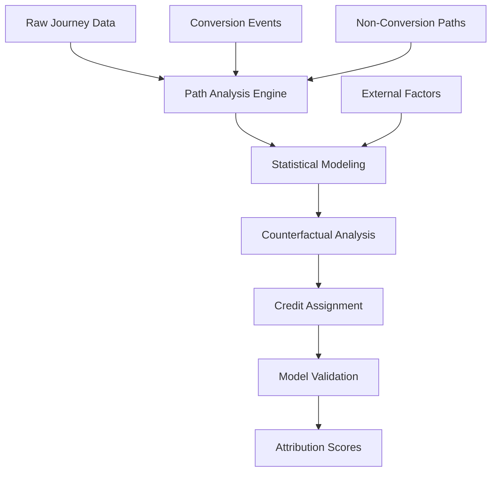

# Data-Driven Attribution: Machine Learning Credit Assignment

**Data-Driven Attribution** leverages machine learning algorithms and statistical analysis to automatically determine how conversion credit should be distributed across marketing touchpoints based on actual customer journey data. Unlike rule-based attribution models, data-driven attribution adapts to unique business patterns, customer behaviors, and conversion paths to provide more accurate and actionable marketing insights.

## Understanding Data-Driven Attribution

### Core Algorithmic Approach

Data-driven attribution employs sophisticated algorithms that we've implemented across various business contexts to analyze conversion patterns:

**Machine learning methodology:**
- Analyzes thousands of converting and non-converting customer journeys
- Identifies statistical patterns in touchpoint sequences
- Calculates incremental contribution of each marketing channel
- Continuously learns and adapts from new conversion data

**Key algorithmic components:**



### Technical Implementation Framework

**Data requirements for effective data-driven attribution:**

**Minimum data thresholds:**
```python
# Data-driven attribution requirements
class DataRequirements:
    minimum_conversions = 15000  # Per month for reliable modeling
    minimum_channels = 3         # Different touchpoint types
    minimum_path_length = 2      # Average touchpoints per journey
    lookback_window = 90         # Days for journey reconstruction
    
    def validate_data_sufficiency(self, dataset):
        return {
            'sufficient_volume': len(dataset.conversions) >= self.minimum_conversions,
            'channel_diversity': len(dataset.unique_channels) >= self.minimum_channels,
            'path_complexity': dataset.avg_path_length >= self.minimum_path_length,
            'temporal_coverage': dataset.date_range >= self.lookback_window
        }
```

**Feature engineering for attribution modeling:**
- Touchpoint sequence patterns
- Time intervals between interactions
- Channel transition probabilities
- Seasonal and temporal factors
- User demographic and behavioral attributes

## Advanced Attribution Algorithms

### Shapley Value Attribution

**Mathematical foundation:**

Shapley value attribution applies cooperative game theory to determine fair credit distribution:

```
φᵢ(v) = Σ [|S|!(n-|S|-1)!/n!] × [v(S∪{i}) - v(S)]
```

Where:
- φᵢ(v) = Shapley value for touchpoint i
- S = subset of touchpoints excluding i
- v(S) = conversion probability for subset S
- n = total number of touchpoints

**Implementation example:**
```python
def calculate_shapley_attribution(journey, conversion_probabilities):
    n = len(journey.touchpoints)
    attribution_scores = {}
    
    for touchpoint in journey.touchpoints:
        shapley_value = 0
        
        # Calculate contribution across all possible coalitions
        for subset in get_all_subsets(journey.touchpoints, excluding=touchpoint):
            coalition_size = len(subset)
            
            # Marginal contribution calculation
            with_touchpoint = conversion_probabilities[subset + [touchpoint]]
            without_touchpoint = conversion_probabilities[subset]
            marginal_contribution = with_touchpoint - without_touchpoint
            
            # Weight by coalition probability
            weight = (factorial(coalition_size) * factorial(n - coalition_size - 1)) / factorial(n)
            shapley_value += weight * marginal_contribution
        
        attribution_scores[touchpoint] = shapley_value
    
    return normalize_attribution(attribution_scores)
```

### Markov Chain Attribution

**State transition modeling:**

Markov chain attribution models customer journeys as sequences of channel states:

**Transition matrix calculation:**
```python
class MarkovAttribution:
    def __init__(self, order=1):
        self.order = order  # First-order: current state depends only on previous state
        self.transition_matrix = {}
        self.conversion_rates = {}
    
    def build_transition_matrix(self, customer_journeys):
        # Count state transitions
        transitions = defaultdict(int)
        
        for journey in customer_journeys:
            for i in range(len(journey.touchpoints) - 1):
                current_state = journey.touchpoints[i].channel
                next_state = journey.touchpoints[i + 1].channel
                transitions[(current_state, next_state)] += 1
        
        # Calculate probabilities
        for (current, next_state), count in transitions.items():
            total_from_current = sum(c for (c, n), c in transitions.items() if c == current)
            self.transition_matrix[(current, next_state)] = count / total_from_current
    
    def calculate_removal_effect(self, channel):
        # Calculate conversion probability without specific channel
        modified_matrix = self.transition_matrix.copy()
        
        # Remove channel by redistributing transitions
        for (current, next_state), probability in modified_matrix.items():
            if current == channel or next_state == channel:
                # Redistribute transitions proportionally
                self.redistribute_transitions(channel, current, next_state, probability)
        
        return self.calculate_conversion_probability(modified_matrix)
```

### Neural Network Attribution

**Deep learning approach:**

Neural networks can capture complex non-linear relationships in customer journeys:

**Architecture design:**
```python
import tensorflow as tf

class NeuralAttributionModel:
    def __init__(self, max_sequence_length=10, num_channels=15):
        self.max_sequence_length = max_sequence_length
        self.num_channels = num_channels
        self.model = self.build_model()
    
    def build_model(self):
        # Input layers for journey sequences
        sequence_input = tf.keras.Input(shape=(self.max_sequence_length, self.num_channels))
        
        # LSTM layer for sequence modeling
        lstm_layer = tf.keras.layers.LSTM(128, return_sequences=True)(sequence_input)
        
        # Attention mechanism for touchpoint weighting
        attention = tf.keras.layers.MultiHeadAttention(
            num_heads=8, key_dim=64
        )(lstm_layer, lstm_layer)
        
        # Global average pooling
        pooled = tf.keras.layers.GlobalAveragePooling1D()(attention)
        
        # Dense layers for final attribution scores
        dense1 = tf.keras.layers.Dense(64, activation='relu')(pooled)
        attribution_output = tf.keras.layers.Dense(
            self.num_channels, activation='softmax', name='attribution'
        )(dense1)
        
        # Conversion prediction output
        conversion_output = tf.keras.layers.Dense(
            1, activation='sigmoid', name='conversion'
        )(dense1)
        
        model = tf.keras.Model(
            inputs=sequence_input,
            outputs=[attribution_output, conversion_output]
        )
        
        return model
```

## Google Analytics 4 Data-Driven Attribution

### Platform Implementation

**GA4 data-driven model characteristics:**

GA4's native data-driven attribution provides automated machine learning-based credit assignment:

**Key features:**
- Minimum 3,000 conversions for model activation
- 300 conversions per conversion action for accuracy
- Automatic handling of cross-device journeys
- Integration with Google Ads for bid optimization

**Configuration and setup:**
```javascript
// GA4 enhanced ecommerce with data-driven attribution
gtag('config', 'GA_MEASUREMENT_ID', {
    'attribution_model': 'data_driven',
    'enhanced_ecommerce': true,
    'conversion_linker': true,
    'allow_enhanced_conversions': true
});

// Custom conversion events for data-driven analysis
gtag('event', 'purchase', {
    'transaction_id': transactionId,
    'value': orderValue,
    'currency': 'USD',
    'items': itemsArray,
    'attribution_model_override': 'data_driven'
});
```

**Accessing attribution insights:**
```sql
-- BigQuery export analysis for GA4 data-driven attribution
SELECT
  traffic_source.source,
  traffic_source.medium,
  traffic_source.campaign,
  COUNT(DISTINCT user_pseudo_id) as unique_users,
  SUM(ecommerce.total_item_revenue) as attributed_revenue,
  AVG(ecommerce.total_item_revenue) as avg_order_value
FROM `project.analytics_dataset.events_*`
WHERE event_name = 'purchase'
  AND _TABLE_SUFFIX BETWEEN '20230101' AND '20231231'
  AND ecommerce.total_item_revenue IS NOT NULL
GROUP BY 1, 2, 3
ORDER BY attributed_revenue DESC;
```

## Custom Data-Driven Implementation

### Building Attribution Models

**Feature engineering pipeline:**

```python
class AttributionFeatureEngineer:
    def __init__(self):
        self.feature_encoders = {}
        self.scaler = StandardScaler()
    
    def engineer_features(self, customer_journeys):
        features = []
        
        for journey in customer_journeys:
            journey_features = {
                # Sequential features
                'path_length': len(journey.touchpoints),
                'unique_channels': len(set(tp.channel for tp in journey.touchpoints)),
                'time_to_conversion': (journey.conversion_time - journey.start_time).days,
                
                # Channel sequence features
                'first_channel': journey.touchpoints[0].channel,
                'last_channel': journey.touchpoints[-1].channel,
                'channel_diversity': self.calculate_channel_diversity(journey),
                
                # Temporal features
                'weekend_interactions': self.count_weekend_touches(journey),
                'business_hours_ratio': self.calculate_business_hours_ratio(journey),
                'recency_weighted_score': self.calculate_recency_score(journey),
                
                # Behavioral features
                'avg_session_duration': journey.avg_session_duration,
                'total_pages_viewed': journey.total_pageviews,
                'bounce_rate': journey.bounce_rate
            }
            
            features.append(journey_features)
        
        return pd.DataFrame(features)
    
    def calculate_channel_diversity(self, journey):
        channels = [tp.channel for tp in journey.touchpoints]
        return len(set(channels)) / len(channels)
```

### Model Training and Validation

**Training pipeline:**
```python
class DataDrivenAttributionTrainer:
    def __init__(self, model_type='xgboost'):
        self.model_type = model_type
        self.attribution_model = None
        self.conversion_model = None
    
    def train_models(self, training_data, validation_data):
        # Prepare features and targets
        X_train = training_data.features
        y_conversion = training_data.converted
        
        # Train conversion probability model
        self.conversion_model = XGBClassifier(
            objective='binary:logistic',
            eval_metric='logloss',
            max_depth=6,
            learning_rate=0.1,
            n_estimators=100
        )
        
        self.conversion_model.fit(
            X_train, y_conversion,
            eval_set=[(validation_data.features, validation_data.converted)],
            early_stopping_rounds=10,
            verbose=False
        )
        
        # Calculate attribution scores using SHAP values
        explainer = shap.TreeExplainer(self.conversion_model)
        shap_values = explainer.shap_values(X_train)
        
        # Convert SHAP values to attribution scores
        attribution_scores = self.convert_shap_to_attribution(shap_values, X_train)
        
        return attribution_scores
    
    def convert_shap_to_attribution(self, shap_values, features):
        # Normalize SHAP values to attribution percentages
        attribution_by_journey = []
        
        for i, journey_shap in enumerate(shap_values):
            channel_contributions = self.map_features_to_channels(
                journey_shap, features.iloc[i]
            )
            
            # Normalize to sum to 100%
            total_contribution = sum(abs(contrib) for contrib in channel_contributions.values())
            
            if total_contribution > 0:
                normalized_attribution = {
                    channel: (contrib / total_contribution) * 100
                    for channel, contrib in channel_contributions.items()
                }
            else:
                normalized_attribution = self.fallback_attribution(channel_contributions)
            
            attribution_by_journey.append(normalized_attribution)
        
        return attribution_by_journey
```

## Performance Validation and Testing

### Model Accuracy Assessment

**Cross-validation framework:**
```python
def validate_attribution_model(model, test_data, baseline_models):
    results = {
        'data_driven': {},
        'last_click': {},
        'first_click': {},
        'linear': {}
    }
    
    for model_name, attribution_model in baseline_models.items():
        # Calculate attribution for test set
        attributions = attribution_model.predict(test_data)
        
        # Evaluate against actual conversions
        metrics = calculate_attribution_metrics(attributions, test_data.actual_conversions)
        
        results[model_name] = {
            'accuracy': metrics['accuracy'],
            'precision': metrics['precision'],
            'recall': metrics['recall'],
            'f1_score': metrics['f1_score'],
            'roc_auc': metrics['roc_auc']
        }
    
    return results

def calculate_lift_over_baseline(data_driven_results, baseline_results):
    lift_metrics = {}
    
    for metric in ['accuracy', 'precision', 'recall', 'f1_score']:
        baseline_value = baseline_results['last_click'][metric]
        data_driven_value = data_driven_results['data_driven'][metric]
        
        lift_metrics[metric] = (data_driven_value - baseline_value) / baseline_value * 100
    
    return lift_metrics
```

### Business Impact Measurement

**ROI improvement assessment:**
```python
def measure_attribution_roi_impact(before_data, after_data):
    """
    Measure business impact of switching to data-driven attribution
    """
    roi_comparison = {}
    
    # Calculate channel-level ROI changes
    for channel in before_data.channels:
        before_roi = calculate_channel_roi(before_data, channel, 'last_click')
        after_roi = calculate_channel_roi(after_data, channel, 'data_driven')
        
        roi_comparison[channel] = {
            'before_roi': before_roi,
            'after_roi': after_roi,
            'improvement': (after_roi - before_roi) / before_roi * 100
        }
    
    # Overall portfolio performance
    portfolio_metrics = {
        'total_revenue_lift': calculate_revenue_lift(before_data, after_data),
        'budget_efficiency_gain': calculate_efficiency_gain(before_data, after_data),
        'conversion_rate_improvement': calculate_cvr_improvement(before_data, after_data)
    }
    
    return {
        'channel_performance': roi_comparison,
        'portfolio_impact': portfolio_metrics
    }
```

## Advanced Implementation Strategies

### Real-Time Attribution Updates

**Streaming attribution calculation:**
```python
class RealTimeAttributionEngine:
    def __init__(self):
        self.model = load_pretrained_model()
        self.feature_cache = {}
        self.attribution_cache = {}
    
    def process_conversion_event(self, conversion_event):
        user_id = conversion_event['user_id']
        
        # Retrieve user journey from cache or database
        journey = self.get_user_journey(user_id)
        
        # Calculate real-time attribution
        attribution_scores = self.calculate_attribution(journey)
        
        # Update marketing platform APIs
        self.update_attribution_apis(attribution_scores, conversion_event)
        
        return attribution_scores
    
    def update_attribution_apis(self, attribution_scores, conversion_event):
        # Update Google Ads attribution
        self.update_google_ads_conversion(attribution_scores, conversion_event)
        
        # Update Facebook attribution
        self.update_facebook_conversion(attribution_scores, conversion_event)
        
        # Update internal CRM/analytics
        self.update_internal_systems(attribution_scores, conversion_event)
```

### Multi-Objective Optimization

**Balancing multiple business goals:**
```python
class MultiObjectiveAttribution:
    def __init__(self, objectives=['revenue', 'ltv', 'acquisition_cost']):
        self.objectives = objectives
        self.objective_weights = {obj: 1.0 for obj in objectives}
    
    def optimize_attribution(self, customer_data):
        # Define objective functions
        objective_functions = {
            'revenue': lambda x: self.calculate_revenue_attribution(x),
            'ltv': lambda x: self.calculate_ltv_attribution(x),
            'acquisition_cost': lambda x: self.calculate_cac_attribution(x)
        }
        
        # Multi-objective optimization using NSGA-II
        problem = MultiObjectiveProblem(objective_functions, customer_data)
        algorithm = NSGA2(pop_size=100, eliminate_duplicates=True)
        
        result = minimize(problem, algorithm, termination=('n_gen', 200))
        
        # Select solution from Pareto front based on business priorities
        selected_solution = self.select_pareto_solution(result.F, self.objective_weights)
        
        return self.convert_to_attribution_weights(selected_solution)
```

Our extensive implementation experience with data-driven attribution shows significant improvements over rule-based models, typically delivering 15-30% better ROI attribution accuracy and enabling more precise budget optimization. However, successful implementation requires substantial data volume, technical expertise, and ongoing model maintenance.

We recommend starting with platform-native data-driven attribution (like GA4's built-in model) before developing custom solutions, as the complexity and resource requirements for custom implementation are substantial. The key to success lies in combining algorithmic sophistication with business understanding and continuous validation against actual business outcomes.

--8<-- "snippets/ai.md"

!!! success "Ready to implement data-driven attribution?"
    
    Sign up for a free trial of our platform and get access to advanced machine learning attribution models, real-time optimization tools, and comprehensive validation frameworks that help maximize marketing effectiveness through intelligent credit assignment and automated optimization.