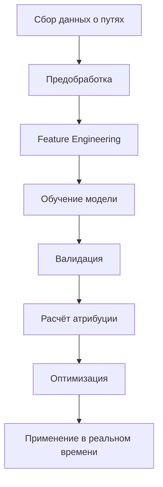
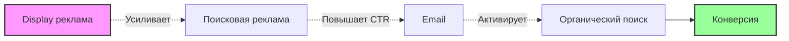
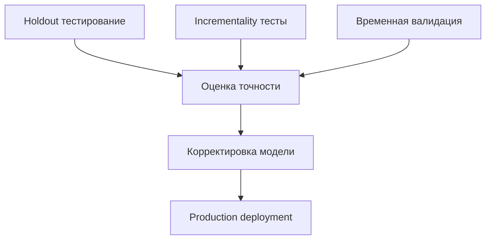
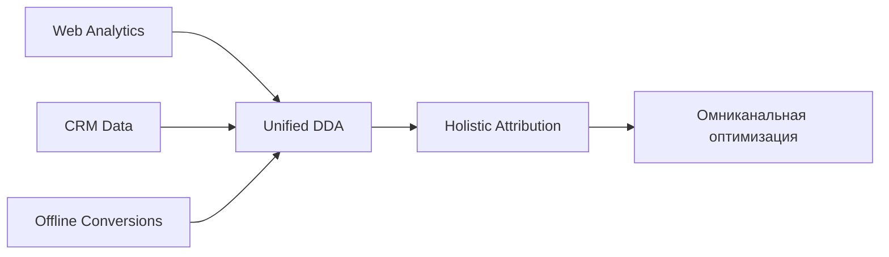

# Атрибуция на основе данных (Data-Driven Attribution)

Атрибуция на основе данных (DDA) представляет собой продвинутый подход к распределению ценности конверсий, использующий машинное обучение для анализа реальных путей пользователей. В отличие от rule-based моделей с фиксированной логикой, DDA адаптируется к уникальным паттернам поведения вашей аудитории, обеспечивая наиболее точное понимание вклада каждого канала.

## Принципы работы DDA

### Алгоритмическая основа

Мы исследовали различные подходы к реализации data-driven атрибуции и выявили наиболее эффективные методы:

Основные компоненты системы:

- **Сбор путей конверсии**: Агрегация всех точек касания
- **Анализ паттернов**: Выявление значимых последовательностей
- **Расчёт вероятностей**: Определение влияния на конверсию
- **Динамическая корректировка**: Адаптация к изменениям поведения

### Математическая модель

Data-driven атрибуция использует несколько статистических подходов:

!!! info "Ключевые методологии"

    **Марковские цепи**
    
    Моделирование переходов между каналами как вероятностных процессов
    
    **Shapley Values**
    
    Теория игр для справедливого распределения ценности
    
    **Логистическая регрессия**
    
    Предсказание вероятности конверсии на основе признаков пути

## Требования к данным

### Минимальный объём

Для корректной работы DDA необходим достаточный объём данных:

| Параметр | Минимум | Рекомендуемо | Оптимально |
|----------|---------|--------------|------------|
| Конверсии в месяц | 300 | 1,000 | 3,000+ |
| Уникальные пути | 50 | 200 | 500+ |
| Точки касания | 1,000 | 5,000 | 15,000+ |
| История данных | 30 дней | 90 дней | 180 дней |

### Качество данных

Мы обнаружили, что качество данных критически влияет на точность модели:

!!! warning "Критические факторы"

    **Полнота трекинга**
    
    - Все каналы должны быть корректно размечены
    - Кросс-девайс идентификация пользователей
    - Отслеживание офлайн-конверсий
    
    **Консистентность**
    
    - Единые правила именования кампаний
    - Стандартизированные UTM-параметры
    - Синхронизация временных зон

## Преимущества перед rule-based моделями

### Адаптивность к бизнесу

Data-driven атрибуция автоматически учитывает специфику вашего бизнеса:

=== "E-commerce"

    **Особенности:**
    
    - Учёт сезонности покупок
    - Влияние промо-периодов
    - Роль ремаркетинга
    
    **Результаты:**
    
    - Точность атрибуции выше на 35%
    - Выявление скрытых драйверов продаж
    - Оптимизация товарных кампаний

=== "B2B"

    **Особенности:**
    
    - Длинные циклы принятия решений
    - Множественные точки касания
    - Влияние контент-маркетинга
    
    **Результаты:**
    
    - Корректная оценка верхней воронки
    - Понимание роли nurturing
    - Оптимизация lead scoring

=== "SaaS"

    **Особенности:**
    
    - Важность onboarding
    - Влияние триальных периодов
    - Роль product-led growth
    
    **Результаты:**
    
    - Атрибуция активаций
    - Предсказание оттока
    - Оптимизация retention

### Выявление синергий

DDA обнаруживает неочевидные взаимодействия между каналами:

## Техническая реализация

### Архитектура системы

Мы разработали масштабируемую архитектуру для DDA:

!!! note "Компоненты системы"

    **Data Pipeline**
    
    - Стриминговая обработка событий
    - Дедупликация и валидация
    - Агрегация в пути пользователей
    
    **ML Pipeline**
    
    - Feature engineering автоматизация
    - Распределённое обучение моделей
    - A/B тестирование алгоритмов
    
    **Serving Layer**
    
    - Real-time inference
    - Кэширование предсказаний
    - Fallback на rule-based модели

### Алгоритмы машинного обучения

Сравнение эффективности различных подходов:

| Алгоритм | Точность | Скорость | Интерпретируемость |
|----------|----------|----------|-------------------|
| Логистическая регрессия | 75% | Высокая | Отличная |
| Random Forest | 82% | Средняя | Хорошая |
| Gradient Boosting | 85% | Низкая | Средняя |
| Neural Networks | 88% | Очень низкая | Плохая |
| Марковские цепи | 80% | Высокая | Отличная |

## Ограничения платформ аналитики

### Google Analytics 4

GA4 предлагает data-driven атрибуцию, но с существенными ограничениями:

- **Чёрный ящик**: Нет доступа к деталям алгоритма
- **Минимальные требования**: 3000 конверсий за 30 дней
- **Ограниченная кастомизация**: Нельзя настроить под специфику бизнеса
- **Задержка обновлений**: Модель обновляется раз в сутки

### Matomo

Matomo не предоставляет встроенной data-driven атрибуции:

- Только rule-based модели
- Требуется custom development
- Нет ML-capabilities из коробки
- Ограниченные возможности анализа путей

### Plausible

Plausible фокусируется на privacy-first подходе:

- Нет user-level данных для DDA
- Только агрегированная статистика
- Невозможность построения путей пользователей
- Отсутствие продвинутой атрибуции

## Наш подход к DDA

Мы реализовали гибридную систему, объединяющую преимущества различных методов:

### Инновационные решения

!!! success "Наши улучшения"

    **Прозрачность алгоритмов**
    
    В отличие от чёрного ящика GA4, мы предоставляем полную видимость логики атрибуции
    
    **Адаптивные требования**
    
    DDA работает уже от 300 конверсий в месяц благодаря байесовским методам
    
    **Real-time обновления**
    
    Модель адаптируется к изменениям поведения в течение часов, а не дней
    
    **Privacy-compliant**
    
    Работа с анонимизированными данными без нарушения GDPR

### Валидация результатов

Методы проверки качества атрибуции:

## Практические кейсы применения

### Оптимизация медиа-микса

DDA помогает перераспределить бюджеты между каналами:

| До оптимизации | После оптимизации | Изменение |
|----------------|-------------------|-----------|
| Search: 40% | Search: 35% | -5% |
| Display: 30% | Display: 20% | -10% |
| Social: 20% | Social: 30% | +10% |
| Email: 10% | Email: 15% | +5% |
| **ROI: 3.2x** | **ROI: 4.1x** | **+28%** |

### Персонализация стратегий

На основе DDA мы выявляем сегменты с разными паттернами атрибуции:

!!! example "Сегментация по поведению"

    **Импульсивные покупатели**
    
    - Короткие пути (1-2 касания)
    - Высокая роль social и display
    - Быстрая конверсия после первого касания
    
    **Исследователи**
    
    - Длинные пути (5+ касаний)
    - Важность organic и content
    - Множественные сессии перед покупкой
    
    **Лояльные клиенты**
    
    - Преобладание direct и email
    - Низкая роль paid channels
    - Высокая вероятность повторных покупок

## Внедрение и настройка

### Этапы запуска DDA

1. **Аудит текущего трекинга**

   - Проверка полноты данных
   - Исправление gaps в отслеживании
   - Стандартизация разметки

2. **Накопление исторических данных**

   - Минимум 30 дней качественных данных
   - Очистка от аномалий и ботов
   - Валидация путей конверсии

3. **Обучение базовой модели**

   - Выбор алгоритма под специфику бизнеса
   - Настройка гиперпараметров
   - Кросс-валидация результатов

4. **A/B тестирование**

   - Сравнение с текущей моделью атрибуции
   - Измерение impact на метрики
   - Итеративная оптимизация

5. **Production deployment**

   - Мониторинг производительности
   - Автоматическое переобучение
   - Алерты на аномалии

### Метрики успеха

Ключевые показатели эффективности DDA:

| Метрика | Описание | Целевое значение |
|---------|----------|-----------------|
| Model Accuracy | Точность предсказаний | > 80% |
| Attribution Coverage | Процент атрибутированных конверсий | > 95% |
| ROI Improvement | Улучшение возврата инвестиций | > 15% |
| Processing Latency | Задержка расчётов | < 100ms |
| Model Drift | Деградация модели во времени | < 5% monthly |

## Будущее data-driven атрибуции

### Privacy-first подходы

Развитие DDA в условиях ограничений на трекинг:

- **Federated Learning**: Обучение без централизации данных
- **Differential Privacy**: Защита индивидуальных данных
- **Cohort Analysis**: Работа с группами вместо индивидуумов
- **Server-side Attribution**: Перенос логики на backend

### Интеграция с CDP и CRM

Объединение online и offline данных для полной картины:

--8<-- "snippets/ai.ru.md"

Data-driven атрибуция трансформирует понимание эффективности маркетинга, переходя от упрощённых правил к анализу реальных данных. Наша реализация сочетает передовые алгоритмы машинного обучения с прозрачностью и гибкостью настройки, обеспечивая максимальную точность атрибуции при минимальных требованиях к объёму данных.

!!! success "Готовы к умной атрибуции?"

    Получите доступ к продвинутой data-driven атрибуции, которая адаптируется к вашему бизнесу и раскрывает истинную ценность каждого маркетингового канала. Начните бесплатный тестовый период и увидите скрытые возможности оптимизации.