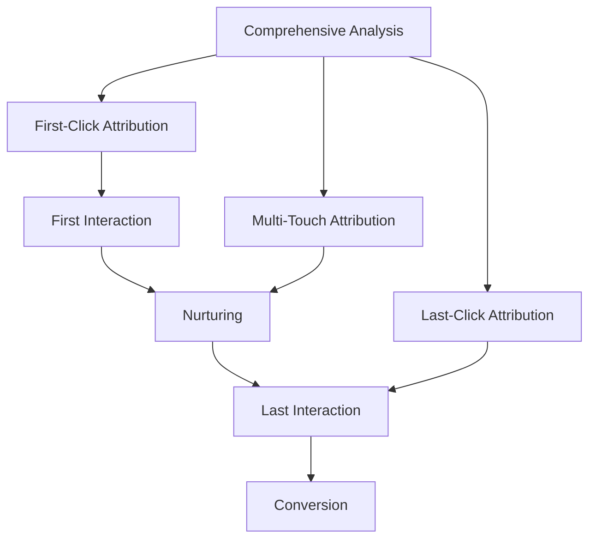

# First-Click Attribution: Complete Guide to the First-Click Attribution Model

Understanding which marketing channels lead to conversions is critical for effective budget allocation. In the world of multi-channel marketing, customers interact with brands through multiple touchpoints before making a purchase. First-Click Attribution is one of the key attribution models that helps understand where exactly the customer's journey to conversion begins.

## What is First-Click Attribution

**First-Click Attribution** is an attribution model that assigns 100% credit for a conversion to the very first interaction a customer has with a brand. Whether it was a click on a search engine ad, a social media post, or a referral link — if this interaction initiated the customer's journey, it receives full attribution for the sale.

!!! info "First-Click Attribution Example"
    A user first learns about a store through a Facebook ad, then returns a week later through an email newsletter and makes a purchase. When using First-Click Attribution, all credit for the conversion goes to the Facebook ad, as it was the first point of contact.

The model is particularly useful for identifying channels and campaigns that are most effective at generating initial interest and brand discovery.

## Types of Attribution Models

To better understand First-Click Attribution, it's important to consider it in the context of other models:

=== "Single-Touch Models"

    **Characteristics:**

    - Assign all credit to one interaction
    - Simple to implement and understand
    - Don't reflect the complexity of modern customer journeys

    **Examples:** First-Click, Last-Click

=== "Multi-Touch Models"

    **Characteristics:**

    - Distribute credit across multiple interactions
    - Provide a more complete picture of the customer journey
    - Require more sophisticated tracking tools

    **Examples:** Linear, Time Decay, Position-Based

## Benefits of First-Click Attribution

### Simplicity and Clarity

The main advantage of the model is its simplicity in understanding and implementation. No complex setup or analysis of multiple touchpoints is required.

### Focus on Brand Discovery

First-Click Attribution excellently shows which channels are effective at attracting new customers and creating initial brand awareness.

!!! tip "Campaign Optimization for New Customers"
    If your primary goal is attracting a new audience, First-Click Attribution will help determine which channels work best at the top of the sales funnel.

### Suitable for Startups

For young companies with simple marketing setups, the model provides initial understanding of customer acquisition sources.

### Top-of-Funnel Analysis

The model is ideal for evaluating the effectiveness of awareness-stage campaigns and understanding sources of initial traffic.

## Limitations and Disadvantages

### Ignoring Subsequent Interactions

!!! warning "Main Limitation"
    First-Click Attribution completely ignores the role of subsequent touchpoints that nurture and convert leads. This creates an incomplete understanding of the customer journey.

### Potential for Distorted Insights

The model can lead to excessive emphasis on initial interactions, undervaluing channels that play key roles at later stages of the customer journey.

### Risk of Budget Misallocation

Relying exclusively on this model, you might over-invest in channels that generate initial interest but perform poorly at nurturing leads to conversion.

### Problems with Long Sales Cycles

For B2B companies with lengthy decision-making cycles, the initial touchpoint may be so removed in time that it has minimal relevance to the final decision.

### Tracking Blind Spots

!!! note "Important Limitation"
    The model only accounts for interactions that include active clicks. Ad impressions, video views, and other touchpoints without clicks remain invisible to the model.

## When to Use First-Click Attribution

### Lead Generation

If the primary goal is to identify the most effective channels for acquiring new leads and building an initial audience.

### Awareness Campaign Analysis

When evaluating the effectiveness of awareness-stage campaigns and understanding sources of initial traffic.

### New Companies

For startups with simple marketing setups, the model can offer initial understanding of customer acquisition sources.

### Short Sales Cycles

The model is most effective for businesses with short purchase paths, where customers interact with few touchpoints.

## Competitor Comparison

=== "Google Analytics 4"

    **Support Changes:**

    - First-Click Attribution is no longer supported as of November 2023
    - Conversions moved to Data-Driven Attribution
    - Last-Click available as alternative

=== "Specialized Platforms"

    **Independent Solution Advantages:**

    - Continue to support all attribution models
    - Track UTM parameters, click IDs, page views
    - Connect data with offline conversions

We see an opportunity in providing a more flexible approach to attribution, where users can choose the model that best fits their business needs.

## Implementation Best Practices

### Technical Setup

**UTM Parameters for All Campaigns**

   - Source (utm_source): facebook, google, newsletter
   - Medium (utm_medium): cpc, social, email, referral
   - Campaign (utm_campaign): spring_sale_2024

**Goal and Event Setup**

   - Define key conversions
   - Set up tracking in analytics systems
   - CRM integration for full cycle

**Data Verification**

   - Regular attribution data audits
   - Check for missing UTM parameters
   - Monitor abnormally high direct traffic

### Combined Approach

!!! success "Recommendation"
    Use First-Click Attribution together with other models to get a complete picture of marketing effectiveness. Comparison with Last-Click and Multi-Touch models will help identify channels effective at different stages of the customer journey.

### Analysis and Optimization

**Data Segmentation**

   - By campaign types (brand, generic, competitor)
   - By devices and demographics
   - By time periods

**A/B Testing**

   - Testing creatives for first contact
   - Landing page optimization
   - Acquisition channel effectiveness analysis

**Qualitative Analysis**

   - Customer surveys "How did you hear about us?"
   - Analysis of reviews and brand mentions
   - Competitive landscape research

## Alternative Approaches

### Multi-Touch Attribution

For comprehensive understanding of the customer journey, consider models that distribute credit across multiple touchpoints:

- **Linear Attribution**: equal distribution across all touchpoints
- **Time Decay**: greater weight to recent interactions
- **Position-Based**: emphasis on first and last contact

### Data-Driven Attribution

Uses machine learning to analyze the impact of each interaction based on historical conversion data.

### Progressive Measurement Methods

Considering cookie limitations and growing privacy requirements, modern analytics systems are developing approaches:

- Server-side tracking
- First-party data integration
- Cross-device identification
- Incrementality testing

We are exploring opportunities to integrate these modern approaches to provide more accurate and privacy-focused analytics.

--8<-- "snippets/ai.md"

!!! success "Ready to optimize your attribution?"
    Try our web analytics tool for free! Get access to flexible attribution models, including First-Click, and make informed decisions about marketing budget allocation.