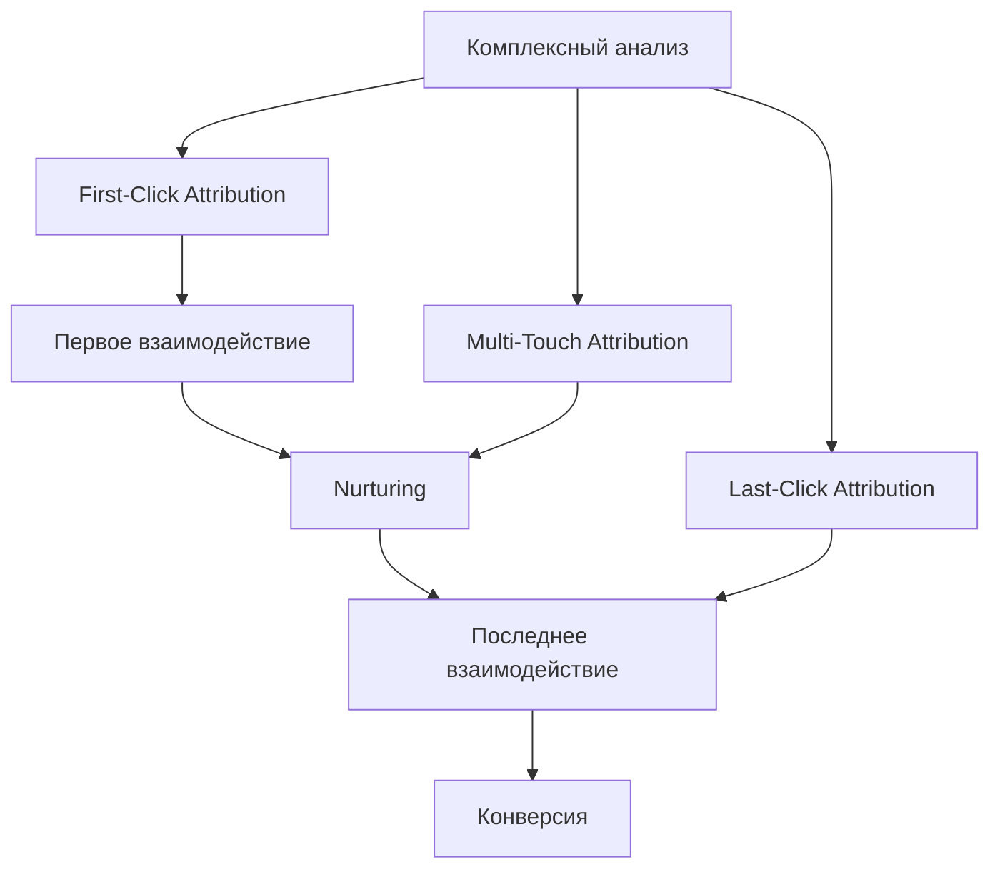

# First-Click Attribution: полное руководство по модели атрибуции первого клика

Понимание того, какие маркетинговые каналы приводят к конверсиям, критически важно для эффективного распределения бюджета. В мире многоканального маркетинга клиенты взаимодействуют с брендом через множество точек контакта перед покупкой. First-Click Attribution — одна из ключевых моделей атрибуции, которая помогает понять, где именно начинается путь клиента к конверсии.

## Что такое First-Click Attribution

**First-Click Attribution** (атрибуция первого клика) — это модель атрибуции, которая присваивает 100% заслуг за конверсию самому первому взаимодействию клиента с брендом. Независимо от того, был ли это клик по рекламе в поисковике, пост в социальных сетях или переход с референсного сайта — если это взаимодействие запустило путь клиента, оно получает полную атрибуцию за продажу.

!!! info "Пример работы First-Click Attribution"
    Пользователь впервые узнает о магазине через рекламу в Facebook, затем возвращается неделю спустя через email-рассылку и совершает покупку. При использовании First-Click Attribution вся заслуга за конверсию достанется Facebook-рекламе, поскольку именно она стала первой точкой контакта.

Модель особенно полезна для выявления каналов и кампаний, которые наиболее эффективны в генерации первоначального интереса и обнаружении бренда.

## Типы моделей атрибуции

Для лучшего понимания First-Click Attribution важно рассмотреть её в контексте других моделей:

=== "Single-Touch модели"

    **Характеристики:**

    - Присваивают всю заслугу одному взаимодействию
    - Просты в реализации и понимании
    - Не отражают сложность современного пути клиента

    **Примеры:** First-Click, Last-Click

=== "Multi-Touch модели"

    **Характеристики:**

    - Распределяют заслугу между несколькими взаимодействиями
    - Предоставляют более полную картину пути клиента
    - Требуют более сложных инструментов отслеживания

    **Примеры:** Linear, Time Decay, Position-Based

## Преимущества First-Click Attribution

### Простота и ясность

Главное преимущество модели — её простота в понимании и реализации. Не требуется сложная настройка или анализ множественных точек контакта.

### Фокус на обнаружении бренда

First-Click Attribution превосходно показывает, какие каналы эффективны в привлечении новых клиентов и создании первоначального осознания бренда.

!!! tip "Оптимизация кампаний для новых клиентов"
    Если ваша основная цель — привлечение новой аудитории, First-Click Attribution поможет определить, какие каналы лучше всего работают на верхней части воронки продаж.

### Подходит для стартапов

Для молодых компаний с простыми маркетинговыми настройками модель дает первоначальное понимание источников привлечения клиентов.

### Анализ верхней части воронки

Модель идеальна для оценки эффективности кампаний на этапе осведомленности и понимания источников первоначального трафика.

## Ограничения и недостатки

### Игнорирование последующих взаимодействий

!!! warning "Основное ограничение"
    First-Click Attribution полностью игнорирует роль последующих точек контакта, которые nurture и конвертируют лиды. Это создает неполное понимание пути клиента.

### Потенциал для искажения инсайтов

Модель может привести к чрезмерному акценту на первоначальных взаимодействиях, недооценивая каналы, играющие ключевую роль на более поздних этапах пути клиента.

### Риск неправильного распределения бюджета

Полагаясь исключительно на эту модель, можно переинвестировать в каналы, генерирующие первоначальный интерес, но плохо справляющиеся с nurturing лидов до конверсии.

### Проблемы с длинными циклами продаж

Для B2B-компаний с длительными циклами принятия решений первоначальная точка контакта может быть настолько удалена во времени, что имеет минимальную релевантность для финального решения.

### Слепые зоны в отслеживании

!!! note "Важное ограничение"
    Модель учитывает только взаимодействия, включающие активные клики. Показы рекламы, просмотры видео и другие touchpoints без кликов остаются невидимыми для модели.

## Когда использовать First-Click Attribution

### Генерация лидов

Если основная цель — определить наиболее эффективные каналы для привлечения новых лидов и построения первоначальной аудитории.

### Анализ кампаний осведомленности

При оценке эффективности кампаний на этапе осведомленности и понимании источников первоначального трафика.

### Новые компании

Для стартапов с простыми маркетинговыми настройками модель может предложить первоначальное понимание источников привлечения клиентов.

### Короткие циклы продаж

Модель наиболее эффективна для бизнесов с коротким путем к покупке, где клиенты взаимодействуют с небольшим количеством точек контакта.

## Сравнение с конкурентами

=== "Google Analytics 4"

    **Изменения в поддержке:**

    - С ноября 2023 года First-Click Attribution больше не поддерживается
    - Конверсии переведены на Data-Driven Attribution
    - Доступна Last-Click как альтернатива

=== "Специализированные платформы"

    **Преимущества независимых решений:**

    - Продолжают поддерживать все модели атрибуции
    - Отслеживают UTM-параметры, click ID, просмотры страниц
    - Связывают данные с оффлайн-конверсиями

Мы видим возможность в предоставлении более гибкого подхода к атрибуции, где пользователи могут выбирать модель, которая лучше всего соответствует их бизнес-потребностям.

## Лучшие практики внедрения

### Техническая настройка

**UTM-параметры для всех кампаний**

   - Источник (utm_source): facebook, google, newsletter
   - Канал (utm_medium): cpc, social, email, referral
   - Кампания (utm_campaign): spring_sale_2024

**Настройка целей и событий**

   - Определение ключевых конверсий
   - Настройка отслеживания в аналитических системах
   - Интеграция с CRM для полного цикла

**Верификация данных**

   - Регулярные аудиты данных атрибуции
   - Проверка на отсутствие UTM-параметров
   - Мониторинг аномально высокого прямого трафика

### Комбинированный подход

!!! success "Рекомендация"
    Используйте First-Click Attribution вместе с другими моделями для получения полной картины эффективности маркетинга. Сравнение с Last-Click и Multi-Touch моделями поможет выявить каналы, эффективные на разных этапах пути клиента.

### Анализ и оптимизация

**Сегментация данных**

   - По типам кампаний (brand, generic, competitor)
   - По устройствам и демографии
   - По временным периодам

**A/B тестирование**

   - Тестирование креативов для первого контакта
   - Оптимизация посадочных страниц
   - Анализ эффективности каналов привлечения

**Качественный анализ**

   - Опросы клиентов "Откуда вы о нас узнали?"
   - Анализ отзывов и упоминаний бренда
   - Исследование конкурентного ландшафта

## Альтернативные подходы

### Multi-Touch Attribution

Для комплексного понимания пути клиента рассмотрите модели, распределяющие заслугу между несколькими точками контакта:

- **Linear Attribution**: равное распределение между всеми touchpoints
- **Time Decay**: больший вес последним взаимодействиям  
- **Position-Based**: акцент на первом и последнем контакте

### Data-Driven Attribution

Использует машинное обучение для анализа влияния каждого взаимодействия на основе исторических данных конверсий.

### Прогрессивные методы измерения

С учетом ограничений cookie и растущих требований к приватности, современные системы аналитики развивают подходы:

- Server-side отслеживание
- First-party data интеграция
- Cross-device идентификация
- Incrementality тестирование

Мы исследуем возможности интеграции этих современных подходов для предоставления более точной и приватной аналитики.

--8<-- "snippets/ai.ru.md"

!!! success "Готовы оптимизировать вашу атрибуцию?"
    Попробуйте наш инструмент веб-аналитики бесплатно! Получите доступ к гибким моделям атрибуции, включая First-Click, и принимайте обоснованные решения о распределении маркетингового бюджета.