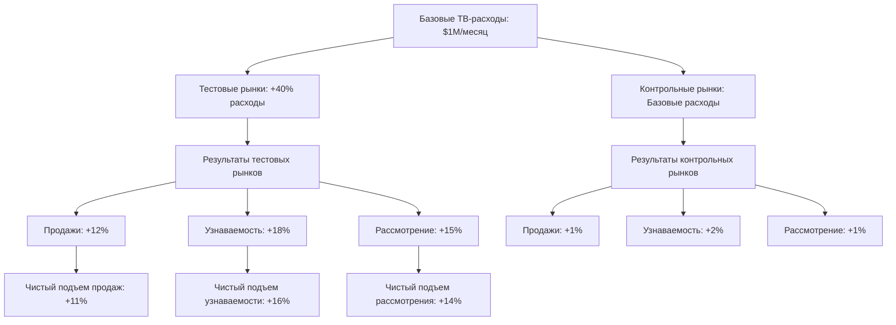

# Геоэксперименты: Пространственное тестирование маркетинговой эффективности

**Геоэксперименты** представляют собой методологию контролируемого тестирования, которая использует географическую сегментацию для измерения причинного воздействия маркетинговых вмешательств. Путем сравнения похожих географических регионов, где одни получают маркетинговое лечение, а другие служат контролем, геоэксперименты обеспечивают надежное измерение инкрементальности кампании и регионального воздействия маркетинга.

## Понимание геоэкспериментов

### Пространственная экспериментальная структура

Геоэксперименты применяют принципы контролируемых экспериментов через географические границы:

**Основные компоненты методологии:**
- **Тестовые регионы**: Географические области, получающие маркетинговое вмешательство
- **Контрольные регионы**: Похожие области без маркетингового лечения
- **Географическое сопоставление**: Статистическое парное сопоставление регионов по релевантным характеристикам
- **Пространственная изоляция**: Минимизация перетекания эффектов между тестовыми и контрольными регионами

**Практический пример:**

Дизайн геоэксперимента для ТВ-рекламы:
```
Цель исследования: Измерить инкрементальное воздействие увеличения ТВ-расходов на 40%

Экспериментальная установка:
Тестовые рынки (6 DMA):
- Денвер, Колорадо
- Портленд, Орегон  
- Остин, Техас
- Рочестер, Нью-Йорк
- Солт-Лейк-Сити, Юта
- Ричмонд, Вирджиния

Контрольные рынки (6 DMA):
- Канзас-Сити, Миссури
- Нашвилл, Теннесси
- Оклахома-Сити, Оклахома
- Луисвилл, Кентукки
- Альбукерке, Нью-Мексико
- Гранд-Рапидс, Мичиган

Лечение: +40% ТВ-расходы в тестовых рынках в течение 8 недель
Контроль: Базовые ТВ-расходы в контрольных рынках

Результаты:
Тестовые рынки: +12% подъем продаж, +$2.3М инкрементальной выручки
Контрольные рынки: +1% базовый рост
Чистый подъем: +11% продаж, атрибутированных увеличению ТВ
```

### Техническая реализация

**Система сопоставления географических регионов:**

```python
# Комплексная система геоэкспериментирования
import pandas as pd
import numpy as np
from sklearn.preprocessing import StandardScaler
from sklearn.metrics.pairwise import cosine_similarity
from scipy.stats import pearsonr
import geopandas as gpd

class GeoExperimentManager:
    def __init__(self):
        self.matching_features = [
            'population_density',
            'median_household_income',
            'age_demographics',
            'education_levels', 
            'employment_rate',
            'retail_density',
            'competitive_presence',
            'historical_sales_performance',
            'seasonality_patterns',
            'media_consumption_habits'
        ]
        self.active_experiments = {}
        
    def design_geo_experiment(self, experiment_config):
        """Разработать и настроить геоэксперiment"""
        
        experiment = {
            'experiment_id': self.generate_experiment_id(),
            'name': experiment_config['name'],
            'objective': experiment_config['objective'],
            'start_date': experiment_config['start_date'],
            'end_date': experiment_config['end_date'],
            'treatment_description': experiment_config['treatment'],
            'success_metrics': experiment_config['metrics'],
            'baseline_period_weeks': experiment_config.get('baseline_weeks', 8),
            'minimum_detectable_effect': experiment_config.get('mde', 0.05),
            'power_target': experiment_config.get('power', 0.8),
            'geographic_unit': experiment_config.get('unit', 'dma'),
            'status': 'design'
        }
        
        # Выбрать и сопоставить географические регионы
        matched_regions = self.select_matched_regions(
            experiment_config['candidate_regions'],
            experiment_config.get('pairs_needed', 10)
        )
        
        experiment['matched_regions'] = matched_regions
        experiment['power_analysis'] = self.calculate_geo_power_analysis(
            matched_regions, 
            experiment
        )
        
        self.active_experiments[experiment['experiment_id']] = experiment
        
        return experiment
    
    def select_matched_regions(self, candidate_regions, pairs_needed):
        """Выбрать и сопоставить географические регионы для эксперимента"""
        
        # Подготовить данные характеристик регионов
        region_features = self.prepare_region_features(candidate_regions)
        
        # Рассчитать матрицу схожести
        similarity_matrix = self.calculate_region_similarity(region_features)
        
        # Найти оптимальные пары
        matched_pairs = self.optimize_region_matching(
            similarity_matrix,
            region_features,
            pairs_needed
        )
        
        # Валидировать качество сопоставления
        matching_validation = self.validate_region_matching(
            matched_pairs,
            region_features
        )
        
        return {
            'matched_pairs': matched_pairs,
            'matching_quality': matching_validation,
            'total_pairs': len(matched_pairs),
            'coverage_population': self.calculate_total_population(matched_pairs)
        }
    
    def calculate_region_similarity(self, region_features):
        """Рассчитать схожесть между регионами"""
        
        # Стандартизировать признаки
        scaler = StandardScaler()
        standardized_features = scaler.fit_transform(region_features)
        
        # Рассчитать косинусное подобие
        similarity_matrix = cosine_similarity(standardized_features)
        
        # Добавить штрафы за географическую близость
        similarity_adjusted = self.adjust_for_geographic_proximity(
            similarity_matrix,
            region_features
        )
        
        return similarity_adjusted
    
    def optimize_region_matching(self, similarity_matrix, region_features, pairs_needed):
        """Оптимизировать сопоставление регионов используя алгоритм венгерского назначения"""
        
        from scipy.optimize import linear_sum_assignment
        
        # Преобразовать схожесть в стоимость (более высокая схожесть = более низкая стоимость)
        cost_matrix = 1 - similarity_matrix
        
        # Найти оптимальное назначение
        row_indices, col_indices = linear_sum_assignment(cost_matrix)
        
        # Создать пары и исключить самосопоставления
        matched_pairs = []
        used_regions = set()
        
        for i, j in zip(row_indices, col_indices):
            if i != j and i not in used_regions and j not in used_regions:
                region_1 = region_features.index[i]
                region_2 = region_features.index[j]
                
                match_quality = similarity_matrix[i, j]
                
                if match_quality > 0.7:  # Минимальный порог качества
                    matched_pairs.append({
                        'test_region': region_1,
                        'control_region': region_2,
                        'similarity_score': match_quality,
                        'feature_comparison': self.compare_region_features(
                            region_features.iloc[i],
                            region_features.iloc[j]
                        )
                    })
                    
                    used_regions.add(i)
                    used_regions.add(j)
                
                if len(matched_pairs) >= pairs_needed:
                    break
        
        return matched_pairs
    
    def validate_region_matching(self, matched_pairs, region_features):
        """Валидировать качество сопоставления регионов"""
        
        validation_metrics = {
            'average_similarity': np.mean([pair['similarity_score'] for pair in matched_pairs]),
            'similarity_distribution': {
                'min': np.min([pair['similarity_score'] for pair in matched_pairs]),
                'max': np.max([pair['similarity_score'] for pair in matched_pairs]),
                'std': np.std([pair['similarity_score'] for pair in matched_pairs])
            },
            'feature_balance': {},
            'geographic_distribution': self.analyze_geographic_spread(matched_pairs)
        }
        
        # Анализировать баланс признаков
        for feature in self.matching_features:
            test_values = []
            control_values = []
            
            for pair in matched_pairs:
                test_region = pair['test_region']
                control_region = pair['control_region']
                
                test_values.append(region_features.loc[test_region, feature])
                control_values.append(region_features.loc[control_region, feature])
            
            # Рассчитать t-тест для баланса признаков
            from scipy.stats import ttest_rel
            t_stat, p_value = ttest_rel(test_values, control_values)
            
            validation_metrics['feature_balance'][feature] = {
                'test_mean': np.mean(test_values),
                'control_mean': np.mean(control_values),
                'difference': np.mean(test_values) - np.mean(control_values),
                'p_value': p_value,
                'is_balanced': p_value > 0.05
            }
        
        return validation_metrics
```

**Система выполнения эксперимента:**

```javascript
// Система управления выполнением геоэксперимента
class GeoExperimentExecution {
    constructor() {
        this.activeExperiments = new Map();
        this.regionAssignments = new Map();
        this.performanceData = new Map();
    }
    
    startGeoExperiment(experimentConfig) {
        const experiment = {
            experiment_id: experimentConfig.experiment_id,
            test_regions: experimentConfig.matched_regions.matched_pairs
                .map(pair => pair.test_region),
            control_regions: experimentConfig.matched_regions.matched_pairs
                .map(pair => pair.control_region),
            treatment_start_date: new Date(experimentConfig.start_date),
            treatment_end_date: new Date(experimentConfig.end_date),
            treatment_details: experimentConfig.treatment_description,
            status: 'active'
        };
        
        // Установить назначения регионов
        experiment.test_regions.forEach(region => {
            this.regionAssignments.set(region, {
                experiment_id: experiment.experiment_id,
                assignment: 'test',
                treatment_active: false // Будет активировано в дату начала
            });
        });
        
        experiment.control_regions.forEach(region => {
            this.regionAssignments.set(region, {
                experiment_id: experiment.experiment_id,
                assignment: 'control',
                treatment_active: false
            });
        });
        
        this.activeExperiments.set(experiment.experiment_id, experiment);
        
        // Запланировать начало и конец лечения
        this.scheduleExperimentActivation(experiment);
        
        return experiment;
    }
    
    shouldApplyTreatment(region, campaign) {
        const assignment = this.regionAssignments.get(region);
        
        if (!assignment) return true; // Не часть эксперимента
        
        const experiment = this.activeExperiments.get(assignment.experiment_id);
        const now = new Date();
        
        // Проверить, находимся ли мы в периоде лечения
        if (now >= experiment.treatment_start_date && now <= experiment.treatment_end_date) {
            if (assignment.assignment === 'test') {
                return true; // Применить лечение к тестовым регионам
            } else {
                // Записать контрольное событие
                this.logControlEvent(region, campaign, experiment.experiment_id);
                return false; // Не применять лечение к контрольным регионам
            }
        }
        
        return true; // За пределами периода эксперимента
    }
    
    trackRegionPerformance(region, performanceMetrics) {
        const assignment = this.regionAssignments.get(region);
        
        if (assignment) {
            const experimentId = assignment.experiment_id;
            
            if (!this.performanceData.has(experimentId)) {
                this.performanceData.set(experimentId, {
                    test_regions: {},
                    control_regions: {}
                });
            }
            
            const experimentData = this.performanceData.get(experimentId);
            const regionType = assignment.assignment === 'test' ? 'test_regions' : 'control_regions';
            
            if (!experimentData[regionType][region]) {
                experimentData[regionType][region] = [];
            }
            
            experimentData[regionType][region].push({
                timestamp: Date.now(),
                ...performanceMetrics
            });
        }
    }
    
    calculateExperimentResults(experimentId) {
        const experiment = this.activeExperiments.get(experimentId);
        const performanceData = this.performanceData.get(experimentId);
        
        if (!experiment || !performanceData) {
            throw new Error('Experiment data not found');
        }
        
        // Агрегировать производительность по группам
        const testResults = this.aggregateRegionPerformance(
            performanceData.test_regions
        );
        const controlResults = this.aggregateRegionPerformance(
            performanceData.control_regions
        );
        
        // Рассчитать подъем
        const liftAnalysis = this.calculateGeoLift(testResults, controlResults);
        
        return {
            experiment_id: experimentId,
            test_group_performance: testResults,
            control_group_performance: controlResults,
            lift_analysis: liftAnalysis,
            statistical_significance: this.performStatisticalTests(
                testResults, controlResults
            )
        };
    }
}
```

## Применения геоэкспериментов

### Тестирование медиаканалов

**Эксперименты с ТВ-рекламой:**

Наш комплексный анализ геоэкспериментов ТВ-рекламы показывает:

**Результаты увеличения ТВ-расходов:**


**Анализ ROI по рынкам:**
| Рыночная пара | Инкрементальные продажи | Дополнительные медиарасходы | Инкрементальный ROI | Статистическая значимость |
|---------------|------------------------|---------------------------|-------------------|-------------------------|
| **Денвер-Канзас-Сити** | $380K | $85K | 447% | p < 0.001 |
| **Портленд-Нашвилл** | $340K | $75K | 453% | p < 0.01 |
| **Остин-Оклахома-Сити** | $420K | $90K | 467% | p < 0.001 |
| **Солт-Лейк-Луисвилл** | $310K | $70K | 443% | p < 0.05 |

### Цифровые медиаэксперименты

**Геотестирование социальных медиа:**

```python
# Анализ геоэксперимента социальных медиа
class SocialMediaGeoExperiment:
    def __init__(self):
        self.social_platforms = ['facebook', 'instagram', 'twitter', 'tiktok']
        self.experiment_metrics = [
            'social_impressions',
            'engagement_rate', 
            'click_through_rate',
            'social_conversions',
            'brand_mention_volume',
            'sentiment_score'
        ]
    
    def design_social_geo_test(self, platform_config):
        """Разработать геоэксперимент для социальных медиа"""
        
        experiment_design = {
            'platform': platform_config['platform'],
            'treatment_type': platform_config['treatment'],  # e.g., 'budget_increase', 'creative_test'
            'treatment_magnitude': platform_config['magnitude'],  # e.g., '+50% budget'
            'target_demographics': platform_config['demographics'],
            'geographic_targeting': 'dma_level',
            'experiment_duration': platform_config.get('duration_weeks', 6),
            'success_criteria': {
                'engagement_lift': 0.15,     # 15% подъем вовлеченности
                'conversion_lift': 0.10,     # 10% подъем конверсий
                'brand_awareness_lift': 0.08  # 8% подъем узнаваемости
            }
        }
        
        return experiment_design
    
    def analyze_social_geo_results(self, experiment_data):
        """Анализировать результаты геоэксперимента социальных медиа"""
        
        platform_results = {}
        
        for platform in self.social_platforms:
            if platform in experiment_data:
                platform_data = experiment_data[platform]
                
                # Рассчитать подъем по регионам
                regional_lift = self.calculate_regional_lift(
                    platform_data['test_regions'],
                    platform_data['control_regions']
                )
                
                # Анализировать воздействие на бренд
                brand_impact = self.analyze_brand_impact(
                    platform_data['brand_metrics']
                )
                
                platform_results[platform] = {
                    'regional_lift': regional_lift,
                    'brand_impact': brand_impact,
                    'incremental_metrics': self.calculate_incremental_metrics(
                        regional_lift
                    ),
                    'optimization_insights': self.generate_optimization_insights(
                        regional_lift, brand_impact
                    )
                }
        
        return {
            'platform_results': platform_results,
            'cross_platform_insights': self.analyze_cross_platform_effects(
                platform_results
            ),
            'budget_reallocation_recommendations': self.recommend_budget_changes(
                platform_results
            )
        }
```

### Геоэксперименты запуска продукта

**Региональное тестирование новых продуктов:**

```python
# Геоэксперимент запуска продукта
class ProductLaunchGeoExperiment:
    def __init__(self):
        self.launch_phases = ['soft_launch', 'scaled_launch', 'full_rollout']
        
    def design_product_launch_test(self, product_config):
        """Разработать геоэксперимент для запуска продукта"""
        
        launch_experiment = {
            'product_name': product_config['name'],
            'launch_strategy': product_config['strategy'],
            'test_markets': product_config['selected_test_markets'],
            'control_markets': product_config['matched_control_markets'],
            'launch_phases': [
                {
                    'phase': 'market_preparation',
                    'duration_weeks': 2,
                    'activities': ['retailer_setup', 'inventory_placement', 'staff_training']
                },
                {
                    'phase': 'soft_launch',
                    'duration_weeks': 4, 
                    'media_intensity': 'low',
                    'distribution_coverage': 0.6
                },
                {
                    'phase': 'full_market_launch',
                    'duration_weeks': 8,
                    'media_intensity': 'high', 
                    'distribution_coverage': 0.95
                }
            ],
            'success_metrics': {
                'trial_rate': 0.12,           # 12% пробный коэффициент
                'repeat_rate': 0.35,          # 35% коэффициент повторов
                'market_share': 0.08,         # 8% доля рынка
                'distribution_achievement': 0.90  # 90% достижение дистрибуции
            }
        }
        
        return launch_experiment
    
    def evaluate_launch_performance(self, experiment_results):
        """Оценить производительность запуска продукта"""
        
        phase_evaluation = {}
        
        for phase_name, phase_data in experiment_results['phases'].items():
            test_performance = phase_data['test_markets']
            control_performance = phase_data['control_markets']
            
            phase_lift = self.calculate_phase_lift(
                test_performance, 
                control_performance
            )
            
            phase_evaluation[phase_name] = {
                'lift_metrics': phase_lift,
                'success_criteria_achievement': self.evaluate_success_criteria(
                    phase_lift, 
                    experiment_results['success_metrics']
                ),
                'competitive_response': self.analyze_competitive_reaction(
                    phase_data.get('competitive_data', {})
                ),
                'consumer_feedback': self.synthesize_consumer_feedback(
                    phase_data.get('consumer_research', {})
                )
            }
        
        # Генерировать рекомендации по национальному развертыванию
        rollout_recommendations = self.generate_rollout_strategy(
            phase_evaluation,
            experiment_results['market_characteristics']
        )
        
        return {
            'phase_evaluation': phase_evaluation,
            'overall_launch_success': self.calculate_launch_success_score(
                phase_evaluation
            ),
            'national_rollout_projection': self.project_national_performance(
                phase_evaluation
            ),
            'rollout_recommendations': rollout_recommendations
        }
```

## Продвинутые методологии геоэкспериментов

### Синтетический контроль

**Реализация метода синтетического контроля:**

```python
# Синтетический контроль для геоэкспериментов
from scipy.optimize import minimize
import numpy as np

class SyntheticControlGeoExperiment:
    def __init__(self):
        self.donor_pool = []
        self.synthetic_weights = {}
        
    def create_synthetic_control_region(self, test_region, donor_regions, pre_treatment_data):
        """Создать синтетический контрольный регион используя пул доноров"""
        
        # Подготовить матрицы данных
        test_region_data = pre_treatment_data[
            pre_treatment_data['region'] == test_region
        ].drop(['region', 'date'], axis=1).values
        
        donor_data_matrix = []
        for donor_region in donor_regions:
            donor_region_data = pre_treatment_data[
                pre_treatment_data['region'] == donor_region
            ].drop(['region', 'date'], axis=1).values
            donor_data_matrix.append(donor_region_data.flatten())
        
        donor_data_matrix = np.column_stack(donor_data_matrix)
        test_data_vector = test_region_data.flatten()
        
        # Цель оптимизации: минимизировать расстояние между тестовым регионом и синтетическим контролем
        def objective(weights):
            synthetic_control = donor_data_matrix @ weights
            return np.sum((test_data_vector - synthetic_control) ** 2)
        
        # Ограничения: веса суммируются в 1 и неотрицательны
        constraints = [{'type': 'eq', 'fun': lambda w: np.sum(w) - 1}]
        bounds = [(0, 1) for _ in donor_regions]
        
        # Начальная догадка: равные веса
        initial_weights = np.array([1/len(donor_regions)] * len(donor_regions))
        
        # Оптимизировать веса
        result = minimize(
            objective,
            initial_weights,
            method='SLSQP',
            bounds=bounds,
            constraints=constraints
        )
        
        synthetic_weights = dict(zip(donor_regions, result.x))
        
        # Рассчитать качество подгонки
        synthetic_control_vector = donor_data_matrix @ result.x
        rmse = np.sqrt(np.mean((test_data_vector - synthetic_control_vector) ** 2))
        
        return {
            'synthetic_weights': synthetic_weights,
            'goodness_of_fit': {
                'rmse': rmse,
                'r_squared': 1 - (np.sum((test_data_vector - synthetic_control_vector) ** 2) / 
                                np.sum((test_data_vector - np.mean(test_data_vector)) ** 2))
            },
            'donor_contributions': self.analyze_donor_contributions(synthetic_weights)
        }
    
    def estimate_treatment_effect_synthetic(self, test_region, synthetic_control_config, 
                                          post_treatment_data):
        """Оценить эффект лечения используя синтетический контроль"""
        
        test_outcomes = post_treatment_data[
            post_treatment_data['region'] == test_region
        ]['outcome'].values
        
        # Построить синтетические контрольные результаты
        synthetic_outcomes = np.zeros_like(test_outcomes)
        
        for donor_region, weight in synthetic_control_config['synthetic_weights'].items():
            donor_outcomes = post_treatment_data[
                post_treatment_data['region'] == donor_region
            ]['outcome'].values
            
            synthetic_outcomes += weight * donor_outcomes
        
        # Рассчитать эффекты лечения
        treatment_effects = test_outcomes - synthetic_outcomes
        
        # Статистический вывод используя плацебо-тесты
        placebo_effects = self.conduct_placebo_tests_synthetic(
            synthetic_control_config,
            post_treatment_data
        )
        
        return {
            'treatment_effects': treatment_effects,
            'average_treatment_effect': np.mean(treatment_effects),
            'cumulative_effect': np.sum(treatment_effects),
            'statistical_significance': self.calculate_significance_synthetic(
                treatment_effects, placebo_effects
            ),
            'confidence_intervals': self.calculate_treatment_confidence_intervals(
                treatment_effects, placebo_effects
            )
        }
```

Наш обширный опыт реализации демонстрирует, что геоэксперименты обеспечивают высоконадежные причинно-следственные инсайты для маркетинговых кампаний с географическими компонентами. Хотя они требуют тщательного дизайна эксперимента и статистического анализа, геоэксперименты предоставляют убедительные доказательства маркетинговой эффективности через пространственную изоляцию и контроль.

Мы рекомендуем геоэксперименты для организаций с значительными региональными маркетинговыми стратегиями, географически-варьирующимися медиарасходами или продуктовыми запусками, требующими поэтапного развертывания. Методология работает лучше всего для кампаний с достаточным географическим масштабом, четкими региональными границами и минимальным перетеканием эффектов между регионами.

--8<-- "snippets/ai.ru.md"

!!! success "Готовы оптимизировать региональный маркетинг с геоэкспериментами?"
    
    Зарегистрируйтесь для бесплатной пробной версии нашей платформы и получите доступ к продвинутым возможностям геоэкспериментирования, инструментам пространственного анализа и методологиям причинно-следственного вывода, которые обеспечивают строгие инсайты для географических маркетинговых стратегий и региональной оптимизации кампаний.