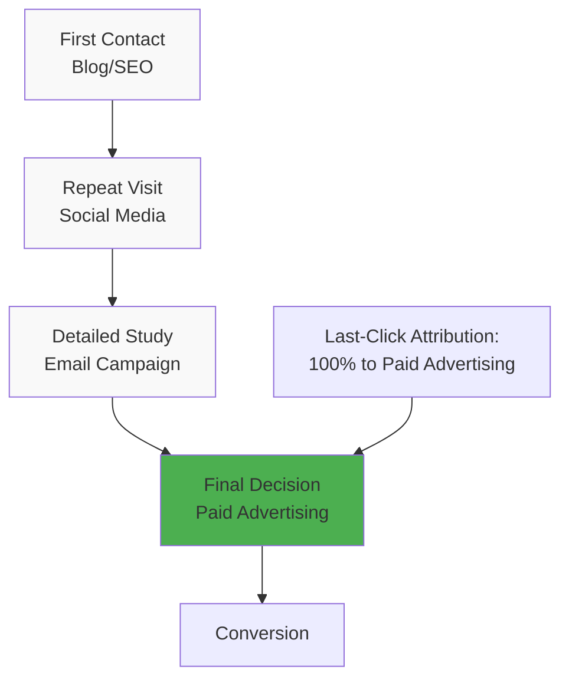
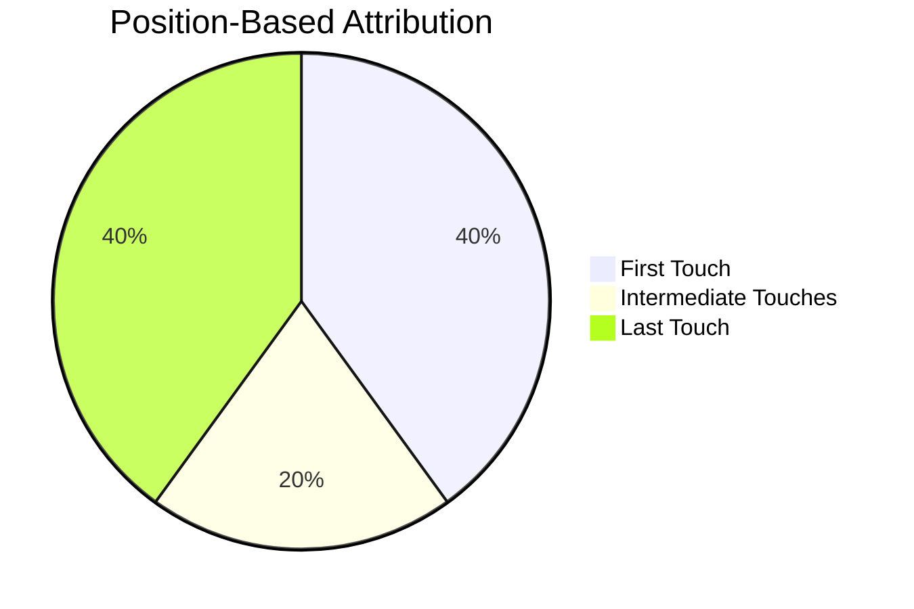

# Last-Click Attribution: The Last-Click Attribution Model

Last-Click Attribution is the most widely used attribution model in digital marketing, which assigns 100% of conversion value to the last interaction a customer had with an advertising channel before completing a target action. This model is used by default in most web analytics systems and advertising platforms, including Google Ads and Facebook Ads Manager.

## How Last-Click Attribution Works

The model assigns all credit for conversion to the final touchpoint in the customer journey. Regardless of how many interactions occurred earlier, only the last click receives credit for achieving the goal.

!!! example "Example of Last-Click Attribution in Action"
    
    A customer goes through the following journey:
    
    1. Sees an advertising banner on social media → visits the website
    2. Receives an email newsletter → revisits the website  
    3. Finds the website through a search engine → makes a purchase
    
    **Result:** Under the Last-Click model, all conversion value goes to organic search, even though previous touchpoints may have played a decisive role in the decision-making process.

### Technical Characteristics

**Attribution Window:** Most platforms use a standard 30-day window for clicks and 1-day for views. Conversions occurring outside this window are not counted.

**Source Priority:** In case of multiple clicks on the same day, the system selects the most recent source by time. Direct visits are often excluded from attribution (Last Non-Direct Click model).

**Cross-device Limitations:** The model works within one device and browser, creating problems when analyzing multi-device user behavior.

## Advantages of Last-Click Attribution

### Simplicity of Implementation and Understanding

The model doesn't require complex algorithms or extensive historical databases to function. The logic of "last click = conversion source" is intuitively clear to most marketers and doesn't raise questions when interpreting results.

### Focus on Conversion Channels  

Last-Click effectively identifies channels that directly lead to sales. These traffic sources attract "hot" audiences ready to make a purchase after one interaction with an advertisement.

!!! tip "Minimum Effectiveness Indicator"
    
    Last-Click Attribution shows the minimum possible contribution of a source to revenue generation. If advertising channels are profitable under this model, they can be confidently scaled.

### Universality and Compatibility

Virtually all web analytics systems and advertising platforms support Last-Click Attribution by default. This ensures data compatibility between different tools and simplifies result comparison.

### Bid and Budget Optimization

The model allows quick identification of channels with high conversion rates within their role of "closing" sales. This simplifies decision-making about reallocating advertising budget toward the most effective sources of final conversions.

## Disadvantages and Limitations

### Ignoring Assisting Channels

The main disadvantage of Last-Click Attribution is completely ignoring the contribution of previous interactions. Upper and middle funnel channels that build awareness and interest don't receive proper recognition for their contribution to final conversion.

!!! warning "Incomplete Picture of Customer Journey"
    
    The model creates a distorted view of the value of different marketing channels. Sources that specialize in attracting new audiences or warming them up may seem unprofitable, although they actually play a critical role in the sales funnel.

### Incorrect Budget Distribution

Focus on final interactions can lead to reduced investment in new audience acquisition channels. This creates long-term problems for the sales funnel and leads to gradual decline in overall results.

### Problems with Long Sales Cycles

In the B2B sector and expensive product categories, the decision-making cycle can stretch for months. Last-Click Attribution cannot reflect the complexity of such sales processes, where each interaction contributes to the final decision.



### Inability to Optimize the Funnel

The model doesn't provide information about which channel combinations work most effectively. This limits opportunities for comprehensive marketing strategy optimization.

## Comparison with Alternative Models

| Model | Value Distribution | Best Suited For |
|--------|----------------------|-------------------------|
| **Last-Click** | 100% to last touch | Short sales cycle, direct sales |
| **First-Click** | 100% to first touch | Acquisition campaigns, branding |
| **Linear** | Evenly across all | Long sales cycle, B2B |
| **Time-Decay** | More to recent touches | Medium sales cycle |
| **Position-Based** | 40% first and last | Complex sales funnels |
| **Data-Driven** | Based on ML analysis | Large data volumes |

## When to Use Last-Click Attribution

### Suitable Application Scenarios

**Short Sales Cycles** — customers make purchase decisions within a maximum of 2-3 interactions. The model works effectively for everyday goods, low-cost digital services, impulse purchases.

**Retargeting Campaigns** — the main goal is to return visitors to complete a started purchase. Last-Click accurately shows which retargeting ads most effectively convert "hot" users.

**Time-Limited Promotions** — flash sales, seasonal discounts, timed offers. In such campaigns, purchase decisions are made quickly, and the last interaction truly plays a decisive role.

!!! info "Optimal Conditions for Last-Click"
    
    - Sales cycle less than 3 days
    - Average order value up to $200 
    - Clear product value proposition
    - Minimal need for explanations and consultations

### Industry Applications

**E-commerce** — for products with clear characteristics and simple decision-making processes. Especially effective for repeat purchases by existing customers.

**Digital Services** — SaaS products with freemium models, online courses, digital content. Last-Click well reflects the moment of transition from free to paid plans.

**Lead Generation** — when the goal is to obtain contact information of potential customers for subsequent work by offline sales teams.

## Best Practices for Usage

### Combining with Other Models

Using Last-Click as the only attribution model creates a distorted view of marketing effectiveness. A comprehensive approach is recommended:

=== "Basic Analysis"
    
    - **Last-Click** for understanding conversion channels
    - **First-Click** for evaluating new audience sources
    - Comparing results to identify imbalances

=== "Advanced Analytics"
    
    - **Position-Based** to account for all touchpoint roles
    - **Time-Decay** to prioritize recent interactions
    - **Data-Driven** when sufficient data volume is available

### Monitoring Key Metrics

!!! note "Control Indicators"
    
    **Single-touch conversion share:** Percentage of purchases made from first visit. If above 60%, Last-Click provides a relatively accurate picture.
    
    **Time between touches:** Average interval between first and last interaction. With values over 7 days, alternative models should be considered.
    
    **Number of touches to conversion:** If more than 3 interactions occur on average, Last-Click significantly distorts reality.

### Attribution Window Settings

Standard 30-day click settings don't suit all businesses. Adjusting the time window allows more accurate reflection of sales cycle specifics:

- **7 days** — for everyday goods
- **30 days** — standard setting for most e-commerce
- **90 days** — for expensive goods and B2B services

### Analysis Segmentation

Different customer types demonstrate different behavior patterns. Analyze Last-Click Attribution separately for:

- **New vs. returning customers**
- **Different product categories** 
- **Geographic regions**
- **Devices and traffic channels**

## Technical Implementation Features

### UTM Parameters and Tracking

Correct Last-Click Attribution operation depends on proper UTM tagging of all advertising links:

```
utm_source=facebook&utm_medium=cpc&utm_campaign=summer_sale&utm_content=video_ad_1
```

!!! warning "Common Mistakes"
    
    - Using UTM parameters for internal links distorts session data
    - Inconsistent tagging leads to traffic source fragmentation
    - Parameter loss during redirects through link shorteners

### Settings in Popular Systems

**Google Analytics 4:** Last-Click is used in the "Last non-direct click" model by default. Direct visits are excluded from attribution, with credit going to the last identifiable source.

**Google Ads:** Option to choose between "Last click" and "Data-driven" attribution at the conversion level. Testing both models is recommended to determine the optimal one.

**Facebook Ads:** Uses 1-day view + 7-day click window by default. Time interval settings from 1 to 28 days are available.

## Alternatives to Last-Click Attribution

### Transition to Data-Driven Models

Modern advertising platforms actively promote transition from simplified rule-based models to machine learning. Google has recommended Data-Driven Attribution as a Last-Click replacement for most accounts since 2019.

**Data-Driven Advantages:**

- Accounts for all interactions in customer journey
- Automatic adaptation to business specifics
- More accurate advertising budget allocation

**Implementation Requirements:**

- Minimum 15,000 clicks over 30 days
- At least 600 conversions over 30 days  
- Sufficient traffic source variety

### Multi-Touch Models

Position-Based (U-shaped) attribution represents a compromise between Last-Click simplicity and Data-Driven model complexity. 40% of value goes to first touch, 40% to last touch, remaining 20% is distributed evenly among intermediate interactions.



### Custom Attribution Models

Creating custom attribution rules allows accounting for specific business characteristics. Possible approaches include:

- Different models for different products
- Seasonal channel weight adjustments
- Accounting for margin and customer LTV

## Channel Effectiveness Measurement

### ROI and ROAS Calculations

When using Last-Click Attribution, return on investment calculation follows the standard formula:

**ROI = (Revenue - Costs) / Costs × 100%**

However, it's important to understand that such calculation shows channel effectiveness only in its role of "closing" sales, not accounting for its contribution at other funnel stages.

!!! example "ROI Comparison Across Different Models"
    
    "Contextual Advertising" channel shows:
    
    - **Last-Click ROI:** 150% 
    - **Linear Attribution ROI:** 95%
    - **Data-Driven ROI:** 120%
    
    The difference is explained by the channel often closing sales initiated by other sources.

### Assisting Conversions Analysis

Web analytics systems provide multi-channel funnel reports showing each source's role as an assistant. Comparing Last-Click conversions with assisting ones helps identify undervalued channels.

**Assist Ratio = Assisting Conversions / Last-Click Conversions**

High values (over 0.5) indicate an important channel role in initial funnel stages.

## Impact on Decision Making

### Budget Allocation

Last-Click Attribution inclines marketers to overinvest in conversion channels at the expense of new audience sources. This creates long-term risks for business growth.

Recommended budget allocation strategy when using Last-Click:

- 60% — channels with high Last-Click ROI
- 25% — new audience acquisition sources  
- 15% — experimental and branding activities

### Team Performance Evaluation

Last-Click Attribution can create conflicts between teams responsible for different funnel stages. The performance marketing team gets credit for conversions prepared by brand team work.

For fair evaluation, it's recommended to:

- Use several attribution models in parallel
- Analyze complete customer journey for key segments
- Set KPIs for each team considering their funnel role

## Future of Last-Click Attribution

### Industry Trends

The industry is gradually moving away from simplified single-touch models toward more complex attribution approaches. Google and other platforms are actively implementing machine learning for automatic determination of each channel's contribution.

### Privacy Changes Impact

Third-party cookie limitations and mobile operating system changes complicate cross-device and cross-session user tracking. This makes Last-Click Attribution even less accurate as tracking gaps lead to loss of intermediate touchpoint information.

### Server-side Tracking

Transition to server-side analytics allows more accurate tracking of the entire user journey and reduces dependence on browser limitations. This opens opportunities for implementing more sophisticated attribution models.

We are working on a solution that will allow marketers to choose between different attribution models and combine them to get the most accurate picture of channel effectiveness. Our approach provides flexible attribution window settings and accounts for different conversion type specifics.

We plan to implement automatic recommendations for choosing optimal attribution models based on user behavior pattern analysis and business characteristics. Unlike solutions limited to one model, our platform will provide comprehensive customer journey analysis with the ability to switch between different attribution approaches.

--8<-- "snippets/ai.md"

---

!!! success "Ready to Get the Complete Picture of Your Channel Effectiveness?"
    
    Register for free testing of our web analytics platform and choose the optimal attribution model for your business — from simple Last-Click to advanced Data-Driven solutions.