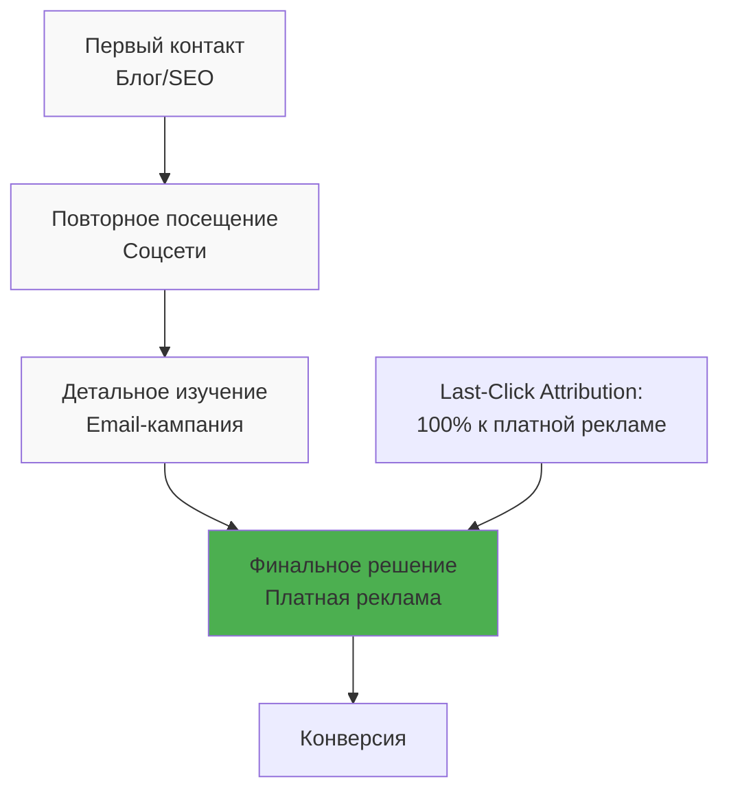
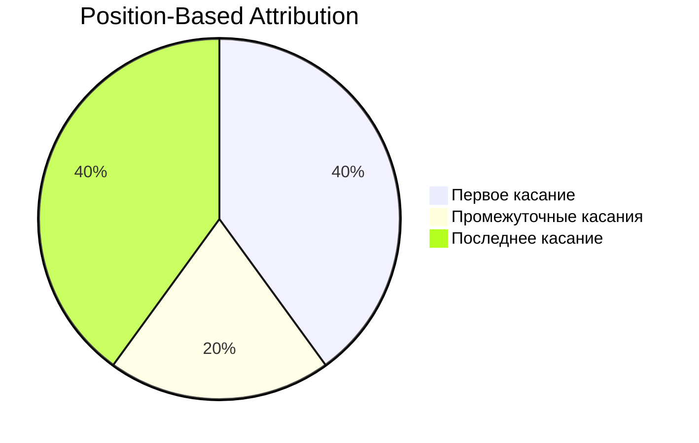

# Last-Click Attribution: Модель атрибуции по последнему клику

Last-Click Attribution (атрибуция по последнему клику) — наиболее распространённая модель атрибуции в цифровом маркетинге, которая присваивает 100% ценности конверсии последнему взаимодействию клиента с рекламным каналом перед совершением целевого действия. Эта модель используется по умолчанию в большинстве систем веб-аналитики и рекламных платформ, включая Google Ads и Facebook Ads Manager.

## Принцип работы Last-Click Attribution

Модель присваивает всю заслугу за конверсию финальной точке касания в пути клиента. Независимо от того, сколько взаимодействий произошло ранее, только последний клик получает кредит за достижение цели.

!!! example "Пример работы Last-Click Attribution"
    
    Клиент проходит следующий путь:
    
    1. Видит рекламный баннер в социальной сети → переходит на сайт
    2. Получает email-рассылку → повторно посещает сайт  
    3. Находит сайт через поисковик → совершает покупку
    
    **Результат:** По модели Last-Click вся ценность конверсии достанется органическому поиску, хотя предыдущие касания могли сыграть решающую роль в процессе принятия решения.

### Технические особенности

**Временное окно атрибуции:** Большинство платформ используют стандартное окно 30 дней для клика и 1 день для просмотра. Конверсии, происходящие за пределами этого окна, не учитываются.

**Приоритет источников:** В случае нескольких кликов в один день система выбирает последний по времени источник. Прямые заходы часто исключаются из атрибуции (модель Last Non-Direct Click).

**Cross-device ограничения:** Модель работает в рамках одного устройства и браузера, что создаёт проблемы при анализе мультиустройственного поведения пользователей.

## Преимущества Last-Click Attribution

### Простота реализации и понимания

Модель не требует сложных алгоритмов или обширной исторической базы данных для функционирования. Логика "последний клик = источник конверсии" интуитивно понятна для большинства маркетологов и не вызывает вопросов при интерпретации результатов.

### Фокус на конверсионных каналах  

Last-Click эффективно выявляет каналы, которые непосредственно приводят к продажам. Эти источники трафика привлекают "горячую" аудиторию, готовую к совершению покупки после одного взаимодействия с рекламным объявлением.

!!! tip "Показатель минимальной эффективности"
    
    Last-Click Attribution показывает минимально возможный вклад источника в получение дохода. Если рекламные каналы рентабельны по этой модели, их можно уверенно масштабировать.

### Универсальность и совместимость

Практически все системы веб-аналитики и рекламные платформы поддерживают Last-Click Attribution по умолчанию. Это обеспечивает совместимость данных между различными инструментами и упрощает сравнение результатов.

### Оптимизация ставок и бюджетов

Модель позволяет быстро выявлять каналы с высокой конверсией в рамках их роли "замыкающих" продажу. Это упрощает принятие решений о перераспределении рекламного бюджета в пользу наиболее эффективных источников финальных конверсий.

## Недостатки и ограничения

### Игнорирование ассистирующих каналов

Основной недостаток Last-Click Attribution — полное игнорирование вклада предыдущих взаимодействий. Каналы верхней и средней воронки, которые формируют осведомлённость и интерес, не получают должного признания своего вклада в итоговую конверсию.

!!! warning "Неполная картина customer journey"
    
    Модель создаёт искажённое представление о ценности различных маркетинговых каналов. Источники, которые специализируются на привлечении новой аудитории или её разогреве, могут показаться убыточными, хотя на самом деле играют критическую роль в воронке продаж.

### Неправильное распределение бюджета

Фокус на последних взаимодействиях может привести к сокращению инвестиций в каналы привлечения новой аудитории. Это создаёт долгосрочные проблемы с воронкой продаж и приводит к постепенному снижению общих результатов.

### Проблемы с долгим циклом продаж

В B2B секторе и дорогих товарных категориях цикл принятия решения может растягиваться на месяцы. Last-Click Attribution не способна отразить сложность таких процессов продаж, где каждое взаимодействие вносит свой вклад в финальное решение.



### Невозможность оптимизации воронки

Модель не предоставляет информации о том, какие комбинации каналов работают наиболее эффективно. Это ограничивает возможности для комплексной оптимизации маркетинговой стратегии.

## Сравнение с альтернативными моделями

| Модель | Распределение ценности | Лучше всего подходит для |
|--------|----------------------|-------------------------|
| **Last-Click** | 100% последнему касанию | Короткий цикл продаж, прямые продажи |
| **First-Click** | 100% первому касанию | Кампании привлечения, брендинг |
| **Linear** | Равномерно между всеми | Длинный цикл продаж, B2B |
| **Time-Decay** | Больше недавним касаниям | Средний цикл продаж |
| **Position-Based** | 40% первому и последнему | Комплексные воронки продаж |
| **Data-Driven** | На основе ML-анализа | Большие объёмы данных |

## Когда использовать Last-Click Attribution

### Подходящие сценарии применения

**Короткие циклы продаж** — клиенты принимают решение о покупке максимум за 2-3 взаимодействия. Модель работает эффективно для товаров повседневного спроса, цифровых услуг с низкой стоимостью, импульсивных покупок.

**Ретаргетинговые кампании** — основная цель заключается в возврате посетителей для завершения начатой покупки. Last-Click точно показывает, какие ретаргетинговые объявления наиболее эффективно конвертируют "горячих" пользователей.

**Промо-акции с ограниченным временем** — флеш-распродажи, сезонные скидки, таймированные предложения. В таких кампаниях решение о покупке принимается быстро, и последнее взаимодействие действительно играет решающую роль.

!!! info "Оптимальные условия для Last-Click"
    
    - Цикл продаж менее 3 дней
    - Средний чек до $200 
    - Ясное ценностное предложение товара
    - Минимальная потребность в разъяснениях и консультациях

### Отраслевое применение

**E-commerce** — для товаров с понятными характеристиками и простым процессом принятия решения. Особенно эффективна для повторных покупок постоянных клиентов.

**Цифровые услуги** — SaaS-продукты с freemium-моделью, онлайн-курсы, цифровой контент. Last-Click хорошо отражает момент перехода от бесплатного к платному тарифу.

**Lead generation** — когда целью является получение контактных данных потенциальных клиентов для последующей работы офлайн-отделом продаж.

## Лучшие практики использования

### Комбинирование с другими моделями

Использование Last-Click в качестве единственной модели атрибуции создаёт искажённое представление о маркетинговой эффективности. Рекомендуется применять комплексный подход:

=== "Базовый анализ"
    
    - **Last-Click** для понимания конверсионных каналов
    - **First-Click** для оценки источников новой аудитории
    - Сравнение результатов для выявления дисбаланса

=== "Продвинутая аналитика"
    
    - **Position-Based** для учёта роли всех касаний
    - **Time-Decay** для приоритизации свежих взаимодействий
    - **Data-Driven** при наличии достаточного объёма данных

### Мониторинг ключевых метрик

!!! note "Контрольные показатели"
    
    **Доля single-touch конверсий:** Процент покупок, совершённых с первого визита. Если показатель выше 60%, Last-Click даёт относительно точную картину.
    
    **Время между касаниями:** Средний интервал между первым и последним взаимодействием. При значениях свыше 7 дней стоит рассмотреть альтернативные модели.
    
    **Количество касаний до конверсии:** Если в среднем происходит более 3 взаимодействий, Last-Click значительно искажает реальность.

### Настройка временных окон

Стандартные настройки 30 дней для клика подходят не всем бизнесам. Корректировка временного окна позволяет более точно отражать специфику цикла продаж:

- **7 дней** — для товаров повседневного спроса
- **30 дней** — стандартная настройка для большинства e-commerce
- **90 дней** — для дорогих товаров и B2B услуг

### Сегментация анализа

Различные типы клиентов демонстрируют разные паттерны поведения. Анализируйте Last-Click Attribution отдельно для:

- **Новых vs. возвращающихся клиентов**
- **Различных товарных категорий** 
- **Географических регионов**
- **Устройств и каналов трафика**

## Технические особенности внедрения

### UTM-параметры и отслеживание

Корректная работа Last-Click Attribution зависит от правильной настройки UTM-разметки всех рекламных ссылок:

```
utm_source=facebook&utm_medium=cpc&utm_campaign=summer_sale&utm_content=video_ad_1
```

!!! warning "Распространённые ошибки"
    
    - Использование UTM-параметров для внутренних ссылок искажает данные о сессиях
    - Несогласованная разметка приводит к фрагментации источников трафика
    - Потеря параметров при редиректах через сокращатели ссылок

### Настройка в популярных системах

**Google Analytics 4:** Last-Click используется в модели "Last non-direct click" по умолчанию. Прямые заходы исключаются из атрибуции, кредит получает последний идентифицируемый источник.

**Google Ads:** Возможность выбора между "Last click" и "Data-driven" атрибуцией на уровне конверсий. Рекомендуется тестирование обеих моделей для определения оптимальной.

**Facebook Ads:** Использует 1-day view + 7-day click окно по умолчанию. Доступны настройки временных интервалов от 1 до 28 дней.

## Альтернативы Last-Click Attribution

### Переход к Data-Driven моделям

Современные рекламные платформы активно продвигают переход от упрощённых rule-based моделей к машинному обучению. Google с 2019 года рекомендует Data-Driven Attribution как замену Last-Click для большинства аккаунтов.

**Преимущества Data-Driven:**

- Учёт всех взаимодействий в пути клиента
- Автоматическая адаптация под особенности бизнеса
- Более точное распределение рекламного бюджета

**Требования для внедрения:**

- Минимум 15000 кликов за 30 дней
- Не менее 600 конверсий за 30 дней  
- Достаточная вариативность источников трафика

### Мультитач-модели

Position-Based (U-shaped) атрибуция представляет компромисс между простотой Last-Click и сложностью Data-Driven моделей. 40% ценности получает первое касание, 40% — последнее, остальные 20% распределяются равномерно между промежуточными взаимодействиями.



### Custom Attribution модели

Создание собственных правил атрибуции позволяет учесть специфику конкретного бизнеса. Возможные подходы включают:

- Различные модели для разных продуктов
- Сезонные корректировки весов каналов
- Учёт маржинальности и LTV клиентов

## Измерение эффективности каналов

### ROI и ROAS расчёты

При использовании Last-Click Attribution расчёт возврата инвестиций происходит по стандартной формуле:

**ROI = (Доход - Затраты) / Затраты × 100%**

Однако важно понимать, что такой расчёт показывает эффективность канала только в роли "замыкающего" продажу, не учитывая его вклад на других этапах воронки.

!!! example "Сравнение ROI по разным моделям"
    
    Канал "Контекстная реклама" показывает:
    
    - **Last-Click ROI:** 150% 
    - **Linear Attribution ROI:** 95%
    - **Data-Driven ROI:** 120%
    
    Разница объясняется тем, что канал часто завершает продажи, начатые другими источниками.

### Анализ ассистирующих конверсий

Системы веб-аналитики предоставляют отчёты о многоканальных последовательностях, показывающие роль каждого источника в качестве ассистирующего. Сравнение Last-Click конверсий с ассистирующими помогает выявить недооценённые каналы.

**Коэффициент ассистирования = Ассистирующие конверсии / Last-Click конверсии**

Высокие значения (более 0.5) указывают на важную роль канала в начальных стадиях воронки продаж.

## Влияние на принятие решений

### Распределение бюджета

Last-Click Attribution склоняет маркетологов к переинвестированию в конверсионные каналы за счёт источников новой аудитории. Это создаёт долгосрочные риски для роста бизнеса.

Рекомендуемая стратегия распределения бюджета при использовании Last-Click:

- 60% — каналы с высоким Last-Click ROI
- 25% — источники привлечения новой аудитории  
- 15% — экспериментальные и брендинговые активности

### Оценка эффективности команд

Last-Click Attribution может создавать конфликты между командами, отвечающими за разные этапы воронки. Команда performance-маркетинга получает кредит за конверсии, которые были подготовлены работой brand-команды.

Для справедливой оценки рекомендуется:

- Использование нескольких моделей атрибуции параллельно
- Анализ полного customer journey для ключевых сегментов
- Постановка KPI для каждой команды с учётом их роли в воронке

## Будущее Last-Click Attribution

### Тренды отрасли

Индустрия постепенно отходит от упрощённых single-touch моделей в пользу более сложных подходов к атрибуции. Google и другие платформы активно внедряют машинное обучение для автоматического определения вклада каждого канала.

### Влияние privacy-изменений

Ограничения третьесторонних cookies и изменения в мобильных операционных системах усложняют отслеживание пользователей между устройствами и сессиями. Это делает Last-Click Attribution ещё менее точной, так как разрывы в отслеживании приводят к потере информации о промежуточных касаниях.

### Server-side tracking

Переход на серверную аналитику позволяет более точно отслеживать весь путь пользователя и снижает зависимость от браузерных ограничений. Это открывает возможности для внедрения более совершенных моделей атрибуции.

Мы работаем над решением, которое позволит маркетологам выбирать между различными моделями атрибуции и комбинировать их для получения наиболее точной картины эффективности каналов. Наш подход предусматривает гибкую настройку временных окон и учёт специфики различных типов конверсий.

Планируется реализация автоматических рекомендаций по выбору оптимальной модели атрибуции на основе анализа паттернов поведения пользователей и характеристик бизнеса. В отличие от решений, ограниченных одной моделью, наша платформа обеспечит комплексный анализ customer journey с возможностью переключения между различными подходами к атрибуции.

--8<-- "snippets/ai.ru.md"

---

!!! success "Готовы получить полную картину эффективности ваших каналов?"
    
    Зарегистрируйтесь для бесплатного тестирования нашей платформы веб-аналитики и выберите оптимальную модель атрибуции для вашего бизнеса — от простого Last-Click до продвинутых Data-Driven решений.