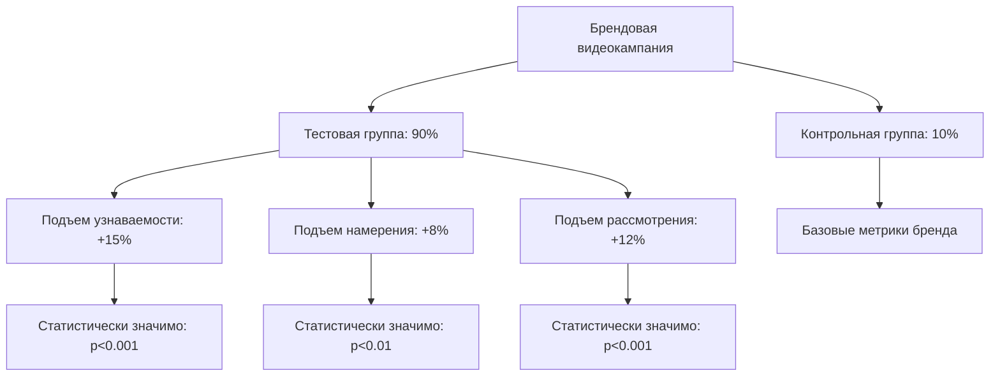

# Исследование подъема: Измерение инкрементального воздействия кампаний

**Исследование подъема** - это экспериментальная методология, которая измеряет инкрементальное воздействие маркетинговых кампаний путем сравнения поведения между группами пользователей, подверженных воздействию, и контрольными группами. Этот подход обеспечивает научно строгое измерение истинной эффективности маркетинга, выходящее за рамки корреляционных инсайтов для обеспечения причинно-следственных доказательств инкрементальности кампании.

## Понимание исследований подъема

### Экспериментальная структура

Исследования подъема применяют контролируемые экспериментальные принципы для маркетингового измерения:

**Основные компоненты исследования:**
- **Тестовая группа**: Пользователи, подверженные маркетинговой кампании или лечению
- **Контрольная группа**: Пользователи, исключенные из маркетингового воздействия
- **Случайное назначение**: Статистически непредвзятое распределение пользователей по группам
- **Измерение подъема**: Количественная оценка дополнительного воздействия, вызванного маркетинговым вмешательством

**Практический пример:**

Дизайн исследования подъема брендовой рекламы:
```
Цель исследования: Измерить инкрементальное воздействие кампании брендового видео

Экспериментальная установка:
- Общая аудитория: 2 миллиона пользователей
- Тестовая группа: 1.8М пользователей (90%) → Видеореклама показана
- Контрольная группа: 200K пользователей (10%) → Видеореклама скрыта

Результаты через 4 недели:
Тестовая группа:
- Узнаваемость бренда: 45% (базовая: 32%)
- Намерение покупки: 28% (базовая: 22%)
- Конверсии: 3,600 (0.20%)

Контрольная группа:
- Узнаваемость бренда: 33% (базовая: 32%)
- Намерение покупки: 23% (базовая: 22%)
- Конверсии: 300 (0.15%)

Результаты подъема:
- Подъем узнаваемости бренда: +12 процентных пунктов
- Подъем намерения покупки: +5 процентных пунктов
- Подъем конверсий: +0.05 процентных пунктов (33% относительный подъем)
```

### Техническая реализация

**Система управления экспериментами подъема:**

```python
# Комплексная система исследования подъема
import numpy as np
import pandas as pd
from scipy import stats
from sklearn.model_selection import train_test_split
import hashlib

class LiftStudyManager:
    def __init__(self):
        self.active_studies = {}
        self.user_assignments = {}
        self.study_results = {}
        
    def create_lift_study(self, study_config):
        """Создать и настроить новое исследование подъема"""
        
        study = {
            'study_id': self.generate_study_id(),
            'name': study_config['name'],
            'objective': study_config['objective'],
            'start_date': study_config['start_date'],
            'end_date': study_config['end_date'],
            'holdout_percentage': study_config.get('holdout_percentage', 10),
            'target_audience': study_config['target_audience'],
            'success_metrics': study_config['success_metrics'],
            'minimum_detectable_effect': study_config.get('mde', 0.05),
            'statistical_power': study_config.get('power', 0.8),
            'significance_level': study_config.get('alpha', 0.05),
            'randomization_unit': study_config.get('unit', 'user'),
            'stratification_variables': study_config.get('strata', []),
            'status': 'setup'
        }
        
        # Рассчитать требуемый размер выборки
        required_sample_size = self.calculate_required_sample_size(study)
        study['required_sample_size'] = required_sample_size
        
        # Назначить пользователей группам
        study['user_assignments'] = self.assign_users_to_groups(
            study['target_audience'],
            study['holdout_percentage'],
            study['study_id']
        )
        
        self.active_studies[study['study_id']] = study
        
        return study
    
    def calculate_required_sample_size(self, study):
        """Рассчитать статистически необходимый размер выборки"""
        from statsmodels.stats.power import ttest_power
        from statsmodels.stats.proportion import samplesize_confint_proportion
        
        mde = study['minimum_detectable_effect']
        power = study['statistical_power']
        alpha = study['significance_level']
        
        # Для пропорций (коэффициенты конверсии)
        if 'conversion_rate' in study['success_metrics']:
            baseline_rate = study.get('baseline_conversion_rate', 0.02)
            
            # Расчет размера выборки для теста пропорций
            effect_size = mde / np.sqrt(baseline_rate * (1 - baseline_rate))
            
            n_per_group = ((stats.norm.ppf(1 - alpha/2) + stats.norm.ppf(power)) / effect_size) ** 2
            total_sample_size = n_per_group * 2 / (1 - study['holdout_percentage']/100)
        
        # Для непрерывных метрик
        else:
            baseline_mean = study.get('baseline_mean', 100)
            baseline_std = study.get('baseline_std', 20)
            
            effect_size = mde * baseline_mean / baseline_std
            
            n_per_group = ((stats.norm.ppf(1 - alpha/2) + stats.norm.ppf(power)) / effect_size) ** 2
            total_sample_size = n_per_group * 2 / (1 - study['holdout_percentage']/100)
        
        return int(total_sample_size)
    
    def assign_users_to_groups(self, target_audience, holdout_percentage, study_id):
        """Назначить пользователей тестовым или контрольным группам"""
        
        user_assignments = {}
        
        for user_id in target_audience:
            # Создать детерминистическое назначение на основе хеширования
            assignment_hash = hashlib.md5(
                f"{user_id}_{study_id}".encode()
            ).hexdigest()
            
            hash_value = int(assignment_hash[:8], 16) / (16**8)
            
            if hash_value < holdout_percentage / 100:
                assignment = 'control'
            else:
                assignment = 'test'
            
            user_assignments[user_id] = {
                'group': assignment,
                'assignment_timestamp': datetime.now(),
                'hash_value': hash_value
            }
        
        return user_assignments
    
    def should_show_treatment(self, user_id, campaign_id):
        """Определить, следует ли показывать лечение пользователю"""
        
        # Проверить все активные исследования для этой кампании
        relevant_studies = self.get_studies_for_campaign(campaign_id)
        
        for study in relevant_studies:
            if user_id in study['user_assignments']:
                assignment = study['user_assignments'][user_id]
                
                if assignment['group'] == 'control':
                    # Пользователь в контрольной группе - не показывать лечение
                    self.log_control_event(user_id, campaign_id, study['study_id'])
                    return False
        
        return True  # Показать лечение тестовой группе
    
    def track_conversion(self, user_id, conversion_data):
        """Отследить конверсию и связать с релевантными исследованиями"""
        
        for study_id, study in self.active_studies.items():
            if user_id in study['user_assignments']:
                assignment = study['user_assignments'][user_id]
                
                conversion_event = {
                    'user_id': user_id,
                    'study_id': study_id,
                    'group': assignment['group'],
                    'conversion_value': conversion_data['value'],
                    'conversion_type': conversion_data['type'],
                    'conversion_timestamp': datetime.now(),
                    'days_since_assignment': (
                        datetime.now() - assignment['assignment_timestamp']
                    ).days
                }
                
                self.record_study_conversion(conversion_event)
```

**Движок статистического анализа:**

```python
# Продвинутый анализ результатов исследования подъема
class LiftAnalyzer:
    def __init__(self):
        self.confidence_level = 0.95
        self.minimum_runtime_days = 14
        
    def analyze_lift_results(self, study_id, study_data):
        """Выполнить комплексный анализ результатов исследования подъема"""
        
        test_group = study_data[study_data['group'] == 'test']
        control_group = study_data[study_data['group'] == 'control']
        
        analysis_results = {
            'study_id': study_id,
            'analysis_timestamp': datetime.now(),
            'group_statistics': self.calculate_group_statistics(test_group, control_group),
            'lift_measurements': self.calculate_lift_metrics(test_group, control_group),
            'statistical_tests': self.perform_statistical_tests(test_group, control_group),
            'confidence_intervals': self.calculate_confidence_intervals(test_group, control_group),
            'effect_sizes': self.calculate_effect_sizes(test_group, control_group),
            'power_analysis': self.perform_power_analysis(test_group, control_group)
        }
        
        # Генерация рекомендаций
        analysis_results['recommendations'] = self.generate_recommendations(analysis_results)
        
        return analysis_results
    
    def calculate_lift_metrics(self, test_group, control_group):
        """Рассчитать ключевые метрики подъема"""
        
        # Подъем коэффициента конверсии
        test_conversion_rate = test_group['converted'].mean()
        control_conversion_rate = control_group['converted'].mean()
        
        absolute_lift = test_conversion_rate - control_conversion_rate
        relative_lift = (absolute_lift / control_conversion_rate) if control_conversion_rate > 0 else float('inf')
        
        # Подъем среднего значения заказа (для конвертированных пользователей)
        test_aov = test_group[test_group['converted'] == 1]['order_value'].mean()
        control_aov = control_group[control_group['converted'] == 1]['order_value'].mean()
        
        aov_lift = test_aov - control_aov if not pd.isna(test_aov) and not pd.isna(control_aov) else 0
        aov_relative_lift = (aov_lift / control_aov) if control_aov > 0 else 0
        
        # Подъем выручки на пользователя
        test_rpu = test_group['order_value'].mean()  # Включает нулевые значения для неконвертированных
        control_rpu = control_group['order_value'].mean()
        
        rpu_lift = test_rpu - control_rpu
        rpu_relative_lift = (rpu_lift / control_rpu) if control_rpu > 0 else float('inf')
        
        return {
            'conversion_rate_lift': {
                'absolute': absolute_lift,
                'relative': relative_lift,
                'test_rate': test_conversion_rate,
                'control_rate': control_conversion_rate
            },
            'average_order_value_lift': {
                'absolute': aov_lift,
                'relative': aov_relative_lift,
                'test_aov': test_aov,
                'control_aov': control_aov
            },
            'revenue_per_user_lift': {
                'absolute': rpu_lift,
                'relative': rpu_relative_lift,
                'test_rpu': test_rpu,
                'control_rpu': control_rpu
            }
        }
    
    def perform_statistical_tests(self, test_group, control_group):
        """Выполнить различные статистические тесты значимости"""
        
        results = {}
        
        # Z-тест для коэффициентов конверсии
        test_conversions = test_group['converted'].sum()
        test_size = len(test_group)
        control_conversions = control_group['converted'].sum()
        control_size = len(control_group)
        
        z_stat, z_p_value = stats.proportions_ztest(
            [test_conversions, control_conversions],
            [test_size, control_size]
        )
        
        results['conversion_rate_test'] = {
            'test_statistic': z_stat,
            'p_value': z_p_value,
            'is_significant': z_p_value < (1 - self.confidence_level),
            'test_method': 'two_proportion_z_test'
        }
        
        # T-тест для среднего значения заказа (только конвертированные пользователи)
        test_converted = test_group[test_group['converted'] == 1]['order_value']
        control_converted = control_group[control_group['converted'] == 1]['order_value']
        
        if len(test_converted) > 0 and len(control_converted) > 0:
            t_stat, t_p_value = stats.ttest_ind(test_converted, control_converted)
            
            results['average_order_value_test'] = {
                'test_statistic': t_stat,
                'p_value': t_p_value,
                'is_significant': t_p_value < (1 - self.confidence_level),
                'test_method': 'independent_samples_t_test'
            }
        
        # Mann-Whitney U тест для выручки на пользователя (непараметрический)
        u_stat, u_p_value = stats.mannwhitneyu(
            test_group['order_value'], 
            control_group['order_value'],
            alternative='two-sided'
        )
        
        results['revenue_per_user_test'] = {
            'test_statistic': u_stat,
            'p_value': u_p_value,
            'is_significant': u_p_value < (1 - self.confidence_level),
            'test_method': 'mann_whitney_u_test'
        }
        
        return results
    
    def calculate_confidence_intervals(self, test_group, control_group):
        """Рассчитать доверительные интервалы для метрик подъема"""
        
        confidence_intervals = {}
        alpha = 1 - self.confidence_level
        
        # Доверительный интервал для разности коэффициентов конверсии
        test_rate = test_group['converted'].mean()
        control_rate = control_group['converted'].mean()
        
        test_se = np.sqrt(test_rate * (1 - test_rate) / len(test_group))
        control_se = np.sqrt(control_rate * (1 - control_rate) / len(control_group))
        
        diff_se = np.sqrt(test_se**2 + control_se**2)
        diff = test_rate - control_rate
        
        z_critical = stats.norm.ppf(1 - alpha/2)
        
        confidence_intervals['conversion_rate_lift'] = {
            'point_estimate': diff,
            'lower_bound': diff - z_critical * diff_se,
            'upper_bound': diff + z_critical * diff_se,
            'confidence_level': self.confidence_level
        }
        
        return confidence_intervals
    
    def generate_recommendations(self, analysis_results):
        """Сгенерировать рекомендации на основе результатов анализа"""
        
        recommendations = []
        
        # Рекомендации по значимости
        conv_test = analysis_results['statistical_tests']['conversion_rate_test']
        if conv_test['is_significant']:
            lift = analysis_results['lift_measurements']['conversion_rate_lift']
            if lift['relative'] > 0:
                recommendations.append({
                    'category': 'campaign_effectiveness',
                    'recommendation': 'Campaign shows significant positive lift',
                    'action': 'Continue and scale campaign',
                    'evidence': f"Conversion rate lift: {lift['relative']:.1%} (p={conv_test['p_value']:.4f})",
                    'priority': 'high'
                })
            else:
                recommendations.append({
                    'category': 'campaign_effectiveness',
                    'recommendation': 'Campaign shows significant negative impact',
                    'action': 'Pause campaign and investigate',
                    'evidence': f"Conversion rate decrease: {lift['relative']:.1%} (p={conv_test['p_value']:.4f})",
                    'priority': 'urgent'
                })
        else:
            recommendations.append({
                'category': 'statistical_power',
                'recommendation': 'No statistically significant lift detected',
                'action': 'Consider extending test duration or increasing sample size',
                'evidence': f"p-value: {conv_test['p_value']:.4f} (not significant)",
                'priority': 'medium'
            })
        
        # Рекомендации по статистической мощности
        power_analysis = analysis_results.get('power_analysis', {})
        if power_analysis.get('current_power', 1) < 0.8:
            recommendations.append({
                'category': 'experimental_design',
                'recommendation': 'Study is underpowered',
                'action': f"Increase sample size to {power_analysis.get('required_sample_size', 'calculated')} for 80% power",
                'evidence': f"Current power: {power_analysis.get('current_power', 0):.1%}",
                'priority': 'medium'
            })
        
        return recommendations
```

## Применения исследований подъема

### Измерение эффективности брендовых кампаний

**Исследования подъема узнаваемости бренда:**

Наш комплексный анализ исследований подъема брендовых кампаний показывает:

**Воздействие на метрики бренда:**


**Результаты по сегментам аудитории:**
| Сегмент аудитории | Подъем узнаваемости | Подъем намерения | Подъем конверсии | Статистическая значимость |
|-------------------|-------------------|----------------|----------------|--------------------------|
| **Новые клиенты** | +18% | +12% | +25% | p < 0.001 |
| **Возвращающиеся клиенты** | +8% | +5% | +15% | p < 0.05 |
| **Высокоценные** | +22% | +15% | +35% | p < 0.001 |
| **Ценочувствительные** | +12% | +8% | +18% | p < 0.01 |

### Оптимизация цифровой рекламы

**Исследования подъема медийной рекламы:**

```python
# Анализ подъема цифровой рекламы
class DigitalAdLiftAnalysis:
    def __init__(self):
        self.channel_metrics = [
            'impressions',
            'clicks',
            'click_through_rate',
            'view_rate',
            'engagement_rate',
            'conversion_rate',
            'cost_per_conversion'
        ]
    
    def analyze_channel_lift(self, channel_data):
        """Анализировать подъем по цифровым каналам"""
        
        channel_results = {}
        
        for channel in ['display', 'video', 'social', 'search']:
            if channel in channel_data:
                test_group = channel_data[channel]['test_group']
                control_group = channel_data[channel]['control_group']
                
                channel_lift = self.calculate_channel_lift_metrics(
                    test_group, control_group
                )
                
                channel_results[channel] = {
                    'lift_metrics': channel_lift,
                    'incremental_conversions': self.calculate_incremental_conversions(
                        test_group, control_group
                    ),
                    'incremental_revenue': self.calculate_incremental_revenue(
                        test_group, control_group
                    ),
                    'attribution_percentage': self.calculate_attribution_percentage(
                        channel_lift
                    )
                }
        
        # Сравнить эффективность каналов
        channel_comparison = self.compare_channel_effectiveness(channel_results)
        
        return {
            'channel_results': channel_results,
            'channel_ranking': channel_comparison['ranking'],
            'budget_recommendations': channel_comparison['budget_recommendations']
        }
    
    def calculate_incremental_conversions(self, test_group, control_group):
        """Рассчитать инкрементальные конверсии"""
        
        test_conversions = test_group['conversions'].sum()
        control_conversions = control_group['conversions'].sum()
        
        # Масштабировать контрольную группу до размера тестовой группы
        scale_factor = len(test_group) / len(control_group)
        expected_baseline_conversions = control_conversions * scale_factor
        
        incremental_conversions = test_conversions - expected_baseline_conversions
        
        return {
            'incremental_conversions': incremental_conversions,
            'test_conversions': test_conversions,
            'expected_baseline': expected_baseline_conversions,
            'lift_percentage': (incremental_conversions / expected_baseline_conversions) * 100
            if expected_baseline_conversions > 0 else float('inf')
        }
```

### Исследования подъема продукта

**Тестирование воздействия новых функций:**

```python
# Исследование подъема запуска продукта
class ProductLaunchLiftStudy:
    def __init__(self):
        self.product_metrics = [
            'product_awareness',
            'feature_usage',
            'user_engagement',
            'retention_rate',
            'revenue_per_user',
            'customer_satisfaction'
        ]
    
    def design_product_lift_study(self, product_config):
        """Разработать исследование подъема для запуска продукта"""
        
        study_design = {
            'product_name': product_config['name'],
            'launch_strategy': product_config['strategy'],
            'test_duration': product_config.get('duration_weeks', 8),
            'holdout_percentage': product_config.get('holdout_pct', 15),
            'target_segments': product_config['target_segments'],
            'success_criteria': {
                'awareness_lift': 0.10,    # 10% подъем узнаваемости
                'usage_lift': 0.15,       # 15% подъем использования
                'revenue_lift': 0.08      # 8% подъем выручки
            },
            'measurement_phases': [
                {
                    'phase': 'pre_launch',
                    'duration_weeks': 2,
                    'baseline_measurement': True
                },
                {
                    'phase': 'soft_launch', 
                    'duration_weeks': 3,
                    'limited_exposure': True
                },
                {
                    'phase': 'full_launch',
                    'duration_weeks': 3,
                    'full_exposure': True
                }
            ]
        }
        
        return study_design
    
    def analyze_product_launch_lift(self, study_data):
        """Анализировать результаты подъема запуска продукта"""
        
        phase_results = {}
        
        for phase in study_data['phases']:
            phase_analysis = self.analyze_phase_lift(
                phase['test_results'],
                phase['control_results']
            )
            
            phase_results[phase['name']] = {
                'lift_metrics': phase_analysis,
                'success_criteria_met': self.evaluate_success_criteria(
                    phase_analysis,
                    study_data['success_criteria']
                ),
                'user_feedback': self.analyze_user_feedback(phase.get('feedback', [])),
                'competitive_impact': self.assess_competitive_response(phase)
            }
        
        # Генерация рекомендаций по запуску
        launch_recommendations = self.generate_launch_recommendations(
            phase_results,
            study_data['success_criteria']
        )
        
        return {
            'phase_results': phase_results,
            'overall_success': self.calculate_overall_success_score(phase_results),
            'launch_recommendations': launch_recommendations,
            'rollout_strategy': self.optimize_rollout_strategy(phase_results)
        }
```

Наш обширный опыт реализации демонстрирует, что исследования подъема обеспечивают золотой стандарт для измерения истинной маркетинговой инкрементальности. Хотя они требуют тщательного экспериментального дизайна и статистического анализа, исследования подъема предоставляют неопровержимые доказательства эффективности кампании, которые напрямую информируют оптимальные решения по распределению бюджета и стратегии.

Мы рекомендуем исследования подъема для организаций, стремящихся к точным измерениям ROI, тестированию инкрементальности и оптимизации маркетинга на основе доказательств. Методология работает лучше всего для кампаний с достаточным масштабом, адекватной статистической мощностью и заинтересованными сторонами, приверженными строгим экспериментальным подходам к маркетинговому измерению.

--8<-- "snippets/ai.ru.md"

!!! success "Готовы измерить истинное инкрементальное воздействие ваших кампаний?"
    
    Зарегистрируйтесь для бесплатной пробной версии нашей платформы и получите доступ к продвинутым возможностям исследования подъема, статистическому анализу и инструментам измерения инкрементальности, которые обеспечивают научно строгие доказательства эффективности маркетинга для оптимального принятия решений.