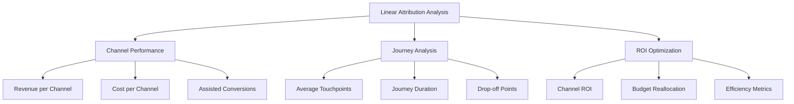

# Linear Attribution: equal credit distribution across touchpoints

Linear Attribution is a multi-channel attribution model that evenly distributes conversion value across all touchpoints in the customer journey. Unlike single-touch models that assign all credit to one interaction, linear attribution recognizes the equal importance of each stage in the buyer's path.

## How Linear Attribution Works

The foundation of the linear model lies in fair credit distribution. Each touchpoint in the customer journey receives an equal share of the total conversion value, regardless of its position in the funnel or timing of interaction.

!!! example "Linear Attribution Calculation Example"
    
    **Customer Journey:**

    1. Click on search ad → 25%
    2. Opening email newsletter → 25%
    3. Social media post interaction → 25%
    4. Direct website visit and purchase → 25%
    
    **Calculation Formula:**

    Credit per touchpoint = Conversion value / Number of touchpoints

### Mathematical Model

For N touchpoints in the customer journey:

```
Credit per touchpoint = 1/N × 100%
```

If conversion has value V (e.g., $100), then:

```
Credit in monetary terms = V/N
```

## Comparison with Other Attribution Models

=== "Linear Attribution"
    
    **Principle:** Even distribution across all touches

    - First touchpoint: 25%
    - Second touchpoint: 25%  
    - Third touchpoint: 25%
    - Last touchpoint: 25%

=== "First-Touch Attribution"
    
    **Principle:** All credit to first interaction

    - First touchpoint: 100%
    - Other touches: 0%

=== "Last-Touch Attribution"
    
    **Principle:** All credit to last interaction

    - Last touchpoint: 100%
    - Previous touches: 0%

=== "Time-Decay Attribution"
    
    **Principle:** More credit to touches closer to conversion

    - First touchpoint: 10%
    - Second touchpoint: 20%
    - Third touchpoint: 30%
    - Last touchpoint: 40%

## Advantages of Linear Attribution

### Fair Distribution

The linear model provides objective evaluation of all marketing channels without bias toward specific funnel stages. This is particularly valuable for teams where different specialists are responsible for various acquisition channels.

### Simplicity of Understanding and Implementation

Unlike complex algorithmic models, linear attribution doesn't require machine learning or advanced data integration. The model is easy to explain to stakeholders and quickly implement in existing analytics systems.

### Support for Omnichannel Strategies

!!! info "Omnichannel Benefits"

    **Channel Synergy Discovery:**

    - Understanding how channels work together
    - Determining importance of each customer journey stage
    - Optimizing message consistency across channels
    
    **Preventing Channel Undervaluation:**

    - Protecting top-of-funnel efforts from being ignored
    - Recognizing value of nurturing channels
    - Fair evaluation of brand awareness campaigns

### Ideal for Long Sales Cycles

For B2B products and high-value goods, where buyers interact with the brand multiple times over months, linear attribution shows the complete picture of influence on purchase decisions.

## Limitations of Linear Model

### Ignoring Influence Differences

Not all interactions are equally important for purchase decisions. A detailed product demonstration or personalized consultation may have significantly greater impact than a random banner click.

!!! warning "Equal Weight Problem"

    **Passive vs Active Interactions:**

    - Opening email out of habit = 25%
    - Actively studying comparison table = 25%
    - Participating in personalized demo = 25%
    - Random ad click = 25%

### Analysis Complexity with Multiple Touches

When customer journey includes dozens of interactions, credit dilutes to insignificant fractions, making analysis less practical. In such cases, the model loses ability to identify truly influential moments.

### No Cost-Per-Channel Consideration

Linear attribution doesn't account for cost-per-interaction across different channels. An expensive conference receives the same credit as a free blog mention, which can lead to suboptimal budget allocation.

## Practical Application

### Ideal Use Case Scenarios

**Multi-channel campaigns with equal-value touches:**
When business uses an integrated approach with email, social media, content, and paid advertising, where each channel plays an equal role in nurturing.

**B2B with lengthy decision cycles:**
For products where decisions take months, and it's important to understand cumulative influence of all educational materials, webinars, and sales team interactions.

**Initial attribution analysis stage:**
For teams just starting with multi-touch attribution and needing a simple model to understand baseline channel effectiveness.

### Scenarios Where Model Is Ineffective

!!! danger "When Not to Use Linear Attribution"

    **Short impulse purchases:**

    - E-commerce with 1-2 day cycles
    - Daily necessity products
    - Time-limited promotional campaigns

    **Complex products with clear touch hierarchy:**

    - SaaS with clear awareness, consideration, trial, purchase stages
    - High-tech B2B solutions
    - Financial products requiring mandatory personal consultation

## Setup and Analysis

### Data Requirements

For proper linear attribution function, you need:

| Component | Description | Importance |
|-----------|-------------|------------|
| Cross-domain tracking | User tracking across domains | Critical |
| Proper user identification | Unified User IDs across all systems | Mandatory |
| Complete touch history | Recording all customer journey interactions | Critical |
| Accurate timestamps | Correct event sequence | Important |

### Key Monitoring Metrics



### Practical Recommendations

**1. Document Methodology**

Create clear description of which interactions count as "touches" and how they're tracked. This is critical for analysis consistency and team communication.

**2. Regular Data Validation**

Conduct data quality audits, checking attribution windows accuracy, bot traffic exclusion, and cross-device tracking precision.

**3. Analysis Segmentation**

Apply linear attribution to various segments: new vs returning users, different geographical regions, device types.

!!! tip "Segmentation Recommendations"

    **By customer type:**

    - B2B vs B2C journeys
    - High-frequency vs rare buyers
    - Different price segments

    **By journey characteristics:**

    - Short (1-7 days) vs long (30+ days) cycles
    - Touch count: 2-5 vs 6+ interactions
    - Online-only vs omnichannel paths

## Integration with Other Models

### Combined Approach

Effective attribution strategy often includes multiple models for different purposes:

=== "Linear for Strategic Planning"

    Usage for understanding overall multi-channel campaign effectiveness and long-term marketing mix planning.

=== "Last-touch for Tactical Optimization"

    Application for quick wins and optimizing conversion channels with short decision cycles.

=== "Data-driven for Advanced Analysis"

    Implementing ML models for precise understanding of cause-and-effect relationships between touches and conversions.

### Validation Through A/B Testing

To verify insights from linear attribution, conduct controlled experiments:

- **Incrementality tests**: Turning off individual channels to measure real impact
- **Geo-split tests**: Different mix strategies by region for model validation
- **Holdout groups**: Comparing results with and without specific touchpoints

## Modern Challenges and Solutions

### Privacy-first World

With stricter privacy regulations and third-party cookie limitations, accurate tracking of all touches becomes more difficult. Modern solutions include:

- **First-party data focus**: Priority on owned touchpoints and direct interactions
- **Server-side tracking**: More reliable tracking through backend systems
- **Probabilistic matching**: Using ML to connect anonymous interactions

### Mobile-first Attribution

Mobile traffic requires special approaches to linear attribution:

- **App-to-web bridging**: Connecting app interactions with web conversions
- **Cross-device journey mapping**: Understanding multi-device customer paths
- **Privacy-compliant mobile tracking**: IDFA and GAID restrictions

!!! info "Mobile Specifics"

    **Unique mobile touches:**

    - Push notifications
    - In-app messages
    - App store interactions
    - Mobile-specific ad formats

    **Technical challenges:**

    - iOS 14.5+ App Tracking Transparency
    - Android Privacy Sandbox changes
    - Cross-app tracking limitations

---

--8<-- "snippets/ai.md"

!!! success "Ready to optimize your attribution?"

    Start with free testing of our web analytics system and get full control over multi-touch attribution models. Our platform supports linear attribution out of the box and allows easy comparison of different models for making data-driven decisions about marketing budget allocation.