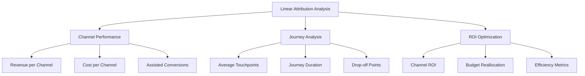

# Linear Attribution: равномерное распределение кредита между точками касания

Linear Attribution (линейная атрибуция) — это модель многоканальной атрибуции, которая равномерно распределяет ценность конверсии между всеми точками касания в пути клиента. В отличие от моделей single-touch, которые приписывают весь кредит одному взаимодействию, линейная атрибуция признаёт равную важность каждого этапа пути покупателя.

## Принцип работы линейной атрибуции

Основа линейной модели заключается в справедливом распределении кредита. Каждая точка касания в пути клиента получает равную долю от общей ценности конверсии, независимо от её позиции в воронке или времени взаимодействия.

!!! example "Пример расчёта линейной атрибуции"
    
    **Путь клиента:**

    1. Клик по рекламе в поисковой выдаче → 25%
    2. Открытие email-рассылки → 25%
    3. Взаимодействие с постом в социальной сети → 25%
    4. Прямой заход на сайт и покупка → 25%
    
    **Формула расчёта:**

    Кредит на точку касания = Ценность конверсии / Количество точек касания

### Математическая модель

Для N точек касания в пути клиента:

```
Кредит каждой точки касания = 1/N × 100%
```

Если конверсия имеет ценность V (например, $100), то:

```
Кредит в денежном выражении = V/N
```

## Сравнение с другими моделями атрибуции

=== "Linear Attribution"
    
    **Принцип:** Равномерное распределение между всеми касаниями

    - Первая точка касания: 25%
    - Вторая точка касания: 25%  
    - Третья точка касания: 25%
    - Последняя точка касания: 25%

=== "First-Touch Attribution"
    
    **Принцип:** Весь кредит первому взаимодействию

    - Первая точка касания: 100%
    - Остальные касания: 0%

=== "Last-Touch Attribution"
    
    **Принцип:** Весь кредит последнему взаимодействию

    - Последняя точка касания: 100%
    - Предыдущие касания: 0%

=== "Time-Decay Attribution"
    
    **Принцип:** Больше кредита ближайшим к конверсии касаниям

    - Первая точка касания: 10%
    - Вторая точка касания: 20%
    - Третья точка касания: 30%
    - Последняя точка касания: 40%

## Преимущества линейной атрибуции

### Справедливость распределения

Линейная модель обеспечивает объективную оценку всех маркетинговых каналов без предвзятости в пользу определённых этапов воронки. Это особенно ценно для команд, где разные специалисты отвечают за различные каналы привлечения.

### Простота понимания и внедрения

В отличие от сложных алгоритмических моделей, линейная атрибуция не требует машинного обучения или продвинутой интеграции данных. Модель легко объяснить заинтересованным сторонам и быстро внедрить в существующие системы аналитики.

### Поддержка омниканальных стратегий

!!! info "Преимущества для омниканальности"

    **Выявление синергии каналов:**

    - Понимание того, как каналы работают вместе
    - Определение важности каждого этапа customer journey
    - Оптимизация согласованности сообщений между каналами
    
    **Предотвращение недооценки каналов:**

    - Защита top-of-funnel усилий от игнорирования
    - Признание ценности nurturing-каналов
    - Справедливая оценка brand awareness кампаний

### Идеальна для долгих циклов продаж

Для B2B-продуктов и высокостоимостных товаров, где покупатель взаимодействует с брендом множество раз на протяжении месяцев, линейная атрибуция показывает полную картину влияния на решение о покупке.

## Ограничения линейной модели

### Игнорирование различий в влиянии

Не все взаимодействия одинаково важны для принятия решения о покупке. Детальная демонстрация продукта или персонализированная консультация могут оказать значительно большее влияние, чем случайный клик по баннеру.

!!! warning "Проблема равного веса"

    **Пассивные vs активные взаимодействия:**

    - Открытие email из привычки = 25%
    - Активное изучение сравнительной таблицы = 25%
    - Участие в персонализированной демонстрации = 25%
    - Случайный клик по рекламе = 25%

### Сложность анализа при множественных касаниях

Когда customer journey включает десятки взаимодействий, кредит размывается до незначительных долей, делая анализ менее практичным. В таких случаях модель теряет способность выявить действительно влиятельные моменты.

### Отсутствие учёта стоимости каналов

Линейная атрибуция не учитывает cost-per-interaction разных каналов. Дорогостоящая конференция получает тот же кредит, что и бесплатное упоминание в блоге, что может привести к неоптимальному распределению бюджета.

## Практическое применение

### Идеальные сценарии использования

**Многоканальные кампании с равноценными касаниями:**
Когда бизнес использует интегрированный подход с email, социальными сетями, контентом и платной рекламой, где каждый канал играет равную роль в nurturing.

**B2B с длительными циклами решений:**
Для продуктов, где решение принимается месяцами, и важно понимать кумулятивное влияние всех образовательных материалов, вебинаров и взаимодействий с sales team.

**Начальный этап анализа атрибуции:**
Для команд, только начинающих работу с multi-touch attribution и нуждающихся в простой модели для понимания baseline эффективности каналов.

### Сценарии, где модель неэффективна

!!! danger "Когда не использовать линейную атрибуцию"

    **Короткие импульсные покупки:**

    - E-commerce с циклом 1-2 дня
    - Товары повседневного спроса
    - Промо-акции с ограниченным временем

    **Сложные продукты с явной иерархией касаний:**

    - SaaS с чётким разделением на awareness, consideration, trial, purchase
    - Высокотехнологичные B2B-решения
    - Финансовые продукты с обязательной персональной консультацией

## Настройка и анализ

### Требования к данным

Для корректной работы линейной атрибуции необходимо:

| Компонент | Описание | Важность |
|-----------|----------|----------|
| Cross-domain tracking | Отслеживание пользователей между доменами | Критично |
| Корректная идентификация пользователей | Единые User ID во всех системах | Обязательно |
| Полная история касаний | Запись всех взаимодействий в customer journey | Критично |
| Точные временные метки | Правильная последовательность событий | Важно |

### Ключевые метрики для мониторинга



### Практические рекомендации

**1. Документирование методологии**

Создайте чёткое описание того, какие взаимодействия считаются "касаниями" и как они отслеживаются. Это критично для согласованности анализа и коммуникации с командой.

**2. Регулярная валидация данных**

Проводите аудит quality данных, проверяя корректность attribution windows, исключение bot traffic и точность cross-device tracking.

**3. Сегментирование анализа**

Применяйте линейную атрибуцию к различным сегментам: новые vs возвращающиеся пользователи, разные географические регионы, device types.

!!! tip "Рекомендации по сегментации"

    **По типу клиентов:**

    - B2B vs B2C journeys
    - Высокочастотные vs редкие покупатели
    - Различные ценовые сегменты

    **По характеристикам journey:**

    - Короткие (1-7 дней) vs длинные (30+ дней) циклы
    - Количество касаний: 2-5 vs 6+ interactions
    - Online-only vs omnichannel paths

## Интеграция с другими моделями

### Комбинированный подход

Эффективная attribution strategy часто включает несколько моделей для различных целей:

=== "Linear для стратегического планирования"

    Использование для понимания общей эффективности multi-channel campaigns и долгосрочного планирования маркетингового mix.

=== "Last-touch для тактической оптимизации"

    Применение для quick wins и оптимизации конверсионных каналов с коротким циклом принятия решений.

=== "Data-driven для продвинутого анализа"

    Внедрение ML-моделей для точного понимания cause-and-effect relationships между касаниями и конверсиями.

### Валидация через A/B-тестирование

Для проверки insights из linear attribution проводите controlled experiments:

- **Incrementality tests**: Отключение отдельных каналов для измерения реального impact
- **Geo-split tests**: Различная mix стратегия по регионам для validation модели
- **Holdout groups**: Сравнение результатов с и без определённых touchpoints

## Современные вызовы и решения

### Privacy-first world

С ужесточением privacy regulations и ограничениями third-party cookies, точное tracking всех касаний становится сложнее. Современные решения включают:

- **First-party data focus**: Приоритет на owned touchpoints и прямые взаимодействия
- **Server-side tracking**: Более надёжное отслеживание через backend systems
- **Probabilistic matching**: Использование ML для связывания anonymous interactions

### Mobile-first attribution

Мобильный traffic требует специальных подходов к linear attribution:

- **App-to-web bridging**: Связывание app interactions с web conversions
- **Cross-device journey mapping**: Понимание multi-device customer paths
- **Privacy-compliant mobile tracking**: IDFA и GAID restrictions

!!! info "Мобильные особенности"

    **Уникальные мобильные касания:**

    - Push notifications
    - In-app messages
    - App store interactions
    - Mobile-specific ad formats

    **Технические вызовы:**

    - iOS 14.5+ App Tracking Transparency
    - Android Privacy Sandbox changes
    - Cross-app tracking limitations

---

--8<-- "snippets/ai.ru.md"

!!! success "Готовы оптимизировать свою атрибуцию?"

    Начните с бесплатного тестирования нашей системы веб-аналитики и получите полный контроль над multi-touch attribution моделями. Наша платформа поддерживает linear attribution из коробки и позволяет легко сравнивать различные модели для принятия data-driven решений о распределении маркетингового бюджета.