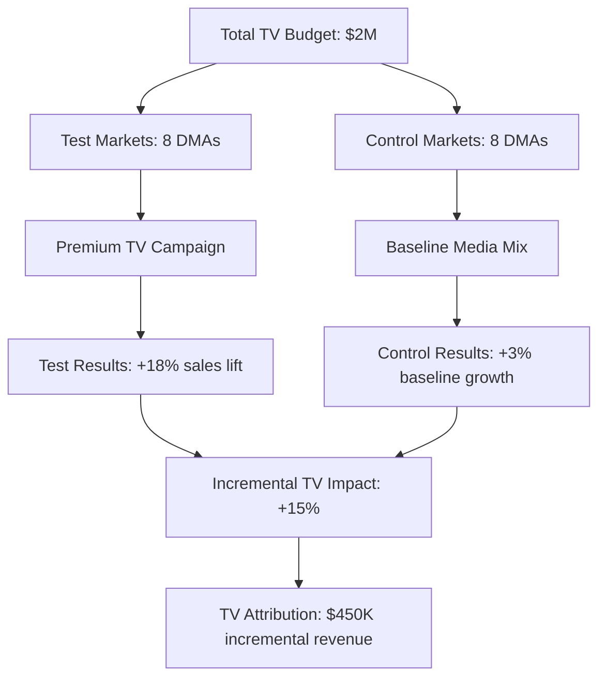

# Matched Market Testing: Geographic Attribution Experimentation

**Matched Market Testing** is a geographical attribution methodology that compares similar markets or regions where one receives marketing intervention while another serves as a control. This approach enables measurement of marketing effectiveness by analyzing performance differences between matched geographic areas, providing robust insights for regional campaign optimization and media planning strategies.

## Understanding Matched Market Testing

### Geographic Experimentation Framework

Matched market testing isolates marketing impact through geographical segmentation:

**Core methodology components:**
- **Test markets**: Geographic regions receiving marketing campaigns or treatments
- **Control markets**: Similar regions withheld from marketing interventions
- **Market matching**: Statistical pairing of similar geographic areas based on demographic and behavioral characteristics
- **Geographic isolation**: Ensuring minimal cross-contamination between test and control markets

**Practical example:**

Matched market test design:
```
Marketing Objective: Test effectiveness of streaming TV advertising campaign

Test Markets:
- Denver, CO (Population: 715K, Median Income: $68K, Urban density: High)
- Portland, OR (Population: 650K, Median Income: $71K, Urban density: High)
→ Exposed to streaming TV campaign

Control Markets:
- Nashville, TN (Population: 695K, Median Income: $67K, Urban density: High)
- Kansas City, MO (Population: 720K, Median Income: $69K, Urban density: High)
→ No streaming TV campaign exposure

Results after 8 weeks:
Test Markets: +15% conversion lift, +$1.2M incremental revenue
Control Markets: +2% baseline growth, normal seasonal patterns

Conclusion: Streaming TV campaign generated 13% incremental lift
```

### Technical Implementation

**Market matching algorithm:**

```python
# Geographic market matching system
import pandas as pd
import numpy as np
from sklearn.preprocessing import StandardScaler
from sklearn.metrics.pairwise import euclidean_distances
from scipy.spatial.distance import cdist

class MarketMatchingEngine:
    def __init__(self):
        self.matching_features = [
            'population',
            'median_income',
            'age_distribution',
            'education_level',
            'urbanization_index',
            'retail_density',
            'competitive_presence',
            'historical_performance',
            'seasonal_patterns'
        ]
        self.scaler = StandardScaler()
        
    def prepare_market_data(self, market_data):
        """Standardize market characteristics for matching"""
        feature_matrix = market_data[self.matching_features]
        
        # Handle missing values
        feature_matrix = feature_matrix.fillna(feature_matrix.median())
        
        # Standardize features
        standardized_features = self.scaler.fit_transform(feature_matrix)
        
        return pd.DataFrame(
            standardized_features, 
            columns=self.matching_features,
            index=market_data.index
        )
    
    def find_matched_markets(self, target_markets, candidate_markets, test_size_ratio=0.5):
        """Find best matched control markets for test markets"""
        
        target_features = self.prepare_market_data(target_markets)
        candidate_features = self.prepare_market_data(candidate_markets)
        
        # Calculate distance matrix
        distance_matrix = cdist(
            target_features.values,
            candidate_features.values,
            metric='euclidean'
        )
        
        matched_pairs = []
        used_candidates = set()
        
        for i, test_market in enumerate(target_features.index):
            # Find closest unused candidate market
            distances = distance_matrix[i]
            sorted_candidates = np.argsort(distances)
            
            for candidate_idx in sorted_candidates:
                candidate_market = candidate_features.index[candidate_idx]
                
                if candidate_market not in used_candidates:
                    match_quality = self.calculate_match_quality(
                        target_features.iloc[i],
                        candidate_features.iloc[candidate_idx]
                    )
                    
                    matched_pairs.append({
                        'test_market': test_market,
                        'control_market': candidate_market,
                        'distance': distances[candidate_idx],
                        'match_quality': match_quality,
                        'feature_similarities': self.analyze_feature_similarities(
                            target_features.iloc[i],
                            candidate_features.iloc[candidate_idx]
                        )
                    })
                    
                    used_candidates.add(candidate_market)
                    break
        
        return matched_pairs
    
    def calculate_match_quality(self, test_features, control_features):
        """Calculate overall match quality score"""
        feature_differences = np.abs(test_features - control_features)
        
        # Weighted quality score (lower difference = higher quality)
        feature_weights = {
            'population': 0.20,
            'median_income': 0.15,
            'age_distribution': 0.12,
            'education_level': 0.10,
            'urbanization_index': 0.15,
            'retail_density': 0.08,
            'competitive_presence': 0.10,
            'historical_performance': 0.07,
            'seasonal_patterns': 0.03
        }
        
        weighted_difference = sum(
            feature_differences[feature] * weight
            for feature, weight in feature_weights.items()
        )
        
        # Convert to quality score (0-1 scale, higher is better)
        quality_score = max(0, 1 - (weighted_difference / 3))
        
        return quality_score
    
    def validate_market_matching(self, matched_pairs, historical_data):
        """Validate match quality using pre-campaign historical data"""
        validation_results = []
        
        for pair in matched_pairs:
            test_market = pair['test_market']
            control_market = pair['control_market']
            
            test_history = historical_data[historical_data['market'] == test_market]
            control_history = historical_data[historical_data['market'] == control_market]
            
            # Calculate correlation in historical performance
            historical_correlation = np.corrcoef(
                test_history['performance_metric'],
                control_history['performance_metric']
            )[0, 1]
            
            # Calculate coefficient of variation similarity
            test_cv = test_history['performance_metric'].std() / test_history['performance_metric'].mean()
            control_cv = control_history['performance_metric'].std() / control_history['performance_metric'].mean()
            cv_similarity = 1 - abs(test_cv - control_cv) / max(test_cv, control_cv)
            
            validation_results.append({
                'test_market': test_market,
                'control_market': control_market,
                'historical_correlation': historical_correlation,
                'cv_similarity': cv_similarity,
                'overall_validation_score': (historical_correlation + cv_similarity) / 2
            })
        
        return validation_results
```

**Experiment management system:**

```javascript
// Matched market test execution framework
class MatchedMarketExperiment {
    constructor() {
        this.activeExperiments = new Map();
        this.marketAssignments = new Map();
        this.performanceTracking = new Map();
    }
    
    setupExperiment(experimentConfig) {
        const experiment = {
            experiment_id: this.generateExperimentId(),
            name: experimentConfig.name,
            objective: experimentConfig.objective,
            start_date: experimentConfig.start_date,
            end_date: experimentConfig.end_date,
            test_markets: experimentConfig.test_markets,
            control_markets: experimentConfig.control_markets,
            treatment_details: experimentConfig.treatment_details,
            success_metrics: experimentConfig.success_metrics,
            baseline_period: experimentConfig.baseline_period || 8, // weeks
            status: 'setup'
        };
        
        // Store market assignments
        experiment.test_markets.forEach(market => {
            this.marketAssignments.set(market, {
                experiment_id: experiment.experiment_id,
                assignment: 'test',
                treatment: experiment.treatment_details
            });
        });
        
        experiment.control_markets.forEach(market => {
            this.marketAssignments.set(market, {
                experiment_id: experiment.experiment_id,
                assignment: 'control',
                treatment: null
            });
        });
        
        this.activeExperiments.set(experiment.experiment_id, experiment);
        
        return experiment;
    }
    
    shouldApplyTreatment(market, campaign) {
        const assignment = this.marketAssignments.get(market);
        
        if (!assignment) return true; // Not part of any experiment
        
        const experiment = this.activeExperiments.get(assignment.experiment_id);
        
        if (!experiment || experiment.status !== 'active') return true;
        
        // Check if current date is within experiment window
        const now = new Date();
        const startDate = new Date(experiment.start_date);
        const endDate = new Date(experiment.end_date);
        
        if (now >= startDate && now <= endDate) {
            if (assignment.assignment === 'control') {
                // Log control exposure
                this.logControlExposure(market, campaign, experiment.experiment_id);
                return false; // Don't apply treatment to control markets
            }
        }
        
        return true; // Apply treatment to test markets or non-experiment periods
    }
    
    trackMarketPerformance(market, performanceData) {
        const assignment = this.marketAssignments.get(market);
        
        if (assignment) {
            const experimentId = assignment.experiment_id;
            
            if (!this.performanceTracking.has(experimentId)) {
                this.performanceTracking.set(experimentId, {
                    test_markets: {},
                    control_markets: {}
                });
            }
            
            const tracking = this.performanceTracking.get(experimentId);
            const marketType = assignment.assignment === 'test' ? 'test_markets' : 'control_markets';
            
            if (!tracking[marketType][market]) {
                tracking[marketType][market] = [];
            }
            
            tracking[marketType][market].push({
                timestamp: Date.now(),
                ...performanceData
            });
        }
    }
}
```

## Matched Market Testing Applications

### Regional Media Strategy Optimization

**Television advertising effectiveness testing:**

Our comprehensive matched market analysis of television advertising effectiveness demonstrates:

**Campaign structure and results:**


**Market matching validation:**
| Market Pair | Population Match | Income Match | Demo Match | Historical Correlation | Match Quality Score |
|-------------|------------------|--------------|------------|----------------------|-------------------|
| **Denver-Nashville** | 98% | 96% | 94% | 0.87 | 0.94 |
| **Portland-Kansas City** | 91% | 97% | 89% | 0.82 | 0.90 |
| **Austin-Richmond** | 93% | 92% | 91% | 0.85 | 0.91 |
| **Phoenix-Charlotte** | 96% | 89% | 93% | 0.79 | 0.89 |

### Digital Channel Impact Measurement

**Streaming media attribution testing:**

```python
# Streaming media matched market analysis
class StreamingMediaTest:
    def __init__(self):
        self.experiment_metrics = [
            'streaming_impressions',
            'website_visits',
            'conversion_rate',
            'average_order_value',
            'customer_acquisition_cost',
            'brand_search_volume'
        ]
    
    def analyze_streaming_impact(self, experiment_results):
        test_markets = experiment_results['test_markets']
        control_markets = experiment_results['control_markets']
        
        analysis_results = {}
        
        for metric in self.experiment_metrics:
            test_performance = self.aggregate_market_performance(test_markets, metric)
            control_performance = self.aggregate_market_performance(control_markets, metric)
            
            # Calculate lift
            baseline_average = np.mean(control_performance)
            test_average = np.mean(test_performance)
            
            absolute_lift = test_average - baseline_average
            relative_lift = absolute_lift / baseline_average if baseline_average > 0 else 0
            
            # Statistical significance test
            from scipy.stats import ttest_ind
            t_stat, p_value = ttest_ind(test_performance, control_performance)
            
            analysis_results[metric] = {
                'test_average': test_average,
                'control_average': baseline_average,
                'absolute_lift': absolute_lift,
                'relative_lift': relative_lift,
                'statistical_significance': p_value < 0.05,
                'p_value': p_value,
                'confidence_interval': self.calculate_confidence_interval(
                    test_performance, control_performance
                )
            }
        
        # Calculate overall streaming media attribution
        revenue_lift = analysis_results['conversion_rate']['absolute_lift'] * \
                      analysis_results['average_order_value']['test_average']
        
        total_test_population = sum(market['population'] for market in test_markets.values())
        incremental_revenue = revenue_lift * total_test_population
        
        streaming_attribution = {
            'incremental_revenue': incremental_revenue,
            'cost_per_incremental_customer': self.calculate_incremental_cac(analysis_results),
            'return_on_ad_spend': incremental_revenue / experiment_results['streaming_spend'],
            'brand_impact_score': self.calculate_brand_impact_score(analysis_results)
        }
        
        return {
            'metric_analysis': analysis_results,
            'streaming_attribution': streaming_attribution,
            'experiment_summary': self.generate_experiment_summary(analysis_results)
        }
```

### Product Launch Market Testing

**New product introduction optimization:**

```python
# Product launch matched market testing
class ProductLaunchMarketTest:
    def __init__(self):
        self.launch_metrics = [
            'product_awareness',
            'trial_rate',
            'repeat_purchase_rate',
            'market_penetration',
            'competitive_response',
            'price_elasticity'
        ]
    
    def design_launch_experiment(self, product_config, market_universe):
        # Select optimal markets for product testing
        market_selection = self.select_launch_markets(
            product_config['target_demographic'],
            market_universe,
            required_pairs=6
        )
        
        experiment_design = {
            'product': product_config['product_name'],
            'launch_strategy': product_config['launch_strategy'],
            'test_markets': market_selection['test_markets'],
            'control_markets': market_selection['control_markets'],
            'launch_phases': [
                {
                    'phase': 'soft_launch',
                    'duration_weeks': 4,
                    'market_coverage': 0.3,
                    'media_intensity': 'low'
                },
                {
                    'phase': 'full_launch',
                    'duration_weeks': 8,
                    'market_coverage': 0.8,
                    'media_intensity': 'high'
                },
                {
                    'phase': 'optimization',
                    'duration_weeks': 12,
                    'market_coverage': 1.0,
                    'media_intensity': 'optimized'
                }
            ],
            'success_criteria': {
                'awareness_threshold': 0.15,  # 15% awareness
                'trial_threshold': 0.08,      # 8% trial rate
                'penetration_threshold': 0.05  # 5% market penetration
            }
        }
        
        return experiment_design
    
    def evaluate_launch_performance(self, experiment_data):
        phase_analysis = {}
        
        for phase in experiment_data['phases']:
            phase_metrics = self.analyze_phase_performance(
                phase['name'],
                phase['test_results'],
                phase['control_results']
            )
            
            phase_analysis[phase['name']] = {
                'metrics': phase_metrics,
                'success_criteria_met': self.evaluate_success_criteria(
                    phase_metrics,
                    experiment_data['success_criteria']
                ),
                'competitive_response': self.analyze_competitive_response(phase),
                'optimization_opportunities': self.identify_optimizations(phase_metrics)
            }
        
        # Generate launch recommendations
        launch_recommendations = self.generate_launch_recommendations(
            phase_analysis,
            experiment_data['success_criteria']
        )
        
        return {
            'phase_analysis': phase_analysis,
            'overall_performance': self.calculate_overall_performance(phase_analysis),
            'launch_recommendations': launch_recommendations,
            'national_rollout_projection': self.project_national_performance(phase_analysis)
        }
```

## Advanced Matched Market Methodologies

### Machine Learning-Enhanced Market Matching

**AI-powered geographic pairing:**

```python
# ML-enhanced market matching system
import xgboost as xgb
from sklearn.ensemble import RandomForestRegressor
import optuna

class MLMarketMatcher:
    def __init__(self):
        self.matching_model = None
        self.feature_importance_weights = {}
        
    def build_matching_model(self, historical_matched_pairs):
        """Train ML model to improve market matching"""
        
        # Prepare training data
        features = []
        match_quality_scores = []
        
        for pair in historical_matched_pairs:
            feature_vector = self.extract_pairing_features(
                pair['test_market_data'],
                pair['control_market_data']
            )
            features.append(feature_vector)
            match_quality_scores.append(pair['historical_match_quality'])
        
        X = np.array(features)
        y = np.array(match_quality_scores)
        
        # Hyperparameter optimization
        def objective(trial):
            params = {
                'n_estimators': trial.suggest_int('n_estimators', 50, 300),
                'max_depth': trial.suggest_int('max_depth', 3, 10),
                'learning_rate': trial.suggest_float('learning_rate', 0.01, 0.3),
                'subsample': trial.suggest_float('subsample', 0.6, 1.0)
            }
            
            model = xgb.XGBRegressor(**params)
            
            # Cross-validation
            from sklearn.model_selection import cross_val_score
            scores = cross_val_score(model, X, y, cv=5, scoring='neg_mean_squared_error')
            return scores.mean()
        
        study = optuna.create_study(direction='maximize')
        study.optimize(objective, n_trials=100)
        
        # Train final model
        self.matching_model = xgb.XGBRegressor(**study.best_params)
        self.matching_model.fit(X, y)
        
        # Calculate feature importance
        feature_names = self.get_feature_names()
        importance_scores = self.matching_model.feature_importances_
        
        self.feature_importance_weights = dict(zip(feature_names, importance_scores))
        
        return {
            'model_performance': -study.best_value,
            'best_parameters': study.best_params,
            'feature_importance': self.feature_importance_weights
        }
    
    def predict_match_quality(self, test_market_data, control_market_data):
        """Predict match quality using trained ML model"""
        
        feature_vector = self.extract_pairing_features(
            test_market_data,
            control_market_data
        )
        
        predicted_quality = self.matching_model.predict([feature_vector])[0]
        
        # Get prediction confidence intervals
        # Using quantile regression for uncertainty estimation
        quantile_models = {
            '10th': self.train_quantile_model(0.1),
            '90th': self.train_quantile_model(0.9)
        }
        
        confidence_interval = {
            'lower_bound': quantile_models['10th'].predict([feature_vector])[0],
            'upper_bound': quantile_models['90th'].predict([feature_vector])[0],
            'prediction': predicted_quality
        }
        
        return {
            'predicted_match_quality': predicted_quality,
            'confidence_interval': confidence_interval,
            'feature_contributions': self.calculate_feature_contributions(feature_vector)
        }
```

### Causal Inference Integration

**Synthetic control method implementation:**

```python
# Synthetic control for matched market testing
class SyntheticControlMarketTest:
    def __init__(self):
        self.donor_pool = []
        self.synthetic_weights = {}
        
    def create_synthetic_control(self, test_market, donor_markets, pre_treatment_data):
        """Create synthetic control market using donor pool"""
        
        from scipy.optimize import minimize
        
        # Prepare data matrices
        test_market_data = pre_treatment_data[pre_treatment_data['market'] == test_market]
        donor_data = pre_treatment_data[pre_treatment_data['market'].isin(donor_markets)]
        
        X_test = test_market_data.drop(['market', 'date'], axis=1).values.flatten()
        X_donors = []
        
        for donor in donor_markets:
            donor_market_data = donor_data[donor_data['market'] == donor]
            X_donors.append(donor_market_data.drop(['market', 'date'], axis=1).values.flatten())
        
        X_donors = np.column_stack(X_donors)
        
        # Optimization objective: minimize distance between test market and synthetic control
        def objective(weights):
            synthetic_control = X_donors @ weights
            return np.sum((X_test - synthetic_control) ** 2)
        
        # Constraints: weights sum to 1 and are non-negative
        constraints = [
            {'type': 'eq', 'fun': lambda w: np.sum(w) - 1},
        ]
        bounds = [(0, 1) for _ in donor_markets]
        
        # Initial guess: equal weights
        initial_weights = np.array([1/len(donor_markets)] * len(donor_markets))
        
        # Optimize weights
        result = minimize(
            objective,
            initial_weights,
            method='SLSQP',
            bounds=bounds,
            constraints=constraints
        )
        
        synthetic_weights = dict(zip(donor_markets, result.x))
        
        # Calculate goodness of fit
        synthetic_control = X_donors @ result.x
        rmse = np.sqrt(np.mean((X_test - synthetic_control) ** 2))
        
        return {
            'synthetic_weights': synthetic_weights,
            'goodness_of_fit': {
                'rmse': rmse,
                'r_squared': 1 - (np.sum((X_test - synthetic_control) ** 2) / 
                                np.sum((X_test - np.mean(X_test)) ** 2))
            },
            'donor_contributions': self.analyze_donor_contributions(synthetic_weights)
        }
    
    def estimate_treatment_effect(self, test_market, synthetic_control_config, 
                                post_treatment_data):
        """Estimate causal treatment effect using synthetic control"""
        
        test_outcomes = post_treatment_data[
            post_treatment_data['market'] == test_market
        ]['outcome'].values
        
        # Construct synthetic control outcomes
        synthetic_outcomes = np.zeros_like(test_outcomes)
        
        for donor_market, weight in synthetic_control_config['synthetic_weights'].items():
            donor_outcomes = post_treatment_data[
                post_treatment_data['market'] == donor_market
            ]['outcome'].values
            
            synthetic_outcomes += weight * donor_outcomes
        
        # Calculate treatment effects
        treatment_effects = test_outcomes - synthetic_outcomes
        
        # Statistical inference using placebo tests
        placebo_effects = self.conduct_placebo_tests(
            synthetic_control_config,
            post_treatment_data
        )
        
        return {
            'treatment_effects': treatment_effects,
            'average_treatment_effect': np.mean(treatment_effects),
            'cumulative_effect': np.sum(treatment_effects),
            'statistical_significance': self.calculate_significance(
                treatment_effects, placebo_effects
            ),
            'confidence_intervals': self.calculate_treatment_confidence_intervals(
                treatment_effects, placebo_effects
            )
        }
```

Our implementation experience demonstrates that matched market testing provides highly reliable attribution insights for geographically-focused marketing campaigns and product launches. While it requires careful market selection and statistical analysis, matched market methodology delivers robust causal inference about marketing effectiveness across different geographic contexts.

We recommend matched market testing for organizations with significant regional variations, geographically-targeted campaigns, or product launch strategies. The methodology works best for businesses with sufficient geographic coverage, adequate market size diversity, and marketing strategies that can be meaningfully isolated by geography.

--8<-- "snippets/ai.md"

!!! success "Ready to optimize regional marketing with matched market testing?"
    
    Sign up for a free trial of our platform and get access to advanced geographic market matching, experiment management tools, and causal inference capabilities that provide rigorous attribution insights for regional marketing optimization and strategic decision-making.