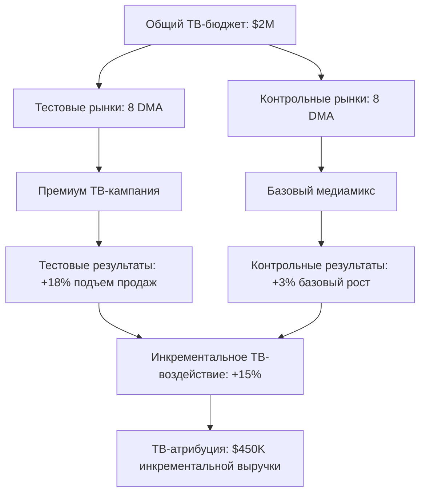

# Тестирование сопоставленных рынков: Географическое экспериментирование атрибуции

**Тестирование сопоставленных рынков** - это географическая методология атрибуции, которая сравнивает похожие рынки или регионы, где один получает маркетинговое вмешательство, а другой служит контролем. Этот подход позволяет измерить эффективность маркетинга, анализируя различия в производительности между сопоставленными географическими областями, предоставляя надежные инсайты для региональной оптимизации кампаний и стратегий медиапланирования.

## Понимание тестирования сопоставленных рынков

### Структура географического экспериментирования

Тестирование сопоставленных рынков изолирует маркетинговое воздействие через географическую сегментацию:

**Основные компоненты методологии:**
- **Тестовые рынки**: Географические регионы, получающие маркетинговые кампании или воздействия
- **Контрольные рынки**: Похожие регионы, исключенные из маркетинговых вмешательств
- **Сопоставление рынков**: Статистическое парное сопоставление похожих географических областей на основе демографических и поведенческих характеристик
- **Географическая изоляция**: Обеспечение минимального перекрестного загрязнения между тестовыми и контрольными рынками

**Практический пример:**

Дизайн теста сопоставленных рынков:
```
Маркетинговая цель: Протестировать эффективность кампании потокового ТВ

Тестовые рынки:
- Денвер, Колорадо (Население: 715K, Медианный доход: $68K, Городская плотность: Высокая)
- Портленд, Орегон (Население: 650K, Медианный доход: $71K, Городская плотность: Высокая)
→ Подвержены кампании потокового ТВ

Контрольные рынки:
- Нашвилл, Теннесси (Население: 695K, Медианный доход: $67K, Городская плотность: Высокая)
- Канзас-Сити, Миссури (Население: 720K, Медианный доход: $69K, Городская плотность: Высокая)
→ Без воздействия кампании потокового ТВ

Результаты через 8 недель:
Тестовые рынки: +15% подъем конверсий, +$1.2М инкрементальной выручки
Контрольные рынки: +2% базового роста, нормальные сезонные паттерны

Заключение: Кампания потокового ТВ сгенерировала 13% инкрементального подъема
```

### Техническая реализация

**Алгоритм сопоставления рынков:**

```python
# Система сопоставления географических рынков
import pandas as pd
import numpy as np
from sklearn.preprocessing import StandardScaler
from sklearn.metrics.pairwise import euclidean_distances
from scipy.spatial.distance import cdist

class MarketMatchingEngine:
    def __init__(self):
        self.matching_features = [
            'population',
            'median_income',
            'age_distribution',
            'education_level',
            'urbanization_index',
            'retail_density',
            'competitive_presence',
            'historical_performance',
            'seasonal_patterns'
        ]
        self.scaler = StandardScaler()
        
    def prepare_market_data(self, market_data):
        """Стандартизировать характеристики рынка для сопоставления"""
        feature_matrix = market_data[self.matching_features]
        
        # Обработать отсутствующие значения
        feature_matrix = feature_matrix.fillna(feature_matrix.median())
        
        # Стандартизировать признаки
        standardized_features = self.scaler.fit_transform(feature_matrix)
        
        return pd.DataFrame(
            standardized_features, 
            columns=self.matching_features,
            index=market_data.index
        )
    
    def find_matched_markets(self, target_markets, candidate_markets, test_size_ratio=0.5):
        """Найти лучшие сопоставленные контрольные рынки для тестовых рынков"""
        
        target_features = self.prepare_market_data(target_markets)
        candidate_features = self.prepare_market_data(candidate_markets)
        
        # Рассчитать матрицу расстояний
        distance_matrix = cdist(
            target_features.values,
            candidate_features.values,
            metric='euclidean'
        )
        
        matched_pairs = []
        used_candidates = set()
        
        for i, test_market in enumerate(target_features.index):
            # Найти ближайший неиспользованный рынок-кандидат
            distances = distance_matrix[i]
            sorted_candidates = np.argsort(distances)
            
            for candidate_idx in sorted_candidates:
                candidate_market = candidate_features.index[candidate_idx]
                
                if candidate_market not in used_candidates:
                    match_quality = self.calculate_match_quality(
                        target_features.iloc[i],
                        candidate_features.iloc[candidate_idx]
                    )
                    
                    matched_pairs.append({
                        'test_market': test_market,
                        'control_market': candidate_market,
                        'distance': distances[candidate_idx],
                        'match_quality': match_quality,
                        'feature_similarities': self.analyze_feature_similarities(
                            target_features.iloc[i],
                            candidate_features.iloc[candidate_idx]
                        )
                    })
                    
                    used_candidates.add(candidate_market)
                    break
        
        return matched_pairs
    
    def calculate_match_quality(self, test_features, control_features):
        """Рассчитать общий балл качества сопоставления"""
        feature_differences = np.abs(test_features - control_features)
        
        # Взвешенный балл качества (меньшая разница = более высокое качество)
        feature_weights = {
            'population': 0.20,
            'median_income': 0.15,
            'age_distribution': 0.12,
            'education_level': 0.10,
            'urbanization_index': 0.15,
            'retail_density': 0.08,
            'competitive_presence': 0.10,
            'historical_performance': 0.07,
            'seasonal_patterns': 0.03
        }
        
        weighted_difference = sum(
            feature_differences[feature] * weight
            for feature, weight in feature_weights.items()
        )
        
        # Преобразовать в балл качества (шкала 0-1, выше лучше)
        quality_score = max(0, 1 - (weighted_difference / 3))
        
        return quality_score
    
    def validate_market_matching(self, matched_pairs, historical_data):
        """Валидировать качество сопоставления используя исторические данные до кампании"""
        validation_results = []
        
        for pair in matched_pairs:
            test_market = pair['test_market']
            control_market = pair['control_market']
            
            test_history = historical_data[historical_data['market'] == test_market]
            control_history = historical_data[historical_data['market'] == control_market]
            
            # Рассчитать корреляцию в исторической производительности
            historical_correlation = np.corrcoef(
                test_history['performance_metric'],
                control_history['performance_metric']
            )[0, 1]
            
            # Рассчитать схожесть коэффициента вариации
            test_cv = test_history['performance_metric'].std() / test_history['performance_metric'].mean()
            control_cv = control_history['performance_metric'].std() / control_history['performance_metric'].mean()
            cv_similarity = 1 - abs(test_cv - control_cv) / max(test_cv, control_cv)
            
            validation_results.append({
                'test_market': test_market,
                'control_market': control_market,
                'historical_correlation': historical_correlation,
                'cv_similarity': cv_similarity,
                'overall_validation_score': (historical_correlation + cv_similarity) / 2
            })
        
        return validation_results
```

**Система управления экспериментом:**

```javascript
// Структура выполнения теста сопоставленных рынков
class MatchedMarketExperiment {
    constructor() {
        this.activeExperiments = new Map();
        this.marketAssignments = new Map();
        this.performanceTracking = new Map();
    }
    
    setupExperiment(experimentConfig) {
        const experiment = {
            experiment_id: this.generateExperimentId(),
            name: experimentConfig.name,
            objective: experimentConfig.objective,
            start_date: experimentConfig.start_date,
            end_date: experimentConfig.end_date,
            test_markets: experimentConfig.test_markets,
            control_markets: experimentConfig.control_markets,
            treatment_details: experimentConfig.treatment_details,
            success_metrics: experimentConfig.success_metrics,
            baseline_period: experimentConfig.baseline_period || 8, // недели
            status: 'setup'
        };
        
        // Сохранить назначения рынков
        experiment.test_markets.forEach(market => {
            this.marketAssignments.set(market, {
                experiment_id: experiment.experiment_id,
                assignment: 'test',
                treatment: experiment.treatment_details
            });
        });
        
        experiment.control_markets.forEach(market => {
            this.marketAssignments.set(market, {
                experiment_id: experiment.experiment_id,
                assignment: 'control',
                treatment: null
            });
        });
        
        this.activeExperiments.set(experiment.experiment_id, experiment);
        
        return experiment;
    }
    
    shouldApplyTreatment(market, campaign) {
        const assignment = this.marketAssignments.get(market);
        
        if (!assignment) return true; // Не часть какого-либо эксперимента
        
        const experiment = this.activeExperiments.get(assignment.experiment_id);
        
        if (!experiment || experiment.status !== 'active') return true;
        
        // Проверить, находится ли текущая дата в окне эксперимента
        const now = new Date();
        const startDate = new Date(experiment.start_date);
        const endDate = new Date(experiment.end_date);
        
        if (now >= startDate && now <= endDate) {
            if (assignment.assignment === 'control') {
                // Записать контрольное воздействие
                this.logControlExposure(market, campaign, experiment.experiment_id);
                return false; // Не применять воздействие к контрольным рынкам
            }
        }
        
        return true; // Применять воздействие к тестовым рынкам или периодам вне эксперимента
    }
    
    trackMarketPerformance(market, performanceData) {
        const assignment = this.marketAssignments.get(market);
        
        if (assignment) {
            const experimentId = assignment.experiment_id;
            
            if (!this.performanceTracking.has(experimentId)) {
                this.performanceTracking.set(experimentId, {
                    test_markets: {},
                    control_markets: {}
                });
            }
            
            const tracking = this.performanceTracking.get(experimentId);
            const marketType = assignment.assignment === 'test' ? 'test_markets' : 'control_markets';
            
            if (!tracking[marketType][market]) {
                tracking[marketType][market] = [];
            }
            
            tracking[marketType][market].push({
                timestamp: Date.now(),
                ...performanceData
            });
        }
    }
}
```

## Применения тестирования сопоставленных рынков

### Оптимизация региональной медиастратегии

**Тестирование эффективности телевизионной рекламы:**

Наш комплексный анализ сопоставленных рынков эффективности телевизионной рекламы демонстрирует:

**Структура кампании и результаты:**


**Валидация сопоставления рынков:**
| Пара рынков | Соответствие населения | Соответствие дохода | Демо-соответствие | Историческая корреляция | Балл качества сопоставления |
|-------------|------------------------|-------------------|----------------|------------------------|-----------------------------|
| **Денвер-Нашвилл** | 98% | 96% | 94% | 0.87 | 0.94 |
| **Портленд-Канзас-Сити** | 91% | 97% | 89% | 0.82 | 0.90 |
| **Остин-Ричмонд** | 93% | 92% | 91% | 0.85 | 0.91 |
| **Феникс-Шарлотт** | 96% | 89% | 93% | 0.79 | 0.89 |

### Измерение воздействия цифровых каналов

**Тестирование атрибуции потоковых медиа:**

```python
# Анализ теста сопоставленных рынков потоковых медиа
class StreamingMediaTest:
    def __init__(self):
        self.experiment_metrics = [
            'streaming_impressions',
            'website_visits',
            'conversion_rate',
            'average_order_value',
            'customer_acquisition_cost',
            'brand_search_volume'
        ]
    
    def analyze_streaming_impact(self, experiment_results):
        test_markets = experiment_results['test_markets']
        control_markets = experiment_results['control_markets']
        
        analysis_results = {}
        
        for metric in self.experiment_metrics:
            test_performance = self.aggregate_market_performance(test_markets, metric)
            control_performance = self.aggregate_market_performance(control_markets, metric)
            
            # Рассчитать подъем
            baseline_average = np.mean(control_performance)
            test_average = np.mean(test_performance)
            
            absolute_lift = test_average - baseline_average
            relative_lift = absolute_lift / baseline_average if baseline_average > 0 else 0
            
            # Тест статистической значимости
            from scipy.stats import ttest_ind
            t_stat, p_value = ttest_ind(test_performance, control_performance)
            
            analysis_results[metric] = {
                'test_average': test_average,
                'control_average': baseline_average,
                'absolute_lift': absolute_lift,
                'relative_lift': relative_lift,
                'statistical_significance': p_value < 0.05,
                'p_value': p_value,
                'confidence_interval': self.calculate_confidence_interval(
                    test_performance, control_performance
                )
            }
        
        # Рассчитать общую атрибуцию потоковых медиа
        revenue_lift = analysis_results['conversion_rate']['absolute_lift'] * \
                      analysis_results['average_order_value']['test_average']
        
        total_test_population = sum(market['population'] for market in test_markets.values())
        incremental_revenue = revenue_lift * total_test_population
        
        streaming_attribution = {
            'incremental_revenue': incremental_revenue,
            'cost_per_incremental_customer': self.calculate_incremental_cac(analysis_results),
            'return_on_ad_spend': incremental_revenue / experiment_results['streaming_spend'],
            'brand_impact_score': self.calculate_brand_impact_score(analysis_results)
        }
        
        return {
            'metric_analysis': analysis_results,
            'streaming_attribution': streaming_attribution,
            'experiment_summary': self.generate_experiment_summary(analysis_results)
        }
```

### Тестирование рынка запуска продукта

**Оптимизация внедрения нового продукта:**

```python
# Тестирование сопоставленных рынков запуска продукта
class ProductLaunchMarketTest:
    def __init__(self):
        self.launch_metrics = [
            'product_awareness',
            'trial_rate',
            'repeat_purchase_rate',
            'market_penetration',
            'competitive_response',
            'price_elasticity'
        ]
    
    def design_launch_experiment(self, product_config, market_universe):
        # Выбрать оптимальные рынки для тестирования продукта
        market_selection = self.select_launch_markets(
            product_config['target_demographic'],
            market_universe,
            required_pairs=6
        )
        
        experiment_design = {
            'product': product_config['product_name'],
            'launch_strategy': product_config['launch_strategy'],
            'test_markets': market_selection['test_markets'],
            'control_markets': market_selection['control_markets'],
            'launch_phases': [
                {
                    'phase': 'soft_launch',
                    'duration_weeks': 4,
                    'market_coverage': 0.3,
                    'media_intensity': 'low'
                },
                {
                    'phase': 'full_launch',
                    'duration_weeks': 8,
                    'market_coverage': 0.8,
                    'media_intensity': 'high'
                },
                {
                    'phase': 'optimization',
                    'duration_weeks': 12,
                    'market_coverage': 1.0,
                    'media_intensity': 'optimized'
                }
            ],
            'success_criteria': {
                'awareness_threshold': 0.15,  # 15% узнаваемость
                'trial_threshold': 0.08,      # 8% коэффициент пробы
                'penetration_threshold': 0.05  # 5% проникновение на рынок
            }
        }
        
        return experiment_design
    
    def evaluate_launch_performance(self, experiment_data):
        phase_analysis = {}
        
        for phase in experiment_data['phases']:
            phase_metrics = self.analyze_phase_performance(
                phase['name'],
                phase['test_results'],
                phase['control_results']
            )
            
            phase_analysis[phase['name']] = {
                'metrics': phase_metrics,
                'success_criteria_met': self.evaluate_success_criteria(
                    phase_metrics,
                    experiment_data['success_criteria']
                ),
                'competitive_response': self.analyze_competitive_response(phase),
                'optimization_opportunities': self.identify_optimizations(phase_metrics)
            }
        
        # Сгенерировать рекомендации по запуску
        launch_recommendations = self.generate_launch_recommendations(
            phase_analysis,
            experiment_data['success_criteria']
        )
        
        return {
            'phase_analysis': phase_analysis,
            'overall_performance': self.calculate_overall_performance(phase_analysis),
            'launch_recommendations': launch_recommendations,
            'national_rollout_projection': self.project_national_performance(phase_analysis)
        }
```

## Продвинутые методологии сопоставленных рынков

### Сопоставление рынков с усилением машинного обучения

**Географическое парное сопоставление на базе ИИ:**

```python
# ML-усиленная система сопоставления рынков
import xgboost as xgb
from sklearn.ensemble import RandomForestRegressor
import optuna

class MLMarketMatcher:
    def __init__(self):
        self.matching_model = None
        self.feature_importance_weights = {}
        
    def build_matching_model(self, historical_matched_pairs):
        """Обучить ML модель для улучшения сопоставления рынков"""
        
        # Подготовить обучающие данные
        features = []
        match_quality_scores = []
        
        for pair in historical_matched_pairs:
            feature_vector = self.extract_pairing_features(
                pair['test_market_data'],
                pair['control_market_data']
            )
            features.append(feature_vector)
            match_quality_scores.append(pair['historical_match_quality'])
        
        X = np.array(features)
        y = np.array(match_quality_scores)
        
        # Оптимизация гиперпараметров
        def objective(trial):
            params = {
                'n_estimators': trial.suggest_int('n_estimators', 50, 300),
                'max_depth': trial.suggest_int('max_depth', 3, 10),
                'learning_rate': trial.suggest_float('learning_rate', 0.01, 0.3),
                'subsample': trial.suggest_float('subsample', 0.6, 1.0)
            }
            
            model = xgb.XGBRegressor(**params)
            
            # Кросс-валидация
            from sklearn.model_selection import cross_val_score
            scores = cross_val_score(model, X, y, cv=5, scoring='neg_mean_squared_error')
            return scores.mean()
        
        study = optuna.create_study(direction='maximize')
        study.optimize(objective, n_trials=100)
        
        # Обучить финальную модель
        self.matching_model = xgb.XGBRegressor(**study.best_params)
        self.matching_model.fit(X, y)
        
        # Рассчитать важность признаков
        feature_names = self.get_feature_names()
        importance_scores = self.matching_model.feature_importances_
        
        self.feature_importance_weights = dict(zip(feature_names, importance_scores))
        
        return {
            'model_performance': -study.best_value,
            'best_parameters': study.best_params,
            'feature_importance': self.feature_importance_weights
        }
    
    def predict_match_quality(self, test_market_data, control_market_data):
        """Предсказать качество сопоставления используя обученную ML модель"""
        
        feature_vector = self.extract_pairing_features(
            test_market_data,
            control_market_data
        )
        
        predicted_quality = self.matching_model.predict([feature_vector])[0]
        
        # Получить доверительные интервалы предсказания
        # Использовать квантильную регрессию для оценки неопределенности
        quantile_models = {
            '10th': self.train_quantile_model(0.1),
            '90th': self.train_quantile_model(0.9)
        }
        
        confidence_interval = {
            'lower_bound': quantile_models['10th'].predict([feature_vector])[0],
            'upper_bound': quantile_models['90th'].predict([feature_vector])[0],
            'prediction': predicted_quality
        }
        
        return {
            'predicted_match_quality': predicted_quality,
            'confidence_interval': confidence_interval,
            'feature_contributions': self.calculate_feature_contributions(feature_vector)
        }
```

Наш опыт реализации демонстрирует, что тестирование сопоставленных рынков предоставляет высоконадежные инсайты атрибуции для географически-ориентированных маркетинговых кампаний и запусков продуктов. Хотя оно требует тщательного выбора рынков и статистического анализа, методология сопоставленных рынков обеспечивает надежные причинно-следственные выводы об эффективности маркетинга в различных географических контекстах.

Мы рекомендуем тестирование сопоставленных рынков для организаций со значительными региональными вариациями, географически-направленными кампаниями или стратегиями запуска продуктов. Методология работает лучше всего для бизнесов с достаточным географическим покрытием, адекватным разнообразием размеров рынков и маркетинговыми стратегиями, которые можно осмысленно изолировать географически.

--8<-- "snippets/ai.ru.md"

!!! success "Готовы оптимизировать региональный маркетинг с тестированием сопоставленных рынков?"
    
    Зарегистрируйтесь для бесплатной пробной версии нашей платформы и получите доступ к продвинутому географическому сопоставлению рынков, инструментам управления экспериментами и возможностям причинно-следственного вывода, которые предоставляют строгие инсайты атрибуции для региональной маркетинговой оптимизации и стратегического принятия решений.