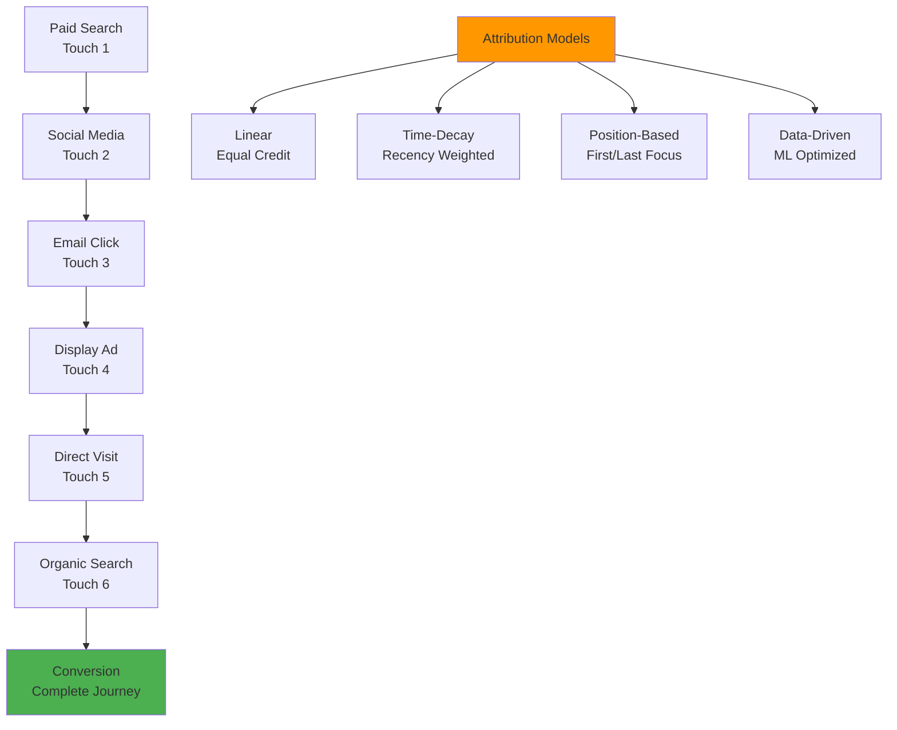

# Multi-Touch Attribution Analysis

Multi-touch attribution is a comprehensive analytical approach that evaluates the contribution of all customer touchpoints throughout the conversion journey. Unlike single-touch models that credit only one interaction, multi-touch attribution provides a holistic view of how different channels, campaigns, and touchpoints work together to drive conversions.

## Understanding Multi-Touch Attribution

Multi-touch attribution represents a paradigm shift from traditional attribution models that oversimplify the customer journey. When we researched customer behavior patterns across various industries, we discovered that modern consumers interact with brands through multiple channels and touchpoints before making purchase decisions, making multi-touch analysis essential for accurate marketing performance measurement.

The approach recognizes that customer journeys are complex, non-linear processes where each touchpoint potentially influences the final conversion. By analyzing all interactions within the attribution window, multi-touch attribution provides insights into channel synergies, optimal marketing mix, and true campaign effectiveness.

## Multi-Touch Attribution Models

When we implemented multi-touch attribution systems, we identified several distinct modeling approaches, each providing different perspectives on touchpoint contribution:

### Linear Attribution Model

Distributes conversion credit equally across all touchpoints:

- **Credit Distribution**: Each touchpoint receives equal weight (1/n of total value)
- **Use Cases**: Balanced view of customer journey, comprehensive channel analysis
- **Benefits**: Recognizes all touchpoint contributions without bias
- **Limitations**: May not reflect actual influence differences between touchpoints

### Time-Decay Attribution Model

Assigns higher credit to touchpoints closer to conversion:

- **Credit Distribution**: Exponential decay function favoring recent interactions
- **Use Cases**: Campaigns where recency matters, short sales cycles
- **Benefits**: Reflects psychological impact of recent touchpoints
- **Limitations**: May undervalue early-stage awareness activities

### Position-Based Attribution Model

Emphasizes first and last touchpoints while crediting middle interactions:

- **Credit Distribution**: 40% first, 40% last, 20% distributed among middle touches
- **Use Cases**: Balanced recognition of acquisition and conversion activities
- **Benefits**: Highlights critical first impression and closing touchpoints
- **Limitations**: Fixed distribution may not reflect actual journey dynamics

### Data-Driven Attribution Model

Uses machine learning to determine optimal credit distribution:

- **Credit Distribution**: Algorithm-determined based on actual conversion patterns
- **Use Cases**: Complex journeys with sufficient data volume
- **Benefits**: Adapts to actual customer behavior patterns
- **Limitations**: Requires substantial data and sophisticated analytics infrastructure

## Implementation Framework

### Data Collection Requirements

Comprehensive multi-touch attribution requires robust data collection across all touchpoints:

**Cross-Channel Tracking**

- Web analytics tracking across all domains and subdomains
- Mobile app interaction tracking with cross-device identification
- Offline touchpoint integration including phone calls and store visits
- Email engagement tracking with click-through attribution
- Social media interaction monitoring across platforms

**Identity Resolution**

- User identification across devices and platforms
- Cookie-based tracking with privacy compliance considerations
- Logged-in user tracking for authenticated experiences
- Probabilistic matching for anonymous user journeys
- Cross-device linking through deterministic and probabilistic methods

**Touchpoint Taxonomy**

- Standardized channel and campaign classification
- Touchpoint quality scoring and filtering
- Interaction type definition and weighting
- Conversion goal mapping and value assignment

### Technical Infrastructure

Multi-touch attribution requires sophisticated technical infrastructure:

**Data Warehousing**
- Centralized data storage for all touchpoint interactions
- Real-time data ingestion and processing capabilities
- Historical data retention for longitudinal analysis
- Scalable storage solutions for high-volume data processing

**Attribution Calculation Engine**
- Configurable attribution model implementation
- Real-time attribution score calculation and updates
- Batch processing for historical data analysis
- API integration for real-time reporting and optimization

**Reporting and Visualization**
- Multi-dimensional reporting across channels, campaigns, and touchpoints
- Journey path analysis and visualization tools
- Performance dashboards with actionable insights
- Custom reporting for different stakeholder needs

## Platform Comparisons

### Google Analytics 4 Multi-Touch Attribution

GA4 provides several multi-touch attribution models with varying capabilities. When we analyzed GA4's implementation:

**Strengths:**
- Multiple attribution models including data-driven options
- Cross-platform journey tracking including mobile and web
- Integration with Google Ads and other Google marketing platforms
- Real-time attribution updates and comprehensive reporting

**Limitations:**
- Limited customization of attribution model parameters
- Dependency on Google's data collection and processing systems
- Potential data sampling affecting accuracy in high-volume accounts
- Privacy limitations may impact cross-device tracking completeness

### Matomo Multi-Touch Attribution

Matomo offers privacy-focused multi-touch attribution with complete data ownership. Our evaluation revealed:

**Strengths:**
- Full data ownership and privacy compliance capabilities
- Customizable attribution models and parameters
- Transparent attribution methodology and calculation visibility
- Integration with custom conversion tracking and e-commerce systems

**Limitations:**
- Limited cross-device tracking compared to larger platforms
- Requires significant manual configuration and optimization
- Smaller ecosystem of integrated marketing and advertising tools
- Less sophisticated machine learning capabilities for data-driven attribution

### Adobe Analytics Multi-Touch Attribution

Adobe Analytics provides enterprise-level multi-touch attribution capabilities. When we assessed their system:

**Strengths:**
- Advanced attribution modeling with extensive customization options
- Sophisticated data processing and analysis capabilities
- Integration with Adobe's marketing cloud ecosystem
- Enterprise-grade scalability and data handling

**Limitations:**
- High implementation and maintenance complexity
- Significant cost considerations for comprehensive deployment
- Steep learning curve for effective utilization
- Requires dedicated analytics resources for optimization

## Benefits of Multi-Touch Attribution

### Comprehensive Journey Understanding

Multi-touch attribution provides complete visibility into customer journeys, revealing how different touchpoints contribute to conversions and identifying optimization opportunities across the entire marketing funnel.

### Channel Synergy Insights

The approach reveals how different marketing channels work together, enabling optimization of channel mix and identification of complementary channel strategies that drive superior performance.

### Accurate Performance Measurement

By crediting all contributing touchpoints, multi-touch attribution provides more accurate measurement of campaign and channel performance, leading to better optimization decisions and budget allocation.

### Strategic Decision Support

Comprehensive attribution insights support strategic decisions about marketing investment, channel prioritization, and campaign optimization based on actual customer behavior patterns.

## Advanced Analysis Techniques

### Journey Path Analysis

Analyze common customer journey paths to identify:

- **High-Converting Paths**: Journey sequences that consistently lead to conversions
- **Drop-Off Points**: Touchpoints where customers commonly exit the funnel
- **Optimization Opportunities**: Path modifications that could improve conversion rates
- **Channel Sequence Effects**: How touchpoint order impacts conversion likelihood

### Cohort Attribution Analysis

Segment attribution analysis by customer cohorts:

- **Acquisition Period**: Compare attribution patterns across different time periods
- **Customer Value**: Analyze journey differences between high and low-value customers
- **Geographic Segments**: Understand regional variations in customer journey patterns
- **Demographic Groups**: Identify attribution pattern differences across customer segments

### Cross-Device Journey Analysis

Examine how customers move between devices throughout their journey:

- **Device Transition Points**: Identify where customers switch between devices
- **Cross-Device Conversion Patterns**: Understand which device combinations drive conversions
- **Channel-Device Relationships**: Analyze how different channels perform on various devices
- **Optimization Strategies**: Develop device-specific marketing strategies based on journey patterns

## Implementation Best Practices

### Data Quality Management

Ensure high-quality data collection for accurate attribution:

- **Consistent Tracking**: Implement standardized tracking across all touchpoints
- **Data Validation**: Regular auditing of data collection accuracy and completeness
- **Privacy Compliance**: Maintain privacy compliance while maximizing data collection
- **Quality Filtering**: Remove bot traffic and invalid interactions from attribution calculations

### Model Selection and Testing

Choose appropriate attribution models based on business needs:

- **Business Objective Alignment**: Select models that align with specific business goals
- **Journey Complexity Consideration**: Match model sophistication to journey complexity
- **Data Volume Requirements**: Ensure sufficient data volume for chosen model type
- **Regular Model Evaluation**: Continuously test and optimize attribution model performance

### Cross-Functional Implementation

Ensure successful implementation across marketing teams:

- **Stakeholder Training**: Educate teams on attribution concepts and insights interpretation
- **Process Integration**: Integrate attribution insights into campaign planning and optimization workflows
- **Performance Alignment**: Align team incentives with multi-touch attribution insights
- **Continuous Improvement**: Establish regular review and optimization processes

--8<-- "snippets/ai.md"

## Get Started with Multi-Touch Attribution

Ready to unlock comprehensive customer journey insights? [Start your free trial](https://stats.uptrace.dev/pricing) with Uptrace and discover how multi-touch attribution can reveal the true impact of all your marketing touchpoints, enabling data-driven optimization across your entire customer acquisition and conversion strategy.