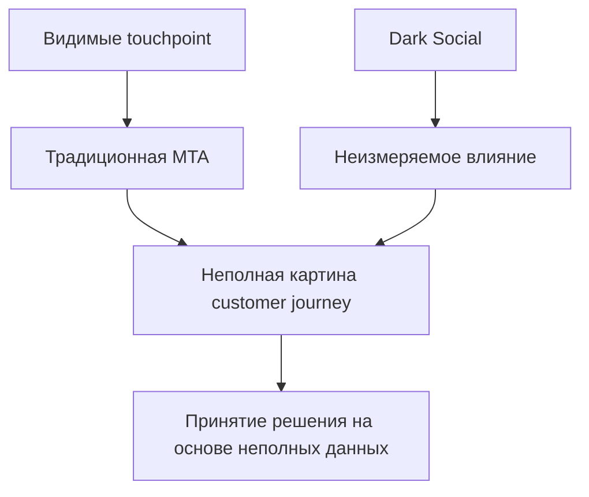

# Мультитач атрибуция: полное руководство по анализу точек взаимодействия

Современный путь покупателя редко представляет собой прямую линию от знакомства с брендом до конверсии. Пользователи взаимодействуют с множеством каналов — видят рекламу в социальных сетях, кликают по поисковой выдаче, открывают email-рассылки, посещают сайт с разных устройств — прежде чем принять решение о покупке. Мультитач атрибуция (Multi-Touch Attribution, MTA) решает задачу справедливого распределения заслуг между всеми этими точками взаимодействия.

## Что такое мультитач атрибуция

Мультитач атрибуция — это метод измерения эффективности маркетинга, который анализирует влияние каждой точки взаимодействия пользователя с брендом на пути к конверсии. В отличие от моделей единичного касания (first-touch или last-touch), MTA распределяет ценность конверсии между несколькими каналами, предоставляя более полную картину customer journey.

!!! info "Пример мультитач атрибуции"
    Пользователь ищет кроссовки в поисковой системе → видит рекламу в Instagram → получает email с промокодом → совершает покупку через ретаргетинговую рекламу. MTA позволяет оценить вклад каждого канала в итоговую конверсию, например: поиск — 30%, Instagram — 20%, email — 25%, ретаргетинг — 25%.

По данным исследования MMA Global за 2023 год, 50% компаний используют мультитач атрибуцию как часть своей маркетинговой стратегии. При этом 60% маркетинг-директоров признают сложности в измерении ROI по цифровым каналам, что приводит к неэффективному распределению бюджета.

## Основные модели мультитач атрибуции

Выбор модели атрибуции зависит от специфики бизнеса, длины цикла продаж и характера взаимодействия с клиентами. Рассмотрим наиболее распространенные подходы.

### Линейная атрибуция (Linear Attribution)

Самая простая модель MTA, которая присваивает равный вес всем точкам взаимодействия в пути покупателя.

**Характеристики:**

- Равномерное распределение заслуг между всеми touchpoint'ами
- Подходит для коротких циклов продаж
- Легка в понимании и реализации

!!! tip "Когда использовать линейную модель"
    Линейная атрибуция эффективна для e-commerce с простыми воронками продаж, где все каналы играют примерно равную роль в принятии решения о покупке.

### Атрибуция с временным затуханием (Time Decay)

Модель присваивает больший вес точкам взаимодействия, которые происходили ближе к моменту конверсии.

**Принцип работы:**

- Наибольший вес получают последние touchpoint'ы
- Учитывает естественное снижение влияния со временем
- Подходит для импульсивных покупок

### U-образная атрибуция (Position-Based)

Модель отдает больше заслуг первому и последнему взаимодействию, распределяя оставшийся вес между промежуточными точками.

=== "Стандартная U-модель"
    - Первое касание: 40%
    - Последнее касание: 40% 
    - Промежуточные касания: 20%

=== "Модифицированная U-модель"
    - Первое касание: 30%
    - Последнее касание: 30%
    - Промежуточные касания: 40%

### W-образная атрибуция

Развитие U-модели, которая дополнительно выделяет момент создания лида.

**Распределение весов:**

- Первое касание: 30%
- Создание лида: 30%
- Последнее касание: 30%
- Остальные касания: 10%

### Полнопутевая атрибуция (Full Path)

Учитывает все этапы воронки продаж от первого знакомства до закрытия сделки.

**Ключевые этапы:**

1. **Первое касание** — знакомство с брендом
2. **Создание лида** — проявление интереса  
3. **Создание возможности** — квалификация лида
4. **Конверсия** — закрытие сделки

!!! note "Применение полнопутевой модели"
    Полнопутевая атрибуция особенно эффективна для B2B-компаний с длинными циклами продаж и множественными точками принятия решений.

### Data-Driven атрибуция

Наиболее продвинутая модель, использующая машинное обучение для определения влияния каждой точки взаимодействия.

**Преимущества:**

- Автоматическая оптимизация весов на основе данных
- Учет уникальных паттернов поведения клиентов
- Адаптация к изменениям в customer journey

**Ограничения:**

- Требует большие объемы данных
- Сложность в понимании логики присвоения весов
- Высокие технические требования к реализации

## Вызовы реализации мультитач атрибуции

Несмотря на очевидные преимущества, внедрение MTA сопряжено с рядом значительных сложностей, особенно в условиях растущих требований к приватности данных.

### Технические сложности

**Кросс-девайс трекинг**

Пользователи переключаются между устройствами в процессе принятия решения о покупке. Связывание активности с разных устройств требует сложных систем идентификации пользователей.

**Интеграция данных**

- Разные стандарты данных между платформами
- Несовместимые форматы трекинга
- Задержки в передаче данных между системами

**Офлайн взаимодействия**

MTA изначально ориентирована на цифровые каналы, что создает слепые зоны для:

- TV и радиореклама
- Печатные материалы
- Событийный маркетинг
- Word-of-mouth рекомендации

### Приватность и регулирование

Современные требования к приватности кардинально меняют ландшафт атрибуции.

!!! warning "Влияние privacy-регулирования"
    GDPR, CCPA, iOS 17 App Tracking Transparency и отказ от third-party cookies создают существенные ограничения для традиционных методов трекинга. Многие пользователи активно отказываются от отслеживания, что приводит к неполным данным о customer journey.

**Основные ограничения:**

- Требование согласия пользователя на трекинг
- Блокировщики рекламы и антитрекинг технологии  
- Ограничения на сбор персональных данных
- Санкции за нарушение privacy-законодательства

### "Темная социальность" (Dark Social)

Концепция, введенная экспертами индустрии, описывает неизмеримые точки влияния на решение о покупке:

- Обсуждения в частных чатах и мессенджерах
- Рекомендации в подкастах
- Упоминания в корпоративных Slack-каналах
- Офлайн-разговоры и рекомендации

## Преимущества мультитач атрибуции

### Оптимизация бюджетного распределения

MTA раскрывает реальный вклад каждого канала в конверсии, позволяя:

- Увеличить инвестиции в недооцененные каналы
- Сократить расходы на переоцененные источники трафика
- Сбалансировать upper-funnel и lower-funnel активности

!!! success "Результат правильной атрибуции"
    Компании, внедрившие MTA, сообщают об увеличении маркетинговой эффективности на 15-30% благодаря более точному пониманию влияния каналов на конверсии.

### Понимание синергии каналов

Мультитач атрибуция выявляет, как разные каналы усиливают друг друга:

- Поисковая реклама может увеличивать эффективность email-маркетинга
- Социальные сети повышают узнаваемость бренда для органического поиска
- Ретаргетинг конвертирует аудиторию, привлеченную контент-маркетингом

### Улучшение ROI измерений

Традиционные модели последнего клика часто приводят к искаженной картине:

- Переоценка performance-каналов (контекстная реклама, ретаргетинг)
- Недооценка awareness-каналов (display, социальные сети)
- Двойной подсчет конверсий разными платформами

MTA предоставляет более справедливое распределение заслуг между каналами.

## Внедрение мультитач атрибуции: пошаговое руководство

### 1. Выбор модели атрибуции

Определение подходящей модели зависит от нескольких факторов:

**Для коротких циклов продаж (до 7 дней):**

- Линейная модель
- Time Decay с коротким окном

**Для средних циклов (7-30 дней):**

- U-образная модель
- W-образная для B2B

**For длинных циклов (30+ дней):**

- Full Path модель
- Data-Driven (при наличии достаточных данных)

### 2. Техническая подготовка

**Настройка трекинга:**

1. **Унифицированные UTM-параметры** для всех каналов
2. **Кросс-доменный трекинг** для связанных сайтов
3. **Server-side трекинг** для повышения надежности данных
4. **First-party data** стратегии для снижения зависимости от cookies

**Интеграция систем:**

- CRM интеграция для B2B attribution
- E-commerce платформы для транзакционных данных
- Email-платформы и marketing automation
- Рекламные кабинеты (Google Ads, Facebook Ads, etc.)

### 3. Настройка сбора данных

!!! tip "Критические параметры для сбора"
    
    **Обязательные поля:**
    
    - User ID / Client ID для связывания сессий
    - Timestamp для каждого взаимодействия
    - Source/Medium/Campaign для идентификации каналов
    - Conversion value и conversion type
    
    **Дополнительные параметры:**
    
    - Device type и operating system
    - Geographic location
    - Customer segment или cohort
    - Creative variant для A/B тестирования

### 4. Анализ и оптимизация

**Мониторинг ключевых метрик:**

- **Attribution lift** — изменение в понимании каналов
- **Model stability** — консистентность результатов во времени
- **Data completeness** — процент tracked vs untracked конверсий

**Итеративное улучшение:**

1. Начните с простой модели (Linear)
2. Сравните результаты с single-touch моделями
3. Постепенно переходите к более сложным моделям
4. Валидируйте результаты через incrementality testing

## Альтернативы и дополнения к MTA

### Marketing Mix Modeling (MMM)

MMM анализирует агрегированные данные вместо пользовательского уровня, что делает его более устойчивым к privacy-ограничениям:

**Преимущества MMM:**

- Учет макроэкономических факторов
- Включение офлайн-каналов
- Соответствие требованиям приватности
- Долгосрочная perspective

**Ограничения MMM:**

- Меньшая гранулярность данных
- Задержка в получении инсайтов
- Сложность настройки для малых объемов данных

### Unified Measurement

Наиболее эффективный подход сочетает MTA и MMM:

=== "Краткосрочная оптимизация"
    **MTA обеспечивает:**
    
    - Тактические инсайты по каналам
    - Быструю оптимизацию кампаний
    - Персонализацию user experience

=== "Долгосрочное планирование"
    **MMM предоставляет:**
    
    - Стратегическое бюджетное планирование
    - Понимание brand awareness влияния
    - Сезонные и внешние факторы

### Incrementality Testing

Каузальные методы измерения дополняют attribution modeling:

- **Geo-based tests** для локальных кампаний
- **Time-based holdouts** для digital каналов
- **Synthetic control groups** для complex environments

## Тренды и будущее мультитач атрибуции

### Адаптация к privacy-first миру

**Emerging technologies:**

- **Privacy Sandbox** от Google для web environments  
- **Server-side tracking** с first-party data
- **Cohort-based analysis** вместо individual tracking
- **Contextual targeting** как альтернатива behavioral data

### AI и машинное обучение

Рынок MTA оценивается в $2.43 миллиарда в 2025 году с прогнозируемым ростом до $4.61 миллиарда к 2030 году (CAGR 13.66%). Драйверы роста включают:

- **Algorithmic models** с 14.3% CAGR
- **Real-time attribution** возможности  
- **Predictive analytics** интеграция
- **Cross-platform identity resolution**

### Интеграция с Customer Data Platforms

Современные CDP становятся центральными хабами для attribution:

- Unified customer profiles across channels
- Real-time data activation capabilities  
- Advanced audience segmentation
- Privacy-compliant data management

!!! note "Развитие рынка решений"
    Крупные технологические платформы интегрируют AI-driven attribution в свои продукты. Adobe увеличила выручку от Digital Experience до $1.46 миллиарда во втором квартале 2025 года благодаря AI-powered Mix Modeler. DoubleVerify приобрела Rockerbox за $85 миллионов в феврале 2025 года, объединив измерение результативности с верификацией.

## Практические рекомендации по выбору решения

### Для малого и среднего бизнеса

**Рекомендуемый подход:**

1. Начните с Google Analytics 4 enhanced conversions
2. Внедрите consistent UTM tracking
3. Используйте linear или time decay модели
4. Дополните простыми incrementality тестами

### Для enterprise компаний

**Комплексная стратегия:**

- **Unified measurement platform** (MTA + MMM)
- **Custom data-driven models** для уникальных business моделей
- **Advanced identity resolution** через CDP
- **Real-time attribution** для dynamic optimization

### Отраслевые особенности

=== "E-commerce"
    
    **Фокус на:**
    
    - Last-click vs assisted conversions анализ
    - Product-level attribution для cross-sell оптимизации  
    - Mobile vs desktop customer journey различия
    - Seasonal adjustment в attribution моделях

=== "B2B SaaS"
    
    **Ключевые аспекты:**
    
    - Multi-touch influence на MQL → SQL conversion
    - Account-based attribution для enterprise deals
    - Content touchpoints влияние на sales cycle
    - Free trial → paid conversion attribution

=== "Financial Services"
    
    **Специальные требования:**
    
    - Compliance с financial regulations
    - High-value transaction attribution accuracy
    - Branch visit integration с digital touchpoints
    - Risk-based customer segmentation в attribution

---
--8<-- "snippets/ai.ru.md"

!!! success "Готовы оптимизировать свою маркетинговую аналитику?"
    Наше решение для веб-аналитики предоставляет комплексные возможности для измерения эффективности всех каналов привлечения. Получите детальное понимание customer journey и оптимизируйте распределение маркетингового бюджета. Зарегистрируйтесь для бесплатного тестирования и убедитесь в превосходстве нашего подхода к атрибуции.