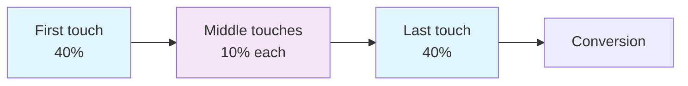

# Position-Based (U-Shaped) Attribution Model: Credit Distribution Between First and Last Touch

The Position-Based (U-Shaped) attribution model represents a balanced approach to evaluating the contribution of various marketing touchpoints to conversions. In this model, the first and last customer interactions with the brand receive the highest credit, typically 40% each. The remaining 20% is evenly distributed among intermediate touchpoints.

This model is called U-shaped because of the visual distribution of attribution weight, which concentrates at the beginning and end of the customer journey, forming a characteristic U-shape on the graph.

## How Position-Based Attribution Works

The Position-Based model is based on understanding that lead generation and conversion, the first and last touchpoints, are the most influential activities in the customer journey. It recognizes the importance of both initial brand introduction and the final action leading to conversion.

### Standard Credit Distribution



!!! example "Practical Attribution Example"
    
    **Customer John's Journey:**
    
    1. **Email campaign** (first touch) → 40% credit
    2. **LinkedIn post** (middle touch) → 10% credit  
    3. **Google Ads** (middle touch) → 10% credit
    4. **Promo code in email** (last touch) → 40% credit
    
    **Total:** 100% conversion distributed among all touches

### Proportion Configuration

If the base model is Position Based, you can configure what percentage of credit goes to the first interaction and last interaction, as well as what gets distributed to the middle interactions. The total must be 100%.

=== "Standard Distribution"

    - **First touch:** 40%
    - **Last touch:** 40%
    - **Middle touches:** 20% equally

=== "Conservative Distribution"

    - **First touch:** 30%
    - **Last touch:** 50%
    - **Middle touches:** 20% equally

=== "Balanced Distribution"

    - **First touch:** 35%
    - **Last touch:** 35%
    - **Middle touches:** 30% equally

## Comparison with Other Attribution Models

The Position-Based model occupies a middle ground between extreme single-touch models and even linear attribution.

| Model | First Touch | Middle Touches | Last Touch | Features |
|--------|-------------|----------------|------------|----------|
| **First-Touch** | 100% | 0% | 0% | Focus on acquisition |
| **Last-Touch** | 0% | 0% | 100% | Focus on conversion |
| **Linear** | 25% | 25% each | 25% | Even distribution |
| **Position-Based** | 40% | 20% equally | 40% | Balance acquisition and conversion |
| **Time-Decay** | 10% | Increases toward end | 40% | Greater weight to recent touches |

!!! info "Comparison with Time-Decay Model"
    
    Time decay attribution is another type of multi-touch attribution model. It assigns more credit to touchpoints that occur closer to the sale and less credit to touchpoints that occur further away.
    
    **Key difference:** Time-Decay focuses on channels leading to conversion, while U-Shaped emphasizes both conversion and initial brand interaction.

## U-Shaped Model Advantages

### Recognition of Acquisition and Conversion Importance

The model recognizes the importance of both lead generation and conversion, while considering the significance of intermediate interactions without treating them as equal contributors. This provides a more accurate representation of how marketing channels work together throughout the entire customer journey.

### Balance Between Extremes

The Position-Based model eliminates the disadvantages of single-touch attribution:

- **First touch** receives deserved recognition for initiating the customer journey
- **Last touch** is considered as the decisive conversion factor
- **Middle touches** are not completely ignored but are not overvalued

### Simplicity of Understanding and Implementation

Although the Position-Based attribution model offers a more balanced view of the customer journey, it has some limitations to consider. Complexity: More complex to implement and analyze compared to simple models such as Last-Click or First-Click attribution.

!!! tip "Implementation Best Practices"
    
    **For successful Position-Based model implementation:**
    
    **Set up comprehensive analytics**
    
       - Use advanced analytics tools for accurate tracking of all interactions
       - Ensure data visualization for understanding attribution
    
    **Integrate all channels**
    
       - The model should combine data from all marketing channels
       - Include both online and offline interactions
    
    **Focus on high-impact interactions**
    
       - Identify key touches that significantly influence conversions
       - Prioritize first and last interactions

## U-Shaped Model Limitations

### Oversimplification of Customer Journey Complexity

Another limitation is that the U-shaped model can oversimplify the conversion path. Since it focuses only on the top and bottom of the funnel, it may not provide a complete picture of the customer journey.

### Undervaluation of Middle Touches

The model may not account for the impact of middle touches, such as social media or SEO, on lead generation, despite these channels being critical for long-term success.

### Ineffectiveness for Short Journeys

May be less effective for short customer journeys with fewer interactions, where other models such as Last-Click might provide clearer insights.

!!! warning "When to Avoid U-Shaped Model"
    
    **The model is not suitable for:**
    
    - Companies with high-value products and long sales cycles
    - Businesses where customer nurturing plays a critical role
    - Cases where middle touches have proven high impact on conversions

## Ideal Application Scenarios

### E-commerce and Low-Value Goods

The U-shaped attribution model is particularly useful in scenarios where lead generation and conversion are the primary objectives, such as: E-commerce: for online stores, understanding the role of various touchpoints, from the initial ad click to the final purchase, is crucial.

### SaaS and Subscription Services

Software as a Service (SaaS): businesses offering subscription-based services must carefully assess the customer journey. Identifying key touchpoints can help refine marketing strategies for customer retention.

### Omnichannel Marketing

For businesses running integrated marketing campaigns across multiple channels (e.g., social media, email, PPC, content marketing), the Position-Based model helps attribute value to different channels.

!!! success "Application Example"
    
    **Integrated Campaign:**
    - Starts with social media advertising (40% credit)
    - Continues with email nurturing (20% credit distributed)
    - Ends with direct website purchase (40% credit)

## Position-Based Model Customization

### Weight Coefficient Configuration

Modern analytics platforms allow customizing credit distribution according to business specifics:

=== "Conservative B2B Approach"

    ```
    First touch: 30%
    Last touch: 50%
    Middle touches: 20%
    ```
    
    Suitable for long sales cycles where last touch is critical

=== "Aggressive B2C Approach"

    ```
    First touch: 50%
    Last touch: 30%
    Middle touches: 20%
    ```
    
    Focus on acquiring new customers in competitive environment

=== "Balanced Approach"

    ```
    First touch: 35%
    Last touch: 35%
    Middle touches: 30%
    ```
    
    Equal attention to acquisition and conversion

### Advanced Settings

Custom credit rules provide the greatest flexibility in applying attribution credit. For example:

- **Position rules:** reducing credit for certain positions in the path
- **Channel rules:** increasing weight for priority channels
- **Time rules:** accounting for time between touches

## Technical Implementation Aspects

### Data Requirements

For effective Position-Based model operation, the following is necessary:

**Complete customer journey tracking**

   - Unique user identification
   - Data collection from all channels
   - Cross-device tracking

**Quality touchpoint data**

   - Accurate timestamps
   - Traffic source information
   - Conversion event data

**Analytics system integration**

   - CRM integration
   - Marketing automation platforms
   - Business intelligence tools

### Modern Implementation Challenges

!!! note "Privacy and Tracking Limitations"
    
    **Modern challenges:**
    
    - **Cookie blocking:** 30-40% of users use blockers
    - **Browser restrictions:** Safari ITP limits cookie lifespan
    - **Privacy regulation:** GDPR and similar requirements
    - **Cross-device identification:** complexity of tracking a unified user

## Model Alternatives and Evolution

### W-Shaped Attribution

An extended version of the U-Shaped model that gives credit to the first and last touchpoints in the buyer's journey and also values touchpoints that occur in the middle of the buyer's journey.

### Data-Driven Attribution

Uses machine learning to determine the actual contribution of each channel, gradually replacing rule-based models in large organizations.

### Custom Attribution

Custom attribution allows marketers to assign credit to touchpoints based on their own insights and goals. This model is the most flexible but can also be the most complex to implement.

## Effectiveness Measurement

### Key Metrics

When using the Position-Based model, it's important to track:

| Metric | Description | Purpose |
|--------|-------------|---------|
| **Attribution ROI** | Return on investment considering attribution | Overall effectiveness assessment |
| **Channel Contribution** | Each channel's contribution to conversions | Budget optimization |
| **First-Touch Volume** | Volume of first touches by channels | Acquisition effectiveness |
| **Last-Touch Quality** | Quality of last touches | Conversion capability |

### A/B Testing Models

!!! tip "Attribution Model Comparison"
    
    **Optimization process:**
    
    1. **Parallel application** of multiple models to the same data
    2. **Difference analysis** in channel evaluation
    3. **Result validation** using incrementality tests
    4. **Optimal model selection** for specific business

## Future of Position-Based Attribution

### Adaptation to Cookieless World

With the departure of third-party cookies, the industry is developing new approaches:

- **First-party data strategies**
- **Server-side tracking**
- **Privacy-preserving technologies**
- **Cohort-based analysis**

### Integration with AI and ML

Modern platforms are implementing machine learning for dynamic Position-Based model weight adjustment based on:

- Historical conversion data
- Seasonal behavior patterns
- Customer journey changes
- Real-time channel effectiveness

Our web analytics platform provides flexible Position-Based attribution configuration with the ability to customize weight coefficients for each business's specifics. We are working on implementing privacy-compliant solutions for accurate customer journey tracking in an era of heightened data privacy requirements.

We plan to implement functionality for automatic attribution weight optimization based on machine learning, which will achieve maximum accuracy in evaluating each marketing touchpoint's contribution to conversions.

---

--8<-- "snippets/ai.md"

!!! success "Ready to implement Position-Based attribution?"
    
    Register for free testing of our platform and get access to flexible attribution model settings, including customizable Position-Based attribution, detailed customer journey analytics, and tools for optimizing marketing budgets based on the real contribution of each channel.