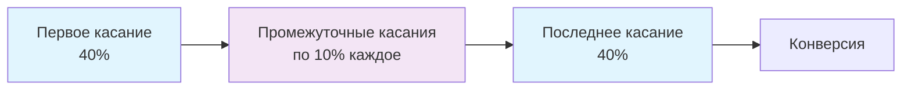

# Position-Based (U-Shaped) модель атрибуции: распределение ценности между первым и последним касанием

Position-Based (U-Shaped) модель атрибуции представляет собой сбалансированный подход к оценке вклада различных маркетинговых касаний в конверсии. В этой модели первое и последнее взаимодействие клиента с брендом получают наибольший кредит, обычно по 40% каждое. Оставшиеся 20% равномерно распределяются между промежуточными точками касания.

Эта модель получила название U-образной из-за визуального распределения атрибуционного веса, который концентрируется в начале и в конце пути клиента, образуя характерную U-форму на графике.

## Принцип работы Position-Based атрибуции

Position-Based модель основана на понимании, что привлечение лидов и конверсия, первая и последняя точки касания, являются наиболее влиятельными активностями в пути клиента. Она признаёт важность как начального знакомства с брендом, так и финального действия, приводящего к конверсии.

### Стандартное распределение кредита



!!! example "Практический пример атрибуции"
    
    **Путь клиента John:**
    
    1. **Email-кампания** (первое касание) → 40% кредита
    2. **LinkedIn-пост** (промежуточное касание) → 10% кредита  
    3. **Google Ads** (промежуточное касание) → 10% кредита
    4. **Промо-код в email** (последнее касание) → 40% кредита
    
    **Итого:** 100% конверсии распределено между всеми касаниями

### Настройка пропорций

Если базовая модель — Position Based, можно настроить, какой процент кредита получает первое взаимодействие и последнее взаимодействие, а также что распределяется между промежуточными взаимодействиями. Общая сумма должна составлять 100%.

=== "Стандартное распределение"

    - **Первое касание:** 40%
    - **Последнее касание:** 40%
    - **Промежуточные касания:** 20% поровну

=== "Консервативное распределение"

    - **Первое касание:** 30%
    - **Последнее касание:** 50%
    - **Промежуточные касания:** 20% поровну

=== "Сбалансированное распределение"

    - **Первое касание:** 35%
    - **Последнее касание:** 35%
    - **Промежуточные касания:** 30% поровну

## Сравнение с другими моделями атрибуции

Position-Based модель занимает промежуточное положение между экстремальными single-touch моделями и равномерной linear атрибуцией.

| Модель | Первое касание | Промежуточные | Последнее касание | Особенности |
|--------|---------------|---------------|------------------|-------------|
| **First-Touch** | 100% | 0% | 0% | Фокус на привлечении |
| **Last-Touch** | 0% | 0% | 100% | Фокус на конверсии |
| **Linear** | 25% | 25% каждое | 25% | Равномерное распределение |
| **Position-Based** | 40% | 20% поровну | 40% | Баланс привлечения и конверсии |
| **Time-Decay** | 10% | Возрастает к концу | 40% | Больший вес недавним касаниям |

!!! info "Сравнение с Time-Decay моделью"
    
    Time decay атрибуция — это другой тип мультикасательной модели атрибуции. Она присваивает больше кредита точкам касания, которые происходят ближе к продаже, и меньше кредита точкам касания, которые происходят дальше. 
    
    **Основное различие:** Time-Decay фокусируется на каналах, ведущих к конверсии, в то время как U-Shaped делает акцент как на конверсии, так и на первоначальном взаимодействии с брендом.

## Преимущества U-Shaped модели

### Признание важности привлечения и конверсии

Модель признаёт важность как привлечения лидов, так и конверсии, при этом учитывает значимость промежуточных взаимодействий, не относясь к ним как к равным участникам. Это даёт более точное представление о том, как маркетинговые каналы работают вместе на протяжении всего пути клиента.

### Баланс между крайностями

Position-Based модель устраняет недостатки single-touch атрибуции:

- **Первое касание** получает заслуженное признание за инициацию customer journey
- **Последнее касание** учитывается как решающий фактор конверсии
- **Промежуточные касания** не игнорируются полностью, но и не переоцениваются

### Простота понимания и внедрения

Хотя Position-Based модель атрибуции предлагает более сбалансированный взгляд на путь клиента, она имеет некоторые ограничения для рассмотрения. Сложность: Более сложна в реализации и анализе по сравнению с простыми моделями, такими как Last-Click или First-Click атрибуция.

!!! tip "Лучшие практики внедрения"
    
    **Для успешной реализации Position-Based модели:**
    
    **Настройте комплексную аналитику**
    
       - Используйте передовые инструменты аналитики для точного отслеживания всех взаимодействий
       - Обеспечьте визуализацию данных для понимания атрибуции
    
    **Интегрируйте все каналы**
    
       - Модель должна объединять данные со всех маркетинговых каналов
       - Включайте как онлайн, так и оффлайн взаимодействия
    
    **Фокусируйтесь на высокоэффективных взаимодействиях**
    
       - Определите ключевые касания, существенно влияющие на конверсии
       - Приоритизируйте первые и последние взаимодействия

## Ограничения U-Shaped модели

### Упрощение сложности путей клиентов

Ещё одно ограничение заключается в том, что U-образная модель может чрезмерно упрощать путь к конверсии. Поскольку она фокусируется только на верхней и нижней части воронки, она может не обеспечить полную картину пути клиента.

### Недооценка промежуточных касаний

Модель может не учитывать влияние промежуточных касаний, таких как социальные медиа или SEO, на генерацию лидов, несмотря на то что эти каналы критичны для долгосрочного успеха.

### Неэффективность для коротких путей

Может быть менее эффективной для коротких путей клиентов с меньшим количеством взаимодействий, где другие модели, такие как Last-Click, могут предоставить более ясные инсайты.

!!! warning "Когда избегать U-Shaped модели"
    
    **Модель не подходит для:**
    
    - Компаний с продуктами высокой стоимости и длинными циклами продаж
    - Бизнесов, где customer nurturing играет критическую роль
    - Случаев, когда промежуточные касания имеют доказанное высокое влияние на конверсии

## Идеальные сценарии применения

### E-commerce и товары низкой стоимости

U-образная модель атрибуции особенно полезна в сценариях, где генерация лидов и конверсия являются основными целями, таких как: E-commerce: для онлайн-магазинов понимание роли различных точек касания, от первоначального клика по рекламе до финальной покупки, имеет решающее значение.

### SaaS и подписочные сервисы

Software as a Service (SaaS): бизнесы, предлагающие подписочные сервисы, должны тщательно оценивать путь клиента. Определение ключевых точек касания может помочь усовершенствовать маркетинговые стратегии для удержания клиентов.

### Omnichannel маркетинг

Для бизнесов, ведущих интегрированные маркетинговые кампании через множество каналов (например, социальные медиа, email, PPC, контент-маркетинг), Position-Based модель помогает атрибутировать ценность различным каналам.

!!! success "Пример применения"
    
    **Интегрированная кампания:**
    - Начинается с рекламы в социальных медиа (40% кредита)
    - Продолжается email-воспитанием (20% кредита распределены)
    - Завершается прямой покупкой с сайта (40% кредита)

## Кастомизация Position-Based модели

### Настройка весовых коэффициентов

Современные платформы аналитики позволяют настраивать распределение кредита в соответствии с особенностями бизнеса:

=== "Консервативный B2B подход"

    ```
    Первое касание: 30%
    Последнее касание: 50%
    Промежуточные: 20%
    ```
    
    Подходит для длинных циклов продаж, где последнее касание критично

=== "Агрессивный B2C подход"

    ```
    Первое касание: 50%
    Последнее касание: 30%
    Промежуточные: 20%
    ```
    
    Фокус на привлечении новых клиентов в конкурентной среде

=== "Сбалансированный подход"

    ```
    Первое касание: 35%
    Последнее касание: 35%
    Промежуточные: 30%
    ```
    
    Равное внимание к привлечению и конверсии

### Продвинутые настройки

Кастомные правила кредита дают наибольшую гибкость в применении атрибуционного кредита. Например:

- **Позиционные правила:** снижение кредита для определённых позиций в пути
- **Канальные правила:** увеличение веса для приоритетных каналов
- **Временные правила:** учёт времени между касаниями

## Технические аспекты реализации

### Требования к данным

Для эффективной работы Position-Based модели необходимо:

**Полное отслеживание пути клиента**

   - Уникальная идентификация пользователей
   - Сбор данных со всех каналов
   - Кросс-устройственное отслеживание

**Качественные данные о касаниях**

   - Точные временные метки
   - Информация об источниках трафика
   - Данные о конверсионных событиях

**Интеграция с системами аналитики**

   - CRM интеграция
   - Marketing automation платформы
   - Business intelligence инструменты

### Вызовы современной реализации

!!! note "Privacy и tracking ограничения"
    
    **Современные вызовы:**
    
    - **Cookie блокировка:** 30-40% пользователей используют блокировщики
    - **Браузерные ограничения:** Safari ITP ограничивает срок жизни cookies
    - **Регулирование privacy:** GDPR и аналогичные требования
    - **Cross-device идентификация:** сложность отслеживания единого пользователя

## Альтернативы и развитие модели

### W-Shaped атрибуция

Расширенная версия U-Shaped модели, которая даёт кредит первой и последней точкам касания в пути покупателя, а также придаёт ценность точкам касания, которые происходят в середине пути покупателя.

### Data-Driven атрибуция

Использует машинное обучение для определения реального вклада каждого канала, постепенно замещая rule-based модели в крупных организациях.

### Custom атрибуция

Кастомная атрибуция позволяет маркетологам присваивать кредит точкам касания на основе их собственных инсайтов и целей. Эта модель наиболее гибкая, но также может быть наиболее сложной в реализации.

## Измерение эффективности

### Ключевые метрики

При использовании Position-Based модели важно отслеживать:

| Метрика | Описание | Цель |
|---------|----------|------|
| **Attribution ROI** | Возврат инвестиций с учётом атрибуции | Оценка общей эффективности |
| **Channel Contribution** | Вклад каждого канала в конверсии | Оптимизация бюджета |
| **First-Touch Volume** | Объём первых касаний по каналам | Эффективность привлечения |
| **Last-Touch Quality** | Качество последних касаний | Конверсионная способность |

### A/B тестирование моделей

!!! tip "Сравнение моделей атрибуции"
    
    **Процесс оптимизации:**
    
    1. **Параллельное применение** нескольких моделей к одним данным
    2. **Анализ различий** в оценке каналов
    3. **Валидация результатов** с помощью incrementality тестов
    4. **Выбор оптимальной модели** для конкретного бизнеса

## Будущее Position-Based атрибуции

### Адаптация к cookieless миру

С уходом third-party cookies индустрия разрабатывает новые подходы:

- **First-party data стратегии**
- **Server-side отслеживание**  
- **Privacy-preserving технологии**
- **Cohort-based анализ**

### Интеграция с AI и ML

Современные платформы внедряют машинное обучение для динамической настройки весов Position-Based модели на основе:

- Исторических данных конверсий
- Сезонных паттернов поведения
- Изменений в customer journey
- Эффективности каналов в реальном времени

Наша платформа веб-аналитики предусматривает гибкую настройку Position-Based атрибуции с возможностью кастомизации весовых коэффициентов под специфику каждого бизнеса. Мы работаем над внедрением privacy-compliant решений для точного отслеживания customer journey в эпоху повышенных требований к приватности данных.

Планируется реализация функциональности для автоматической оптимизации атрибуционных весов на основе машинного обучения, что позволит достигать максимальной точности в оценке вклада каждого маркетингового касания в конверсии.

---

--8<-- "snippets/ai.ru.md"

!!! success "Готовы внедрить Position-Based атрибуцию?"
    
    Зарегистрируйтесь для бесплатного тестирования нашей платформы и получите доступ к гибким настройкам атрибуционных моделей, включая кастомизируемую Position-Based атрибуцию, детальную аналитику customer journey и инструменты для оптимизации маркетинговых бюджетов на основе реального вклада каждого канала.