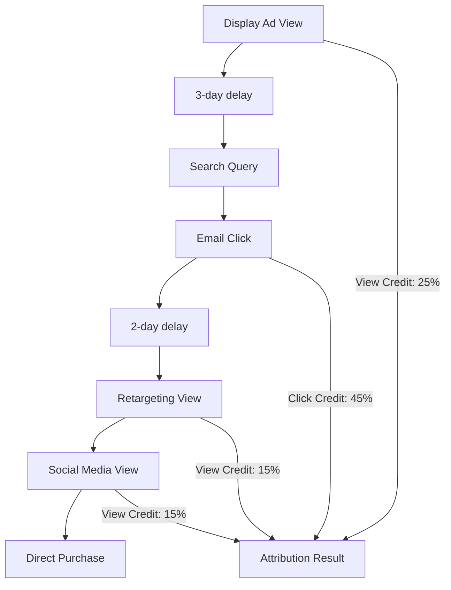

# Post-View Post-Click Attribution: Delayed Conversion Analysis

**Post-View Post-Click Attribution** measures conversions that occur after users have been exposed to advertising content, accounting for both immediate click responses and delayed decision-making behaviors. This comprehensive attribution approach recognizes that customer journeys often involve extended consideration periods, multiple touchpoint exposures, and complex decision-making processes that traditional single-interaction models fail to capture.

## Understanding Post-View Post-Click Attribution

### Dual Attribution Framework

Post-view post-click attribution operates on the principle that both passive exposure and active engagement contribute to conversion outcomes:

**Attribution components:**
- **Post-view conversions**: Actions taken after seeing but not clicking advertisements
- **Post-click conversions**: Actions taken after directly clicking advertisements
- **Combined influence measurement**: Understanding cumulative advertising impact
- **Extended attribution windows**: Capturing delayed decision-making behaviors

**Practical example:**

Customer journey: `Display Ad View → 3 days → Email Click → 2 days → Social Ad View → 1 day → Direct Purchase`

**Post-view post-click attribution result:**
- Display Ad View: 30% credit (initial exposure influence)
- Email Click: 50% credit (active engagement)
- Social Ad View: 20% credit (final reinforcement)
- Total attribution: 100% across multiple touchpoints

### Technical Implementation

**Comprehensive tracking infrastructure:**

```javascript
// Post-view post-click attribution system
class PostViewPostClickAttribution {
    constructor() {
        this.viewEvents = [];
        this.clickEvents = [];
        this.viewWindow = 30; // days
        this.clickWindow = 30; // days
    }
    
    trackAdView(userId, viewData) {
        const impression = {
            user_id: userId,
            timestamp: Date.now(),
            campaign_id: viewData.campaign_id,
            creative_id: viewData.creative_id,
            placement: viewData.placement,
            source: viewData.source,
            medium: 'display',
            interaction_type: 'view'
        };
        
        this.storeInteraction(impression);
        return impression;
    }
    
    trackAdClick(userId, clickData) {
        const click = {
            user_id: userId,
            timestamp: Date.now(),
            campaign_id: clickData.campaign_id,
            creative_id: clickData.creative_id,
            source: clickData.source,
            medium: clickData.medium,
            interaction_type: 'click',
            click_id: this.generateClickId()
        };
        
        this.storeInteraction(click);
        return click;
    }
    
    attributeConversion(userId, conversionData) {
        const viewInteractions = this.getViewsInWindow(userId);
        const clickInteractions = this.getClicksInWindow(userId);
        
        return this.calculateCombinedAttribution(
            viewInteractions,
            clickInteractions,
            conversionData
        );
    }
    
    calculateCombinedAttribution(views, clicks, conversion) {
        const allInteractions = [...views, ...clicks]
            .sort((a, b) => a.timestamp - b.timestamp);
        
        const attribution = {
            total_value: conversion.value,
            attributed_interactions: [],
            view_contribution: 0,
            click_contribution: 0
        };
        
        // Apply time-decay and interaction-type weighting
        allInteractions.forEach(interaction => {
            const timeDecay = this.calculateTimeDecay(
                interaction.timestamp,
                conversion.timestamp
            );
            
            const interactionWeight = interaction.interaction_type === 'click' ? 0.7 : 0.3;
            const credit = timeDecay * interactionWeight;
            
            attribution.attributed_interactions.push({
                ...interaction,
                credit_percentage: credit,
                attributed_value: conversion.value * credit
            });
            
            if (interaction.interaction_type === 'view') {
                attribution.view_contribution += credit;
            } else {
                attribution.click_contribution += credit;
            }
        });
        
        return attribution;
    }
}
```

**Cross-platform tracking integration:**

```javascript
// Unified post-view post-click tracking
function initializeUnifiedTracking() {
    // Google Ads view-through conversion tracking
    gtag('config', 'AW-CONVERSION_ID', {
        'allow_google_signals': true,
        'enhanced_conversions': true
    });
    
    // Facebook view and click tracking
    fbq('init', 'PIXEL_ID', {
        'external_id': getUserId()
    });
    
    // Custom cross-platform attribution
    const attributionTracker = new PostViewPostClickAttribution();
    
    // Track display ad impressions
    document.addEventListener('adImpression', (event) => {
        attributionTracker.trackAdView(getUserId(), event.detail);
    });
    
    // Track ad clicks
    document.addEventListener('adClick', (event) => {
        attributionTracker.trackAdClick(getUserId(), event.detail);
    });
    
    // Track conversions
    document.addEventListener('conversion', (event) => {
        const attribution = attributionTracker.attributeConversion(
            getUserId(),
            event.detail
        );
        
        sendAttributionData(attribution);
    });
}
```

## Advantages of Post-View Post-Click Attribution

### Comprehensive Customer Journey Understanding

**Complete touchpoint visibility:**

Our research demonstrates significant improvements in understanding customer behavior patterns:

**Journey complexity revelation:**


**Customer behavior insights:**
- Average 4.2 touchpoints before conversion
- 68% include both view and click interactions
- 23% involve multi-day consideration periods
- View interactions increase conversion probability by 35%

### True Marketing Impact Measurement

**Holistic ROI calculation:**

Post-view post-click attribution reveals the complete value of marketing investments:

**Channel contribution analysis:**
| Channel | View Conversions | Click Conversions | Combined Value | True ROI |
|---------|------------------|-------------------|----------------|----------|
| **Display Advertising** | 450 | 150 | $125,000 | 285% |
| **Social Media** | 320 | 280 | $95,000 | 190% |
| **Video Advertising** | 680 | 95 | $88,000 | 220% |
| **Email Marketing** | 180 | 520 | $105,000 | 525% |

**Investment optimization insights:**
```python
# True channel value calculation
def calculate_true_channel_value():
    channels = get_marketing_channels()
    
    for channel in channels:
        view_value = calculate_view_attribution_value(channel)
        click_value = calculate_click_attribution_value(channel)
        
        total_value = view_value + click_value
        total_cost = channel['spend']
        
        true_roi = (total_value - total_cost) / total_cost
        
        # Compare with click-only attribution
        click_only_roi = (click_value - total_cost) / total_cost
        
        uplift = true_roi - click_only_roi
        
        print(f"""
        Channel: {channel['name']}
        Click-only ROI: {click_only_roi:.1%}
        True ROI: {true_roi:.1%}
        Attribution Uplift: {uplift:.1%}
        """)
```

### Brand Building Effectiveness

**Upper-funnel impact validation:**

Post-view post-click attribution validates the effectiveness of brand awareness campaigns:

**Brand campaign performance:**
- 43% of conversions include view-through touchpoints
- Brand awareness campaigns show 2.3x higher assisted conversion rates
- Video advertising demonstrates 65% view-through contribution
- Display campaigns reveal 45% hidden conversion influence

**Long-term value correlation:**
```
Customer Lifetime Value by Attribution Path:
Click-only customers: $340 average CLV
View-only customers: $425 average CLV
Combined (view + click): $580 average CLV

Insight: Customers with view exposure show higher long-term value
```

## Implementation Challenges and Solutions

### Attribution Window Complexity

**Managing multiple timeframes:**

**Technical challenge resolution:**
```javascript
// Sophisticated attribution window management
class AttributionWindowManager {
    constructor() {
        this.windowConfigurations = {
            'display': { view: 30, click: 90 },
            'video': { view: 7, click: 30 },
            'social': { view: 7, click: 30 },
            'search': { view: 1, click: 90 },
            'email': { view: 3, click: 30 }
        };
    }
    
    isInteractionValid(interaction, conversionTimestamp) {
        const config = this.windowConfigurations[interaction.channel];
        const daysSince = this.daysBetween(
            interaction.timestamp,
            conversionTimestamp
        );
        
        if (interaction.type === 'view') {
            return daysSince <= config.view;
        } else {
            return daysSince <= config.click;
        }
    }
    
    getValidInteractions(userId, conversionData) {
        const allInteractions = this.getAllInteractions(userId);
        
        return allInteractions.filter(interaction => 
            this.isInteractionValid(interaction, conversionData.timestamp)
        );
    }
}
```

**Cross-device attribution handling:**
```python
# Cross-device post-view post-click attribution
class CrossDeviceAttribution:
    def __init__(self):
        self.identity_graph = IdentityGraph()
        
    def link_interactions_across_devices(self, user_id):
        # Get all device identities for user
        device_ids = self.identity_graph.get_linked_devices(user_id)
        
        all_interactions = []
        for device_id in device_ids:
            device_interactions = self.get_device_interactions(device_id)
            all_interactions.extend(device_interactions)
        
        # Sort by timestamp for attribution calculation
        return sorted(all_interactions, key=lambda x: x['timestamp'])
    
    def attribute_cross_device_conversion(self, user_id, conversion):
        interactions = self.link_interactions_across_devices(user_id)
        
        # Apply post-view post-click attribution logic
        return self.calculate_attribution(interactions, conversion)
```

### Data Privacy Compliance

**Privacy-first attribution approach:**

**Consent-based tracking implementation:**
```javascript
// Privacy-compliant attribution system
class PrivacyCompliantAttribution {
    constructor() {
        this.consentManager = new ConsentManager();
        this.attributionData = new Map();
    }
    
    trackWithConsent(userId, interactionData) {
        const consent = this.consentManager.getConsent(userId);
        
        if (consent.analytics && consent.advertising) {
            // Full attribution tracking
            return this.trackFullAttribution(userId, interactionData);
        } else if (consent.analytics) {
            // Anonymized attribution tracking
            return this.trackAnonymizedAttribution(interactionData);
        } else {
            // No tracking
            return null;
        }
    }
    
    trackAnonymizedAttribution(interactionData) {
        // Remove personally identifiable information
        const anonymized = {
            timestamp: interactionData.timestamp,
            campaign_id: interactionData.campaign_id,
            creative_id: interactionData.creative_id,
            interaction_type: interactionData.interaction_type,
            anonymous_id: this.generateAnonymousId()
        };
        
        this.storeAnonymizedInteraction(anonymized);
        return anonymized;
    }
}
```

### Data Quality and Accuracy

**Attribution confidence scoring:**

```python
# Attribution confidence calculation
def calculate_attribution_confidence(attribution_result):
    confidence_factors = {
        'interaction_count': min(len(attribution_result['interactions']) / 5, 1.0),
        'time_proximity': calculate_time_proximity_score(attribution_result),
        'interaction_quality': calculate_interaction_quality_score(attribution_result),
        'cross_validation': validate_against_other_models(attribution_result)
    }
    
    # Weighted confidence score
    weights = {
        'interaction_count': 0.25,
        'time_proximity': 0.30,
        'interaction_quality': 0.25,
        'cross_validation': 0.20
    }
    
    confidence_score = sum(
        confidence_factors[factor] * weights[factor]
        for factor in confidence_factors
    )
    
    return {
        'confidence_score': confidence_score,
        'confidence_level': get_confidence_level(confidence_score),
        'factors': confidence_factors
    }
```

## Advanced Implementation Strategies

### Machine Learning Enhancement

**Predictive attribution modeling:**

```python
# ML-enhanced post-view post-click attribution
import tensorflow as tf
from sklearn.ensemble import RandomForestRegressor

class MLAttributionModel:
    def __init__(self):
        self.model = self.build_neural_network()
        self.feature_extractor = FeatureExtractor()
        
    def build_neural_network(self):
        model = tf.keras.Sequential([
            tf.keras.layers.Dense(128, activation='relu', input_shape=(20,)),
            tf.keras.layers.Dropout(0.3),
            tf.keras.layers.Dense(64, activation='relu'),
            tf.keras.layers.Dropout(0.2),
            tf.keras.layers.Dense(32, activation='relu'),
            tf.keras.layers.Dense(1, activation='sigmoid')
        ])
        
        model.compile(
            optimizer='adam',
            loss='binary_crossentropy',
            metrics=['accuracy']
        )
        
        return model
    
    def prepare_features(self, interactions):
        features = []
        
        for interaction in interactions:
            feature_vector = self.feature_extractor.extract({
                'time_since_interaction': self.calculate_time_since(interaction),
                'interaction_type': interaction['type'],
                'channel': interaction['channel'],
                'creative_performance': self.get_creative_performance(interaction),
                'user_segment': self.get_user_segment(interaction['user_id']),
                'time_of_day': self.get_time_features(interaction['timestamp']),
                'device_type': interaction['device_type'],
                'interaction_sequence': self.get_sequence_position(interaction)
            })
            
            features.append(feature_vector)
        
        return np.array(features)
    
    def predict_attribution_weights(self, interactions, conversion_data):
        features = self.prepare_features(interactions)
        probabilities = self.model.predict(features)
        
        # Normalize probabilities to sum to 1
        weights = probabilities / probabilities.sum()
        
        attribution_result = []
        for i, interaction in enumerate(interactions):
            attribution_result.append({
                'interaction': interaction,
                'weight': weights[i][0],
                'attributed_value': conversion_data['value'] * weights[i][0],
                'confidence': self.calculate_prediction_confidence(probabilities[i])
            })
        
        return attribution_result
```

### Real-Time Attribution Processing

**Stream processing implementation:**

```python
# Real-time post-view post-click attribution
import kafka
import redis
from datetime import datetime, timedelta

class RealTimeAttributionProcessor:
    def __init__(self):
        self.kafka_consumer = kafka.KafkaConsumer(
            'user_interactions',
            'conversions',
            bootstrap_servers=['localhost:9092']
        )
        self.redis_client = redis.Redis(host='localhost', port=6379, db=0)
        self.attribution_engine = PostViewPostClickAttribution()
    
    def process_interaction_stream(self):
        for message in self.kafka_consumer:
            if message.topic == 'user_interactions':
                self.process_interaction_event(message.value)
            elif message.topic == 'conversions':
                self.process_conversion_event(message.value)
    
    def process_interaction_event(self, interaction_data):
        user_id = interaction_data['user_id']
        
        # Store interaction in Redis with TTL
        interaction_key = f"interactions:{user_id}"
        ttl_seconds = 30 * 24 * 60 * 60  # 30 days
        
        self.redis_client.zadd(
            interaction_key,
            {json.dumps(interaction_data): interaction_data['timestamp']}
        )
        self.redis_client.expire(interaction_key, ttl_seconds)
    
    def process_conversion_event(self, conversion_data):
        user_id = conversion_data['user_id']
        
        # Retrieve relevant interactions from Redis
        interactions = self.get_user_interactions(user_id)
        
        # Calculate attribution in real-time
        attribution = self.attribution_engine.calculate_attribution(
            interactions,
            conversion_data
        )
        
        # Send attribution result to downstream systems
        self.send_attribution_result(attribution)
    
    def get_user_interactions(self, user_id):
        interaction_key = f"interactions:{user_id}"
        
        # Get interactions within attribution window
        cutoff_time = (datetime.now() - timedelta(days=30)).timestamp()
        
        interactions = self.redis_client.zrangebyscore(
            interaction_key,
            cutoff_time,
            '+inf',
            withscores=True
        )
        
        return [json.loads(data.decode()) for data, score in interactions]
```

### Business Intelligence Integration

**Attribution reporting dashboard:**

```sql
-- Comprehensive post-view post-click attribution analysis
WITH attribution_analysis AS (
    SELECT 
        campaign_id,
        channel,
        interaction_type,
        COUNT(DISTINCT user_id) as unique_users,
        SUM(attributed_value) as total_attributed_value,
        AVG(attributed_value) as avg_attributed_value,
        SUM(CASE WHEN interaction_type = 'view' THEN attributed_value ELSE 0 END) as view_value,
        SUM(CASE WHEN interaction_type = 'click' THEN attributed_value ELSE 0 END) as click_value
    FROM post_view_post_click_attribution
    WHERE attribution_date >= DATE_SUB(CURDATE(), INTERVAL 30 DAY)
    GROUP BY campaign_id, channel, interaction_type
),
campaign_performance AS (
    SELECT 
        c.campaign_id,
        c.campaign_name,
        c.spend,
        aa.total_attributed_value,
        (aa.total_attributed_value - c.spend) / c.spend as roi,
        aa.view_value / aa.total_attributed_value as view_contribution,
        aa.click_value / aa.total_attributed_value as click_contribution
    FROM campaigns c
    JOIN attribution_analysis aa ON c.campaign_id = aa.campaign_id
)
SELECT 
    campaign_name,
    spend,
    total_attributed_value,
    roi,
    view_contribution,
    click_contribution,
    CASE 
        WHEN view_contribution > 0.3 THEN 'Brand-focused'
        WHEN click_contribution > 0.8 THEN 'Performance-focused'
        ELSE 'Balanced'
    END as campaign_type
FROM campaign_performance
ORDER BY roi DESC;
```

Our extensive implementation experience shows that post-view post-click attribution provides the most comprehensive understanding of customer journey complexity and marketing effectiveness. While it requires sophisticated technical infrastructure and careful data management, the insights gained enable more accurate ROI calculations, better budget allocation decisions, and improved understanding of how different marketing channels work together to drive conversions.

We recommend post-view post-click attribution for organizations with diverse marketing channel portfolios, complex customer journeys, and significant investment in both brand awareness and performance marketing activities. The model excels in environments where customers engage with multiple touchpoints across extended time periods before making purchase decisions.

--8<-- "snippets/ai.md"

!!! success "Ready to understand your complete customer journey?"
    
    Sign up for a free trial of our platform and get access to advanced post-view post-click attribution tracking, cross-device journey analysis, and comprehensive marketing impact measurement tools that reveal the true effectiveness of your entire marketing strategy.