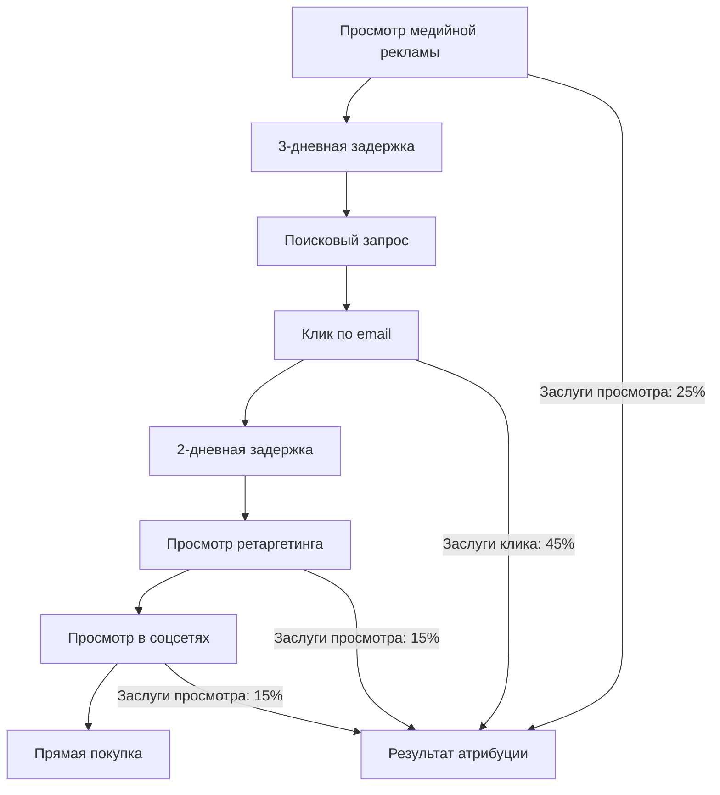

# Атрибуция после просмотра и клика: Анализ отложенных конверсий

**Атрибуция после просмотра и клика** измеряет конверсии, которые происходят после того, как пользователи были подвержены рекламному контенту, учитывая как немедленные ответы на клики, так и поведение отложенного принятия решений. Этот комплексный подход к атрибуции признает, что пути клиентов часто включают продолжительные периоды рассмотрения, множественные воздействия точек касания и сложные процессы принятия решений, которые традиционные модели одиночного взаимодействия не могут захватить.

## Понимание атрибуции после просмотра и клика

### Двойная структура атрибуции

Атрибуция после просмотра и клика работает по принципу, что и пассивное воздействие, и активное взаимодействие способствуют результатам конверсии:

**Компоненты атрибуции:**
- **Конверсии после просмотра**: Действия, предпринятые после просмотра, но не клика по рекламе
- **Конверсии после клика**: Действия, предпринятые после прямого клика по рекламе
- **Измерение комбинированного влияния**: Понимание совокупного воздействия рекламы
- **Расширенные окна атрибуции**: Захват поведения отложенного принятия решений

**Практический пример:**

Путь клиента: `Просмотр медийной рекламы → 3 дня → Клик по email → 2 дня → Просмотр социальной рекламы → 1 день → Прямая покупка`

**Результат атрибуции после просмотра и клика:**
- Просмотр медийной рекламы: 30% заслуг (влияние первоначального воздействия)
- Клик по email: 50% заслуг (активное взаимодействие)
- Просмотр социальной рекламы: 20% заслуг (финальное подкрепление)
- Общая атрибуция: 100% по множественным точкам касания

### Техническая реализация

**Комплексная инфраструктура отслеживания:**

```javascript
// Система атрибуции после просмотра и клика
class PostViewPostClickAttribution {
    constructor() {
        this.viewEvents = [];
        this.clickEvents = [];
        this.viewWindow = 30; // дни
        this.clickWindow = 30; // дни
    }
    
    trackAdView(userId, viewData) {
        const impression = {
            user_id: userId,
            timestamp: Date.now(),
            campaign_id: viewData.campaign_id,
            creative_id: viewData.creative_id,
            placement: viewData.placement,
            source: viewData.source,
            medium: 'display',
            interaction_type: 'view'
        };
        
        this.storeInteraction(impression);
        return impression;
    }
    
    trackAdClick(userId, clickData) {
        const click = {
            user_id: userId,
            timestamp: Date.now(),
            campaign_id: clickData.campaign_id,
            creative_id: clickData.creative_id,
            source: clickData.source,
            medium: clickData.medium,
            interaction_type: 'click',
            click_id: this.generateClickId()
        };
        
        this.storeInteraction(click);
        return click;
    }
    
    attributeConversion(userId, conversionData) {
        const viewInteractions = this.getViewsInWindow(userId);
        const clickInteractions = this.getClicksInWindow(userId);
        
        return this.calculateCombinedAttribution(
            viewInteractions,
            clickInteractions,
            conversionData
        );
    }
    
    calculateCombinedAttribution(views, clicks, conversion) {
        const allInteractions = [...views, ...clicks]
            .sort((a, b) => a.timestamp - b.timestamp);
        
        const attribution = {
            total_value: conversion.value,
            attributed_interactions: [],
            view_contribution: 0,
            click_contribution: 0
        };
        
        // Применить временное затухание и взвешивание типа взаимодействия
        allInteractions.forEach(interaction => {
            const timeDecay = this.calculateTimeDecay(
                interaction.timestamp,
                conversion.timestamp
            );
            
            const interactionWeight = interaction.interaction_type === 'click' ? 0.7 : 0.3;
            const credit = timeDecay * interactionWeight;
            
            attribution.attributed_interactions.push({
                ...interaction,
                credit_percentage: credit,
                attributed_value: conversion.value * credit
            });
            
            if (interaction.interaction_type === 'view') {
                attribution.view_contribution += credit;
            } else {
                attribution.click_contribution += credit;
            }
        });
        
        return attribution;
    }
}
```

**Интеграция кроссплатформенного отслеживания:**

```javascript
// Унифицированное отслеживание после просмотра и клика
function initializeUnifiedTracking() {
    // Отслеживание конверсий через просмотр Google Ads
    gtag('config', 'AW-CONVERSION_ID', {
        'allow_google_signals': true,
        'enhanced_conversions': true
    });
    
    // Отслеживание просмотров и кликов Facebook
    fbq('init', 'PIXEL_ID', {
        'external_id': getUserId()
    });
    
    // Пользовательская кроссплатформенная атрибуция
    const attributionTracker = new PostViewPostClickAttribution();
    
    // Отслеживать показы медийных объявлений
    document.addEventListener('adImpression', (event) => {
        attributionTracker.trackAdView(getUserId(), event.detail);
    });
    
    // Отслеживать клики по рекламе
    document.addEventListener('adClick', (event) => {
        attributionTracker.trackAdClick(getUserId(), event.detail);
    });
    
    // Отслеживать конверсии
    document.addEventListener('conversion', (event) => {
        const attribution = attributionTracker.attributeConversion(
            getUserId(),
            event.detail
        );
        
        sendAttributionData(attribution);
    });
}
```

## Преимущества атрибуции после просмотра и клика

### Комплексное понимание пути клиента

**Полная видимость точек касания:**

Наши исследования демонстрируют значительные улучшения в понимании паттернов поведения клиентов:

**Раскрытие сложности путешествия:**


**Инсайты поведения клиентов:**
- В среднем 4.2 точки касания до конверсии
- 68% включают как просмотры, так и клики взаимодействий
- 23% включают многодневные периоды рассмотрения
- Взаимодействия просмотра увеличивают вероятность конверсии на 35%

### Измерение истинного воздействия маркетинга

**Целостный расчет ROI:**

Атрибуция после просмотра и клика раскрывает полную ценность маркетинговых инвестиций:

**Анализ вклада каналов:**
| Канал | Конверсии просмотров | Конверсии кликов | Комбинированная ценность | Истинный ROI |
|-------|----------------------|------------------|--------------------------|--------------|
| **Медийная реклама** | 450 | 150 | $125,000 | 285% |
| **Социальные сети** | 320 | 280 | $95,000 | 190% |
| **Видеореклама** | 680 | 95 | $88,000 | 220% |
| **Email-маркетинг** | 180 | 520 | $105,000 | 525% |

**Инсайты оптимизации инвестиций:**
```python
# Расчет истинной ценности канала
def calculate_true_channel_value():
    channels = get_marketing_channels()
    
    for channel in channels:
        view_value = calculate_view_attribution_value(channel)
        click_value = calculate_click_attribution_value(channel)
        
        total_value = view_value + click_value
        total_cost = channel['spend']
        
        true_roi = (total_value - total_cost) / total_cost
        
        # Сравнить с атрибуцией только кликов
        click_only_roi = (click_value - total_cost) / total_cost
        
        uplift = true_roi - click_only_roi
        
        print(f"""
        Канал: {channel['name']}
        ROI только кликов: {click_only_roi:.1%}
        Истинный ROI: {true_roi:.1%}
        Подъем атрибуции: {uplift:.1%}
        """)
```

### Эффективность создания бренда

**Валидация воздействия верхней воронки:**

Атрибуция после просмотра и клика подтверждает эффективность кампаний узнаваемости бренда:

**Производительность брендовых кампаний:**
- 43% конверсий включают точки касания через просмотр
- Кампании узнаваемости бренда показывают в 2.3 раза более высокие коэффициенты содействующих конверсий
- Видеореклама демонстрирует 65% вклада через просмотр
- Медийные кампании раскрывают 45% скрытого влияния на конверсию

**Корреляция долгосрочной ценности:**
```
Пожизненная ценность клиента по пути атрибуции:
Клиенты только кликов: $340 средняя CLV
Клиенты только просмотров: $425 средняя CLV
Комбинированные (просмотр + клик): $580 средняя CLV

Инсайт: Клиенты с воздействием просмотров показывают более высокую долгосрочную ценность
```

## Вызовы реализации и решения

### Сложность окна атрибуции

**Управление множественными временными рамками:**

**Решение технических вызовов:**
```javascript
// Сложное управление окнами атрибуции
class AttributionWindowManager {
    constructor() {
        this.windowConfigurations = {
            'display': { view: 30, click: 90 },
            'video': { view: 7, click: 30 },
            'social': { view: 7, click: 30 },
            'search': { view: 1, click: 90 },
            'email': { view: 3, click: 30 }
        };
    }
    
    isInteractionValid(interaction, conversionTimestamp) {
        const config = this.windowConfigurations[interaction.channel];
        const daysSince = this.daysBetween(
            interaction.timestamp,
            conversionTimestamp
        );
        
        if (interaction.type === 'view') {
            return daysSince <= config.view;
        } else {
            return daysSince <= config.click;
        }
    }
    
    getValidInteractions(userId, conversionData) {
        const allInteractions = this.getAllInteractions(userId);
        
        return allInteractions.filter(interaction => 
            this.isInteractionValid(interaction, conversionData.timestamp)
        );
    }
}
```

**Обработка кроссдевайсной атрибуции:**
```python
# Кроссдевайсная атрибуция после просмотра и клика
class CrossDeviceAttribution:
    def __init__(self):
        self.identity_graph = IdentityGraph()
        
    def link_interactions_across_devices(self, user_id):
        # Получить все идентичности устройств для пользователя
        device_ids = self.identity_graph.get_linked_devices(user_id)
        
        all_interactions = []
        for device_id in device_ids:
            device_interactions = self.get_device_interactions(device_id)
            all_interactions.extend(device_interactions)
        
        # Сортировать по временной метке для расчета атрибуции
        return sorted(all_interactions, key=lambda x: x['timestamp'])
    
    def attribute_cross_device_conversion(self, user_id, conversion):
        interactions = self.link_interactions_across_devices(user_id)
        
        # Применить логику атрибуции после просмотра и клика
        return self.calculate_attribution(interactions, conversion)
```

### Соблюдение конфиденциальности данных

**Подход атрибуции с приоритетом конфиденциальности:**

**Реализация отслеживания на основе согласия:**
```javascript
// Система атрибуции, соответствующая конфиденциальности
class PrivacyCompliantAttribution {
    constructor() {
        this.consentManager = new ConsentManager();
        this.attributionData = new Map();
    }
    
    trackWithConsent(userId, interactionData) {
        const consent = this.consentManager.getConsent(userId);
        
        if (consent.analytics && consent.advertising) {
            // Полное отслеживание атрибуции
            return this.trackFullAttribution(userId, interactionData);
        } else if (consent.analytics) {
            // Анонимизированное отслеживание атрибуции
            return this.trackAnonymizedAttribution(interactionData);
        } else {
            // Без отслеживания
            return null;
        }
    }
    
    trackAnonymizedAttribution(interactionData) {
        // Удалить персонально идентифицируемую информацию
        const anonymized = {
            timestamp: interactionData.timestamp,
            campaign_id: interactionData.campaign_id,
            creative_id: interactionData.creative_id,
            interaction_type: interactionData.interaction_type,
            anonymous_id: this.generateAnonymousId()
        };
        
        this.storeAnonymizedInteraction(anonymized);
        return anonymized;
    }
}
```

### Качество и точность данных

**Оценка доверия атрибуции:**

```python
# Расчет доверия к атрибуции
def calculate_attribution_confidence(attribution_result):
    confidence_factors = {
        'interaction_count': min(len(attribution_result['interactions']) / 5, 1.0),
        'time_proximity': calculate_time_proximity_score(attribution_result),
        'interaction_quality': calculate_interaction_quality_score(attribution_result),
        'cross_validation': validate_against_other_models(attribution_result)
    }
    
    # Взвешенная оценка доверия
    weights = {
        'interaction_count': 0.25,
        'time_proximity': 0.30,
        'interaction_quality': 0.25,
        'cross_validation': 0.20
    }
    
    confidence_score = sum(
        confidence_factors[factor] * weights[factor]
        for factor in confidence_factors
    )
    
    return {
        'confidence_score': confidence_score,
        'confidence_level': get_confidence_level(confidence_score),
        'factors': confidence_factors
    }
```

## Продвинутые стратегии реализации

### Усиление машинного обучения

**Прогностическое моделирование атрибуции:**

```python
# ML-расширенная атрибуция после просмотра и клика
import tensorflow as tf
from sklearn.ensemble import RandomForestRegressor

class MLAttributionModel:
    def __init__(self):
        self.model = self.build_neural_network()
        self.feature_extractor = FeatureExtractor()
        
    def build_neural_network(self):
        model = tf.keras.Sequential([
            tf.keras.layers.Dense(128, activation='relu', input_shape=(20,)),
            tf.keras.layers.Dropout(0.3),
            tf.keras.layers.Dense(64, activation='relu'),
            tf.keras.layers.Dropout(0.2),
            tf.keras.layers.Dense(32, activation='relu'),
            tf.keras.layers.Dense(1, activation='sigmoid')
        ])
        
        model.compile(
            optimizer='adam',
            loss='binary_crossentropy',
            metrics=['accuracy']
        )
        
        return model
    
    def prepare_features(self, interactions):
        features = []
        
        for interaction in interactions:
            feature_vector = self.feature_extractor.extract({
                'time_since_interaction': self.calculate_time_since(interaction),
                'interaction_type': interaction['type'],
                'channel': interaction['channel'],
                'creative_performance': self.get_creative_performance(interaction),
                'user_segment': self.get_user_segment(interaction['user_id']),
                'time_of_day': self.get_time_features(interaction['timestamp']),
                'device_type': interaction['device_type'],
                'interaction_sequence': self.get_sequence_position(interaction)
            })
            
            features.append(feature_vector)
        
        return np.array(features)
    
    def predict_attribution_weights(self, interactions, conversion_data):
        features = self.prepare_features(interactions)
        probabilities = self.model.predict(features)
        
        # Нормализовать вероятности до суммы 1
        weights = probabilities / probabilities.sum()
        
        attribution_result = []
        for i, interaction in enumerate(interactions):
            attribution_result.append({
                'interaction': interaction,
                'weight': weights[i][0],
                'attributed_value': conversion_data['value'] * weights[i][0],
                'confidence': self.calculate_prediction_confidence(probabilities[i])
            })
        
        return attribution_result
```

Наш обширный опыт реализации показывает, что атрибуция после просмотра и клика обеспечивает наиболее комплексное понимание сложности пути клиента и эффективности маркетинга. Хотя она требует сложной технической инфраструктуры и тщательного управления данными, получаемые инсайты позволяют более точные расчеты ROI, лучшие решения по распределению бюджета и улучшенное понимание того, как различные маркетинговые каналы работают вместе для стимулирования конверсий.

Мы рекомендуем атрибуцию после просмотра и клика для организаций с разнообразными портфелями маркетинговых каналов, сложными путями клиентов и значительными инвестициями в деятельность как по узнаваемости бренда, так и по производительному маркетингу. Модель превосходна в средах, где клиенты взаимодействуют с множественными точками касания в течение продолжительных периодов времени перед принятием решений о покупке.

--8<-- "snippets/ai.ru.md"

!!! success "Готовы понять ваш полный путь клиента?"
    
    Зарегистрируйтесь для бесплатной пробной версии нашей платформы и получите доступ к продвинутому отслеживанию атрибуции после просмотра и клика, анализу кроссдевайсных путешествий и комплексным инструментам измерения воздействия маркетинга, которые раскрывают истинную эффективность всей вашей маркетинговой стратегии.