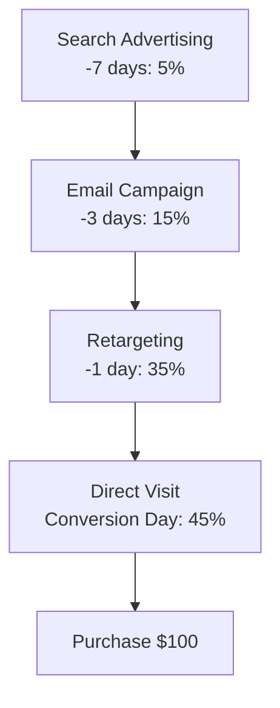
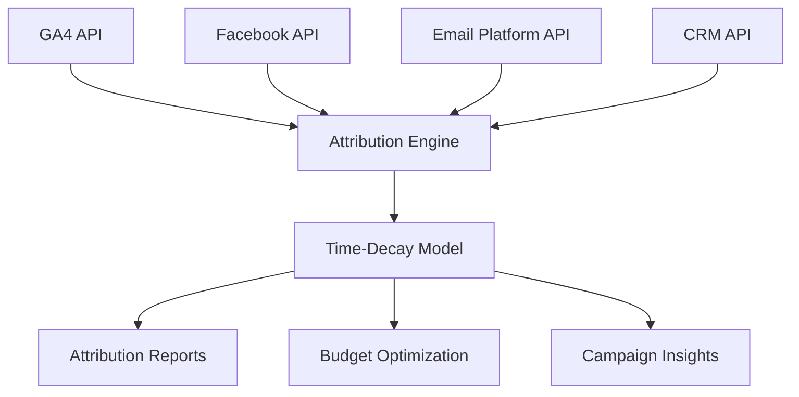

# Time-Decay Attribution: temporal decay model in web analytics

Time-Decay Attribution is a multi-channel attribution model that distributes conversion value across all touchpoints in the customer journey, giving greater weight to interactions that occurred closer to the conversion moment. Unlike simple single-touch models, Time-Decay accounts for the reality of modern marketing, where customers interact with brands multiple times before making a purchase decision.

The core idea of the model is that recent touches have greater influence on conversion than those that occurred several weeks ago. This is particularly relevant for scenarios where temporal proximity is critically important — for example, in limited-time promotional campaigns or impulse purchases.

## How Time-Decay Attribution Works

### Half-Life Concept

The mechanics of Time-Decay Attribution are based on the concept of **half-life** — an idea borrowed from physics that describes the time it takes for a marketing touchpoint's influence to diminish by half.

!!! info "Mathematical Model"

    Formula for calculating touchpoint weight in Time-Decay Attribution:
    
    ```
    Weight = 2^(-t/half-life)
    ```
    
    where **t** is the number of days between the touchpoint and conversion, and **half-life** is the configurable half-life parameter.

### Weight Distribution Principles

**Temporal sensitivity** determines how strongly time influences value distribution. Touchpoints occurring immediately before conversion receive maximum weight, while earlier interactions receive proportionally less.

**Decay function** applies gradual value reduction as the temporal gap between touchpoint and conversion increases. This ensures smooth weight transitions between touchpoints instead of abrupt jumps.

!!! example "Weight Distribution Example"

    **Customer Journey (7 days):**
    
    - Day 1: Google Ads (search advertising) → 10%
    - Day 3: Facebook (organic post) → 20%
    - Day 6: Email campaign → 30%
    - Day 7: Direct visit → 40%
    
    **Half-life: 7 days**
    
    An interaction occurring 7 days before conversion receives half the weight of a touchpoint on the conversion day.

## Comparison with Other Attribution Models

### Time-Decay vs Linear Attribution

Linear Attribution distributes value evenly across all touchpoints, while Time-Decay gives greater weight to recent interactions. The linear model assumes all touches are equally important, which doesn't always correspond to purchasing behavior reality.

=== "Linear Attribution"

    **Characteristics:**
    
    - Equal value distribution
    - Simple to understand and implement
    - Doesn't account for temporal importance of touches
    - Suitable for analyzing overall channel contribution

=== "Time-Decay Attribution"

    **Characteristics:**
    
    - Priority to recent interactions
    - Accounts for temporal proximity to conversion
    - Configurable half-life period
    - Ideal for campaigns with urgency component

### Time-Decay vs Position-Based

Position-Based model assigns 40% value to first and last touches, distributing the remaining 20% among intermediate points. Time-Decay provides smoother weight distribution without fixed percentages.

## Setting Up Time-Decay Attribution

### Determining Half-Life Period

Marketers typically configure half-life in Time-Decay models according to their products' or services' sales cycle. Choosing the correct half-life period is critically important for model accuracy.

!!! tip "Half-Life Configuration Recommendations"

    **Short Sales Cycles (B2C):**
    
    - E-commerce: 1-3 days
    - Impulse purchases: 12-24 hours
    - Service subscriptions: 3-7 days
    
    **Long Sales Cycles (B2B):**
    
    - SaaS solutions: 14-30 days
    - Enterprise sales: 30-90 days
    - Consulting services: 7-21 days

### Lookback Window Configuration

**Lookback window** determines how far back in time the attribution model will search for touchpoints to associate with a conversion. Various types of lookback windows exist, such as visit lookback window, which looks at the beginning of the visit/touchpoint where conversion occurred.

| Lookback Window Type | Description | Recommended Use |
|---------------------|-------------|-----------------|
| Visit-based | From session start to conversion | Intra-session behavior analysis |
| Time-based | Fixed period (7, 14, 30 days) | Standard marketing analysis |
| Custom | Configurable period | Specific business scenarios |

### Technical Implementation

=== "Google Analytics 4"

    **GA4 Setup:**
    
    1. Conversion Settings → Attribution Models
    2. Select Time-Decay from available models list
    3. Configure lookback window (default 90 days)
    4. Apply to required conversion actions

=== "Adobe Analytics"

    **Adobe Analytics Configuration:**
    
    Follows exponential decay with customizable half-life parameter, with default value of 7 days
    
    - Attribution Components → Time Decay
    - Set custom half-life parameter
    - Configure lookback window

=== "Custom Implementation"

    **Custom Implementation:**
    
    - Collect data on all touchpoints
    - Calculate temporal intervals
    - Apply 2^(-t/halflife) formula
    - Normalize weights to 100%

## Urgency Modeling in Time-Decay Attribution

### Adaptation for Urgent Campaigns

Time-Decay Attribution is particularly effective for understanding which channels secure conversions within shorter timeframes. Urgency modeling allows adapting the model for specific scenarios where temporal factor plays a decisive role.

!!! warning "Promotional Campaign Settings"

    For short-term campaigns (24-48 hours), it's recommended to:
    
    - Reduce half-life to 1-2 days
    - Decrease lookback window to 7 days
    - Increase weight of last 24 hours before conversion
    - Exclude interactions older than one week

### Seasonal Adjustments

**Holiday periods** require special approaches to Time-Decay model configuration. During high purchasing activity periods, consumer behavior changes, which should be reflected in attribution parameters.

**Adjustments for different periods:**

- Black Friday: half-life 6-12 hours
- New Year holidays: half-life 2-3 days
- Back-to-school season: half-life 3-7 days
- Regular periods: standard settings

## Applications Across Industries

### E-commerce and Retail

E-commerce, digital advertising, and lead-generation businesses benefit from Time-Decay Attribution as it helps optimize campaigns by identifying recent high-impact marketing touchpoints.



### SaaS and B2B

For SaaS companies, Time-Decay Attribution helps understand the influence of various touches in long sales cycles. B2B brands typically have longer sales cycles with networks of touchpoints that interact with each other.

!!! info "B2B Attribution Specifics"

    **Consider when configuring:**
    
    - Multiple stakeholders in decision-making process
    - Long sales cycles (30-180 days)
    - Account-based marketing approach
    - Cross-device interactions

### Lead Generation

Lead generation companies use Time-Decay to optimize channels for attracting quality leads. The model helps identify which channels are most effective in the final stage of converting leads to customers.

## Benefits and Limitations

### Time-Decay Attribution Benefits

**Realistic behavior modeling:** Time-Decay Attribution gives greater weight to interactions occurring closer to final conversion, recognizing their greater influence on customer decisions.

**Configuration flexibility:** The ability to adapt half-life to business specifics and sales cycle length makes the model universal for various industries.

**Balance between touchpoints:** Unlike single-touch models, Time-Decay accounts for all interactions in the customer journey, but considering their temporal importance.

### Limitations and Challenges

The model is complex to implement and heavily depends on accurate and complete data about customer interactions across various touchpoints. Any gaps in data collection can distort attribution results.

!!! warning "Main Limitations"

    **Technical Complexities:**
    
    - Requires sophisticated tracking mechanisms
    - Complexity of integrating data from multiple sources
    - Cross-device interactions difficult to track
    - Offline interactions difficult to account for
    
    **Analytical Challenges:**
    
    - Subjectivity in half-life selection
    - May underestimate importance of awareness channels
    - Requires large data volumes for statistical significance

## Time-Decay Attribution Data Analysis

### Report Interpretation

Review Time-Decay Attribution reports in your analytics platform. These reports typically show how much credit each marketing touchpoint receives based on its proximity to the conversion event.

**Key metrics for analysis:**

- **ROI/ROAS** by channels accounting for Time-Decay weight
- **Cost per Acquisition** with temporal distribution adjustment
- **Customer Lifetime Value** by acquisition sources
- **LTV:CAC ratio** for long-term effectiveness evaluation

### Segmentation and Comparative Analysis

=== "By Devices"

    **Mobile vs Desktop behavior:**
    
    - Mobile: shorter decision cycles
    - Desktop: deeper research sessions
    - Cross-device: attribution complexities

=== "By Geography"

    **Regional differences:**
    
    - Developed markets: longer consideration phase
    - Emerging markets: more impulsive purchases
    - Local vs international campaigns

=== "By Demographics"

    **Generational differences:**
    
    - Gen Z: shorter attention span
    - Millennials: multi-channel journey
    - Gen X: more thorough research

### Validation Against Other Models

Segment your data by traffic source, campaign, device type, or user demographics and validate results against other attribution models to optimize strategies.

## Optimization Based on Time-Decay Attribution

### Budget Planning

Time-Decay Attribution provides a more accurate picture for marketing budget allocation. Channels receiving high weight in the model should be considered for increased investment.

**Budget optimization strategies:**

**Increasing budget for high-impact channels**

   - Channels with high Time-Decay weight
   - Sources with short time-to-conversion
   - Campaigns with high urgency component

**Redistributing from low-impact channels**

   - Channels with low weight in final stage
   - Sources only for awareness
   - Campaigns with long lag between touch and conversion

### Creative Optimization

**Message adaptation for temporal proximity:**

- **Early-stage touchpoints:** Brand awareness, educational content
- **Mid-stage interactions:** Product benefits, case studies
- **Late-stage touchpoints:** Urgency messaging, limited-time offers

### Timing Optimization

Integrating Time-Decay into marketing analytics frameworks enables creating more flexible and responsive marketing strategies.

**Optimal timing for various channels:**

| Channel | Optimal Touch Timing | Urgency Level |
|---------|---------------------|---------------|
| Email | 2-24 hours before conversion | High |
| Paid Social | 1-3 days before conversion | Medium |
| Organic Search | 1-7 days before conversion | Low |
| Display Retargeting | 6-48 hours before conversion | Very High |

## Technical Implementation Aspects

### Data Requirements

Quality data source and tracking setup is one of the most important aspects of any attribution model. Without proper tracking, the model will provide inaccurate insights.

**Minimum data requirements:**

- **Customer ID** for linking touches
- **Timestamp** of all interactions
- **Source/Medium** classification
- **Conversion events** with precise timestamps
- **UTM parameters** for campaign tracking

### Cross-device Tracking

**Strategies for solving cross-device challenges:**

- **Deterministic matching:** Email, user ID
- **Probabilistic matching:** Device fingerprinting
- **Hybrid approach:** Combination of methods
- **First-party data utilization:** CRM integration

### API Integrations



## Future of Time-Decay Attribution

### Machine Learning Integration

Modern platforms integrate machine learning for automatic Time-Decay model parameter optimization. Data-Driven Attribution uses machine learning to determine real contribution of each channel based on historical data.

**Promising development directions:**

- Automatic half-life optimization
- Predictive attribution modeling
- Real-time model adjustment
- Cross-industry benchmarking

### Privacy-First Approaches

With tightening privacy regulations, attribution models adapt to new realities:

- **Server-side tracking** to bypass blockers
- **First-party data focus** instead of third-party cookies
- **Probabilistic modeling** to fill data gaps
- **Cookieless attribution** through advanced fingerprinting

### Omnichannel Attribution

Integration of offline and online touches into unified Time-Decay model becomes standard for comprehensive customer journey analysis.

We are working on solutions that will allow combining data from all customer interaction channels — from digital touchpoints to phone calls and in-store visits. Our approach envisions creating a unified view of customer journey with Time-Decay principles applied to the full spectrum of interactions.

We plan to implement advanced urgency modeling functionality that will automatically adapt model parameters to campaign specifics, time periods, and audience behavioral patterns. This will enable obtaining maximally accurate insights for marketing investment optimization.

--8<-- "snippets/ai.md"

!!! success "Ready to Implement Time-Decay Attribution?"

    Register for free trial of our web analytics platform and gain access to advanced attribution modeling, including customizable Time-Decay models with urgency optimization for maximally precise understanding of your marketing channels' effectiveness.