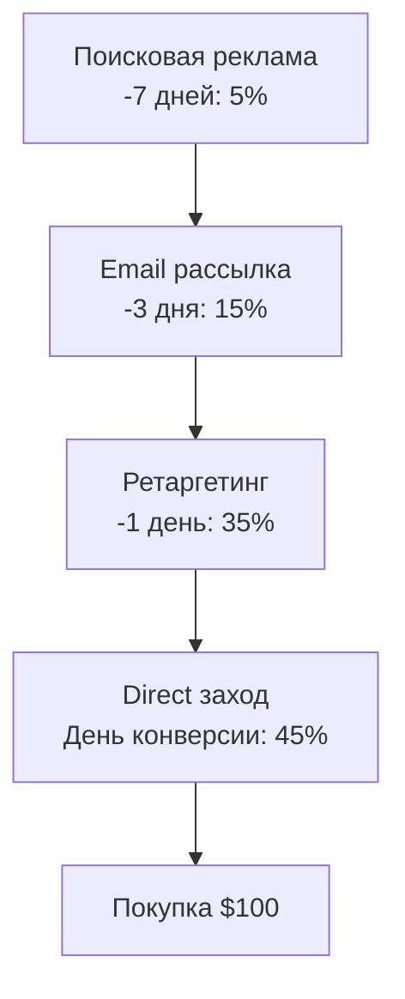
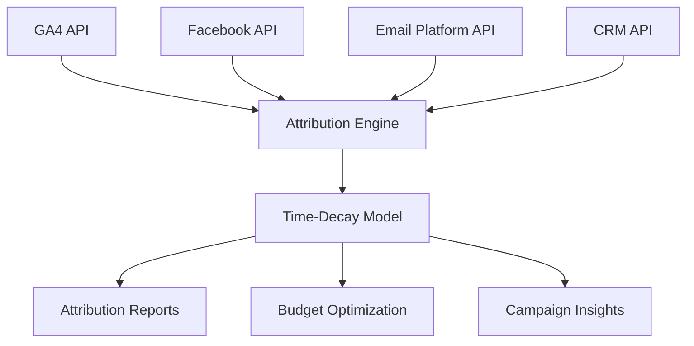

# Time-Decay Attribution: модель временного затухания в веб-аналитике

Time-Decay Attribution (модель временного затухания) — это многоканальная модель атрибуции, которая распределяет ценность конверсии между всеми точками касания в пути клиента, отдавая больший вес взаимодействиям, произошедшим ближе к моменту конверсии. В отличие от простых single-touch моделей, Time-Decay учитывает реальность современного маркетинга, где клиенты взаимодействуют с брендом несколько раз перед принятием решения о покупке.

Основная идея модели заключается в том, что недавние касания имеют большее влияние на конверсию, чем произошедшие несколько недель назад. Это особенно актуально для сценариев, где временная близость критически важна — например, при промо-акциях с ограниченным сроком или импульсных покупках.

## Принципы работы Time-Decay Attribution

### Концепция периода полураспада

Механика Time-Decay Attribution основана на концепции **half-life** (период полураспада) — заимствованной из физики идее, которая описывает время, за которое влияние маркетингового касания уменьшается наполовину.

!!! info "Математическая модель"

    Формула для расчёта веса касания в Time-Decay Attribution:
    
    ```
    Вес = 2^(-t/half-life)
    ```
    
    где **t** — количество дней между касанием и конверсией, а **half-life** — настраиваемый параметр периода полураспада.

### Принципы распределения веса

**Временная чувствительность** определяет, насколько сильно время влияет на распределение ценности. Касания, произошедшие непосредственно перед конверсией, получают максимальный вес, а более ранние взаимодействия — пропорционально меньший.

**Функция затухания** применяет постепенное снижение ценности по мере увеличения временного разрыва между касанием и конверсией. Это обеспечивает плавный переход веса между точками касания вместо резких скачков.

!!! example "Пример распределения веса"

    **Путь клиента (7 дней):**
    
    - День 1: Google Ads (поисковая реклама) → 10%
    - День 3: Facebook (органический пост) → 20%
    - День 6: Email рассылка → 30%
    - День 7: Прямой заход → 40%
    
    **Half-life: 7 дней**
    
    Взаимодействие, произошедшее за 7 дней до конверсии, получает в два раза меньше веса, чем касание в день конверсии.

## Сравнение с другими моделями атрибуции

### Time-Decay vs Linear Attribution

Linear Attribution равномерно распределяет ценность между всеми точками касания, тогда как Time-Decay придаёт больший вес недавним взаимодействиям. Линейная модель предполагает, что все касания одинаково важны, что не всегда соответствует реальности покупательского поведения.

=== "Linear Attribution"

    **Характеристики:**
    
    - Равное распределение ценности
    - Простота понимания и реализации
    - Не учитывает временную важность касаний
    - Подходит для анализа общего вклада каналов

=== "Time-Decay Attribution"

    **Характеристики:**
    
    - Приоритет недавним взаимодействиям
    - Учитывает temporal proximity к конверсии
    - Настраиваемый период полураспада
    - Идеально для кампаний с urgency-компонентом

### Time-Decay vs Position-Based

Position-Based модель отдаёт 40% ценности первому и последнему касанию, распределяя оставшиеся 20% между промежуточными точками. Time-Decay обеспечивает более плавное распределение веса без фиксированных процентных соотношений.

## Настройка Time-Decay Attribution

### Определение периода полураспада

Маркетологи обычно настраивают half-life в модели Time-Decay в соответствии с циклом продаж их продуктов или услуг. Выбор правильного периода полураспада критически важен для точности модели.

!!! tip "Рекомендации по настройке half-life"

    **Короткие циклы продаж (B2C):**
    
    - E-commerce: 1-3 дня
    - Импульсные покупки: 12-24 часа
    - Подписки на услуги: 3-7 дней
    
    **Длинные циклы продаж (B2B):**
    
    - SaaS решения: 14-30 дней
    - Enterprise продажи: 30-90 дней
    - Консультационные услуги: 7-21 день

### Настройка lookback window

**Lookback window** определяет, насколько далеко в прошлое модель атрибуции будет искать касания для привязки к конверсии. Существуют различные типы lookback windows, такие как visit lookback window, который смотрит на начало визита/касания, где произошла конверсия.

| Тип Lookback Window | Описание | Рекомендуемое использование |
|---------------------|----------|----------------------------|
| Visit-based | От начала сессии до конверсии | Анализ внутрисессионного поведения |
| Time-based | Фиксированный период (7, 14, 30 дней) | Стандартный маркетинговый анализ |
| Custom | Настраиваемый период | Специфичные бизнес-сценарии |

### Техническая реализация

=== "Google Analytics 4"

    **Настройка в GA4:**
    
    1. Conversion Settings → Attribution Models
    2. Выберите Time-Decay из списка доступных моделей
    3. Настройте lookback window (по умолчанию 90 дней)
    4. Примените к нужным conversion actions

=== "Adobe Analytics"

    **Конфигурация в Adobe Analytics:**
    
    Следует экспоненциальному затуханию с настраиваемым параметром half-life, где значение по умолчанию составляет 7 дней
    
    - Attribution Components → Time Decay
    - Установите custom half-life parameter
    - Настройте lookback window

=== "Custom Implementation"

    **Собственная реализация:**
    
    - Сбор данных о всех touchpoints
    - Расчёт временных интервалов
    - Применение формулы 2^(-t/halflife)
    - Нормализация весов до 100%

## Urgency Modeling в Time-Decay Attribution

### Адаптация под срочные кампании

Time-Decay Attribution особенно эффективна для понимания, какие каналы обеспечивают конверсии в более короткие временные рамки. Urgency modeling позволяет адаптировать модель под специфические сценарии, где временной фактор играет решающую роль.

!!! warning "Настройка для промо-кампаний"

    При проведении краткосрочных акций (24-48 часов) рекомендуется:
    
    - Сократить half-life до 1-2 дней
    - Уменьшить lookback window до 7 дней
    - Увеличить вес последних 24 часов перед конверсией
    - Исключить взаимодействия старше недели

### Сезонные корректировки

**Праздничные периоды** требуют особого подхода к настройке Time-Decay модели. В периоды высокой покупательской активности поведение потребителей меняется, что должно отражаться в параметрах атрибуции.

**Корректировки для различных периодов:**

- Чёрная пятница: half-life 6-12 часов
- Новогодние праздники: half-life 2-3 дня
- Back-to-school сезон: half-life 3-7 дней
- Обычные периоды: стандартные настройки

## Применение в различных индустриях

### E-commerce и розничная торговля

E-commerce, цифровая реклама и lead-generation бизнесы получают выгоду от Time-Decay Attribution, поскольку это помогает оптимизировать кампании путём выявления недавних высокоэффективных маркетинговых касаний.



### SaaS и B2B

Для SaaS компаний Time-Decay Attribution помогает понять влияние различных касаний в длинном цикле продаж. B2B бренды обычно имеют более длинные циклы продаж с сетью касаний, которые взаимодействуют друг с другом.

!!! info "Особенности B2B Attribution"

    **Учитывайте при настройке:**
    
    - Множественные заинтересованные стороны в процессе принятия решений
    - Длинные циклы продаж (30-180 дней)
    - Account-based marketing подход
    - Cross-device interactions

### Lead Generation

Lead generation компании используют Time-Decay для оптимизации каналов привлечения качественных лидов. Модель помогает выявить, какие каналы наиболее эффективны в финальной стадии конверсии лида в клиента.

## Преимущества и ограничения

### Преимущества Time-Decay Attribution

**Реалистичное моделирование поведения:** Time-Decay Attribution придаёт больший вес взаимодействиям, произошедшим ближе к финальной конверсии, признавая их большее влияние на решение клиента.

**Гибкость настройки:** Возможность адаптации half-life под специфику бизнеса и длину цикла продаж делает модель универсальной для различных индустрий.

**Баланс между касаниями:** В отличие от single-touch моделей, Time-Decay учитывает все взаимодействия в customer journey, но с учётом их временной важности.

### Ограничения и вызовы

Модель сложна в реализации и сильно зависит от точных и полных данных о взаимодействиях клиентов в различных точках касания. Любые пробелы в сборе данных могут исказить результаты атрибуции.

!!! warning "Основные ограничения"

    **Технические сложности:**
    
    - Требует sophisticated tracking mechanisms
    - Сложность интеграции данных из множества источников
    - Cross-device interactions трудно отслеживать
    - Offline взаимодействия сложно учесть
    
    **Аналитические вызовы:**
    
    - Субъективность выбора half-life
    - Может недооценивать важность awareness-каналов
    - Требует большого объёма данных для статистической значимости

## Анализ данных Time-Decay Attribution

### Интерпретация отчётов

Просмотрите отчёты Time-Decay Attribution в вашей аналитической платформе. Эти отчёты обычно показывают, сколько кредита получает каждая маркетинговая точка касания на основе её близости к событию конверсии.

**Ключевые метрики для анализа:**

- **ROI/ROAS** по каналам с учётом Time-Decay веса
- **Cost per Acquisition** с корректировкой на временное распределение
- **Customer Lifetime Value** по источникам привлечения
- **LTV:CAC ratio** для оценки долгосрочной эффективности

### Сегментация и сравнительный анализ

=== "По устройствам"

    **Mobile vs Desktop поведение:**
    
    - Mobile: более короткие циклы решений
    - Desktop: глубже исследовательские сессии
    - Cross-device: сложности в attribution

=== "По географии"

    **Региональные различия:**
    
    - Развитые рынки: длиннее consideration phase
    - Развивающиеся: импульсивнее покупки
    - Локальные vs международные кампании

=== "По демографии"

    **Поколенческие различия:**
    
    - Gen Z: короче attention span
    - Millennials: multi-channel journey
    - Gen X: основательнее исследование

### Validation против других моделей

Сегментируйте ваши данные по источнику трафика, кампании, типу устройства или демографии пользователей и проверяйте результаты против других моделей атрибуции для оптимизации стратегий.

## Оптимизация на основе Time-Decay Attribution

### Бюджетное планирование

Time-Decay Attribution предоставляет более точную картину для распределения маркетингового бюджета. Каналы, которые получают высокий вес в модели, должны рассматриваться для увеличения инвестиций.

**Стратегии оптимизации бюджета:**

**Увеличение бюджета high-impact каналов**

   - Каналы с высоким Time-Decay весом
   - Источники с коротким time-to-conversion
   - Кампании с high urgency компонентом

**Перераспределение из low-impact каналов**

   - Каналы с низким весом в финальной стадии
   - Источники только для awareness
   - Кампании с длинным lag между касанием и конверсией

### Креативная оптимизация

**Адаптация сообщений под временную близость:**

- **Early-stage touchpoints:** Brand awareness, educational контент
- **Mid-stage interactions:** Преимущества продукта, case studies
- **Late-stage touchpoints:** Urgency messaging, limited-time offers

### Timing оптимизация

Интеграция Time-Decay в фреймворки маркетинговой аналитики позволяет создавать более гибкие и responsive маркетинговые стратегии.

**Оптимальное время для различных каналов:**

| Канал | Оптимальное время касания | Urgency level |
|-------|-------------------------|---------------|
| Email | 2-24 часа до конверсии | Высокая |
| Paid Social | 1-3 дня до конверсии | Средняя |
| Organic Search | 1-7 дней до конверсии | Низкая |
| Display Retargeting | 6-48 часов до конверсии | Очень высокая |

## Технические аспекты реализации

### Требования к данным

Качественная настройка источников данных и трекинга — один из важнейших аспектов любой модели атрибуции. Без правильного трекинга модель будет давать неточные инсайты.

**Минимальные требования к данным:**

- **Customer ID** для связки касаний
- **Timestamp** всех взаимодействий
- **Source/Medium** классификация
- **Conversion events** с точными метками времени
- **UTM parameters** для кампанейного трекинга

### Cross-device tracking

**Стратегии для решения cross-device вызовов:**

- **Deterministic matching:** Email, user ID
- **Probabilistic matching:** Device fingerprinting
- **Hybrid approach:** Комбинация методов
- **First-party data utilisation:** CRM интеграция

### API интеграции



## Будущее Time-Decay Attribution

### Machine Learning интеграция

Современные платформы интегрируют машинное обучение для автоматической настройки параметров Time-Decay модели. Data-Driven Attribution использует машинное обучение для определения реального вклада каждого канала на основе исторических данных.

**Перспективные направления развития:**

- Автоматическая оптимизация half-life
- Predictive attribution modeling
- Real-time model adjustment
- Cross-industry benchmarking

### Privacy-first подходы

С ужесточением privacy регулирования модели атрибуции адаптируются под новые реалии:

- **Server-side tracking** для обхода блокировщиков
- **First-party data focus** вместо third-party cookies
- **Probabilistic modeling** для заполнения пробелов в данных
- **Cookieless attribution** через advanced fingerprinting

### Омниканальная атрибуция

Интеграция offline и online касаний в единую Time-Decay модель становится стандартом для comprehensive customer journey анализа.

Мы работаем над решениями, которые позволят объединить данные из всех каналов взаимодействия с клиентами — от цифровых touchpoints до phone calls и in-store visits. Наш подход предусматривает создание unified view of customer journey с применением Time-Decay принципов ко всему спектру взаимодействий.

Планируется реализация advanced urgency modeling функциональности, которая будет автоматически адаптировать параметры модели под специфику кампаний, временные периоды и поведенческие паттерны аудитории. Это позволит получать максимально точные инсайты для оптимизации маркетинговых инвестиций.

--8<-- "snippets/ai.ru.md"

!!! success "Готовы внедрить Time-Decay Attribution?"

    Зарегистрируйтесь для бесплатного тестирования нашей платформы веб-аналитики и получите доступ к advanced attribution modeling, включая настраиваемые Time-Decay модели с urgency optimization для максимально точного понимания эффективности ваших маркетинговых каналов.