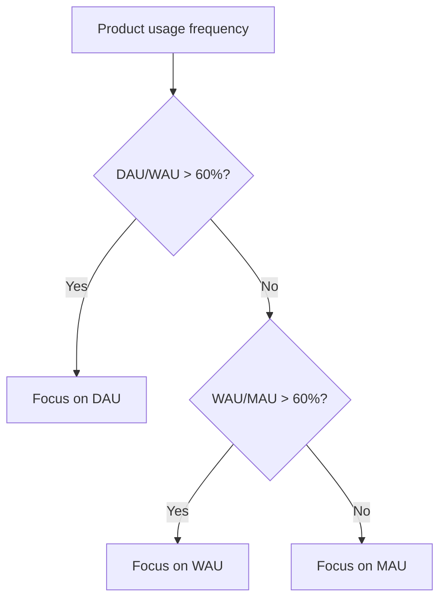

# DAU/WAU/MAU: Active User Metrics for Measuring Engagement

**DAU (Daily Active Users)**, **WAU (Weekly Active Users)**, and **MAU (Monthly Active Users)** are key active user metrics that measure the number of unique users interacting with a product over a specific time period. These metrics form the foundation for analyzing engagement, growth, and health of digital products, from mobile applications to SaaS platforms.

## Definitions and Calculation

### DAU - Daily Active Users

DAU measures the number of unique users who interact with a product within one day (24 hours).

```
DAU = Number of unique active users per day
```

**Calculation methods:**

- **Calendar day**: From 00:00 to 23:59 in a specific timezone
- **Rolling window**: Last 24 hours from calculation time
- **Average DAU**: Sum of DAU over period / number of days

### WAU - Weekly Active Users

WAU shows the number of unique users active during a week (7 days).

```
WAU = Number of unique active users per week
```

!!! warning "Important Clarification"
    
    WAU ≠ Sum of DAU for 7 days. A user who visited multiple days in a week is counted in WAU only once.

### MAU - Monthly Active Users

MAU reflects the number of unique users over a month (30 days or calendar month).

```
MAU = Number of unique active users per month
```

**Counting variations:**

- Calendar month (1st-31st)
- Rolling 30 days
- 28-day period (4 full weeks)

## Defining "Active User"

### Activity Criteria by Product Type

The key aspect is defining what counts as "activity" for your product:

| Product Type | Activity Examples | Threshold Values |
|--------------|-------------------|------------------|
| **Social Networks** | Feed viewing, likes, comments | Any interaction |
| **E-commerce** | Product browsing, cart additions, purchases | >30 seconds on site |
| **B2B SaaS** | Login, feature usage | Active session >1 minute |
| **Media** | Video viewing, article reading | Content consumption >10 seconds |
| **Games** | Game launch, level completion | Game session >2 minutes |
| **Fintech** | Balance check, transaction | Any app action |

!!! info "Activity Definition Example"
    
    For a streaming platform, an active user might be someone who:

    - Option 1: Simply opened the app
    - Option 2: Started viewing content
    - Option 3: Watched at least 1 minute of video
    
    The choice of criteria significantly impacts metrics (difference can reach 30-50%)

## Trend Analysis and Dynamics

### Growth Patterns

Analyzing DAU/WAU/MAU dynamics helps understand product development trajectory:

=== "Healthy Growth"
    
    **Characteristics:**

    - All three metrics grow proportionally
    - DAU/MAU ratio stable or growing
    - WAU shows steady trend
    
    **Dynamics chart:**
    ```
    MAU: ↗️ Stable growth 10-15% m/m
    WAU: ↗️ Correlates with MAU
    DAU: ↗️ Growing faster than MAU
    ```

=== "Retention Problems"
    
    **Characteristics:**

    - MAU grows but DAU stagnates
    - Declining DAU/MAU ratio
    - WAU volatile
    
    **Dynamics chart:**
    ```
    MAU: ↗️ Growth from new users
    WAU: ↔️ Unstable dynamics
    DAU: ↘️ Declining engagement
    ```

=== "Seasonal Fluctuations"
    
    **Characteristics:**

    - Predictable peaks and troughs
    - Pattern cyclicality
    - Correlation with external factors
    
    **Dynamics chart:**
    ```
    MAU: 〰️ Wave-like dynamics
    WAU: 〰️ Follows MAU with delay
    DAU: 📊 Sharp peaks on specific days
    ```

### Data Smoothing

Smoothing methods are used to identify trends:

**7-day moving average for DAU:**
```
DAU_MA7 = (DAU₁ + DAU₂ + ... + DAU₇) / 7
```

**Advantages:**

- Removes weekly seasonality
- Identifies long-term trends
- Reduces anomaly impact

## Industry Benchmarks

### General Standards by Category

| Category | Typical DAU | Typical WAU | Typical MAU | DAU/MAU |
|----------|-------------|-------------|-------------|---------|
| **Social Networks** | 10-50M | 50-200M | 100-500M | 40-60% |
| **Messengers** | 50-500M | 200-800M | 500-1500M | 50-70% |
| **Games (Casual)** | 100K-1M | 500K-5M | 2M-20M | 15-25% |
| **E-commerce** | 50K-500K | 200K-2M | 1M-10M | 10-15% |
| **B2B SaaS** | 5K-50K | 20K-200K | 50K-500K | 30-40% |
| **Media/News** | 100K-5M | 500K-20M | 2M-50M | 20-30% |
| **Fintech** | 10K-100K | 50K-500K | 200K-2M | 15-20% |

!!! note "Context Matters More Than Absolute Numbers"
    
    Comparison with competitors in your niche is more important than achieving abstract goals. A SaaS with 10K MAU can be more successful than a social network with 1M MAU in its segment.

### Benchmark Evolution

**Historical changes in average metrics:**

- **2014**: Average DAU/MAU for successful apps — 10-20%
- **2017**: Increased to 15-25% with mobile usage growth
- **2020**: Pandemic raised average to 25-35%
- **2024**: New norm — 30-40% for digital products

## Ratios and Derived Metrics

### DAU/MAU Ratio (Stickiness)

Shows product "stickiness" — what proportion of monthly users use the product daily:

```
Stickiness = (DAU / MAU) × 100%
```

**Interpretation:**

- <10%: Episodic usage
- 10-20%: Low engagement
- 20-40%: Medium engagement
- 40-60%: High engagement
- >60%: Daily habit

### DAU/WAU and WAU/MAU Ratios

Additional coefficients for understanding usage patterns:

| Metric | Formula | What it shows | Norm |
|--------|---------|---------------|------|
| DAU/WAU | (DAU/WAU)×100% | Daily usage within week | 40-60% |
| WAU/MAU | (WAU/MAU)×100% | Weekly activity | 60-80% |
| L21+/28 | Active 21+ days of 28 | Super-active users | 15-30% |

### Selecting Key Metric

Algorithm for choosing main tracking metric:



!!! tip "Practical Rule"
    
    - If DAU/WAU > 60% — daily use product, track DAU
    - If WAU/MAU > 60% — weekly pattern, focus on WAU
    - Otherwise — monthly MAU metric will be most representative

## Factors Affecting Metrics

### External Factors

**Seasonality:**

- Workdays vs weekends (B2B drops 40-60% on weekends)
- Holidays and vacations
- Seasons (fitness apps peak in January)
- Time zones for global products

**Marketing activities:**

- Ad campaigns give MAU spikes
- PR and viral events
- App Store featuring
- Partner integrations

**Competitive environment:**

- Competitor launches
- Industry changes
- Platform changes (iOS/Android updates)

### Internal Factors

**Product changes:**

| Change Type | DAU Impact | MAU Impact | Effect Time |
|-------------|------------|------------|-------------|
| New killer feature | +20-50% | +10-30% | 1-2 weeks |
| UX improvement | +5-15% | +5-10% | 2-4 weeks |
| Bugs and crashes | -30-70% | -10-30% | Immediate |
| Onboarding change | +/-10% | +/-20% | 4-8 weeks |
| Push notifications | +15-25% | +5-10% | 3-7 days |

## Optimization Strategies

### Increasing DAU

**Tactics for boosting daily activity:**

**Habit-forming mechanics**

   - Daily rewards/streaks
   - Daily quests
   - Time-sensitive content
   - Social pressure (friends online)

**Push notifications**

   - Personalized send time
   - Relevant triggers
   - Frequency limit (max 2-3 per day)

**Content strategy**

   - Daily updates
   - User-generated content
   - Live events

### Increasing WAU

**Focus on weekly engagement:**

**Weekly rituals**

   - Weekly reports
   - Weekly challenges
   - Scheduled content updates

**Email marketing**

   - Weekly digest
   - Personal recommendations
   - Missed activity summaries

**Social mechanics**

   - Group activities
   - Competitions
   - Collaborative features

### Increasing MAU

**Strategies for expanding monthly audience:**

**Acquisition channels**

   - SEO for organic growth
   - Paid acquisition with quality focus
   - Referral programs

**Retention mechanics**

   - Onboarding improvement
   - Reactivation campaigns
   - Win-back offers

**Product value**

   - Expanding use cases
   - New features for different segments
   - Integrations with other services

## Anomalies and Interpretation

### Typical Anomalies

**Sharp DAU growth without MAU growth:**

- Possible cause: successful retention campaign
- Action: analyze activity sources
- Risk: unsustainability without new users

**DAU drop with stable MAU:**

- Possible cause: declining engagement
- Action: research user feedback
- Risk: beginning of user churn

**MAU growth without DAU/WAU growth:**

- Possible cause: low acquisition quality
- Action: analyze traffic sources
- Risk: high churn of new users

!!! warning "Red Flags in Metrics"
    
    - DAU/MAU < 5%: critically low engagement
    - MAU grows, DAU drops: product problems
    - Sharp spikes without obvious causes: check tracking
    - WAU > MAU: calculation error

## Technical Measurement Aspects

### Counting Methodologies

=== "Client-side tracking"
    
    **Advantages:**

    - Precise action tracking
    - Real-time data
    - Detailed analytics
    
    **Disadvantages:**

    - Tracker blocking (20-40% losses)
    - JavaScript dependency
    - Cross-device problems

=== "Server-side tracking"
    
    **Advantages:**

    - Data reliability
    - Bypasses blockers
    - Single source of truth
    
    **Disadvantages:**

    - Implementation complexity
    - Processing delay
    - Requires infrastructure

=== "Hybrid approach"
    
    **Advantages:**

    - Maximum accuracy
    - Data redundancy
    - Analysis flexibility
    
    **Disadvantages:**

    - Reconciliation complexity
    - Logic duplication
    - High costs

### Edge Case Handling

**Time zones:**
```python
# Example logic for global products
if user_timezone:
    day_start = midnight_in_user_timezone
else:
    day_start = midnight_UTC
```

**Deduplication:**

- User ID takes priority over device ID
- Session stitching for cross-device
- Probabilistic matching

**Bots and fraud:**

- User-Agent filtering
- Behavioral pattern analysis
- Rate limiting checks

## Business Application

### Growth Forecasting

**MAU forecast model:**
```
MAU(t+1) = MAU(t) × (1 - Churn Rate) + New Users(t+1)
```

**Factors for ML models:**

- Historical trends
- Seasonality
- Marketing calendar
- Product roadmap
- External events

### Effectiveness Evaluation

**Marketing campaign ROI:**
```
ROI = (DAU Increase × LTV - Costs) / Costs × 100%
```

**Product-Market Fit indicators:**

- DAU/MAU > 40% for B2C
- WAU/MAU > 60% for B2B
- Organic growth > 20% of total

### Investment Metrics

For startups and company valuation:

| Stage | Focus Metric | Target Values | Importance |
|-------|--------------|---------------|------------|
| Pre-seed | MAU growth | >20% m/m | Potential |
| Seed | DAU/MAU | >20% | Engagement |
| Series A | MAU | >100K | Scale |
| Series B+ | All metrics | Industry benchmarks | Maturity |

## Future of Activity Metrics

### Approach Evolution

**From quantity to quality:**

- Weighted Active Users (by interaction depth)
- Quality-Adjusted Active Users
- Engagement Score instead of binary active/inactive

**Predictive metrics:**

- Predicted lifetime active days
- Churn probability scores
- Engagement trajectory modeling

**Cross-platform unification:**

- Omnichannel activity counting
- Unified user journey
- Attribution across all touchpoints

Our web analytics platform is developing advanced solutions for measuring user activity, considering modern challenges of cross-device behavior and privacy-first approaches. We focus on creating algorithms that ensure accurate DAU/WAU/MAU measurement even under third-party cookie restrictions.

We plan to implement predictive models that will not only track current activity but also forecast future trends, enabling proactive response to changes in user behavior.

--8<-- "snippets/ai.md"

!!! success "Ready to understand your users' activity deeper?"
    
    Sign up for a free trial of our analytics platform and get full access to DAU/WAU/MAU metrics with detailed segmentation, trends, forecasts, and recommendations for optimizing your audience engagement.