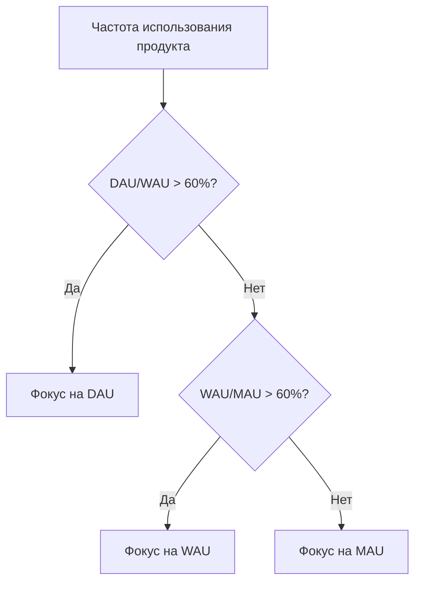

# DAU/WAU/MAU: метрики активных пользователей для измерения вовлечённости

**DAU (Daily Active Users)**, **WAU (Weekly Active Users)** и **MAU (Monthly Active Users)** — это ключевые метрики активных пользователей, которые измеряют количество уникальных пользователей, взаимодействующих с продуктом за определённый период времени. Эти показатели формируют основу для анализа вовлечённости, роста и здоровья цифровых продуктов, от мобильных приложений до SaaS-платформ.

## Определения и расчёт

### DAU - Daily Active Users

DAU измеряет количество уникальных пользователей, которые взаимодействуют с продуктом в течение одного дня (24 часов).

```
DAU = Количество уникальных активных пользователей за день
```

**Методы расчёта:**
- **Календарный день**: С 00:00 до 23:59 в определённой временной зоне
- **Скользящее окно**: Последние 24 часа от момента расчёта
- **Среднее DAU**: Сумма DAU за период / количество дней

### WAU - Weekly Active Users

WAU показывает количество уникальных пользователей, активных в течение недели (7 дней).

```
WAU = Количество уникальных активных пользователей за неделю
```

!!! warning "Важное уточнение"
    
    WAU ≠ Сумма DAU за 7 дней. Пользователь, заходивший несколько дней в неделю, учитывается в WAU только один раз.

### MAU - Monthly Active Users

MAU отражает количество уникальных пользователей за месяц (30 дней или календарный месяц).

```
MAU = Количество уникальных активных пользователей за месяц
```

**Варианты подсчёта:**
- Календарный месяц (1-31 число)
- Скользящие 30 дней
- 28-дневный период (4 полные недели)

## Определение "активного пользователя"

### Критерии активности по типам продуктов

Ключевой аспект — определение, что считать "активностью" для вашего продукта:

| Тип продукта | Примеры активности | Пороговые значения |
|--------------|-------------------|-------------------|
| **Социальные сети** | Просмотр ленты, лайки, комментарии | Любое взаимодействие |
| **E-commerce** | Просмотр товаров, добавление в корзину, покупка | >30 секунд на сайте |
| **SaaS B2B** | Вход в систему, использование функций | Активная сессия >1 минуты |
| **Медиа** | Просмотр видео, чтение статей | Потребление контента >10 секунд |
| **Игры** | Запуск игры, прохождение уровня | Игровая сессия >2 минут |
| **Финтех** | Проверка баланса, транзакция | Любое действие в приложении |

!!! info "Пример определения активности"
    
    Для стриминговой платформы активным может считаться пользователь, который:

    - Вариант 1: Просто открыл приложение
    - Вариант 2: Начал просмотр контента
    - Вариант 3: Просмотрел минимум 1 минуту видео
    
    Выбор критерия существенно влияет на метрики (разница может достигать 30-50%)

## Анализ трендов и динамика

### Паттерны роста

Анализ динамики DAU/WAU/MAU помогает понять траекторию развития продукта:

=== "Здоровый рост"
    
    **Характеристики:**

    - Все три метрики растут пропорционально
    - DAU/MAU ratio стабилен или растёт
    - WAU показывает устойчивый тренд
    
    **График динамики:**
    ```
    MAU: ↗️ Стабильный рост 10-15% м/м
    WAU: ↗️ Коррелирует с MAU
    DAU: ↗️ Растёт быстрее MAU
    ```

=== "Проблемы с удержанием"
    
    **Характеристики:**

    - MAU растёт, но DAU стагнирует
    - Снижение DAU/MAU ratio
    - WAU волатилен
    
    **График динамики:**
    ```
    MAU: ↗️ Рост за счёт новых
    WAU: ↔️ Нестабильная динамика
    DAU: ↘️ Падение вовлечённости
    ```

=== "Сезонные колебания"
    
    **Характеристики:**

    - Предсказуемые пики и спады
    - Цикличность паттернов
    - Корреляция с внешними факторами
    
    **График динамики:**
    ```
    MAU: 〰️ Волнообразная динамика
    WAU: 〰️ Следует за MAU с задержкой
    DAU: 📊 Резкие пики в определённые дни
    ```

### Сглаживание данных

Для выявления трендов используются методы сглаживания:

**7-дневное скользящее среднее для DAU:**
```
DAU_MA7 = (DAU₁ + DAU₂ + ... + DAU₇) / 7
```

**Преимущества:**

- Убирает недельную сезонность
- Выявляет долгосрочные тренды
- Снижает влияние аномалий

## Индустриальные бенчмарки

### Общие стандарты по категориям

| Категория | Типичный DAU | Типичный WAU | Типичный MAU | DAU/MAU |
|-----------|--------------|--------------|--------------|---------|
| **Социальные сети** | 10-50M | 50-200M | 100-500M | 40-60% |
| **Мессенджеры** | 50-500M | 200-800M | 500-1500M | 50-70% |
| **Игры (Casual)** | 100K-1M | 500K-5M | 2M-20M | 15-25% |
| **E-commerce** | 50K-500K | 200K-2M | 1M-10M | 10-15% |
| **SaaS B2B** | 5K-50K | 20K-200K | 50K-500K | 30-40% |
| **Медиа/Новости** | 100K-5M | 500K-20M | 2M-50M | 20-30% |
| **Финтех** | 10K-100K | 50K-500K | 200K-2M | 15-20% |

!!! note "Контекст важнее абсолютных чисел"
    
    Сравнение с конкурентами в вашей нише важнее, чем достижение абстрактных целей. SaaS с 10K MAU может быть успешнее социальной сети с 1M MAU в своём сегменте.

### Эволюция бенчмарков

**Исторические изменения средних показателей:**

- **2014**: Средний DAU/MAU для успешных приложений — 10-20%
- **2017**: Повышение до 15-25% с ростом мобильного использования
- **2020**: Пандемия подняла средние показатели до 25-35%
- **2024**: Новая норма — 30-40% для цифровых продуктов

## Соотношения и производные метрики

### DAU/MAU Ratio (Stickiness)

Показывает "липкость" продукта — какая доля месячных пользователей использует продукт ежедневно:

```
Stickiness = (DAU / MAU) × 100%
```

**Интерпретация:**

- <10%: Эпизодическое использование
- 10-20%: Низкая вовлечённость
- 20-40%: Средняя вовлечённость
- 40-60%: Высокая вовлечённость
- >60%: Ежедневная привычка

### DAU/WAU и WAU/MAU Ratios

Дополнительные коэффициенты для понимания паттернов использования:

| Метрика | Формула | Что показывает | Норма |
|---------|---------|----------------|-------|
| DAU/WAU | (DAU/WAU)×100% | Ежедневность в рамках недели | 40-60% |
| WAU/MAU | (WAU/MAU)×100% | Еженедельная активность | 60-80% |
| L21+/28 | Активны 21+ день из 28 | Суперактивные пользователи | 15-30% |

### Выбор ключевой метрики

Алгоритм выбора основной метрики для трекинга:



!!! tip "Практическое правило"
    
    - Если DAU/WAU > 60% — продукт для ежедневного использования, трекайте DAU
    - Если WAU/MAU > 60% — еженедельный паттерн, фокус на WAU
    - Иначе — месячная метрика MAU будет наиболее репрезентативной

## Факторы, влияющие на метрики

### Внешние факторы

**Сезонность:**

- Рабочие дни vs выходные (B2B падает на 40-60% в выходные)
- Праздники и каникулы
- Времена года (фитнес-приложения пик в январе)
- Часовые пояса для глобальных продуктов

**Маркетинговые активности:**

- Рекламные кампании дают всплески MAU
- PR и вирусные события
- App Store featuring
- Партнёрские интеграции

**Конкурентная среда:**

- Запуск конкурентов
- Изменения в индустрии
- Платформенные изменения (iOS/Android updates)

### Внутренние факторы

**Продуктовые изменения:**

| Тип изменения | Влияние на DAU | Влияние на MAU | Время эффекта |
|---------------|----------------|----------------|---------------|
| Новая killer-feature | +20-50% | +10-30% | 1-2 недели |
| Улучшение UX | +5-15% | +5-10% | 2-4 недели |
| Баги и сбои | -30-70% | -10-30% | Немедленно |
| Изменение onboarding | +/-10% | +/-20% | 4-8 недель |
| Push-уведомления | +15-25% | +5-10% | 3-7 дней |

## Стратегии оптимизации

### Увеличение DAU

**Тактики повышения ежедневной активности:**

**Habit-forming механики**

   - Daily rewards/streaks
   - Ежедневные задания
   - Time-sensitive контент
   - Social pressure (друзья онлайн)

**Push-уведомления**

   - Персонализированное время отправки
   - Relevant triggers
   - Ограничение частоты (не более 2-3 в день)

**Контент-стратегия**

   - Ежедневные обновления
   - User-generated content
   - Live события

### Увеличение WAU

**Фокус на еженедельное вовлечение:**

**Weekly rituals**

   - Еженедельные отчёты
   - Weekly challenges
   - Обновление контента по расписанию

**Email-маркетинг**

   - Weekly digest
   - Персональные рекомендации
   - Missed activity summaries

**Социальные механики**

   - Групповые активности
   - Соревнования
   - Коллаборативные функции

### Увеличение MAU

**Стратегии расширения месячной аудитории:**

**Acquisition каналы**

   - SEO для органического роста
   - Paid acquisition с фокусом на качество
   - Referral программы

**Retention механики**

   - Улучшение onboarding
   - Реактивационные кампании
   - Win-back предложения

**Продуктовая ценность**

   - Расширение use cases
   - Новые features для разных сегментов
   - Интеграции с другими сервисами

## Аномалии и их интерпретация

### Типичные аномалии

**Резкий рост DAU без роста MAU:**

- Возможная причина: успешная retention кампания
- Действие: анализ источников активности
- Риск: неустойчивость без новых пользователей

**Падение DAU при стабильном MAU:**

- Возможная причина: снижение engagement
- Действие: исследование user feedback
- Риск: начало оттока пользователей

**Рост MAU без роста DAU/WAU:**

- Возможная причина: низкое качество acquisition
- Действие: анализ источников трафика
- Риск: высокий churn новых пользователей

!!! warning "Red flags в метриках"
    
    - DAU/MAU < 5%: критически низкая вовлечённость
    - MAU растёт, DAU падает: проблемы с продуктом
    - Резкие скачки без очевидных причин: проверить трекинг
    - WAU > MAU: ошибка в расчётах

## Технические аспекты измерения

### Методологии подсчёта

=== "Client-side tracking"
    
    **Преимущества:**

    - Точное отслеживание действий
    - Real-time данные
    - Детальная аналитика
    
    **Недостатки:**

    - Блокировка трекеров (20-40% потерь)
    - Зависимость от JavaScript
    - Проблемы с cross-device

=== "Server-side tracking"
    
    **Преимущества:**

    - Надёжность данных
    - Обход блокировщиков
    - Единый источник правды
    
    **Недостатки:**

    - Сложность реализации
    - Задержка в обработке
    - Требует инфраструктуры

=== "Hybrid подход"
    
    **Преимущества:**

    - Максимальная точность
    - Резервирование данных
    - Гибкость анализа
    
    **Недостатки:**

    - Сложность reconciliation
    - Дублирование логики
    - Высокие затраты

### Обработка edge cases

**Временные зоны:**
```python
# Пример логики для глобальных продуктов
if user_timezone:
    day_start = midnight_in_user_timezone
else:
    day_start = midnight_UTC
```

**Дедупликация:**

- User ID приоритетнее device ID
- Session stitching для cross-device
- Вероятностное сопоставление

**Боты и fraud:**

- Фильтрация по User-Agent
- Анализ поведенческих паттернов
- Rate limiting проверки

## Применение в бизнес-решениях

### Прогнозирование роста

**Модель прогноза MAU:**
```
MAU(t+1) = MAU(t) × (1 - Churn Rate) + New Users(t+1)
```

**Факторы для ML-моделей:**

- Исторические тренды
- Сезонность
- Маркетинговый календарь
- Продуктовый roadmap
- Внешние события

### Оценка эффективности

**ROI маркетинговых кампаний:**
```
ROI = (Прирост DAU × LTV - Затраты) / Затраты × 100%
```

**Product-Market Fit индикаторы:**

- DAU/MAU > 40% для B2C
- WAU/MAU > 60% для B2B
- Органический рост > 20% от общего

### Инвестиционные метрики

Для стартапов и оценки компаний:

| Стадия | Фокус метрика | Целевые значения | Важность |
|--------|---------------|------------------|----------|
| Pre-seed | MAU рост | >20% м/м | Потенциал |
| Seed | DAU/MAU | >20% | Engagement |
| Series A | MAU | >100K | Масштаб |
| Series B+ | Все метрики | Индустриальные benchmarks | Зрелость |

## Будущее метрик активности

### Эволюция подходов

**От количества к качеству:**

- Weighted Active Users (по глубине взаимодействия)
- Quality-Adjusted Active Users
- Engagement Score вместо binary active/inactive

**Predictive metrics:**

- Predicted lifetime active days
- Churn probability scores
- Engagement trajectory modeling

**Cross-platform унификация:**

- Омниканальный подсчёт активности
- Unified user journey
- Attribution по всем touchpoints

Наша платформа веб-аналитики разрабатывает передовые решения для измерения активности пользователей, учитывающие современные вызовы cross-device поведения и privacy-first подходов. Мы фокусируемся на создании алгоритмов, которые обеспечат точное измерение DAU/WAU/MAU даже в условиях ограничений third-party cookies.

Планируется внедрение предиктивных моделей, которые позволят не только отслеживать текущую активность, но и прогнозировать будущие тренды, давая возможность проактивно реагировать на изменения в поведении пользователей.

--8<-- "snippets/ai.ru.md"

!!! success "Готовы глубже понять активность ваших пользователей?"
    
    Зарегистрируйтесь для бесплатного тестирования нашей платформы аналитики и получите полный доступ к метрикам DAU/WAU/MAU с детальной сегментацией, трендами, прогнозами и рекомендациями по оптимизации вовлечённости вашей аудитории.