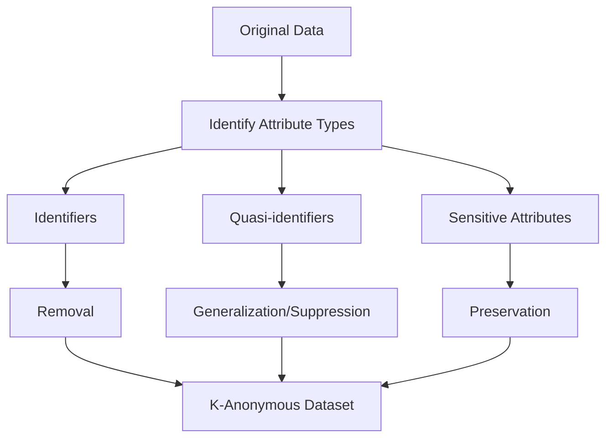

# Anonymous Data: Definition, Anonymization Techniques and True Anonymity Criteria

Anonymous data represents information from which all elements allowing identification of a specific natural person have been removed. Unlike pseudonymized data, anonymous data does not fall under GDPR if anonymization is irreversible and excludes the possibility of re-identification of the data subject. Understanding the differences between pseudonymization and true anonymization is critically important for web analytics systems striving to comply with international data protection requirements.

## Definition of Anonymous Data

Anonymous data is information that does not relate to an identified or identifiable natural person, or to personal data transformed in such a way that the data subject can no longer be identified.

### Criteria for True Anonymity

According to Article 29 Working Party recommendations, to achieve true anonymity, data must satisfy three main criteria:

=== "Impossibility of Singling Out"

    **Definition:**

    - Impossibility to isolate all or part of records that identify a specific person in the dataset
    - Absence of unique combinations of attributes pointing to a specific individual
    
    **Practical Example:**

    - If there is a single record about an 85-year-old woman living in a specific postal code in the dataset, this record can be singled out

=== "Impossibility of Linkability"

    **Definition:**

    - Impossibility to link two records about the same data subject or group of subjects
    - Prevention of correlation of different datasets about one person
    
    **Technical Implementation:**

    - Removal of temporal behavioral patterns
    - Exclusion of stable identifiers
    - Destruction of links between different data sources

=== "Impossibility of Inference"

    **Definition:**

    - Impossibility to infer with high probability the value of any attribute of the data subject
    - Exclusion of possibility to deduce information from data analysis
    
    **Protection Methods:**

    - Introduction of statistical noise
    - Generalization of sensitive attributes
    - Limitation of data granularity

!!! warning "Re-identification Problem"
    
    Research shows that 99.98% of people can be correctly re-identified in anonymized datasets using just 15 characteristics, including age, gender, and marital status. This emphasizes the complexity of achieving true anonymity in large datasets.

## Classical Anonymization Techniques

### K-Anonymity

K-anonymity ensures that each person in a dataset cannot be distinguished from at least k-1 other people regarding quasi-identifiers in the dataset.

**Main Principles:**

- **Quasi-identifiers**: Indirect identifiers such as age, gender, postal code
- **Sensitive attributes**: Protected information that cannot be changed
- **Equivalence classes**: Groups of records with identical quasi-identifiers

**Methods for achieving k-anonymity:**

- **Generalization**: Reducing data precision (exact age → age range)
- **Suppression**: Removing specific attribute values
- **Anatomization**: Separating quasi-identifiers and sensitive attributes

### L-Diversity

L-diversity was created to complement k-anonymity by additionally maintaining diversity of sensitive fields. The l-diversity model requires that each equivalence class contains at least l different values for each sensitive attribute.

**Types of l-diversity:**

**Distinct l-diversity:**

- Simplest variant requiring at least l different values

**Entropy l-diversity:**

- Based on entropy of sensitive attribute distribution
- More stringent diversity measure

**Recursive (c,l)-diversity:**

- Guarantees that the most frequent value doesn't occur too often

!!! info "L-diversity Example"
    
    In a medical database with quasi-identifiers (age, gender, city) and sensitive attribute (disease), l-diversity with l=3 requires that each group of people with the same age, gender, and city has at least 3 different diseases.

### T-Closeness

T-closeness ensures that the distribution of a sensitive attribute in a generalization of quasi-identifiers is close to the distribution of the sensitive attribute in the entire dataset.

**Working Principle:**

- Uses Earth Mover's Distance to measure distance between distributions
- Guarantees that local distribution doesn't differ too much from global distribution
- Protects against attacks based on knowledge of general distribution

**T-closeness Advantages:**

- Protection against similarity attacks
- Consideration of semantic meaning of attributes
- Stronger privacy guarantees compared to l-diversity

## Modern Anonymization Methods

### Differential Privacy

Differential Privacy provides mathematical privacy guarantees by adding controlled noise to query results.

**Formal Definition:**

Mechanism M provides ε-differential privacy if for all datasets D1 and D2 differing by one record, and for all possible outputs S:

Pr[M(D1) ∈ S] ≤ eᵋ × Pr[M(D2) ∈ S]

**Types of Differential Privacy:**

=== "Centralized Differential Privacy (CDP)"

    **Characteristics:**

    - Trusted server adds noise to aggregated data
    - Better accuracy for statistical queries
    - Requires trust in central server

=== "Local Differential Privacy (LDP)"

    **Characteristics:**

    - Noise is added at client level before transmission
    - Stronger privacy guarantees
    - Lower result accuracy

=== "Shuffle Model"

    **Characteristics:**

    - Hybrid approach combining CDP and LDP
    - Anonymization through data shuffling
    - Balance between privacy and accuracy

### Synthetic Data

Synthetic data generation creates new datasets while preserving statistical properties of original data without retaining information about specific individuals.

**Generation Methods:**

**Generative Adversarial Networks (GANs):**

- Training generative models on real data
- Creating synthetic samples with similar properties
- Protection from re-identification through absence of direct copying

**Variational Autoencoders (VAEs):**

- Encoding data into latent space
- Generating new points from latent distribution
- Control over level of similarity and privacy

### Federated Learning

Federated learning enables decentralized model training while keeping raw data on individual devices.

**Working Principles:**

- Models are trained locally on user devices
- Only model parameters are transmitted to central server
- Aggregation of updates without access to original data

**Additional Security Measures:**

- **Secure Aggregation**: Cryptographic protection of model parameters
- **Differential Privacy**: Adding noise to local updates
- **Homomorphic Encryption**: Computations on encrypted data

### Homomorphic Encryption

Homomorphic encryption allows performing arithmetic operations on ciphertexts without decrypting them.

**Types of homomorphic encryption:**

**Partially Homomorphic Encryption (PHE):**

- Support for one operation (addition or multiplication)
- High performance
- Limited functionality

**Somewhat Homomorphic Encryption (SWHE):**

- Limited number of operations
- Compromise between functionality and performance

**Fully Homomorphic Encryption (FHE):**

- Unlimited computations on encrypted data
- Maximum security
- High computational costs

## Problems of Modern Anonymization

### Attacks on Anonymized Data

**Linkage Attacks:**

- Using external data sources for re-identification
- Correlation of different anonymized datasets
- Temporal correlation of behavioral patterns

**Homogeneity Attacks:**

- Exploiting lack of diversity in sensitive attributes
- Inferring information from groups with similar characteristics

**Background Knowledge Attacks:**

- Using additional information about target individuals
- Combining public data with anonymized data

### Technological Arms Race

**Growing Re-identification Capabilities:**

- Development of machine learning for pattern matching
- Increasing available public datasets
- Advancement of correlation analysis techniques

**Countermeasures:**

- Development of privacy-enhancing technologies (PETs)
- Improvement of mathematical privacy guarantees
- Regular updating of anonymization standards

## Practical Recommendations

### Choosing Anonymization Method

**For Statistical Reporting:**

- Differential Privacy for aggregated metrics
- Synthetic data for detailed analysis
- Federated Learning for distributed computations

**For Machine Learning:**

- Federated Learning with differential privacy
- Homomorphic encryption for sensitive computations
- Privacy-preserving synthetic data generation

**For Research:**

- Combining multiple techniques
- Regular assessment of re-identification risks
- Application of data minimization principle

### Evaluating Anonymization Effectiveness

!!! tip "Motivated Intruder Test"
    
    Assess whether a reasonably informed person could re-identify individuals using available resources. This test helps determine if data is truly anonymized.

**Risk Factors:**

- Rarity of attribute combinations
- Availability of external data sources
- Technical capabilities of potential attackers
- Temporal stability of anonymization

**Continuous Monitoring:**

- Regular re-assessment of re-identification risks
- Monitoring new attack techniques
- Updating anonymization methods

Data anonymization remains a complex technical and legal challenge. Modern research shows that traditional de-identification methods may be insufficient to protect against re-identification using machine learning. Successful anonymization requires combining multiple techniques, regular risk assessment, and implementing privacy-by-design approaches.

We research advanced data anonymization methods for integration into our analytics platform. Our approach provides for using differential privacy for statistical reporting, federated learning for distributed analysis, and advanced synthetic data for detailed research, ensuring compliance with international data protection standards.

---

--8<-- "snippets/ai.md"

!!! success "Ready to ensure true anonymity of your data?"
    
    Register for free testing of our analytics platform. Get access to modern anonymization methods, differential privacy mechanisms, and privacy-preserving analytics without technical implementation complexities.