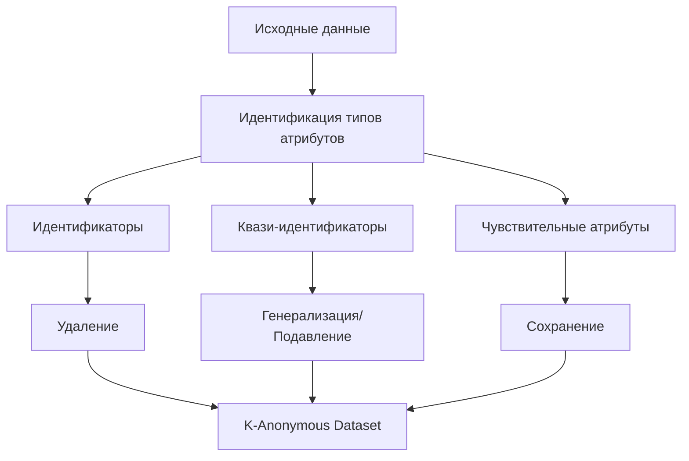

# Анонимные данные: определение, техники анонимизации и критерии истинной анонимности

Анонимные данные представляют собой информацию, из которой удалены все элементы, позволяющие идентифицировать конкретное физическое лицо. В отличие от псевдонимизированных данных, анонимные данные не подпадают под действие GDPR, если анонимизация является необратимой и исключает возможность повторной идентификации субъекта данных. Понимание различий между псевдонимизацией и истинной анонимизацией критически важно для систем веб-аналитики, стремящихся к соответствию международным требованиям защиты данных.

## Определение анонимных данных

Анонимные данные — это информация, которая не относится к идентифицированному или идентифицируемому физическому лицу, либо к персональным данным, преобразованным таким образом, что субъект данных больше не может быть идентифицирован.

### Критерии истинной анонимности

Согласно рекомендациям Article 29 Working Party, для достижения истинной анонимности данные должны удовлетворять трём основным критериям:

=== "Невозможность выделения (Singling Out)"

    **Определение:**

    - Невозможность изолировать все или часть записей, которые идентифицируют конкретного человека в наборе данных
    - Отсутствие уникальных комбинаций атрибутов, указывающих на конкретную личность
    
    **Практический пример:**

    - Если в наборе данных есть единственная запись о 85-летней женщине, проживающей в определённом почтовом коде, эта запись может быть выделена

=== "Невозможность связывания (Linkability)"

    **Определение:**

    - Невозможность связать две записи об одном и том же субъекте данных или группе субъектов
    - Предотвращение корреляции различных наборов данных об одном лице
    
    **Техническая реализация:**

    - Удаление временных паттернов поведения
    - Исключение стабильных идентификаторов
    - Разрушение связей между различными источниками данных

=== "Невозможность выведения (Inference)"

    **Определение:**

    - Невозможность с высокой вероятностью вывести значение любого атрибута субъекта данных
    - Исключение возможности дедукции информации из анализа данных
    
    **Методы защиты:**

    - Введение статистического шума
    - Обобщение чувствительных атрибутов
    - Ограничение детализации данных

!!! warning "Проблема реидентификации"
    
    Исследования показывают, что 99,98% людей могут быть правильно реидентифицированы в анонимизированных наборах данных, используя всего 15 характеристик, включая возраст, пол и семейное положение. Это подчёркивает сложность достижения истинной анонимности в больших наборах данных.

## Классические техники анонимизации

### K-Anonymity

K-anonymity обеспечивает, что каждый человек в наборе данных не может быть отличён от по крайней мере k-1 других людей относительно квази-идентификаторов в наборе данных.

**Основные принципы:**

- **Квази-идентификаторы**: Косвенные идентификаторы, такие как возраст, пол, почтовый код
- **Чувствительные атрибуты**: Защищаемая информация, которая не может быть изменена
- **Эквивалентные классы**: Группы записей с идентичными квази-идентификаторами

**Методы достижения k-anonymity:**

- **Генерализация**: Уменьшение точности данных (точный возраст → возрастной диапазон)
- **Подавление**: Удаление определённых значений атрибутов
- **Анатомизация**: Разделение квази-идентификаторов и чувствительных атрибутов

### L-Diversity

L-diversity создан для дополнения k-anonymity путём дополнительного поддержания разнообразия чувствительных полей. Модель l-diversity требует, чтобы каждый эквивалентный класс содержал минимум l различных значений для каждого чувствительного атрибута.

**Типы l-diversity:**

**Distinct l-diversity:**

- Простейший вариант, требующий минимум l различных значений

**Entropy l-diversity:**

- Основан на энтропии распределения чувствительных атрибутов
- Более строгая мера разнообразия

**Recursive (c,l)-diversity:**

- Гарантирует, что наиболее частое значение не встречается слишком часто

!!! info "Пример l-diversity"
    
    В медицинской базе данных с квази-идентификаторами (возраст, пол, город) и чувствительным атрибутом (заболевание), l-diversity с l=3 требует, чтобы каждая группа людей с одинаковыми возрастом, полом и городом имела минимум 3 различных заболевания.

### T-Closeness

T-closeness обеспечивает, что распределение чувствительного атрибута в обобщении квази-идентификатора близко к распределению чувствительного атрибута во всём наборе данных.

**Принцип работы:**

- Использует Earth Mover's Distance для измерения расстояния между распределениями
- Гарантирует, что локальное распределение не слишком отличается от глобального
- Защищает от атак на основе знания общего распределения

**Преимущества t-closeness:**

- Защита от атак на схожесть
- Учёт семантического значения атрибутов
- Более сильные гарантии приватности по сравнению с l-diversity

## Современные методы анонимизации

### Differential Privacy

Differential Privacy предоставляет математические гарантии приватности путём добавления контролируемого шума к результатам запросов.

**Формальное определение:**

Механизм M обеспечивает ε-differential privacy, если для всех наборов данных D1 и D2, отличающихся одной записью, и для всех возможных выходов S:

Pr[M(D1) ∈ S] ≤ eᵋ × Pr[M(D2) ∈ S]

**Типы Differential Privacy:**

=== "Centralized Differential Privacy (CDP)"

    **Характеристики:**

    - Доверенный сервер добавляет шум к агрегированным данным
    - Лучшая точность для статистических запросов
    - Требует доверия к центральному серверу

=== "Local Differential Privacy (LDP)"

    **Характеристики:**

    - Шум добавляется на уровне клиента перед передачей
    - Более сильные гарантии приватности
    - Меньшая точность результатов

=== "Shuffle Model"

    **Характеристики:**

    - Гибридный подход, комбинирующий CDP и LDP
    - Анонимизация через перемешивание данных
    - Баланс между приватностью и точностью

### Синтетические данные

Генерация синтетических данных создаёт новые наборы данных, сохраняя статистические свойства исходных данных без сохранения информации о конкретных людях.

**Методы генерации:**

**Generative Adversarial Networks (GANs):**

- Обучение генеративных моделей на реальных данных
- Создание синтетических выборок с похожими свойствами
- Защита от реидентификации через отсутствие прямого копирования

**Variational Autoencoders (VAEs):**

- Кодирование данных в латентное пространство
- Генерация новых точек из латентного распределения
- Контроль над уровнем похожести и приватности

### Federated Learning

Federated learning позволяет децентрализованное обучение модели, сохраняя сырые данные на отдельных устройствах.

**Принципы работы:**

- Модели обучаются локально на устройствах пользователей
- Только параметры модели передаются на центральный сервер
- Агрегация обновлений без доступа к исходным данным

**Дополнительные меры безопасности:**

- **Secure Aggregation**: Криптографическая защита параметров модели
- **Differential Privacy**: Добавление шума к локальным обновлениям
- **Homomorphic Encryption**: Вычисления на зашифрованных данных

### Homomorphic Encryption

Homomorphic encryption позволяет выполнять арифметические операции над зашифрованными текстами без их расшифровки.

**Типы homomorphic encryption:**

**Partially Homomorphic Encryption (PHE):**

- Поддержка одной операции (сложение или умножение)
- Высокая производительность
- Ограниченная функциональность

**Somewhat Homomorphic Encryption (SWHE):**

- Ограниченное количество операций
- Компромисс между функциональностью и производительностью

**Fully Homomorphic Encryption (FHE):**

- Неограниченные вычисления на зашифрованных данных
- Максимальная безопасность
- Высокие вычислительные затраты

## Проблемы современной анонимизации

### Атаки на анонимизированные данные

**Атаки связывания (Linkage Attacks):**

- Использование внешних источников данных для реидентификации
- Корреляция различных анонимизированных наборов
- Временная корреляция поведенческих паттернов

**Атаки на однородность (Homogeneity Attacks):**

- Эксплуатация недостатка разнообразия в чувствительных атрибутах
- Выведение информации из групп с похожими характеристиками

**Атаки на основе фоновых знаний (Background Knowledge Attacks):**

- Использование дополнительной информации о целевых лицах
- Комбинирование публичных данных с анонимизированными

### Technological Arms Race

**Растущие возможности реидентификации:**

- Развитие машинного обучения для паттерн-матчинга
- Увеличение доступных публичных наборов данных
- Совершенствование техник корреляционного анализа

**Ответные меры:**

- Развитие privacy-enhancing technologies (PETs)
- Улучшение математических гарантий приватности
- Регулярное обновление стандартов анонимизации

## Практические рекомендации

### Выбор метода анонимизации

**Для статистической отчётности:**

- Differential Privacy для агрегированных метрик
- Синтетические данные для детализированного анализа
- Federated Learning для распределённых вычислений

**Для машинного обучения:**

- Federated Learning с differential privacy
- Homomorphic encryption для чувствительных вычислений
- Privacy-preserving synthetic data generation

**Для исследований:**

- Комбинирование нескольких техник
- Регулярная оценка рисков реидентификации
- Применение принципа минимизации данных

### Оценка эффективности анонимизации

!!! tip "Motivated Intruder Test"
    
    Оцените, может ли разумно информированное лицо реидентифицировать людей, используя доступные ресурсы. Этот тест помогает определить, действительно ли данные анонимизированы.

**Факторы риска:**

- Редкость комбинаций атрибутов
- Доступность внешних источников данных
- Технические возможности потенциальных атакующих
- Временная стабильность анонимизации

**Continuous monitoring:**

- Регулярная переоценка рисков реидентификации
- Мониторинг новых техник атак
- Обновление методов анонимизации

Анонимизация данных остаётся сложной технической и юридической задачей. Современные исследования показывают, что традиционные методы деидентификации могут быть недостаточными для защиты от реидентификации с использованием машинного обучения. Успешная анонимизация требует комбинирования множественных техник, regular assessment рисков и внедрения privacy-by-design подходов.

Мы исследуем передовые методы анонимизации данных для интеграции в нашу аналитическую платформу. Наш подход предусматривает использование differential privacy для статистической отчётности, federated learning для распределённого анализа и advanced синтетических данных для детализированных исследований, обеспечивая соответствие международным стандартам защиты данных.

---

--8<-- "snippets/ai.ru.md"

!!! success "Готовы обеспечить истинную анонимность ваших данных?"
    
    Зарегистрируйтесь для бесплатного тестирования нашей аналитической платформы. Получите доступ к современным методам анонимизации, differential privacy механизмам и privacy-preserving analytics без технических сложностей внедрения.