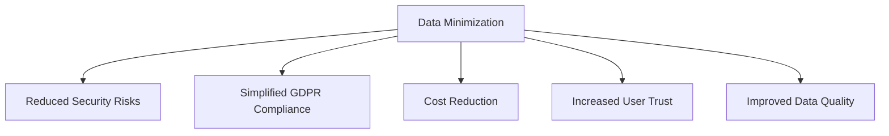
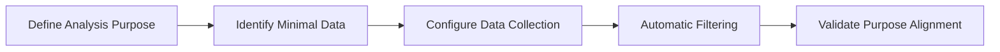
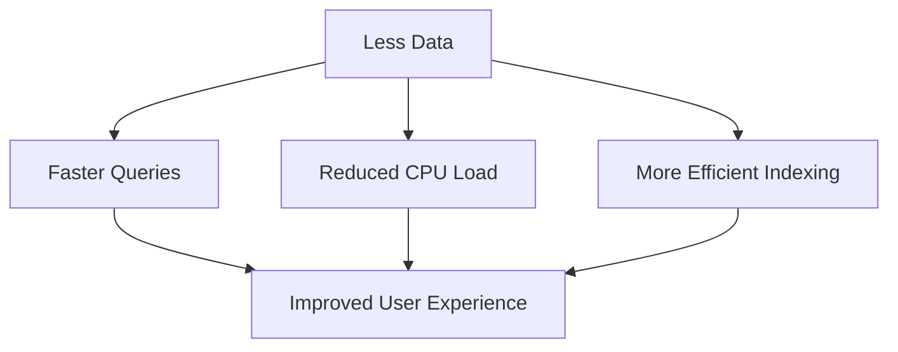
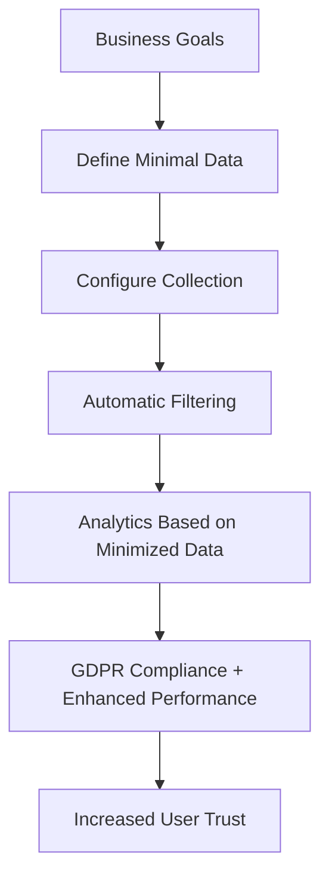

# Data Minimization: Collecting Only Necessary Information for GDPR-compliant Analytics

The data minimization principle represents a fundamental approach to responsible personal information management, requiring collection and storage of only information directly necessary to achieve stated purposes. In web analytics context, this principle becomes the cornerstone of GDPR compliance and other data protection laws.

## Legal Foundations of Data Minimization

### GDPR Requirements

Article 5(1)(c) GDPR defines the data minimization principle as requiring personal data to be "adequate, relevant and limited to what is necessary in relation to the purposes for which they are processed."

!!! info "Three Components of GDPR Data Minimization"

    **Adequacy (Adequate):**

    - Data must be sufficient to fulfill the stated purpose
    - Data shortage should not prevent achieving processing objectives

    **Relevance (Relevant):**

    - Rational connection exists between collected data and stated purpose
    - Data must be applicable to the specific task

    **Limitation (Limited to what is necessary):**

    - Collect no more data than required
    - Exclude "excess" information that might be useful in the future

### Enforcement Examples

European regulatory authorities actively apply the data minimization principle:

=== "Danish Data Protection Agency"

    **Case:** Company shared sensitive employee data with colleagues without necessity.

    **Violation:** Information transfer that wasn't necessary for work task performance.

    **Result:** Official warning for violating minimization principle.

=== "Finnish Agency"

    **Case:** Insurance company requested full medical records for claim settlements.

    **Violation:** Collection of excessive medical information unrelated to specific insurance cases.

    **Result:** €52,000 fine.

=== "Amazon France Logistique"

    **Case:** Excessive warehouse employee monitoring through scanners.

    **Violation:** Surveillance exceeded work-necessary requirements.

    **Result:** €32 million fine from CNIL.

## Applying Data Minimization in Web Analytics

### Traditional vs Minimalist Approach

**Traditional Data Collection Problems**

Many organizations collect data by the "more is better" principle, creating significant risks:

- Increased attack surface in data breaches
- Complicated regulatory compliance
- Additional storage and processing costs
- Reduced user trust

**Minimalist Approach Benefits**



### Practical Implementation in Analytics Systems

=== "User Session Analysis"

    **Minimal Dataset:**

    - Anonymized session identifier
    - Start/end timestamps
    - Number of viewed pages
    - Referrer (domain without parameters)

    **Excessive Data to Exclude:**

    - Full URLs with personal parameters
    - Precise timestamps to milliseconds
    - Detailed browser information
    - User's previous session history

=== "Geographic Analytics"

    **Necessary Data:**

    - Country and region (state/province)
    - Time zone for time adjustment
    - Browser language

    **Excessive Data:**

    - Exact GPS coordinates
    - Full IP addresses
    - Internet provider information
    - User movement history

!!! example "Practical Example: Data Minimization for E-commerce Analytics"

    **Purpose:** Marketing campaign effectiveness analysis

    **Minimally Necessary Data:**
    ```json
    {
        "session_id": "anonymous_hash_123",
        "campaign_source": "social_media",
        "campaign_medium": "organic",
        "conversion": true,
        "conversion_value": 99.99,
        "timestamp": "2025-08-28T14:00:00Z"
    }
    ```

    **Data to Exclude:**
    ```json
    {
        // Personal information
        "user_email": "user@example.com",
        "user_name": "John Smith",
        "phone_number": "+31234567890",
        
        // Excessive technical information
        "full_user_agent": "Mozilla/5.0 (Windows NT 10.0; Win64; x64)...",
        "screen_resolution": "1920x1080",
        "installed_plugins": ["flash", "java", "silverlight"],
        
        // Detailed behavioral information
        "mouse_movements": [...],
        "scroll_depth_by_second": [...],
        "time_spent_on_each_element": {...}
    }
    ```

## Data Minimization Implementation Strategies

### Proactive Measures

**Privacy by Design**

Embedding data minimization principles at analytics system design stage:

- Define minimal datasets for each analytical purpose
- Automatic exclusion of excessive information
- Regular review of collected data

**Purpose-driven Data Collection Approach**



### Technical Minimization Methods

=== "On-the-fly Aggregation"

    **Principle:** Instead of storing individual events, save only aggregated metrics.

    **Implementation:**
    ```javascript
    // Instead of saving each click
    const individualClick = {
        user_id: 'user123',
        timestamp: '2025-08-28T14:30:15.123Z',
        page: '/products/item-456',
        coordinates: {x: 245, y: 678}
    };
    
    // Save aggregated data
    const aggregatedData = {
        hour: '2025-08-28T14:00:00Z',
        page_clicks: 15,
        unique_sessions: 8,
        avg_time_on_page: 45.6
    };
    ```

=== "Progressive Data Deletion"

    **Storage strategy with decreasing detail:**

    - **0-30 days:** Full data for operational analytics
    - **30-90 days:** Aggregated hourly data
    - **90-365 days:** Aggregated daily data
    - **Over a year:** Only monthly aggregates

=== "Conditional Data Collection"

    **Adaptive collection system:**
    
    - Collect detailed data only with user consent
    - Automatic switch to minimal mode for opted-out users
    - Context-dependent tracking depth configuration

!!! tip "Automatic Minimization Techniques"

    **Algorithmic Filtering:**

    - Remove query parameters containing PII
    - IP address masking (remove last octet)
    - User agent generalization to core characteristics
    - Timestamp rounding to nearest hour

    **Minimization Rules:**

    - If data unused for 6 months → deletion
    - If metric accuracy unchanged when removing field → exclude field
    - If aggregated data sufficient for purpose → delete detailed data

## Business Benefits of Data Minimization

### Economic Benefits

**Reduced Infrastructure Costs**

Less data volume means:

- Reduced data storage requirements
- Lower backup costs
- Faster processing and analysis
- Reduced cloud service expenses

**Simplified Compliance**

- Less data for audit and control
- Simplified procedures for responding to data subject requests
- Reduced risk of regulatory violation fines

### Operational Advantages

**Improved Data Quality**

Focusing on necessary data leads to:

- Higher quality of collected information
- Reduced "junk" data volume
- Improved analytical model accuracy
- Faster insight generation

**Enhanced System Performance**



### Customer Trust and Reputation Benefits

**Increased User Trust**

Research shows 86% of users support minimizing collected data types. Transparent approach to collecting only necessary information:

- Demonstrates respect for user privacy
- Reduces concerns about data misuse
- Improves brand perception

**Competitive Advantages**

Organizations implementing data minimization principles gain:

- Reputation as responsible data processor
- Ability to use privacy-first approach as marketing advantage
- Readiness for stricter regulatory requirements

## Industry Applications

### E-commerce and Retail

=== "Shopping Cart Analysis"

    **Minimal Data:**

    - Anonymized cart identifier
    - Product categories (without exact names)
    - Total purchase amount
    - Payment method (category)

    **Purpose:** Assortment and pricing policy optimization

    **Excluded Data:**

    - Buyer personal information
    - Exact product names
    - Previous purchase history
    - Detailed delivery information

=== "Content Personalization"

    **Balancing Personalization and Minimization:**

    - Using behavioral signals instead of demographic data
    - Client-side data processing for personalization
    - Federated learning for recommendation improvement

### Healthcare and Medical Data

**Special Requirements for Medical Data Minimization:**

- Strict adherence to necessity principle
- Data separation by specialization
- Temporal access limitations
- Pseudonymization as standard practice

### Financial Services

**Financial Data Minimization Specifics:**

- Balancing AML/KYC requirements and minimization
- Risk-oriented data collection approach
- Automated data deletion after retention periods

!!! warning "Special Considerations for Regulated Industries"

    In industries with additional regulation (finance, healthcare, telecommunications), data minimization principles must consider:

    - Specific industry legislation requirements
    - Data retention period compliance needs
    - Audit and reporting requirements
    - Cross-border data transfer specifics

## Practical Implementation Recommendations

### Step-by-step Data Minimization Implementation

**Stage 1: Current State Audit**

- Inventory all collected data
- Map data to stated processing purposes
- Identify excessive information
- Assess risks and costs

**Stage 2: Minimization Policy Development**

- Create "purpose → minimal data" matrix
- Establish automatic filtering rules
- Define regular review procedures
- Train staff on minimization principles

**Stage 3: Technical Implementation**

```javascript
// Automatic minimization system example
class DataMinimizer {
    constructor(purposes) {
        this.purposes = purposes;
        this.minimizationRules = this.buildRules();
    }
    
    collectData(rawData, purpose) {
        const allowedFields = this.purposes[purpose].requiredFields;
        const minimizedData = {};
        
        allowedFields.forEach(field => {
            if (rawData[field] !== undefined) {
                minimizedData[field] = this.applyFieldMinimization(
                    rawData[field], 
                    field, 
                    purpose
                );
            }
        });
        
        return minimizedData;
    }
    
    applyFieldMinimization(value, field, purpose) {
        const rules = this.minimizationRules[field];
        if (rules && rules[purpose]) {
            return rules[purpose](value);
        }
        return value;
    }
}

// Configuration for different purposes
const analyticsMinimizer = new DataMinimizer({
    'traffic_analysis': {
        requiredFields: ['session_id', 'page_category', 'timestamp_hour', 'referrer_domain']
    },
    'conversion_tracking': {
        requiredFields: ['campaign_source', 'conversion_type', 'value_range', 'timestamp_day']
    }
});
```

**Stage 4: Monitoring and Optimization**

- Regular minimization effectiveness assessment
- Analysis of impact on analytics quality
- Rule adjustment based on feedback
- Track regulatory compliance

### Overcoming Obstacles

=== "Resistance to Change"

    **Problem:** Teams accustomed to "maximalist" data collection approach.

    **Solutions:**

    - Demonstrate business benefits of minimization
    - Gradual implementation with pilot projects
    - Training and awareness raising
    - Create tools to simplify working with minimized data

=== "Technical Difficulties"

    **Problem:** Existing systems don't support flexible data minimization.

    **Solutions:**

    - Phased architecture modernization
    - Use intermediate layer for data filtering
    - Implement microservice architecture
    - Automate minimization processes

=== "Balancing Business Needs"

    **Problem:** Concerns about losing analytical capabilities.

    **Solutions:**

    - Use synthetic data to supplement minimized datasets
    - Apply federated learning to preserve model accuracy
    - Develop new analysis methods for limited data

We conducted comprehensive research on data minimization principles' impact on web analytics effectiveness. Our experiments showed that properly implemented data minimization not only ensures GDPR compliance but also improves overall analytical process quality by focusing on the most significant information.



The data minimization principle represents not a limitation, but an opportunity to create more efficient, secure, and ethical analytical systems. Organizations that implement this principle early gain competitive advantages in improved reputation, reduced risks, and optimized operational processes.

--8<-- "snippets/ai.md"

!!! success "Ready to Implement Data Minimization Principles?"

    Our analytics platform is designed with privacy-by-design principles and ensures automatic minimization of collected data. Get powerful analytics with full GDPR compliance and user privacy protection.