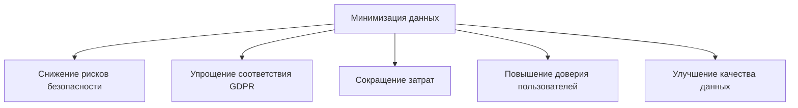
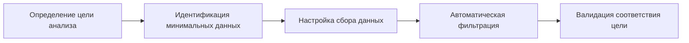
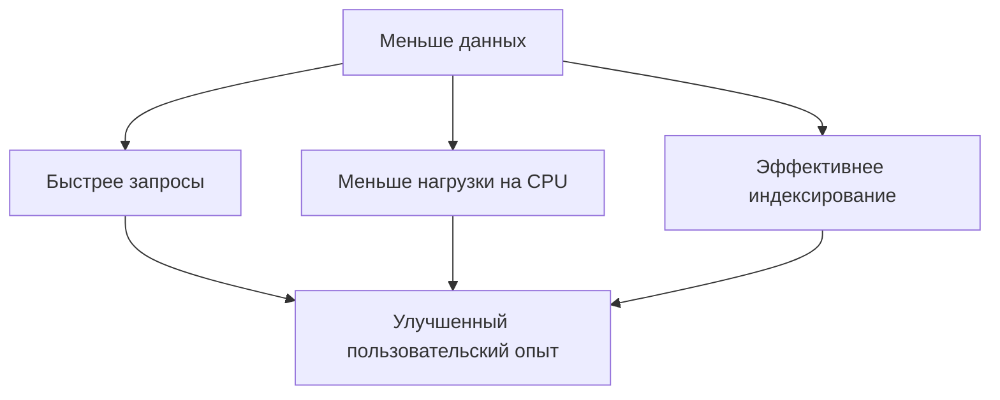
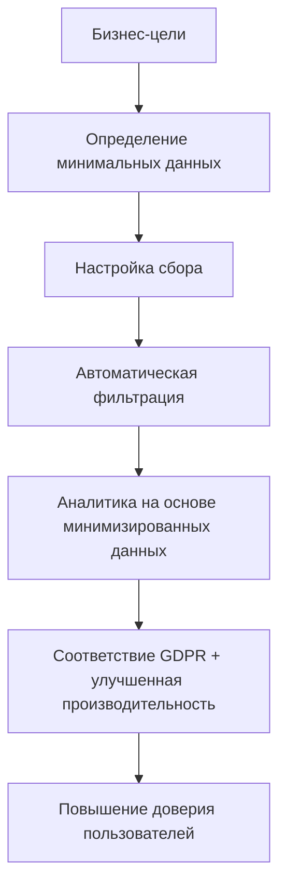

# Минимизация данных: сбор только необходимой информации для GDPR-совместимой аналитики

Принцип минимизации данных представляет собой основополагающий подход к ответственному управлению персональной информацией, требующий сбора и хранения только той информации, которая непосредственно необходима для достижения заявленных целей. В контексте веб-аналитики этот принцип становится краеугольным камнем соответствия требованиям GDPR и других законов о защите данных.

## Правовые основы минимизации данных

### Требования GDPR

Статья 5(1)(c) GDPR определяет принцип минимизации данных как требование того, чтобы персональные данные были "адекватными, релевантными и ограничивались тем, что необходимо в связи с целями, для которых они обрабатываются".

!!! info "Три компонента минимизации данных по GDPR"

    **Адекватность (Adequate):**

    - Данные должны быть достаточными для выполнения заявленной цели
    - Недостаток данных не должен препятствовать достижению целей обработки

    **Релевантность (Relevant):**

    - Существует рациональная связь между собираемыми данными и заявленной целью
    - Данные должны быть применимы к конкретной задаче

    **Ограниченность (Limited to what is necessary):**

    - Сбор не большего объема данных, чем требуется
    - Исключение "излишков" информации, которые могли бы быть полезными в будущем

### Примеры правоприменения

Европейские регулирующие органы активно применяют принцип минимизации данных:

=== "Датское агентство по защите данных"

    **Случай:** Компания делилась чувствительными данными сотрудника с коллегами без необходимости.

    **Нарушение:** Передача информации, которая не была необходима для выполнения рабочих задач.

    **Результат:** Официальное предупреждение за нарушение принципа минимизации.

=== "Финское агентство"

    **Случай:** Страховая компания запрашивала полные медицинские карты для урегулирования претензий.

    **Нарушение:** Сбор избыточной медицинской информации, не связанной с конкретными страховыми случаями.

    **Результат:** Штраф в размере 52,000 евро.

=== "Amazon France Logistique"

    **Случай:** Избыточный мониторинг сотрудников складов через сканеры.

    **Нарушение:** Слежение превышало необходимые для работы требования.

    **Результат:** Штраф в размере 32 миллионов евро от CNIL.

## Применение минимизации данных в веб-аналитике

### Традиционный подход vs минималистский подход

**Проблемы традиционного сбора данных**

Многие организации собирают данные по принципу "чем больше, тем лучше", что создает значительные риски:

- Увеличение поверхности атак при утечках данных
- Усложнение соответствия регулятивным требованиям
- Дополнительные затраты на хранение и обработку
- Снижение доверия пользователей

**Преимущества минималистского подхода**



### Практическая реализация в аналитических системах

=== "Анализ пользовательских сессий"

    **Минимальный набор данных:**

    - Анонимизированный идентификатор сессии
    - Временные метки начала/окончания
    - Количество просмотренных страниц
    - Реферер (домен без параметров)

    **Избыточные данные для исключения:**

    - Полные URL с персональными параметрами
    - Точные временные метки до миллисекунд
    - Подробная информация о браузере
    - История предыдущих сессий пользователя

=== "Географическая аналитика"

    **Необходимые данные:**

    - Страна и регион (область/штат)
    - Часовой пояс для корректировки времени
    - Язык браузера

    **Избыточные данные:**

    - Точные координаты GPS
    - Полные IP-адреса
    - Информация о провайдере интернета
    - История перемещений пользователя

!!! example "Практический пример: минимизация сбора данных для e-commerce аналитики"

    **Цель:** Анализ эффективности маркетинговых кампаний

    **Минимально необходимые данные:**
    ```json
    {
        "session_id": "anonymous_hash_123",
        "campaign_source": "social_media",
        "campaign_medium": "organic",
        "conversion": true,
        "conversion_value": 99.99,
        "timestamp": "2025-08-28T14:00:00Z"
    }
    ```

    **Данные, от которых можно отказаться:**
    ```json
    {
        // Персональная информация
        "user_email": "user@example.com",
        "user_name": "John Smith",
        "phone_number": "+31234567890",
        
        // Избыточная техническая информация
        "full_user_agent": "Mozilla/5.0 (Windows NT 10.0; Win64; x64)...",
        "screen_resolution": "1920x1080",
        "installed_plugins": ["flash", "java", "silverlight"],
        
        // Детальная поведенческая информация
        "mouse_movements": [...],
        "scroll_depth_by_second": [...],
        "time_spent_on_each_element": {...}
    }
    ```

## Стратегии реализации минимизации данных

### Проактивные меры

**Дизайн с учетом конфиденциальности (Privacy by Design)**

Встраивание принципов минимизации данных на этапе проектирования аналитических систем:

- Определение минимальных наборов данных для каждой аналитической цели
- Автоматическое исключение избыточной информации
- Регулярная ревизия собираемых данных

**Целевой подход к сбору данных**



### Технические методы минимизации

=== "Агрегация на лету"

    **Принцип:** Вместо хранения индивидуальных событий сохранение только агрегированных метрик.

    **Реализация:**
    ```javascript
    // Вместо сохранения каждого клика
    const individualClick = {
        user_id: 'user123',
        timestamp: '2025-08-28T14:30:15.123Z',
        page: '/products/item-456',
        coordinates: {x: 245, y: 678}
    };
    
    // Сохраняем агрегированные данные
    const aggregatedData = {
        hour: '2025-08-28T14:00:00Z',
        page_clicks: 15,
        unique_sessions: 8,
        avg_time_on_page: 45.6
    };
    ```

=== "Прогрессивное удаление данных"

    **Стратегия хранения с уменьшающейся детализацией:**

    - **0-30 дней:** Полные данные для оперативной аналитики
    - **30-90 дней:** Агрегированные почасовые данные
    - **90-365 дней:** Агрегированные дневные данные
    - **Более года:** Только месячные агрегаты

=== "Условный сбор данных"

    **Адаптивная система сбора:**
    
    - Сбор детальных данных только при наличии согласия пользователя
    - Автоматическое переключение на минимальный режим для отказавшихся пользователей
    - Контекстно-зависимая настройка глубины отслеживания

!!! tip "Техники автоматической минимизации"

    **Алгоритмическая фильтрация:**

    - Удаление параметров запроса, содержащих PII
    - Маскирование IP-адресов (удаление последнего октета)
    - Обобщение пользовательских агентов до основных характеристик
    - Округление временных меток до ближайшего часа

    **Правила минимизации:**

    - Если данные не использовались в течение 6 месяцев → удаление
    - Если точность метрики не изменяется при удалении поля → исключение поля
    - Если агрегированные данные достаточны для цели → удаление детализированных данных

## Бизнес-преимущества минимизации данных

### Экономические выгоды

**Снижение затрат на инфраструктуру**

Меньший объем данных означает:

- Уменьшение требований к хранилищам данных
- Снижение затрат на резервное копирование
- Ускорение процессов обработки и анализа
- Сокращение расходов на облачные сервисы

**Упрощение соответствия требованиям**

- Меньше данных для аудита и контроля
- Упрощенные процедуры реагирования на запросы субъектов данных
- Снижение рисков штрафов за нарушение регулятивных требований

### Операционные преимущества

**Улучшение качества данных**

Концентрация на необходимых данных приводит к:

- Более высокому качеству собираемой информации
- Уменьшению количества "мусорных" данных
- Улучшению точности аналитических моделей
- Повышению скорости получения инсайтов

**Повышение производительности системы**



### Доверие клиентов и репутационные выгоды

**Повышение доверия пользователей**

Исследования показывают, что 86% пользователей поддерживают минимизацию типов собираемых данных. Прозрачный подход к сбору только необходимой информации:

- Демонстрирует уважение к приватности пользователей
- Снижает беспокойство о неправомерном использовании данных
- Улучшает восприятие бренда

**Конкурентные преимущества**

Организации, внедряющие принципы минимизации данных, получают:

- Репутацию ответственного обработчика данных
- Возможность использовать privacy-first подход как маркетинговое преимущество
- Готовность к ужесточению регулятивных требований

## Отраслевые применения

### E-commerce и розничная торговля

=== "Анализ корзины покупок"

    **Минимальные данные:**

    - Анонимизированный идентификатор корзины
    - Категории товаров (без точных наименований)
    - Общая стоимость покупки
    - Способ оплаты (категория)

    **Цель:** Оптимизация ассортимента и ценовой политики

    **Исключаемые данные:**

    - Персональная информация покупателя
    - Точные наименования товаров
    - История предыдущих покупок
    - Детальная информация о доставке

=== "Персонализация контента"

    **Балансирование персонализации и минимизации:**

    - Использование поведенческих сигналов вместо демографических данных
    - Клиентская обработка данных для персонализации
    - Федеративное обучение для улучшения рекомендаций

### Здравоохранение и медицинские данные

**Особые требования к минимизации медицинских данных:**

- Строгое соблюдение принципа необходимости
- Разделение данных по специализациям
- Временные ограничения на доступ к информации
- Псевдонимизация как стандартная практика

### Финансовые услуги

**Специфика минимизации финансовых данных:**

- Балансирование требований AML/KYC и минимизации
- Риск-ориентированный подход к сбору данных
- Автоматизированное удаление данных по истечении сроков хранения

!!! warning "Особые соображения для регулируемых отраслей"

    В отраслях с дополнительным регулированием (финансы, здравоохранение, телекоммуникации) принципы минимизации данных должны учитывать:

    - Специфические требования отраслевого законодательства
    - Необходимость соблюдения сроков хранения данных
    - Требования к аудиту и отчетности
    - Особенности трансграничной передачи данных

## Практические рекомендации по внедрению

### Пошаговое внедрение минимизации данных

**Этап 1: Аудит текущего состояния**

- Инвентаризация всех собираемых данных
- Сопоставление данных с заявленными целями обработки
- Идентификация избыточной информации
- Оценка рисков и затрат

**Этап 2: Разработка политик минимизации**

- Создание матрицы "цель → минимальные данные"
- Установление правил автоматической фильтрации
- Определение процедур регулярного пересмотра
- Обучение персонала принципам минимизации

**Этап 3: Техническая реализация**

```javascript
// Пример системы автоматической минимизации
class DataMinimizer {
    constructor(purposes) {
        this.purposes = purposes;
        this.minimizationRules = this.buildRules();
    }
    
    collectData(rawData, purpose) {
        const allowedFields = this.purposes[purpose].requiredFields;
        const minimizedData = {};
        
        allowedFields.forEach(field => {
            if (rawData[field] !== undefined) {
                minimizedData[field] = this.applyFieldMinimization(
                    rawData[field], 
                    field, 
                    purpose
                );
            }
        });
        
        return minimizedData;
    }
    
    applyFieldMinimization(value, field, purpose) {
        const rules = this.minimizationRules[field];
        if (rules && rules[purpose]) {
            return rules[purpose](value);
        }
        return value;
    }
}

// Конфигурация для различных целей
const analyticsMinimizer = new DataMinimizer({
    'traffic_analysis': {
        requiredFields: ['session_id', 'page_category', 'timestamp_hour', 'referrer_domain']
    },
    'conversion_tracking': {
        requiredFields: ['campaign_source', 'conversion_type', 'value_range', 'timestamp_day']
    }
});
```

**Этап 4: Мониторинг и оптимизация**

- Регулярная оценка эффективности минимизации
- Анализ влияния на качество аналитики
- Корректировка правил на основе обратной связи
- Отслеживание соответствия регулятивным требованиям

### Преодоление препятствий

=== "Сопротивление изменениям"

    **Проблема:** Команды привыкли к "максималистскому" подходу к сбору данных.

    **Решения:**

    - Демонстрация бизнес-преимуществ минимизации
    - Постепенное внедрение с пилотными проектами
    - Обучение и повышение осведомленности
    - Создание инструментов для упрощения работы с минимизированными данными

=== "Технические сложности"

    **Проблема:** Существующие системы не поддерживают гибкую минимизацию данных.

    **Решения:**

    - Поэтапная модернизация архитектуры
    - Использование промежуточного слоя для фильтрации данных
    - Внедрение микросервисной архитектуры
    - Автоматизация процессов минимизации

=== "Балансирование бизнес-потребностей"

    **Проблема:** Опасения о потере аналитических возможностей.

    **Решения:**

    - Использование синтетических данных для дополнения минимизированных наборов
    - Применение федеративного обучения для сохранения точности моделей
    - Разработка новых методов анализа для работы с ограниченными данными

Мы провели комплексное исследование влияния принципов минимизации данных на эффективность веб-аналитики. Наши эксперименты показали, что правильно реализованная минимизация данных не только обеспечивает соответствие GDPR, но и улучшает общее качество аналитических процессов за счет фокуса на наиболее значимой информации.



Принцип минимизации данных представляет собой не ограничение, а возможность для создания более эффективных, безопасных и этичных аналитических систем. Организации, которые внедряют этот принцип на раннем этапе, получают конкурентные преимущества в виде улучшенной репутации, снижения рисков и оптимизации операционных процессов.

--8<-- "snippets/ai.ru.md"

!!! success "Готовы внедрить принципы минимизации данных?"

    Наша аналитическая платформа разработана с учетом принципов privacy-by-design и обеспечивает автоматическую минимизацию собираемых данных. Получите мощную аналитику при полном соответствии требованиям GDPR и защите конфиденциальности пользователей.