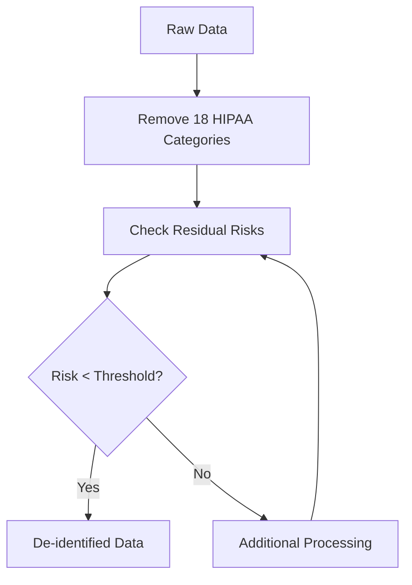
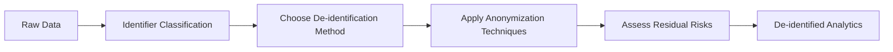

# De-identification of Data: Standards for Personal Information Protection in Web Analytics

De-identification is the process of removing or modifying personal identifiers from data to protect user privacy. In web analytics, this approach becomes critically important for compliance with privacy requirements while preserving data value for analysis.

## What is Data De-identification

De-identification is a systematic process of eliminating direct and indirect identifiers from datasets. Unlike simple removal of names or email addresses, effective de-identification considers the possibility of re-identification through combinations of various data attributes.

!!! info "Main Categories of Identifiers"

    **Direct Identifiers:**

    - Names, email addresses
    - Phone numbers, residential addresses
    - Social security numbers

    **Indirect Identifiers (Quasi-identifiers):**

    - Demographic data (age, gender)
    - Geographic location
    - Activity timestamps
    - Behavioral patterns

## De-identification Standards

### HIPAA Safe Harbor Method

The American HIPAA standard defines a "safe harbor" method that requires removal of 18 specific categories of identifiers. Despite its medical focus, the principles apply to any personal data.



### Expert Determination

An alternative approach involves engaging a qualified expert to determine that the risk of re-identification is very small. The expert must document their analysis and justify conclusions with statistical and scientific methods.

!!! warning "Expert Assessment Limitations"

    - No universal validity period
    - Subjectivity of risk assessment
    - Need for regular review

## Application in Web Analytics

In web analytics systems, de-identification is particularly relevant for protecting the following data types:

**User Activity**

- IP addresses (masking last octet)
- User-Agent strings (browser version generalization)
- Referrer URLs (removing query parameters)

**Temporal Data**

- Precise timestamps (rounding to hour/day)
- Action sequences (adding noise)

**Geographic Data**

- Replacing exact coordinates with regions
- Grouping cities by population

!!! example "De-identification Example in Analytics"

    **Before de-identification:**
    ```
    IP: 192.168.1.45
    Time: 2025-08-28 14:32:15
    City: Almelo
    Browser: Chrome 127.0.0.0
    ```

    **After de-identification:**
    ```
    IP: 192.168.1.0/24
    Time: 2025-08-28 14:00:00
    Region: Overijssel
    Browser: Chrome 127.x.x
    ```

## Re-identification Risks

Even when following de-identification standards, residual risk of user identity recovery remains. Modern research shows that combining data from various sources can lead to unexpected re-identification.

=== "Data Linkage Attack"

    Attackers may use publicly available data to match with de-identified datasets.

=== "Mosaic Attack"

    Gradual accumulation of information from various sources to build user profiles.

=== "Differential Attack"

    Analysis of differences between datasets to extract information about specific individuals.

## Technical Implementation

### Data Generalization

Replacing specific values with broader categories. Instead of exact age "28 years" use range "25-30 years".

### Data Suppression

Complete removal of fields or records that may contribute to identification.

### Noise Addition

Introducing statistical distortions that preserve general trends but make precise identification of individual records difficult.

!!! tip "Technical Implementation Recommendations"

    **Process Automation:**

    - Apply de-identification algorithms at data collection stage
    - Regular effectiveness method verification

    **Quality Control:**

    - Monitor impact on analytics accuracy
    - Balance privacy and data utility

## Regulatory Compliance

### GDPR and European Law

Under GDPR, de-identified data may no longer be considered personal if re-identification is impossible. However, regulators set high standards for proving process irreversibility.

### National Standards

Various jurisdictions may have specific requirements for de-identification methods and criteria. It's important to consider local legislation when developing data processing policies.

## Practical Significance for Analytics Platforms

Effective de-identification allows analytical systems to:

- Conduct user behavior research without violating privacy
- Share aggregated data with third parties
- Comply with requirements of various jurisdictions
- Reduce risks in potential data breaches

We researched various approaches to balancing user protection and preserving analytical data value. Our experience shows that properly implemented de-identification can provide high-level privacy protection with minimal impact on insight quality.



Implementing de-identification procedures requires a comprehensive approach considering technical, legal, and ethical aspects of data processing. When properly applied, these methods become the foundation for responsible analytics that protects user privacy while providing valuable business insights.

--8<-- "snippets/ai.md"

!!! success "Ready to Protect User Data?"

    Try our analytics tool with built-in de-identification features. Get full control over personal data processing and ensure compliance with international privacy standards.