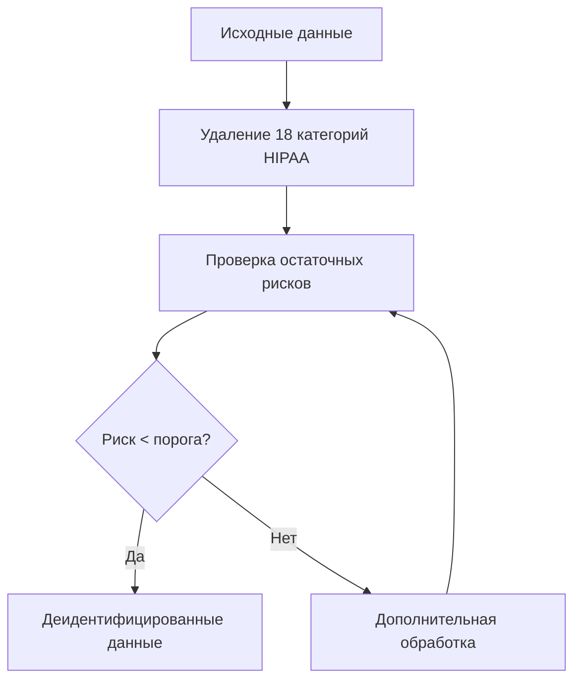
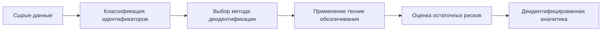

# Деидентификация данных: стандарты защиты личной информации в веб-аналитике

Деидентификация представляет собой процесс удаления или изменения персональных идентификаторов из данных с целью защиты конфиденциальности пользователей. В веб-аналитике этот подход становится критически важным для соблюдения требований конфиденциальности при сохранении ценности данных для анализа.

## Что такое деидентификация данных

Деидентификация — это систематический процесс устранения прямых и косвенных идентификаторов из наборов данных. В отличие от простого удаления имен или email-адресов, эффективная деидентификация учитывает возможность реидентификации через комбинацию различных атрибутов данных.

!!! info "Основные категории идентификаторов"

    **Прямые идентификаторы:**

    - Имена, адреса электронной почты
    - Телефонные номера, адреса проживания
    - Номера социального страхования

    **Косвенные идентификаторы (квази-идентификаторы):**

    - Демографические данные (возраст, пол)
    - Географическое местоположение
    - Временные метки активности
    - Поведенческие паттерны

## Стандарты деидентификации

### HIPAA Safe Harbor метод

Американский стандарт HIPAA определяет метод "безопасной гавани", который требует удаления 18 специфических категорий идентификаторов. Несмотря на медицинскую направленность, принципы применимы к любым персональным данным.



### Экспертная оценка

Альтернативный подход предполагает привлечение квалифицированного эксперта для определения того, что риск реидентификации является очень малым. Эксперт должен документировать свой анализ и обосновать выводы статистическими и научными методами.

!!! warning "Ограничения экспертной оценки"

    - Отсутствие универсального срока действия
    - Субъективность оценки рисков
    - Необходимость регулярного пересмотра

## Применение в веб-аналитике

В контексте систем веб-аналитики деидентификация особенно актуальна для защиты следующих типов данных:

**Пользовательская активность**

- IP-адреса (маскирование последнего октета)
- User-Agent строки (обобщение версий браузера)
- Referrer URL (удаление параметров запроса)

**Временные данные**

- Точные временные метки (округление до часа/дня)
- Последовательности действий (добавление шума)

**Географические данные**

- Замена точных координат на регионы
- Группировка городов по населению

!!! example "Пример деидентификации в аналитике"

    **До деидентификации:**
    ```
    IP: 192.168.1.45
    Время: 2025-08-28 14:32:15
    Город: Алмело
    Браузер: Chrome 127.0.0.0
    ```

    **После деидентификации:**
    ```
    IP: 192.168.1.0/24
    Время: 2025-08-28 14:00:00
    Регион: Оверейссел
    Браузер: Chrome 127.x.x
    ```

## Риски реидентификации

Даже при соблюдении стандартов деидентификации сохраняется остаточный риск восстановления личности пользователей. Современные исследования показывают, что комбинирование данных из различных источников может привести к неожиданной реидентификации.

=== "Атака связывания данных"

    Злоумышленники могут использовать публично доступные данные для сопоставления с деидентифицированными наборами.

=== "Мозаичная атака"

    Постепенное накопление информации из различных источников для составления профиля пользователя.

=== "Дифференциальная атака"

    Анализ различий между наборами данных для извлечения информации о конкретных людях.

## Техническая реализация

### Обобщение данных

Замена конкретных значений более широкими категориями. Вместо точного возраста "28 лет" используется диапазон "25-30 лет".

### Подавление данных

Полное удаление полей или записей, которые могут способствовать идентификации.

### Добавление шума

Внесение статистических искажений, которые сохраняют общие тенденции, но затрудняют точную идентификацию отдельных записей.

!!! tip "Рекомендации по техническому внедрению"

    **Автоматизация процессов:**

    - Применение алгоритмов деидентификации на этапе сбора данных
    - Регулярная проверка эффективности методов

    **Контроль качества:**

    - Мониторинг влияния на точность аналитики
    - Балансирование конфиденциальности и полезности данных

## Соответствие регулятивным требованиям

### GDPR и европейское право

В рамках GDPR деидентифицированные данные могут больше не считаться персональными, если невозможна реидентификация. Однако регулятор устанавливает высокие стандарты для подтверждения необратимости процесса.

### Национальные стандарты

Различные юрисдикции могут предъявлять специфические требования к методам и критериям деидентификации. Важно учитывать местное законодательство при разработке политик обработки данных.

## Практическая значимость для аналитических платформ

Эффективная деидентификация позволяет аналитическим системам:

- Проводить исследования пользовательского поведения без нарушения конфиденциальности
- Делиться агрегированными данными с третьими сторонами
- Соответствовать требованиям различных юрисдикций
- Снижать риски при потенциальных утечках данных

Мы исследовали различные подходы к балансу между защитой пользователей и сохранением аналитической ценности данных. Наш опыт показывает, что правильно реализованная деидентификация может обеспечить высокий уровень защиты конфиденциальности при минимальном влиянии на качество инсайтов.



Внедрение процедур деидентификации требует комплексного подхода, учитывающего технические, правовые и этические аспекты обработки данных. При правильном применении эти методы становятся основой для ответственной аналитики, которая защищает конфиденциальность пользователей и одновременно предоставляет ценные инсайты для бизнеса.

--8<-- "snippets/ai.ru.md"

!!! success "Готовы защитить данные пользователей?"

    Попробуйте наш инструмент аналитики с встроенными функциями деидентификации. Получите полный контроль над обработкой персональных данных и обеспечьте соответствие международным стандартам конфиденциальности.