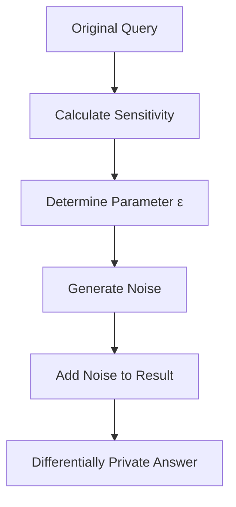
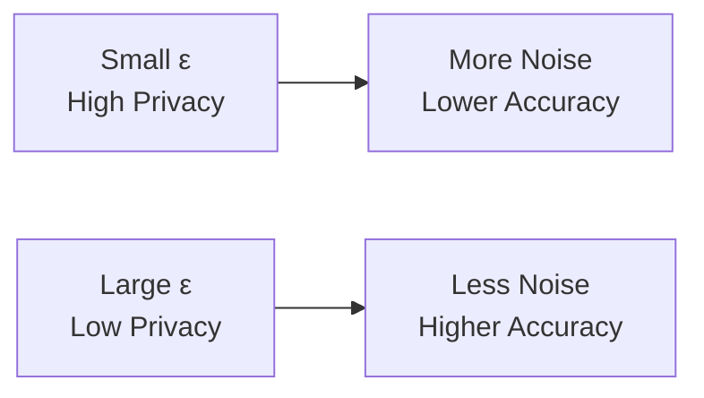
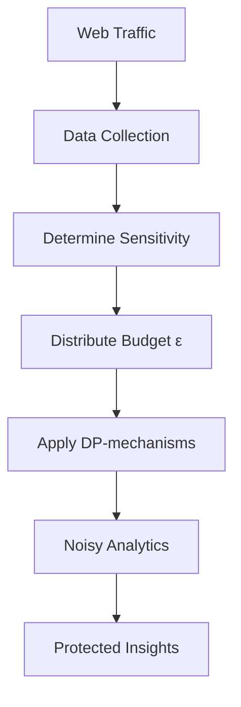

# Differential Privacy: Adding Noise for Data Protection in Analytics

Differential privacy represents a mathematically rigorous privacy protection system that enables extracting useful information from datasets while limiting the possibility of identifying individuals. This approach revolutionizes methods of analyzing sensitive data in web analytics.

## Principles of Differential Privacy

Differential privacy is based on adding carefully calibrated statistical noise to database query results. The key idea is that the presence or absence of one person in a dataset should not significantly affect the analysis result.

!!! info "Mathematical Definition"

    Algorithm M provides ε-differential privacy if for any two datasets D and D' differing by one record, and any possible result S:

    P[M(D) ∈ S] ≤ exp(ε) × P[M(D') ∈ S]

    where ε (epsilon) is the privacy parameter controlling the level of protection.

### Key Components

**Privacy Budget**

Parameter ε determines the maximum allowable information leakage. Smaller values provide better protection but require more noise, reducing result accuracy.

**Query Sensitivity**

Maximum change in query result when adding or removing one record from the dataset. This parameter determines the required noise level.

**Noise Addition Mechanisms**

Special algorithms that add calibrated noise to query results to ensure differential privacy.



## Noise Addition Mechanisms

### Laplace Mechanism

The most common approach for numerical result queries. Noise is generated from Laplace distribution with scale parameter proportional to query sensitivity and inversely proportional to ε.

=== "Application"

    **Suitable Queries:**

    - Record counting
    - Numerical value summation
    - Average value calculation

    **Laplace Noise Properties:**

    - Symmetric distribution around zero
    - Exponential probability decay
    - Simple calibration

=== "Practical Example"

    ```javascript
    function addLaplaceNoise(trueValue, sensitivity, epsilon) {
        const scale = sensitivity / epsilon;
        // Generate noise from Laplace distribution
        const noise = generateLaplaceNoise(0, scale);
        return trueValue + noise;
    }
    
    // Usage example
    const trueCount = 1547; // Real visitor count
    const noisyCount = addLaplaceNoise(trueCount, 1, 0.1);
    // Result: ~1547 ± random noise
    ```

### Gaussian Mechanism

Used to ensure (ε, δ)-differential privacy, where δ represents a small probability of privacy guarantee violation.

**Characteristics:**

- Noise from normal distribution
- Additional parameter δ for flexibility
- Often applied in machine learning

### Exponential Mechanism

Designed for selecting elements from discrete sets of possible answers. Each option's selection probability exponentially depends on its "utility".

!!! example "Exponential Mechanism Application"

    **Selecting most popular page with privacy protection:**

    - Each page receives weight proportional to view count
    - Exponential noise added to weights
    - Page selected randomly with probabilities proportional to noisy weights

## Application in Web Analytics

### Protecting Aggregated Metrics

**Unique Visitor Counting**

Traditional unique user counting methods may reveal information about specific person presence in data. Differential privacy allows obtaining approximate but protected estimates.

**Time Series Analysis**

Adding noise to temporal site activity data protects individual behavior patterns while preserving general trends.

**Geographic Analytics**

Noising user location data prevents tracking specific individuals while maintaining regional statistics.

### Advanced Applications

=== "Machine Learning"

    **Differentially Private Model Training:**

    - DP-SGD (Differentially Private Stochastic Gradient Descent) algorithm
    - Gradient clipping to limit individual example influence
    - Adding noise to gradients at each training step

    ```python
    # DP-SGD pseudocode
    for epoch in training_epochs:
        for batch in data_batches:
            # Calculate gradients for each example
            per_example_gradients = compute_gradients(batch)
            # Clip gradients
            clipped_gradients = clip_gradients(per_example_gradients, clip_norm)
            # Add noise
            noisy_gradients = add_gaussian_noise(clipped_gradients, noise_scale)
            # Update model parameters
            update_model(noisy_gradients)
    ```

=== "Continuous Monitoring"

    **Streaming Analytics with Privacy Protection:**

    - Real-time data processing
    - Privacy budget management over time
    - Adaptive ε distribution between queries

## Privacy-Utility Tradeoffs

The central problem of differential privacy is balancing privacy protection and result accuracy. This tradeoff is determined by several factors.

### Factors Affecting Accuracy

**Privacy Budget Size**



**Query Sensitivity**

Queries with high sensitivity require more noise to ensure the same privacy level.

**Dataset Size**

Large datasets allow obtaining more accurate results with the same privacy protection level.

!!! warning "Privacy Budget Accumulation"

    Each data query "spends" part of the privacy budget. With multiple queries, the budget accumulates, potentially requiring increased noise or query limitations.

### Practical Optimization Strategies

**Query Composition**

Combining related queries for more efficient privacy budget use.

**Hierarchical Structure**

Distributing budget between different data detail levels.

**Adaptive Algorithms**

Dynamic budget allocation based on query importance and available resources.

## Technical Implementation

### Infrastructure Requirements

**Random Number Generation**

High-quality random number generators are critical for differential privacy mechanism reliability.

**Side-Channel Attack Protection**

Implementation must consider possible attacks through side channels like execution time or memory consumption.

**Audit and Monitoring**

System should track privacy budget usage and prevent exceeding limits.

### Libraries and Tools

=== "Open-source Solutions"

    **Google Differential Privacy**

    - Libraries for C++, Go, Java
    - Ready mechanisms for standard tasks
    - Integration with popular frameworks

    **OpenDP (Harvard)**

    - Python and Rust implementations
    - Modular architecture
    - Formal algorithm verification

=== "Commercial Platforms"

    **Tumult Analytics**

    - Platform for differentially private analytics
    - Ready integrations with popular data sources
    - Privacy budget management

    **IBM Diffprivlib**

    - Python library for machine learning
    - Scikit-learn compatible algorithms
    - Wide range of methods

!!! example "Practical Implementation in Web Analytics"

    ```javascript
    class DifferentialPrivacyAnalytics {
        constructor(privacyBudget) {
            this.totalBudget = privacyBudget;
            this.usedBudget = 0;
        }
        
        getUniqueVisitors(epsilon) {
            if (this.usedBudget + epsilon > this.totalBudget) {
                throw new Error('Privacy budget exceeded');
            }
            
            const trueCount = this.queryDatabase('SELECT COUNT(DISTINCT user_id) FROM visits');
            const noisyCount = this.addLaplaceNoise(trueCount, 1, epsilon);
            
            this.usedBudget += epsilon;
            return Math.max(0, Math.round(noisyCount));
        }
        
        addLaplaceNoise(value, sensitivity, epsilon) {
            const scale = sensitivity / epsilon;
            const noise = this.sampleLaplace(0, scale);
            return value + noise;
        }
    }
    ```

## Limitations and Challenges

### Conceptual Limitations

**Accuracy Loss**

Adding noise inevitably reduces result accuracy, which may be critical for some applications.

**Parameter Tuning Complexity**

Choosing correct ε and δ values requires deep understanding of data specifics and analysis tasks.

**Repeated Query Limitations**

Finite privacy budget limits the number of analyses that can be performed on the same data.

### Practical Problems

**High-dimensional Data**

Differential privacy efficiency decreases with data dimensionality growth due to "curse of dimensionality".

**Rare Events**

Analyzing rare events or small subgroups requires large amounts of noise, potentially making results useless.

**Data Correlations**

Complexity of accounting for correlations between different data attributes when calibrating noise.

We conducted extensive experiments with various differential privacy implementations in web analytics context. Our research showed that properly configured systems can provide significant privacy protection with acceptable accuracy losses for most analytical tasks.



Differential privacy represents a powerful tool for creating analytical systems that provide strict privacy guarantees. With proper implementation, it allows extracting valuable insights from sensitive data while minimizing user privacy risks.

--8<-- "snippets/ai.md"

!!! success "Interested in Differentially Private Analytics?"

    Our platform provides built-in differential privacy mechanisms for user data protection. Get strict mathematical privacy guarantees without losing analytical value of your data.