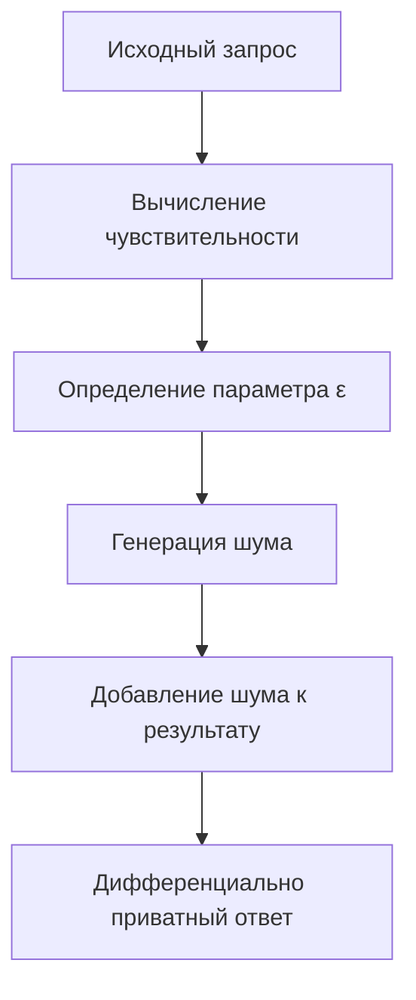
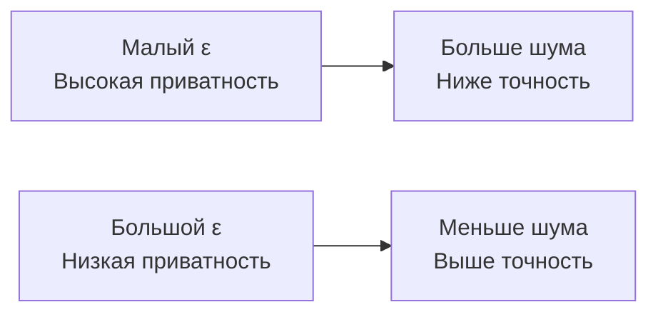
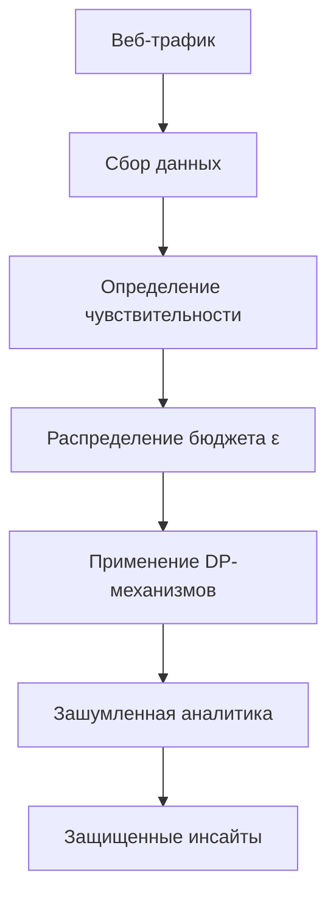

# Дифференциальная приватность: добавление шума для защиты данных в аналитике

Дифференциальная приватность представляет собой математически строгую систему защиты конфиденциальности, которая позволяет извлекать полезную информацию из наборов данных, одновременно ограничивая возможность идентификации отдельных лиц. Этот подход революционизирует способы анализа чувствительных данных в веб-аналитике.

## Принципы дифференциальной приватности

Дифференциальная приватность основывается на добавлении тщательно откалиброванного статистического шума к результатам запросов к базе данных. Ключевая идея заключается в том, что присутствие или отсутствие одного человека в наборе данных не должно существенно влиять на результат анализа.

!!! info "Математическое определение"

    Алгоритм M обеспечивает ε-дифференциальную приватность, если для любых двух наборов данных D и D', различающихся одной записью, и любого возможного результата S выполняется:

    P[M(D) ∈ S] ≤ exp(ε) × P[M(D') ∈ S]

    где ε (эпсилон) — параметр конфиденциальности, контролирующий уровень защиты.

### Ключевые компоненты

**Бюджет конфиденциальности (Privacy Budget)**

Параметр ε определяет максимально допустимую утечку информации. Меньшие значения обеспечивают лучшую защиту, но требуют больше шума, что снижает точность результатов.

**Чувствительность запроса (Query Sensitivity)**

Максимальное изменение результата запроса при добавлении или удалении одной записи из набора данных. Этот параметр определяет необходимый уровень шума.

**Механизмы добавления шума**

Специальные алгоритмы, которые добавляют калиброванный шум к результатам запросов для обеспечения дифференциальной приватности.



## Механизмы добавления шума

### Механизм Лапласа

Наиболее распространенный подход для запросов с числовыми результатами. Шум генерируется из распределения Лапласа с параметром масштаба, пропорциональным чувствительности запроса и обратно пропорциональным ε.

=== "Применение"

    **Подходящие запросы:**

    - Подсчет количества записей
    - Суммирование числовых значений
    - Вычисление средних значений

    **Свойства шума Лапласа:**

    - Симметричное распределение вокруг нуля
    - Экспоненциальное убывание вероятности
    - Простота калибровки

=== "Практический пример"

    ```javascript
    function addLaplaceNoise(trueValue, sensitivity, epsilon) {
        const scale = sensitivity / epsilon;
        // Генерация шума из распределения Лапласа
        const noise = generateLaplaceNoise(0, scale);
        return trueValue + noise;
    }
    
    // Пример использования
    const trueCount = 1547; // Реальное количество посетителей
    const noisyCount = addLaplaceNoise(trueCount, 1, 0.1);
    // Результат: ~1547 ± случайный шум
    ```

### Механизм Гаусса

Используется для обеспечения (ε, δ)-дифференциальной приватности, где δ представляет малую вероятность нарушения гарантий приватности.

**Характеристики:**

- Шум из нормального распределения
- Дополнительный параметр δ для гибкости
- Часто применяется в машинном обучении

### Экспоненциальный механизм

Предназначен для выбора элементов из дискретного множества возможных ответов. Вероятность выбора каждого варианта экспоненциально зависит от его "полезности".

!!! example "Применение экспоненциального механизма"

    **Выбор наиболее популярной страницы с защитой приватности:**

    - Каждая страница получает вес пропорциональный количеству просмотров
    - Добавляется экспоненциальный шум к весам
    - Страница выбирается случайным образом с вероятностями, пропорциональными зашумленным весам

## Применение в веб-аналитике

### Защита агрегированных метрик

**Подсчет уникальных посетителей**

Традиционные методы подсчета уникальных пользователей могут раскрывать информацию о присутствии конкретного человека в данных. Дифференциальная приватность позволяет получать приблизительные, но защищенные оценки.

**Анализ временных рядов**

Добавление шума к временным данным активности сайта защищает индивидуальные паттерны поведения, сохраняя общие тренды.

**Географическая аналитика**

Зашумление данных о местоположении пользователей предотвращает отслеживание конкретных лиц при сохранении региональной статистики.

### Продвинутые применения

=== "Машинное обучение"

    **Дифференциально приватное обучение моделей:**

    - Алгоритм DP-SGD (Differentially Private Stochastic Gradient Descent)
    - Обрезка градиентов для ограничения влияния отдельных примеров
    - Добавление шума к градиентам на каждом шаге обучения

    ```python
    # Псевдокод DP-SGD
    for epoch in training_epochs:
        for batch in data_batches:
            # Вычисление градиентов для каждого примера
            per_example_gradients = compute_gradients(batch)
            # Обрезка градиентов
            clipped_gradients = clip_gradients(per_example_gradients, clip_norm)
            # Добавление шума
            noisy_gradients = add_gaussian_noise(clipped_gradients, noise_scale)
            # Обновление параметров модели
            update_model(noisy_gradients)
    ```

=== "Continuous monitoring"

    **Потоковая аналитика с защитой приватности:**

    - Обработка данных в реальном времени
    - Управление бюджетом конфиденциальности во времени
    - Адаптивное распределение ε между запросами

## Компромиссы приватность-утилитарность

Центральная проблема дифференциальной приватности — балансирование между защитой конфиденциальности и точностью результатов. Этот компромисс определяется несколькими факторами.

### Факторы, влияющие на точность

**Размер бюджета конфиденциальности**



**Чувствительность запроса**

Запросы с высокой чувствительностью требуют больше шума для обеспечения того же уровня приватности.

**Размер датасета**

Большие наборы данных позволяют получать более точные результаты при том же уровне защиты приватности.

!!! warning "Накопление бюджета приватности"

    Каждый запрос к данным "тратит" часть бюджета конфиденциальности. При множественных запросах бюджет накапливается, что может потребовать увеличения шума или ограничения количества запросов.

### Практические стратегии оптимизации

**Композиция запросов**

Объединение связанных запросов для более эффективного использования бюджета приватности.

**Иерархическая структура**

Распределение бюджета между различными уровнями детализации данных.

**Адаптивные алгоритмы**

Динамическое распределение бюджета на основе важности запросов и доступных ресурсов.

## Техническая реализация

### Инфраструктурные требования

**Генерация случайных чисел**

Высококачественные генераторы случайных чисел критически важны для надежности механизмов дифференциальной приватности.

**Защита от побочных атак**

Реализация должна учитывать возможные атаки через побочные каналы, такие как время выполнения или потребление памяти.

**Аудит и мониторинг**

Система должна отслеживать расход бюджета приватности и предотвращать его превышение.

### Библиотеки и инструменты

=== "Open-source решения"

    **Google Differential Privacy**

    - Библиотеки для C++, Go, Java
    - Готовые механизмы для стандартных задач
    - Интеграция с популярными фреймворками

    **OpenDP (Harvard)**

    - Python и Rust реализации
    - Модульная архитектура
    - Формальная верификация алгоритмов

=== "Коммерческие платформы"

    **Tumult Analytics**

    - Платформа для дифференциально приватной аналитики
    - Готовые интеграции с популярными источниками данных
    - Управление бюджетом приватности

    **IBM Diffprivlib**

    - Python библиотека для машинного обучения
    - Scikit-learn совместимые алгоритмы
    - Широкий спектр методов

!!! example "Практическая реализация в веб-аналитике"

    ```javascript
    class DifferentialPrivacyAnalytics {
        constructor(privacyBudget) {
            this.totalBudget = privacyBudget;
            this.usedBudget = 0;
        }
        
        getUniqueVisitors(epsilon) {
            if (this.usedBudget + epsilon > this.totalBudget) {
                throw new Error('Privacy budget exceeded');
            }
            
            const trueCount = this.queryDatabase('SELECT COUNT(DISTINCT user_id) FROM visits');
            const noisyCount = this.addLaplaceNoise(trueCount, 1, epsilon);
            
            this.usedBudget += epsilon;
            return Math.max(0, Math.round(noisyCount));
        }
        
        addLaplaceNoise(value, sensitivity, epsilon) {
            const scale = sensitivity / epsilon;
            const noise = this.sampleLaplace(0, scale);
            return value + noise;
        }
    }
    ```

## Ограничения и вызовы

### Концептуальные ограничения

**Потеря точности**

Добавление шума неизбежно снижает точность результатов, что может быть критично для некоторых применений.

**Сложность настройки параметров**

Выбор правильных значений ε и δ требует глубокого понимания специфики данных и задач анализа.

**Ограниченность повторных запросов**

Конечность бюджета приватности ограничивает количество анализов, которые можно провести над одними данными.

### Практические проблемы

**Высокоразмерные данные**

Эффективность дифференциальной приватности снижается с ростом размерности данных из-за "проклятия размерности".

**Редкие события**

Анализ редких событий или небольших подгрупп требует больших объемов шума, что может сделать результаты бесполезными.

**Корреляции в данных**

Сложность учета корреляций между различными атрибутами данных при калибровке шума.

Мы провели обширные эксперименты с различными реализациями дифференциальной приватности в контексте веб-аналитики. Наши исследования показали, что правильно настроенные системы могут обеспечить значительную защиту приватности с приемлемыми потерями точности для большинства аналитических задач.



Дифференциальная приватность представляет собой мощный инструмент для создания аналитических систем, которые обеспечивают строгие гарантии конфиденциальности. При правильной реализации она позволяет извлекать ценные инсайты из чувствительных данных, минимизируя риски для приватности пользователей.

--8<-- "snippets/ai.ru.md"

!!! success "Заинтересованы в дифференциально приватной аналитике?"

    Наша платформа предоставляет встроенные механизмы дифференциальной приватности для защиты данных пользователей. Получите строгие математические гарантии конфиденциальности без потери аналитической ценности ваших данных.