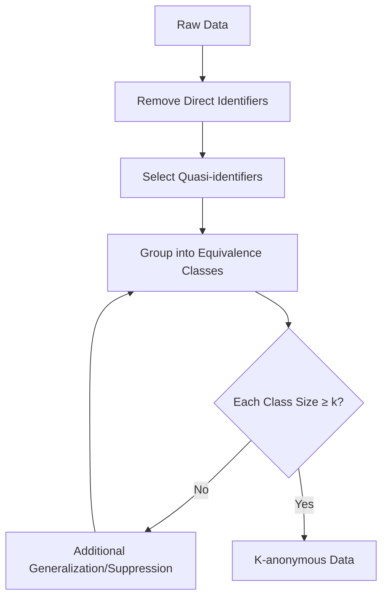
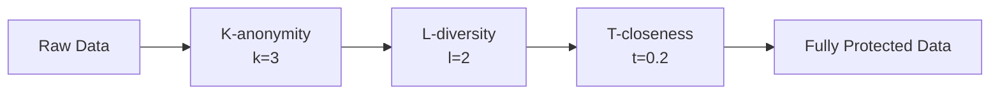
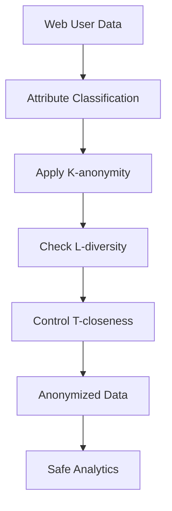

# K-anonymity, L-diversity, and T-closeness: Group-based Data Anonymization Models

The k-anonymity, l-diversity, and t-closeness models represent fundamental approaches to group-based anonymization of tabular data. These methods protect user privacy by creating groups of similar records, making individual identification difficult while preserving analytical data value.

## K-anonymity: Foundation of Group Protection

K-anonymity is a dataset property where each record is indistinguishable from at least k-1 other records by a set of quasi-identifiers. This approach forms the foundation for more complex privacy protection models.

### Core Components of k-anonymity

**Attribute Classification**

!!! info "Data Types in k-anonymity"

    **Direct Identifiers:**

    - Names, social security numbers
    - Email addresses, phone numbers
    - Must be removed before anonymization

    **Quasi-identifiers:**

    - Age, gender, postal code
    - Birth date, occupation
    - May indirectly identify individuals

    **Sensitive Attributes:**

    - Medical information, income
    - Political preferences
    - Not used for grouping but require protection

### Methods for Achieving k-anonymity

=== "Generalization"

    Replacing specific values with broader categories.

    **Transformation Examples:**

    - Age 28 → range 25-30
    - City "Almelo" → province "Overijssel"
    - Exact date → month and year

    **Generalization Hierarchies:**
    ```
    Specific Address
    ↓ (generalization)
    Street
    ↓ (generalization)
    District
    ↓ (generalization)
    City
    ↓ (generalization)
    Province
    ```

=== "Suppression"

    Removing or replacing values with "*" symbol to create equal-sized groups.

    **Suppression Strategies:**

    - Individual cell suppression
    - Entire record removal
    - Rare value suppression

    **Selection Criteria for Suppression:**

    - Value uniqueness
    - Information loss cost
    - Impact on equivalence class size

!!! example "k-anonymization Example for Web Data"

    **Original User Data:**
    
    | User ID | Age | City | Country | Page Views |
    |---------|-----|------|---------|------------|
    | 1 | 23 | Almelo | Netherlands | 45 |
    | 2 | 25 | Enschede | Netherlands | 67 |
    | 3 | 28 | Hengelo | Netherlands | 23 |
    | 4 | 31 | Almelo | Netherlands | 89 |

    **After 2-anonymization:**
    
    | Age Range | Region | Country | Page Views |
    |-----------|--------|---------|------------|
    | 23-25 | Overijssel | Netherlands | 45 |
    | 23-25 | Overijssel | Netherlands | 67 |
    | 28-31 | Overijssel | Netherlands | 23 |
    | 28-31 | Overijssel | Netherlands | 89 |

### K-anonymity Limitations

**Homogeneity Attack**

If all records in an equivalence class have the same sensitive attribute value, k-anonymity protection is ineffective.

**Background Knowledge Attack**

Attackers may use additional information to narrow the set of possible sensitive attribute values.



## L-diversity: Protection Against Homogeneity Attacks

L-diversity extends k-anonymity by requiring at least l different values for each sensitive attribute in each equivalence class.

### L-diversity Variants

=== "Simple l-diversity"

    Each equivalence class contains at least l different values of the sensitive attribute.

    **Advantages:**

    - Simple to understand and implement
    - Effective protection against homogeneity attacks

    **Disadvantages:**

    - Doesn't consider value frequency
    - May be ineffective with uneven distribution

=== "Entropy l-diversity"

    Uses entropy to measure value diversity in equivalence classes.

    **Entropy Formula:**
    ```
    H(S) = -Σ p(s) × log(p(s))
    ```
    where S is the set of sensitive attribute values in the class.

    **Requirement:** H(S) ≥ log(l)

=== "Recursive (c,l)-diversity"

    Compromise solution between simple l-diversity and entropy approach.

    **Principle:** Most frequent value shouldn't appear too often, while less frequent values shouldn't appear too rarely.

!!! warning "L-diversity Limitations"

    **Skewness Attack**

    If sensitive values in an equivalence class are semantically similar, l-diversity may not provide sufficient protection.

    **Similarity Attack**

    Different values with similar meaning may reveal additional information about data subjects.

## T-closeness: Controlling Sensitive Attribute Distribution

T-closeness requires that the sensitive attribute distribution in any equivalence class be close to the attribute distribution in the entire table.

### Measuring Distance Between Distributions

**Hellinger Distance**

Used to measure difference between two probability distributions:

```
d(P,Q) = (1/√2) × √(Σ(√p_i - √q_i)²)
```

**Earth Mover's Distance (EMD)**

Metric based on minimum work to transform one distribution into another.

**Variational Distance**

Simple metric for categorical attributes:

```
d(P,Q) = (1/2) × Σ|p_i - q_i|
```

### T-closeness Application in Web Analytics

=== "Behavioral Data Protection"

    **User Activity Categories:**

    - Low activity (< 10 pages/session)
    - Medium activity (10-50 pages/session)
    - High activity (> 50 pages/session)

    **T-closeness requirement:** Activity distribution in each group should be close to overall distribution.

=== "Geographic Data"

    **Distribution by Visit Regions:**

    Each user group should contain representatives from various geographic regions in proportion close to overall distribution.

!!! example "T-closeness Implementation for Session Data"

    **Overall Session Duration Distribution:**

    - Short (< 5 min): 60%
    - Medium (5-30 min): 30%
    - Long (> 30 min): 10%

    **User Group (equivalence class):**

    - Short: 55% (5% deviation)
    - Medium: 35% (5% deviation)
    - Long: 10% (0% deviation)

    **If t = 0.1, group satisfies t-closeness requirement**

## Comparative Model Analysis

| Criteria | K-anonymity | L-diversity | T-closeness |
|----------|-------------|-------------|-------------|
| **Identification Protection** | Basic | Enhanced | Advanced |
| **Sensitive Attribute Protection** | Weak | Good | Excellent |
| **Attack Resistance** | Limited | Medium | High |
| **Implementation Complexity** | Low | Medium | High |
| **Information Loss** | Minimal | Moderate | Significant |

### Combined Application

The most effective approach often involves sequential application of all three models:

1. **Achieving k-anonymity** for basic identification protection
2. **Ensuring l-diversity** for sensitive attribute protection
3. **Applying t-closeness** for distribution control



## Practical Implementation

### Anonymization Algorithms

=== "Incognito Algorithm"

    **Features:**

    - Bottom-up approach to building generalization lattice
    - Search for minimal k-anonymous generalization
    - Efficient pruning of unpromising branches

    **Application:**

    ```python
    def incognito_algorithm(data, k, quasi_identifiers):
        # Build lattice of all possible generalizations
        lattice = build_generalization_lattice(quasi_identifiers)
        
        # Bottom-up lattice traversal
        for level in lattice.levels():
            for node in level:
                generalized_data = apply_generalization(data, node)
                if is_k_anonymous(generalized_data, k):
                    return generalized_data, node
        
        return None  # k-anonymity unachievable
    ```

=== "Mondrian Algorithm"

    **Working Principle:**

    - Recursive attribute space partitioning
    - Multi-dimensional data generalization
    - Information loss optimization

    **Pseudocode:**

    ```python
    def mondrian(data, k):
        if len(data) < 2*k:
            return generalize(data)
        
        # Choose attribute for splitting
        split_attr = choose_dimension(data)
        
        # Split data
        left, right = partition(data, split_attr)
        
        # Recursive processing
        return mondrian(left, k) + mondrian(right, k)
    ```

### Anonymization Quality Assessment

**Information Loss Metrics**

- **General Loss Metric (GLM):** Measures accuracy loss during generalization
- **Discernibility Metric (DM):** Considers equivalence class sizes
- **Normalized Certainty Penalty (NCP):** Normalized information loss measure

**Privacy Metrics**

- **Privacy Level:** Minimum k value across all equivalence classes
- **Diversity Measure:** Number of different sensitive attribute values
- **Closeness Index:** Maximum deviation from overall distribution

!!! tip "Parameter Selection Recommendations"

    **Recommended for Web Analytics:**

    - **k ≥ 5** for basic user data protection
    - **l ≥ 2** for behavioral attributes
    - **t ≤ 0.3** for critical metrics

    **Selection Factors:**

    - Dataset size
    - Number of quasi-identifiers
    - Information sensitivity
    - Analysis accuracy requirements

## Limitations and Challenges

### Scalability

**Big Data Problems**

Anonymization algorithms may have high computational complexity when working with large datasets.

**Multi-dimensionality**

As quasi-identifier count increases, achieving required anonymity levels becomes harder without significant information loss.

### Dynamic Data

**Streaming Data**

Applying traditional k-anonymity methods to streaming data requires special algorithms and compromises.

**Data Updates**

Adding new records may violate existing anonymity, requiring entire dataset recompilation.

### Modern Attacks

**Downcoding Attack**

Using deterministic nature of anonymization algorithms to restore original data.

**Composition Attacks**

Combining multiple anonymous releases to recover personal information.

We conducted extensive research on the effectiveness of various group-based anonymization models for web analytics data. Our experiments showed that a combined approach using k-anonymity, l-diversity, and t-closeness provides the best balance between privacy protection and analytical data value preservation.



Group-based anonymization models remain important tools for privacy protection in web analytics. When properly applied, they allow creating datasets that protect individual privacy while preserving meaningful analysis capability.

--8<-- "snippets/ai.md"

!!! success "Need Help with Group-based Anonymization?"

    Our analytics platform provides built-in algorithms for k-anonymity, l-diversity, and t-closeness. Ensure user data protection while maintaining analytical capabilities.