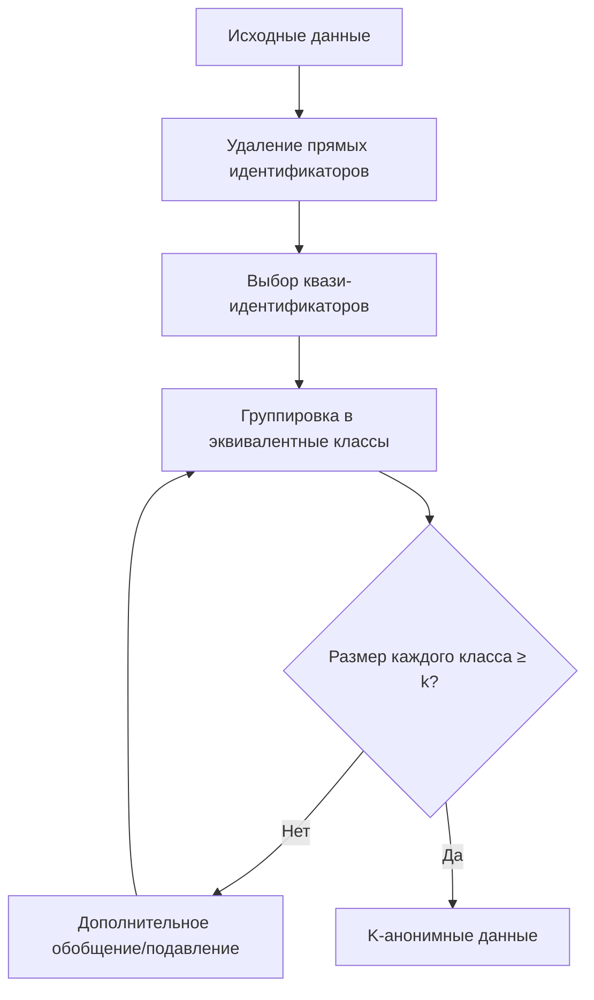
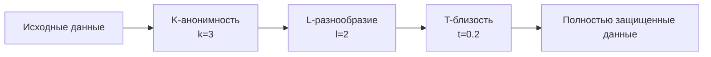
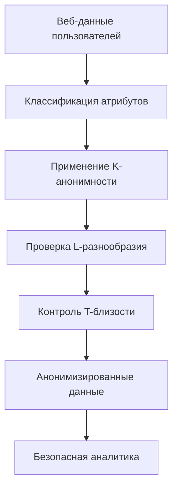

# K-анонимность, L-разнообразие и T-близость: модели групповой анонимизации данных

Модели k-анонимности, l-разнообразия и t-близости представляют собой фундаментальные подходы к групповой анонимизации табличных данных. Эти методы позволяют защитить конфиденциальность пользователей путем создания групп похожих записей, затрудняя идентификацию отдельных лиц при сохранении аналитической ценности данных.

## K-анонимность: основа групповой защиты

K-анонимность — это свойство набора данных, при котором каждая запись неотличима от по крайней мере k-1 других записей по набору квази-идентификаторов. Этот подход формирует основу для более сложных моделей защиты конфиденциальности.

### Основные компоненты k-анонимности

**Классификация атрибутов**

!!! info "Типы данных в k-анонимности"

    **Прямые идентификаторы:**

    - Имена, номера социального страхования
    - Email-адреса, номера телефонов
    - Должны быть удалены перед анонимизацией

    **Квази-идентификаторы:**

    - Возраст, пол, почтовый индекс
    - Дата рождения, род занятий
    - Могут косвенно идентифицировать людей

    **Чувствительные атрибуты:**

    - Медицинская информация, доходы
    - Политические предпочтения
    - Не используются для группировки, но требуют защиты

### Методы достижения k-анонимности

=== "Обобщение (Generalization)"

    Замена конкретных значений более общими категориями.

    **Примеры преобразований:**

    - Возраст 28 → диапазон 25-30
    - Город "Алмело" → область "Оверейссел"
    - Точная дата → месяц и год

    **Иерархии обобщения:**
    ```
    Конкретный адрес
    ↓ (обобщение)
    Улица
    ↓ (обобщение)
    Район
    ↓ (обобщение)
    Город
    ↓ (обобщение)
    Область
    ```

=== "Подавление (Suppression)"

    Удаление или замена значений символом "*" для создания групп одинакового размера.

    **Стратегии подавления:**

    - Подавление отдельных ячеек
    - Удаление целых записей
    - Подавление редких значений

    **Критерии выбора для подавления:**

    - Уникальность значения
    - Стоимость потери информации
    - Влияние на размер эквивалентных классов

!!! example "Пример k-анонимизации веб-данных"

    **Исходные данные пользователей:**
    
    | User ID | Age | City | Country | Page Views |
    |---------|-----|------|---------|------------|
    | 1 | 23 | Алмело | Нидерланды | 45 |
    | 2 | 25 | Энсхеде | Нидерланды | 67 |
    | 3 | 28 | Хенгело | Нидерланды | 23 |
    | 4 | 31 | Алмело | Нидерланды | 89 |

    **После 2-анонимизации:**
    
    | Age Range | Region | Country | Page Views |
    |-----------|--------|---------|------------|
    | 23-25 | Оверейссел | Нидерланды | 45 |
    | 23-25 | Оверейссел | Нидерланды | 67 |
    | 28-31 | Оверейссел | Нидерланды | 23 |
    | 28-31 | Оверейссел | Нидерланды | 89 |

### Ограничения k-анонимности

**Атака однородности**

Если все записи в эквивалентном классе имеют одинаковое значение чувствительного атрибута, защита k-анонимности неэффективна.

**Атака с использованием фоновых знаний**

Злоумышленники могут использовать дополнительную информацию для сужения множества возможных значений чувствительного атрибута.



## L-разнообразие: защита от атак однородности

L-разнообразие расширяет k-анонимность требованием наличия как минимум l различных значений для каждого чувствительного атрибута в каждом эквивалентном классе.

### Варианты l-разнообразия

=== "Простое l-разнообразие"

    Каждый эквивалентный класс содержит как минимум l различных значений чувствительного атрибута.

    **Преимущества:**

    - Простота понимания и реализации
    - Эффективная защита от атак однородности

    **Недостатки:**

    - Не учитывает частоту значений
    - Может быть неэффективным при неравномерном распределении

=== "Энтропийное l-разнообразие"

    Использует энтропию для измерения разнообразия значений в эквивалентном классе.

    **Формула энтропии:**
    ```
    H(S) = -Σ p(s) × log(p(s))
    ```
    где S — множество значений чувствительного атрибута в классе.

    **Требование:** H(S) ≥ log(l)

=== "Рекурсивное (c,l)-разнообразие"

    Компромиссное решение между простым l-разнообразием и энтропийным подходом.

    **Принцип:** Наиболее частое значение не должно появляться слишком часто, а менее частые значения не должны появляться слишком редко.

!!! warning "Ограничения l-разнообразия"

    **Атака подверженности различиям**

    Если чувствительные значения в эквивалентном классе семантически похожи, l-разнообразие может не обеспечить достаточную защиту.

    **Атака подобия**

    Различные значения с похожим смыслом могут раскрывать дополнительную информацию о субъектах данных.

## T-близость: контроль распределения чувствительных атрибутов

T-близость требует, чтобы распределение чувствительного атрибута в любом эквивалентном классе было близко к распределению атрибута во всей таблице.

### Измерение расстояния между распределениями

**Расстояние Хелллингера**

Используется для измерения различия между двумя вероятностными распределениями:

```
d(P,Q) = (1/√2) × √(Σ(√p_i - √q_i)²)
```

**Earth Mover's Distance (EMD)**

Метрика, основанная на минимальной работе по преобразованию одного распределения в другое.

**Варьирование расстояния**

Простая метрика для категориальных атрибутов:

```
d(P,Q) = (1/2) × Σ|p_i - q_i|
```

### Применение t-близости в веб-аналитике

=== "Защита поведенческих данных"

    **Категории пользователей по активности:**

    - Низкая активность (< 10 страниц/сессия)
    - Средняя активность (10-50 страниц/сессия)
    - Высокая активность (> 50 страниц/сессия)

    **Требование t-близости:** Распределение активности в каждой группе должно быть близко к общему распределению.

=== "Географические данные"

    **Распределение по регионам посещения:**

    Каждая группа пользователей должна содержать представителей различных географических регионов в пропорции, близкой к общему распределению.

!!! example "Реализация t-близости для данных сессий"

    **Общее распределение длительности сессий:**

    - Короткие (< 5 мин): 60%
    - Средние (5-30 мин): 30%
    - Длинные (> 30 мин): 10%

    **Группа пользователей (эквивалентный класс):**

    - Короткие: 55% (отклонение 5%)
    - Средние: 35% (отклонение 5%)
    - Длинные: 10% (отклонение 0%)

    **Если t = 0.1, группа удовлетворяет требованию t-близости**

## Сравнительный анализ моделей

| Критерий | K-анонимность | L-разнообразие | T-близость |
|----------|---------------|----------------|-------------|
| **Защита от идентификации** | Базовая | Улучшенная | Продвинутая |
| **Защита чувствительных атрибутов** | Слабая | Хорошая | Отличная |
| **Устойчивость к атакам** | Ограниченная | Средняя | Высокая |
| **Сложность реализации** | Низкая | Средняя | Высокая |
| **Потеря информации** | Минимальная | Умеренная | Значительная |

### Комбинированное применение

Наиболее эффективный подход часто заключается в последовательном применении всех трех моделей:

1. **Достижение k-анонимности** для базовой защиты от идентификации
2. **Обеспечение l-разнообразия** для защиты чувствительных атрибутов
3. **Применение t-близости** для контроля распределений



## Практическая реализация

### Алгоритмы анонимизации

=== "Incognito алгоритм"

    **Особенности:**

    - Bottom-up подход к построению решетки обобщений
    - Поиск минимальной k-анонимной генерализации
    - Эффективное отсечение неперспективных ветвей

    **Применение:**

    ```python
    def incognito_algorithm(data, k, quasi_identifiers):
        # Построение решетки всех возможных обобщений
        lattice = build_generalization_lattice(quasi_identifiers)
        
        # Bottom-up обход решетки
        for level in lattice.levels():
            for node in level:
                generalized_data = apply_generalization(data, node)
                if is_k_anonymous(generalized_data, k):
                    return generalized_data, node
        
        return None  # k-анонимность недостижима
    ```

=== "Mondrian алгоритм"

    **Принцип работы:**

    - Рекурсивное разбиение пространства атрибутов
    - Многомерное обобщение данных
    - Оптимизация по информационным потерям

    **Псевдокод:**

    ```python
    def mondrian(data, k):
        if len(data) < 2*k:
            return generalize(data)
        
        # Выбор атрибута для разделения
        split_attr = choose_dimension(data)
        
        # Разделение данных
        left, right = partition(data, split_attr)
        
        # Рекурсивная обработка
        return mondrian(left, k) + mondrian(right, k)
    ```

### Оценка качества анонимизации

**Метрики информационных потерь**

- **General Loss Metric (GLM):** Измеряет потерю точности при обобщении
- **Discernibility Metric (DM):** Учитывает размеры эквивалентных классов
- **Normalized Certainty Penalty (NCP):** Нормализованная мера потери информации

**Метрики конфиденциальности**

- **Privacy Level:** Минимальное значение k во всех эквивалентных классах
- **Diversity Measure:** Количество различных значений чувствительных атрибутов
- **Closeness Index:** Максимальное отклонение от общего распределения

!!! tip "Рекомендации по выбору параметров"

    **Для веб-аналитики рекомендуются:**

    - **k ≥ 5** для базовой защиты пользовательских данных
    - **l ≥ 2** для поведенческих атрибутов
    - **t ≤ 0.3** для критически важных метрик

    **Факторы выбора:**

    - Размер набора данных
    - Количество квази-идентификаторов
    - Чувствительность информации
    - Требования к точности анализа

## Ограничения и вызовы

### Масштабируемость

**Проблемы больших данных**

Алгоритмы анонимизации могут иметь высокую вычислительную сложность при работе с большими наборами данных.

**Многомерность**

С ростом количества квази-идентификаторов становится сложнее достичь требуемых уровней анонимности без значительных потерь информации.

### Динамические данные

**Потоковые данные**

Применение традиционных методов k-анонимности к потоковым данным требует специальных алгоритмов и компромиссов.

**Обновления данных**

Добавление новых записей может нарушить существующую анонимность, требуя перекомпиляции всего набора данных.

### Современные атаки

**Атака понижения кода (Downcoding Attack)**

Использование детерминированной природы алгоритмов анонимизации для восстановления исходных данных.

**Композиционные атаки**

Объединение множественных анонимных релизов для восстановления персональной информации.

Мы провели обширные исследования эффективности различных моделей групповой анонимизации применительно к данным веб-аналитики. Наши эксперименты показали, что комбинированный подход с использованием k-анонимности, l-разнообразия и t-близости обеспечивает наилучший баланс между защитой конфиденциальности и сохранением аналитической ценности данных.



Модели групповой анонимизации остаются важным инструментом для защиты конфиденциальности в веб-аналитике. При правильном применении они позволяют создавать наборы данных, которые защищают индивидуальную приватность при сохранении возможности проведения значимого анализа.

--8<-- "snippets/ai.ru.md"

!!! success "Нужна помощь с групповой анонимизацией?"

    Наша аналитическая платформа предоставляет встроенные алгоритмы k-анонимности, l-разнообразия и t-близости. Обеспечьте защиту пользовательских данных с сохранением аналитических возможностей.