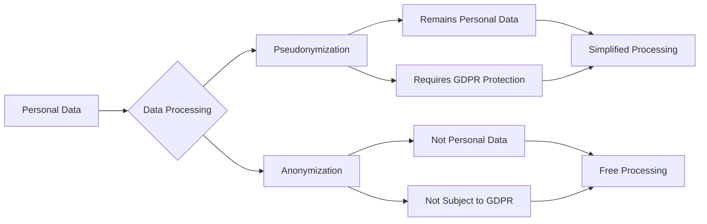
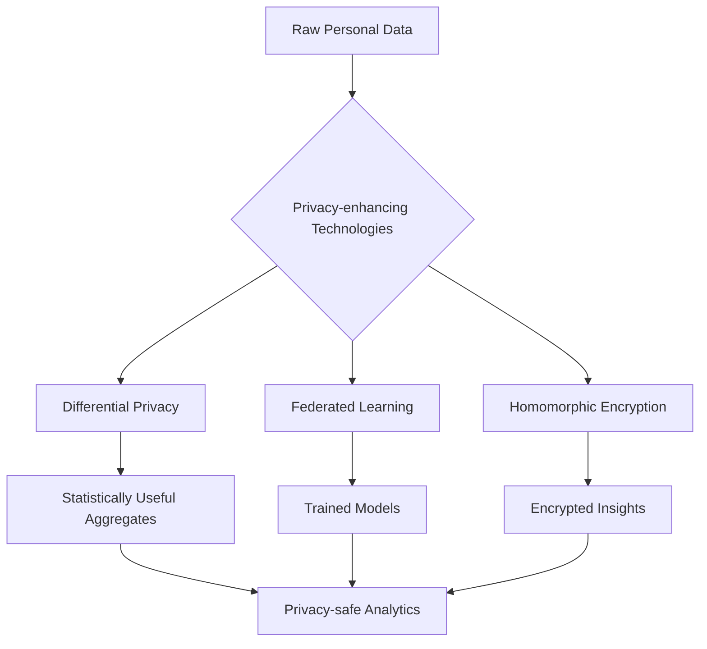

# Personal Data: Definition, Examples and Global Processing Requirements

Personal data forms the foundation of modern web analytics systems and digital marketing. According to GDPR, personal data is any information relating to an identified or identifiable natural person. Understanding what constitutes personal data is critically important for developing analytics systems that comply with international data protection requirements.

## What is Personal Data

Personal data includes any information concerning an identified or identifiable natural person — a person who can be identified directly or indirectly, particularly using identifiers or factors specific to the physical, physiological, genetic, mental, economic, cultural or social characteristics of that person.

### Identification Criteria

**Direct Identification**

- First and last name
- Passport or ID number
- Social security number
- Biometric data

**Indirect Identification**

- IP addresses combined with other information
- Cookie identifiers
- Location data
- Behavioral patterns in web analytics

!!! info "Examples of Personal Data in Web Analytics"

    **Obvious Identifiers:**

    - User email addresses
    - Phone numbers
    - Postal addresses
    
    **Less Obvious but Identifying Data:**

    - User IDs in analytics systems
    - Browser fingerprinting data
    - Activity timestamps combined with other parameters
    - Purchase or conversion data

## Classification of Personal Data

### Ordinary Personal Data

=== "Contact Information"
    
    **Examples:**

    - First name, last name
    - Email addresses
    - Phone numbers
    - Postal addresses
    
    **Processing Features:**
    
    - Requires lawful basis for processing
    - Data minimization principle
    - Purpose limitation

=== "Identification Data"
    
    **Examples:**

    - Document numbers
    - Customer ID
    - Analytics system User ID
    - Device ID
    
    **Processing Features:**
    
    - High degree of identification
    - Requires additional protection measures
    - Data access auditing

=== "Technical Information"
    
    **Examples:**

    - IP addresses
    - Cookie data
    - Browser fingerprints
    - Session ID
    
    **Processing Features:**
    
    - May be personal depending on context
    - Requires analysis of identification possibility
    - Subject to minimization principles

### Special Categories of Personal Data

GDPR identifies special categories of personal data that require enhanced protection: data revealing racial or ethnic origin, political opinions, religious beliefs, genetic data, biometric data, health data, and data concerning sexual orientation.

!!! warning "Restrictions on Processing Special Categories of Data"
    
    **Processing Principles:**

    - Direct prohibition of processing by default
    - Exceptions only with explicit consent
    - Additional technical protection measures
    - Mandatory Data Protection Impact Assessment (DPIA)

| Data Type | Requirements | Analytics Examples |
|-----------|--------------|-------------------|
| **Racial/Ethnic Data** | Explicit consent or vital interests | Demographic user segmentation |
| **Political Views** | Explicit consent or public interest | Targeting based on political preferences |
| **Health Data** | Medical purposes or explicit consent | Health & wellness apps, fitness trackers |
| **Biometric Data** | Unique identification | Face ID, voice assistants, fingerprint scanners |

## International Definition Standards

### GDPR (European Union)

GDPR interprets personal data as broadly as possible — any information that relates to an identified or identifiable natural person. This includes subjective information such as opinions, assessments and judgments.

**Key GDPR Features:**

- Extraterritorial effect
- Accountability principle
- Privacy by design
- High fines (up to 4% of global turnover)

### CCPA/CPRA (California, USA)

CCPA defines personal information as "information that identifies, relates to, describes, is reasonably capable of being associated with, or could reasonably be linked, directly or indirectly, with a particular consumer, device, or household."

**CPRA Extensions:**

- Introduction of "Sensitive Personal Information" (SPI) concept
- Right to limit use of SPI
- Creation of California Privacy Protection Agency (CPPA)

### PIPEDA (Canada)

PIPEDA uses a broad definition of personal information — any information that can be used to identify a person, including traditional identifiers and financial or medical information.

**PIPEDA's 10 Fair Information Principles:**

1. **Accountability** — appointing someone responsible for compliance
2. **Identifying Purposes** — clear formulation of collection reasons
3. **Consent** — obtaining permission before data collection
4. **Limiting Collection** — only necessary information
5. **Limiting Use and Disclosure** — strictly for stated purposes
6. **Accuracy** — maintaining data currency
7. **Safeguards** — technical and organizational measures
8. **Openness** — transparency of processing policies
9. **Individual Access** — right to view personal data
10. **Challenging Compliance** — complaint procedures

### LGPD (Brazil)

LGPD defines personal data as any information that helps directly or indirectly identify a person, which is significantly broader than PIPEDA. The law was created following the GDPR model and unifies 40 different sectoral regulations.

## Pseudonymization and Anonymization

### Pseudonymization

Pseudonymization is a technique that replaces or removes information in a dataset that identifies a person, but pseudonymized data remains personal data under GDPR.

!!! tip "Pseudonymization Methods"
    
    **Technical Solutions:**

    - Replacing names with reference numbers
    - Hashing identifiers
    - Data tokenization
    - Encryption with separate key storage
    
    **Advantages:**

    - Reduced risks for data subjects
    - Compliance with minimization principle
    - Simplified analytics processing
    - Preserved re-identification capability when necessary

### Anonymization

Anonymized data does not fall under GDPR if anonymization is irreversible and the data subject is no longer identifiable.

**True Anonymization Criteria:**

- Impossibility of singling out
- Impossibility of linkability
- Impossibility of inference

## Personal Data in Web Analytics Context

### Data Collection in Analytics Systems

Modern web analytics systems collect extensive volumes of information, much of which may qualify as personal data:

**Session-based Data**

- Unique session identifiers
- Activity timestamps
- Page view sequences
- Duration and bounce rate data

**Device Fingerprinting**

- Browser and OS parameters
- Screen resolution and timezone
- Installed fonts and plugins
- Canvas fingerprints

**Behavioral Analytics**

- Heatmaps and click tracking
- Scroll depth and time on page
- Form interaction analytics
- A/B testing data

!!! note "Defining Personal Data in Analytics"
    
    Even if a system doesn't directly collect names or email addresses, the combination of behavioral data, device technical characteristics, and temporal patterns can create a unique profile that allows user identification.

### Consent Processing in Analytics Systems

=== "Opt-in Model (GDPR)"
    
    **Requirements:**

    - No cookies before obtaining consent
    - Granular tracking category selection
    - Simple consent withdrawal mechanism
    - Consent documentation
    
    **Implementation:**

    - Cookie banners with active choice
    - Consent Management Platforms (CMP)
    - Integration with analytics systems
    - Regular consent renewal

=== "Opt-out Model (CCPA)"
    
    **Requirements:**

    - Tracking allowed by default
    - Visible "Do Not Sell" link
    - Global Privacy Control (GPC) support
    - Data deletion upon request
    
    **Implementation:**

    - Privacy policy with clear opt-out procedures
    - Automatic GPC signal detection
    - User dashboard for data management
    - Data deletion workflows

### Technical Solutions for Compliance

**Privacy-first Architecture**

- Server-side tracking for data control
- First-party instead of third-party cookies
- Edge computing for processing localization
- Minimized data retention periods

**Data Governance Processes**

- Data mapping and inventory procedures
- Privacy Impact Assessments (DPIA)
- Regular compliance audits
- Incident response plans

## Data Subject Rights

### Universal Rights

Most modern data protection laws provide subjects with similar rights:

**Right to Information**

- Transparency in collection and processing
- Clear explanation of usage purposes
- Information about retention periods
- Contact details of processing responsible party

**Right of Access**

- Confirmation of data processing fact
- Copies of processed personal data
- Additional information about purposes and recipients
- Data sources if not collected from subject

**Right to Rectification**

- Correction of inaccurate data
- Completion of incomplete data
- Notification of third parties about changes

**Right to Erasure ("Right to be Forgotten")**

- Complete data deletion under certain conditions
- Notification of third parties about deletion request
- Balance with other rights (freedom of expression, public interest)

### GDPR-Specific Rights

**Right to Restriction of Processing**

- Temporary processing suspension during disputes
- Restriction instead of deletion
- Notification about lifting restrictions

**Right to Data Portability**

- Receiving data in structured format
- Data transfer to another controller
- Technical format compatibility

**Right to Object**

- Objection to processing based on legitimate interests
- Absolute right to object to direct marketing
- Exceptions for compelling legitimate grounds

## Global Regulation Trends

### Development Directions

**Standards Convergence**

- Globalization of GDPR principles
- Harmonization of international requirements
- Mutual recognition of adequacy decisions

**Enforcement Strengthening**

- Increasing fine amounts
- DPA investigation intensification
- Class action lawsuits and collective redress

**Technological Specialization**

- AI and automated decision-making regulation
- Facial recognition restrictions
- Children's privacy (Age Appropriate Design Code)

### New Jurisdictions

**Asia-Pacific Region**

- Personal Data Protection Act (PDPA) Singapore
- Privacy Act 1988 Australia with 2022 amendments
- Personal Information Protection Law (PIPL) China

**Africa and Latin America**

- Protection of Personal Information Act (POPIA) South Africa
- Ley de Protección de Datos Personales Argentina
- Data Protection Act Kenya

!!! info "Gartner Forecast"
    
    According to Gartner's forecast, by 2024 modern privacy regulation will cover the majority of consumer data. This means the need for a global compliance approach for international companies.

## Impact on Analytics System Development

### Privacy by Design Principles

**Proactive not Reactive**

- Preventing privacy issues at design stage
- Continuous privacy impact assessments
- Privacy-first approach to new features

**Privacy as the Default**

- Maximum privacy settings by default
- Opt-in models for additional data collection
- Automatic data retention limits

**Privacy Embedded into Design**

- Architectural integration of privacy measures
- Impossibility to bypass privacy controls
- End-to-end data protection

**Full Functionality - Positive Sum**

- Privacy shouldn't compromise functionality
- Win-win solutions for users and business
- Innovative approaches to balancing privacy and utility

### Technical Approaches

**Differential Privacy**

- Adding mathematical noise to data
- Plausible deniability for individual records
- Statistical utility with individual privacy

**Federated Learning**

- Model training without data centralization
- On-device personal data processing
- Aggregated insights without raw data sharing

**Homomorphic Encryption**

- Computations on encrypted data
- Zero-knowledge proof systems
- Secure multi-party computation

## Practical Compliance Recommendations

### Organizational Measures

**Appointing Responsible Parties**

- Data Protection Officer (DPO) for GDPR compliance
- Privacy Officer for CCPA/CPRA
- Cross-functional privacy committee

**Process Documentation**

- Records of Processing Activities (RoPA)
- Data mapping and flow diagrams
- Privacy policies and notices

**Staff Training**

- Regular privacy training for developers
- Legal updates for management
- Incident response procedures

### Technical Measures

**Data Minimization**

- Collection of only necessary and relevant data
- Purpose limitation for processing
- Automatic data retention and deletion

**Security Measures**

- Encryption at rest and in transit
- Access controls and authentication
- Regular security audits and penetration testing

**Transparency Mechanisms**

- User-friendly privacy dashboards
- Clear consent management interfaces
- Accessible privacy policies

## Challenges for Web Analytics Systems

### Balancing Utility and Privacy

**Analytical Insights vs Individual Privacy**

- Need for detailed user tracking for business intelligence
- Growing consumer privacy expectations
- Technical challenges in anonymizing large datasets

**Real-time Processing vs Consent Management**

- Speed requirements for real-time analytics
- Latency from consent verification processes
- Complexity in managing granular consent choices

### International Compliance

**Multi-jurisdictional Requirements**

- Different personal data definitions
- Conflicting requirements between jurisdictions
- Extraterritorial application of various laws

**Data Localization Requirements**

- Restrictions on cross-border data transfers
- Need for regional data processing centers
- Adequacy decisions and standard contractual clauses

We have researched various approaches to defining and classifying personal data in an international context. Our analytics platform is developed with privacy by design principles, ensuring compliance with global data protection requirements while maintaining analytical value for webmasters.

Our system plans to implement advanced privacy-enhancing technologies, including differential privacy for statistical reporting and federated learning for behavioral insights, enabling detailed analytics without compromising user privacy.

---

--8<-- "snippets/ai.md"

!!! success "Ready to ensure full compliance with data protection requirements?"
    
    Sign up for a free trial of our platform and get access to analytics tools designed with global privacy compliance standards. Automatic compliance monitoring, built-in privacy controls, and transparent user consent management out of the box.