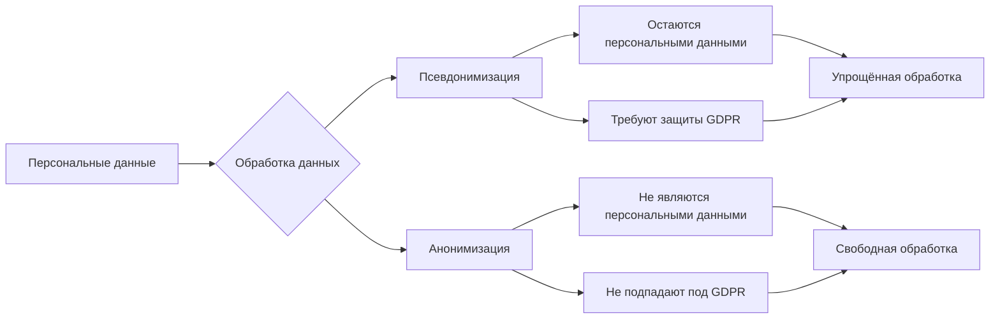
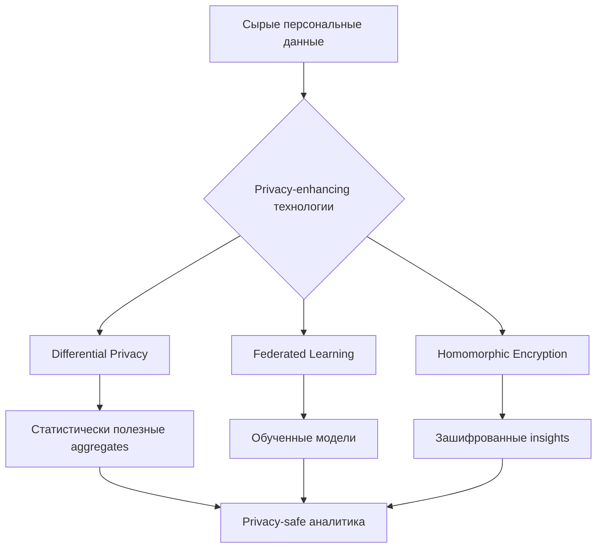

# Персональные данные: определение, примеры и глобальные требования к обработке

Персональные данные являются основой современных систем веб-аналитики и цифрового маркетинга. Согласно GDPR, персональные данные — это любая информация, относящаяся к идентифицированному или идентифицируемому физическому лицу. Понимание того, что составляет персональные данные, критически важно для разработки аналитических систем, соответствующих международным требованиям защиты данных.

## Что такое персональные данные

Персональные данные включают любую информацию, касающуюся идентифицированного или идентифицируемого естественного лица — лица, которое можно идентифицировать прямо или косвенно, особенно с использованием идентификаторов или факторов, специфичных для физических, физиологических, генетических, умственных, экономических, культурных или социальных особенностей этого лица.

### Критерии идентификации

**Прямая идентификация**

- Имя и фамилия
- Номер паспорта или удостоверения личности
- Номер социального страхования
- Биометрические данные

**Косвенная идентификация**

- IP-адреса в сочетании с другой информацией
- Cookie-идентификаторы
- Данные о местоположении
- Поведенческие паттерны в веб-аналитике

!!! info "Примеры персональных данных в веб-аналитике"

    **Очевидные идентификаторы:**

    - Email-адреса пользователей
    - Телефонные номера
    - Почтовые адреса
    
    **Менее очевидные, но идентифицирующие данные:**

    - User ID в аналитических системах
    - Fingerprinting данные браузера
    - Timestamps активности в комбинации с другими параметрами
    - Данные о покупках или конверсиях

## Классификация персональных данных

### Обычные персональные данные

=== "Контактная информация"
    
    **Примеры:**

    - Имя, фамилия
    - Email-адреса
    - Телефонные номера
    - Почтовые адреса
    
    **Особенности обработки:**
    
    - Требуется законная основа для обработки
    - Принцип минимизации данных
    - Ограничение по целям использования

=== "Идентификационные данные"
    
    **Примеры:**

    - Номера документов
    - Customer ID
    - User ID аналитических систем
    - Device ID
    
    **Особенности обработки:**
    
    - Высокая степень идентификации
    - Требуются дополнительные меры защиты
    - Аудит доступа к данным

=== "Техническая информация"
    
    **Примеры:**

    - IP-адреса
    - Cookie-данные
    - Browser fingerprints
    - Session ID
    
    **Особенности обработки:**
    
    - Могут быть персональными в зависимости от контекста
    - Требуют анализа возможности идентификации
    - Подлежат принципам минимизации

### Особые категории персональных данных

GDPR выделяет особые категории персональных данных, которые требуют повышенной защиты: данные о расовом или этническом происхождении, политических взглядах, религиозных убеждениях, генетические данные, биометрические данные, данные о здоровье и сексуальной ориентации.

!!! warning "Ограничения на обработку особых категорий данных"
    
    **Принципы обработки:**

    - Прямое запрещение обработки по умолчанию
    - Исключения только при явном согласии
    - Дополнительные технические меры защиты
    - Обязательная оценка влияния на защиту данных (DPIA)

| Тип данных | Требования | Примеры в аналитике |
|------------|------------|-------------------|
| **Расовые/этнические данные** | Явное согласие или жизненно важные интересы | Демографическая сегментация пользователей |
| **Политические взгляды** | Явное согласие или общественный интерес | Targeting на основе политических предпочтений |
| **Данные о здоровье** | Медицинские цели или явное согласие | Health & wellness приложения, фитнес-трекеры |
| **Биометрические данные** | Уникальная идентификация | Face ID, голосовые помощники, сканеры отпечатков |

## Международные стандарты определения

### GDPR (Европейский союз)

GDPR трактует персональные данные максимально широко — любая информация, которая связана с идентифицированным или идентифицируемым физическим лицом. Это включает субъективную информацию, такую как мнения, оценки и суждения.

**Ключевые особенности GDPR:**

- Экстерриториальное действие
- Принцип подотчётности (accountability)
- Privacy by design
- Высокие штрафы (до 4% от глобального оборота)

### CCPA/CPRA (Калифорния, США)

CCPA определяет персональную информацию как "информацию, которая идентифицирует, относится, описывает, способна быть ассоциирована или может быть разумно связана, прямо или косвенно, с конкретным потребителем, устройством или домохозяйством".

**Расширения CPRA:**

- Введение концепции "чувствительной персональной информации" (SPI)
- Право на ограничение использования SPI
- Создание California Privacy Protection Agency (CPPA)

### PIPEDA (Канада)

PIPEDA использует широкое определение персональной информации — любая информация, которая может быть использована для идентификации человека, включая традиционные идентификаторы и финансовую или медицинскую информацию.

**10 принципов справедливой информации PIPEDA:**

1. **Подотчётность** — назначение ответственного за соответствие
2. **Определение целей** — чёткая формулировка причин сбора
3. **Согласие** — получение разрешения до сбора данных
4. **Ограничение сбора** — только необходимая информация
5. **Ограничение использования и раскрытия** — строго по заявленным целям
6. **Точность** — поддержание актуальности данных
7. **Защитные меры** — технические и организационные меры
8. **Открытость** — прозрачность политик обработки
9. **Доступ индивида** — право на просмотр своих данных
10. **Обжалование** — процедуры подачи жалоб

### LGPD (Бразилия)

LGPD определяет персональные данные как любую информацию, которая помогает прямо или косвенно идентифицировать человека, что значительно шире, чем в PIPEDA. Закон создавался по модели GDPR и унифицирует 40 различных отраслевых регуляций.

## Псевдонимизация и анонимизация

### Псевдонимизация

Псевдонимизация — это методика, которая заменяет или удаляет информацию в наборе данных, идентифицирующую человека, но псевдонимизированные данные остаются персональными данными в рамках GDPR.

!!! tip "Методы псевдонимизации"
    
    **Технические решения:**

    - Замена имён на reference номера
    - Хеширование идентификаторов
    - Токенизация данных
    - Шифрование с раздельным хранением ключей
    
    **Преимущества:**

    - Снижение рисков для субъектов данных
    - Соответствие принципу минимизации
    - Упрощение обработки для аналитики
    - Сохранение возможности реидентификации при необходимости

### Анонимизация

Анонимизированные данные не подпадают под действие GDPR, если анонимизация необратима и субъект данных больше не идентифицируем.

**Критерии истинной анонимизации:**

- Невозможность выделения (singling out)
- Невозможность связывания (linkability)
- Невозможность выведения (inference)

## Персональные данные в контексте веб-аналитики

### Сбор данных в аналитических системах

Современные системы веб-аналитики собирают обширные объёмы информации, большая часть которой может квалифицироваться как персональные данные:

**Session-based данные**

- Уникальные идентификаторы сессий
- Временные метки активности
- Последовательности просмотра страниц
- Duration и bounce rate данные

**Device fingerprinting**

- Параметры браузера и операционной системы
- Разрешение экрана и временная зона
- Установленные шрифты и плагины
- Canvas fingerprints

**Поведенческая аналитика**

- Heatmaps и click tracking
- Scroll depth и time on page
- Form interaction analytics
- A/B тестирование данные

!!! note "Определение персональных данных в аналитике"
    
    Даже если система не собирает напрямую имена или email-адреса, комбинация данных о поведении, технических характеристик устройства и временных паттернов может создавать уникальный профиль, позволяющий идентифицировать пользователя.

### Обработка согласия в аналитических системах

=== "Модель Opt-in (GDPR)"
    
    **Требования:**

    - Никаких cookies до получения согласия
    - Гранулярный выбор категорий tracking
    - Простой механизм отзыва согласия
    - Документирование согласия
    
    **Реализация:**

    - Cookie banners с активным выбором
    - Consent management platforms (CMP)
    - Интеграция с аналитическими системами
    - Regular consent renewal

=== "Модель Opt-out (CCPA)"
    
    **Требования:**

    - Tracking по умолчанию разрешён
    - Видимая ссылка "Do Not Sell"
    - Поддержка Global Privacy Control (GPC)
    - Удаление данных по запросу
    
    **Реализация:**

    - Privacy policy с clear opt-out procedures
    - Automatic GPC signal detection
    - User dashboard для управления данными
    - Data deletion workflows

### Технические решения для compliance

**Privacy-first архитектура**

- Server-side tracking для контроля данных
- First-party cookies вместо third-party
- Edge computing для локализации обработки
- Minimized data retention periods

**Data governance процессы**

- Data mapping и inventory процедуры
- Privacy impact assessments (DPIA)
- Regular compliance audits
- Incident response планы

## Права субъектов данных

### Универсальные права

Большинство современных законов о защите данных предоставляют субъектам схожие права:

**Право на информацию**

- Прозрачность сбора и обработки
- Чёткое объяснение целей использования
- Информация о сроках хранения
- Контакты ответственного за обработку

**Право на доступ**

- Подтверждение факта обработки данных
- Копии обрабатываемых персональных данных
- Дополнительная информация о целях и получателях
- Источники данных, если они не собирались у субъекта

**Право на исправление**

- Корректировка неточных данных
- Дополнение неполных данных
- Уведомление третьих сторон об изменениях

**Право на удаление ("право на забвение")**

- Полное удаление данных при определённых условиях
- Уведомление третьих сторон о запросе на удаление
- Баланс с другими правами (свобода выражения, общественный интерес)

### Специфические права GDPR

**Право на ограничение обработки**

- Временная приостановка обработки при спорах
- Ограничение вместо удаления
- Уведомление о снятии ограничений

**Право на портируемость данных**

- Получение данных в структурированном формате
- Передача данных другому контролёру
- Техническая совместимость форматов

**Право на возражение**

- Возражение против обработки на основе законных интересов
- Абсолютное право на возражение против direct marketing
- Исключения для compelling legitimate grounds

## Глобальные тенденции регулирования

### Направления развития

**Конвергенция стандартов**

- Глобализация принципов GDPR
- Harmonization международных требований
- Взаимное признание adequacy decisions

**Усиление enforcement**

- Увеличение размера штрафов
- Активизация расследований DPA
- Class action lawsuits и collective redress

**Технологическая специализация**

- Регулирование AI и automated decision-making
- Facial recognition restrictions
- Children's privacy (Age Appropriate Design Code)

### Новые юрисдикции

**Азиатско-Тихоокеанский регион**

- Personal Data Protection Act (PDPA) Сингапур
- Privacy Act 1988 Австралия с поправками 2022
- Personal Information Protection Law (PIPL) Китай

**Африка и Латинская Америка**

- Protection of Personal Information Act (POPIA) ЮАР  
- Ley de Protección de Datos Personales Аргентина
- Data Protection Act Кения

!!! info "Прогноз Gartner"
    
    Согласно прогнозу Gartner, к 2024 году современное регулирование приватности будет покрывать большинство потребительских данных. Это означает необходимость глобального подхода к compliance для международных компаний.

## Влияние на разработку аналитических систем

### Принципы Privacy by Design

**Proactive not Reactive**

- Предотвращение проблем с privacy на стадии проектирования
- Continuous privacy impact assessments
- Privacy-first подход к новым функциям

**Privacy as the Default**

- Максимальные настройки приватности по умолчанию
- Opt-in модели для дополнительного сбора данных
- Automatic data retention limits

**Privacy Embedded into Design**

- Архитектурная интеграция privacy мер
- Невозможность обойти privacy контроли
- End-to-end защита данных

**Full Functionality - Positive Sum**

- Privacy не должна ущемлять функциональность
- Win-win решения для пользователей и бизнеса
- Innovative approaches к balancing privacy и utility

### Технические подходы

**Differential Privacy**

- Добавление математического шума к данным
- Плausible deniability для индивидуальных записей
- Statistical utility при individual privacy

**Federated Learning**

- Обучение моделей без централизации данных
- On-device обработка персональных данных
- Aggregated insights без raw data sharing

**Homomorphic Encryption**

- Вычисления на зашифрованных данных
- Zero-knowledge proof системы
- Secure multi-party computation

## Практические рекомендации для compliance

### Организационные меры

**Назначение ответственных**

- Data Protection Officer (DPO) для GDPR compliance
- Privacy Officer для CCPA/CPRA
- Cross-functional privacy committee

**Документирование процессов**

- Records of Processing Activities (RoPA)
- Data mapping и flow диаграммы
- Privacy policies и notices

**Обучение персонала**

- Regular privacy training для developers
- Legal updates для management
- Incident response procedures

### Технические меры

**Data minimization**

- Сбор только necessary и relevant данных
- Purpose limitation для обработки
- Automatic data retention и deletion

**Security measures**

- Encryption at rest и in transit
- Access controls и authentication
- Regular security audits и penetration testing

**Transparency mechanisms**

- User-friendly privacy dashboards
- Clear consent management interfaces  
- Accessible privacy policies

## Вызовы для систем веб-аналитики

### Балансирование utility и privacy

**Analytical insights vs Individual privacy**

- Необходимость detailed user tracking для business intelligence
- Growing consumer privacy expectations  
- Technical challenges в anonymization больших datasets

**Real-time processing vs Consent management**

- Speed requirements для real-time аналитики
- Latency от consent verification процессов
- Complexity в managing granular consent choices

### Международная compliance

**Multi-jurisdictional requirements**

- Различные определения персональных данных
- Conflicting requirements между юрисдикциями
- Extraterritorial application различных законов

**Data localization requirements**

- Ограничения на cross-border data transfers
- Need для regional data processing centres
- Adequacy decisions и standard contractual clauses

Мы исследовали различные подходы к определению и классификации персональных данных в международном контексте. Наша аналитическая платформа разрабатывается с учётом принципов privacy by design, обеспечивая соответствие глобальным требованиям защиты данных при сохранении аналитической ценности для веб-мастеров.

Наша система планирует реализацию advanced privacy-enhancing технологий, включая differential privacy для statistical reporting и federated learning для behavioural insights, что позволит предоставлять detailed аналитику без компромиссов в отношении user privacy.

---

--8<-- "snippets/ai.ru.md"

!!! success "Готовы обеспечить полное соответствие требованиям защиты данных?"
    
    Зарегистрируйтесь для бесплатного тестирования нашей платформы и получите доступ к аналитическим инструментам, разработанным с учётом глобальных стандартов privacy compliance. Автоматический мониторинг соответствия, встроенные privacy контроли и прозрачное управление согласием пользователей из коробки.