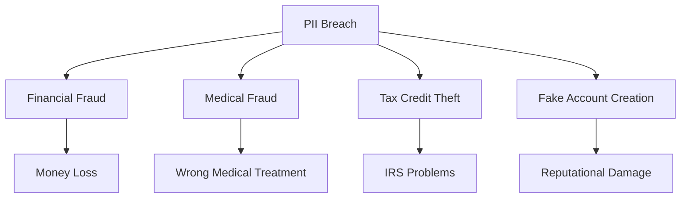
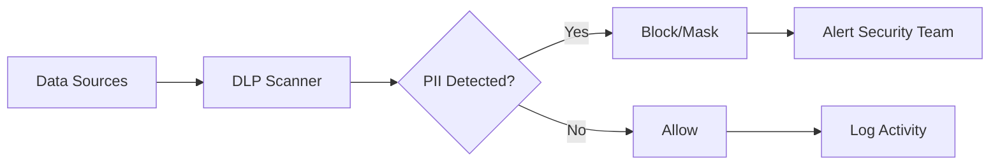

# PII (Personally Identifiable Information): Protecting Personal Data in Web Analytics

**Personally Identifiable Information (PII)** is any information that can be used to identify a specific individual directly or in combination with other data. In the context of web analytics, PII presents special challenges for compliance with data protection legislation, such as GDPR and CCPA, requiring analytics platforms to implement comprehensive protective measures.

## PII Fundamentals

### Definition and Categories

PII includes any information that can be used to distinguish or trace an individual's identity, either alone or in combination with other personal information that is linked or linkable to a specific individual.

=== "Direct Identifiers"

    Data that uniquely identifies a person:

    - Full name
    - Social Security number
    - Passport number
    - Email address
    - Phone number
    - Biometric data

=== "Indirect Identifiers"

    Information that can identify a person when combined:

    - Date of birth
    - ZIP code
    - IP address
    - Cookie ID
    - Demographic characteristics
    - Geolocation data

### PII vs Personal Data

It's important to understand the difference between the American concept of PII and the European definition of personal data:

| Aspect | PII (USA) | Personal Data (GDPR) |
|--------|-----------|----------------------|
| **Definition** | Distinguishing a specific person | Any information relating to an identifiable person |
| **Scope** | Focus on identification | Broader concept |
| **IP addresses** | Not always considered PII | Considered personal data |
| **Cookies** | Disputed classification | Definitely personal data |
| **Regulation** | Various federal/state laws | Unified GDPR regulation |

!!! info "Key Difference"
    
    According to Article 29 Working Party opinion, personal data that has been de-identified, encrypted or pseudonymized but can be used to re-identify a person remains personal data and falls within the scope of GDPR.

## PII Sensitivity Classification

### Sensitive PII

Sensitive PII is any information whose disclosure could cause significant harm to an individual:

**Financial Data:**

- Credit card numbers
- Bank account details
- Financial history
- Tax identifiers

**Medical Data:**

- Medical history
- Prescriptions and diagnoses
- Biometric indicators
- Genetic information

**Government Identifiers:**

- Social Security numbers
- Driver's licenses
- Passport data
- Military IDs

### Non-sensitive PII

Data that alone would not cause substantial harm but could be dangerous in combination:

- Name (without additional data)
- Place of work
- Education
- Public social media profiles
- ZIP code

!!! warning "Combination Risk"
    
    It's important to understand that non-PII can become PII when additional information becomes publicly available from any source, which in combination with other available information could be used to identify an individual.

## PII Risks and Threats

### Identity Theft

With just a few pieces of an individual's personal information, thieves can create false accounts in their name, accumulate debt, create a fake passport, or sell their identity to a criminal.

**Consequences for Users:**



**Emotional Consequences:**

- Stress and anxiety
- Loss of trust in digital services
- Time spent on recovery
- Long-term financial problems

### Business Threats

**Financial Risks:**

- Amazon was fined $888 million for GDPR violation in 2021
- CCPA can impose fines of $2,500 per violation and $7,500 for intentional violations
- Lawsuits from affected parties
- Customer loss

**Reputational Risks:**

- Decreased customer trust
- Negative media coverage
- Competitive advantages for rivals
- Long-term brand impact

!!! danger "Scale of the Problem"
    
    According to ESG research, 66% of companies that underwent data privacy audits in the last three years failed at least once, and 23% failed three or more times.

## PII Regulation

### GDPR (European Union)

GDPR establishes strict requirements for personal data processing:

**GDPR Principles:**

=== "Lawful Processing"

    **Processing Grounds:**

    - Data subject consent
    - Contract performance
    - Legal obligation compliance
    - Vital interests protection
    - Public interest tasks
    - Legitimate interests of controller

=== "Data Minimization"

    **Requirements:**

    - Collection of only necessary data
    - Purpose limitation
    - Storage limitation
    - Accuracy assurance

=== "Data Subject Rights"

    **Core Rights:**

    - Right to information
    - Right of access to data
    - Right to rectification
    - Right to erasure (right to be forgotten)
    - Right to restrict processing
    - Right to data portability

**GDPR Sanctions:**

- Up to 4% of global annual turnover
- Up to €20 million
- Mandatory notification within 72 hours
- Notification of affected individuals

### CCPA/CPRA (California)

CCPA defines personal information as "Information that identifies, relates to, describes, is capable of being associated with, or could reasonably be linked, directly or indirectly, with a particular consumer or household."

**Consumer Rights under CCPA:**

- Right to know what personal data is collected
- Right to delete personal data
- Right to opt-out of sale of personal data
- Right to non-discrimination

**CCPA Features:**

- Applies to households, not just individuals
- Includes IP addresses as personal information
- Applicability threshold: $25M annual revenue or 50,000+ consumers
- Fines up to $7,500 for intentional violations

### Other Jurisdictions

| Law | Region | Key Features |
|-----|--------|--------------|
| **PIPEDA** | Canada | Consent for collection, use and disclosure |
| **LGPD** | Brazil | Similar to GDPR, fines up to 2% of revenue |
| **PDPA** | Singapore | Notice and consent, right to portability |
| **POPI Act** | South Africa | 8 principles of information protection |

## PII in Web Analytics

### Data Collection Issues

In web analytics, many standard metrics may contain PII:

**Automatically Collected PII:**

```javascript
// Potentially problematic data
{
  "ip_address": "192.168.1.100",        // PII under GDPR
  "user_agent": "Mozilla/5.0...",       // Indirect identifier
  "session_id": "abc123...",            // Can link activity
  "client_id": "GA1.2.123456...",       // Persistent identifier
  "geolocation": "lat:40.7, lng:-74.0", // Precise geolocation - PII
  "referrer": "https://internal-app.com/user/john" // May contain PII
}
```

**PII in Custom Events:**

- Email in event parameters
- Usernames in URLs
- Personal identifiers in custom dimensions
- Search queries with personal terms

!!! example "URL Problem Example"
    
    A URL like `example.com/user/john.smith@company.com/dashboard` contains email and is PII that automatically appears in analytics reports.

### Protection Methods in Analytics

=== "Hashing"

    **One-way hashing of sensitive data:**

    ```javascript
    // Safe email handling
    function hashEmail(email) {
        return CryptoJS.SHA256(email.toLowerCase().trim()).toString();
    }
    
    // Send hashed identifier
    analytics.track('user_signup', {
        'user_id_hashed': hashEmail(userEmail),
        'signup_source': 'website'
    });
    ```

=== "Pseudonymization"

    **Replace identifiers with pseudonyms:**

    - Generate random IDs instead of email
    - Use internal user_id
    - Create session tokens
    - Reversible only through protected database

=== "IP Anonymization"

    **Mask last octets:**

    - `192.168.1.100` → `192.168.1.0`
    - `2001:db8::1` → `2001:db8::`
    - Geographic accuracy reduced to city/region
    - GDPR compliance

### Consent and Management

**Tracking Categories:**

=== "Necessary"

    **Technically required for operation:**

    - Session cookies
    - Site security
    - Basic functionality
    - No consent required

=== "Analytics"

    **Performance measurement:**

    - Anonymized analytics
    - Aggregated metrics
    - A/B testing
    - Consent required

=== "Marketing"

    **Personalization and advertising:**

    - Behavioral targeting
    - Remarketing
    - Cross-site tracking
    - Explicit consent mandatory

**Consent Implementation:**

```javascript
// Check consent before tracking
function trackEvent(eventName, eventData) {
    if (hasConsent('analytics')) {
        // Full tracking with personal data
        analytics.track(eventName, eventData);
    } else if (hasConsent('essential')) {
        // Only anonymous aggregated data
        analytics.track(eventName, {
            'event_category': eventData.category,
            'consent_status': 'declined'
        });
    }
}
```

## Technical PII Protection

### Data Encryption

**Encryption at Rest:**

- AES-256 for databases
- Encrypted backups
- Protected key storage
- Regular key rotation

**Encryption in Transit:**

- TLS 1.3 for all connections
- Certificate pinning
- HTTP Strict Transport Security (HSTS)
- Encrypted API endpoints

### Access Control

**Identity and Access Management (IAM):**

| Access Level | Data | Personnel |
|--------------|------|-----------|
| **Full** | All PII data | Data Protection Officer |
| **Limited** | Hashed PII | Analysts |
| **Aggregated** | Metrics only | Marketers |
| **Public** | Anonymous reports | All employees |

**Technical Measures:**

- Multi-factor authentication (MFA)
- Role-based access control (RBAC)
- Zero-trust architecture
- Access logging

### Monitoring and Detection

**Data Loss Prevention (DLP):**

- PII scanning in data
- Unauthorized transfer prevention
- Data sensitivity classification
- Automatic masking

**Monitoring Systems:**



## Data Breach Procedures

### Response Plan

**72-hour Process (GDPR):**

**Hours 0-4: Detection**

   - Immediate system isolation
   - Initial scope assessment
   - Response team activation

**Hours 4-24: Investigation**

   - Determine breach cause
   - Identify affected data
   - Incident documentation

**Hours 24-72: Notification**

   - Regulator notification
   - DPA report preparation
   - User notification planning

!!! warning "Notification Requirements"
    
    **Mandatory information in notification:**

    - Nature of personal data breach
    - Categories and approximate number of data subjects
    - Possible consequences of breach
    - Measures taken or planned

### Post-incident Recovery

**Technical Measures:**

- Security patches
- Compromised key replacement
- Enhanced monitoring
- Access audits

**Working with Affected Parties:**

- Personal notifications
- Free credit monitoring
- Protection consultations
- Damage compensation

## Best Practices for Web Analytics

### Privacy by Design

**Design Principles:**

**Data Minimization**

   - Collect only necessary metrics
   - Automatic old data deletion
   - Aggregation instead of detail

**Transparency**

   - Clear privacy policy
   - Understandable cookie notices
   - Accessible tracking information

**User Control**

   - Granular privacy settings
   - Easy consent withdrawal
   - Ability to view collected data

### Alternative Approaches

**Server-side Tracking:**

- Bypass blockers
- Full data control
- Privacy compliance
- Reduced browser dependency

**Differential Privacy:**

- Statistical noise addition
- Individual record protection
- Preserve aggregate utility
- Large-scale analytics application

**Federated Learning:**

- Model training without data transfer
- Local device processing
- Result-only aggregation
- Maximum privacy protection

### Compliance Checklist

**PII Compliance Audit:**

- [ ] Inventory all collected data
- [ ] Classify by sensitivity level
- [ ] Document legal grounds
- [ ] Implement consent procedures
- [ ] Deploy data subject rights
- [ ] Train staff on requirements
- [ ] Regular privacy impact assessments
- [ ] Execute data processing agreements with vendors

Protecting PII in web analytics requires a comprehensive approach combining technical solutions, procedural measures, and legal compliance. Modern analytics platforms must balance the need for detailed data for business insights with obligations to protect users' personal information.

--8<-- "snippets/ai.md"

!!! success "Start Protected Analytics"
    
    Try our platform with built-in PII protection. Get complete analytics with automatic data anonymization and GDPR compliance out of the box.