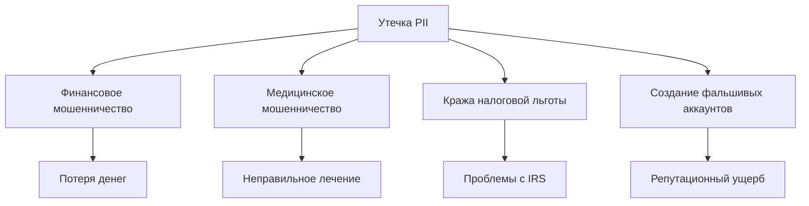
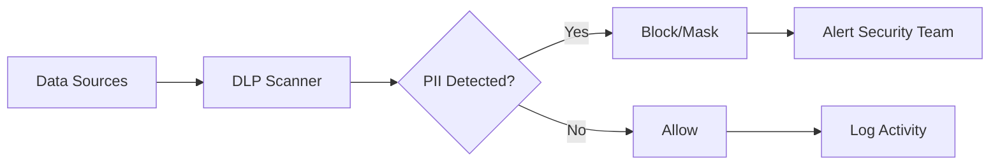

# PII (Personally Identifiable Information): Защита персональных данных в веб-аналитике

**Personally Identifiable Information (PII)** — это любая информация, которая может быть использована для идентификации конкретного человека напрямую или в совокупности с другими данными. В контексте веб-аналитики PII представляет особые вызовы для соблюдения законодательства о защите данных, таких как GDPR и CCPA, требуя от платформ аналитики внедрения комплексных мер защиты.

## Основы PII

### Определение и категории

PII включает любую информацию, которая может быть использована для различения или отслеживания личности человека, либо самостоятельно, либо в сочетании с другой персональной информацией, связанной или привязываемой к конкретному лицу.

=== "Прямые идентификаторы"

    Данные, которые однозначно идентифицируют человека:

    - Полное имя
    - Номер социального страхования
    - Номер паспорта
    - Email адрес
    - Номер телефона
    - Биометрические данные

=== "Косвенные идентификаторы"

    Информация, которая может идентифицировать человека в совокупности:

    - Дата рождения
    - Почтовый индекс
    - IP-адрес
    - Cookie ID
    - Демографические характеристики
    - Геолокационные данные

### PII vs Персональные данные

Важно понимать различие между американским понятием PII и европейским определением персональных данных:

| Аспект | PII (США) | Персональные данные (GDPR) |
|--------|-----------|----------------------------|
| **Определение** | Различение конкретного человека | Любая информация, относящаяся к идентифицируемому лицу |
| **Охват** | Фокус на идентификации | Более широкое понятие |
| **IP-адреса** | Не всегда считаются PII | Считаются персональными данными |
| **Cookies** | Спорная классификация | Определенно персональные данные |
| **Регулирование** | Различные федеральные/штатные законы | Единое регулирование GDPR |

!!! info "Ключевое различие"
    
    Согласно мнению Рабочей группы Article 29, персональные данные, которые были деидентифицированы, зашифрованы или псевдонимизированы, но могут быть использованы для повторной идентификации человека, остаются персональными данными и попадают под действие GDPR.

## Классификация чувствительности PII

### Чувствительные PII

Чувствительные PII — это любая информация, раскрытие которой может причинить значительный вред человеку:

**Финансовые данные:**

- Номера кредитных карт
- Банковские реквизиты
- Финансовая история
- Налоговые идентификаторы

**Медицинские данные:**

- История болезни
- Рецепты и диагнозы
- Биометрические показатели
- Генетическая информация

**Правительственные идентификаторы:**

- Номера социального страхования
- Водительские удостоверения
- Паспортные данные
- Военные билеты

### Нечувствительные PII

Данные, которые сами по себе не причинят существенного вреда, но могут быть опасны в комбинации:

- Имя (без дополнительных данных)
- Место работы
- Образование
- Общедоступные профили социальных сетей
- Почтовый индекс

!!! warning "Риск комбинирования"
    
    Важно понимать, что не-PII может стать PII, когда дополнительная информация становится публично доступной из любого источника, что в сочетании с другой доступной информацией может быть использовано для идентификации человека.

## Риски и угрозы PII

### Кража личных данных

Всего лишь с несколькими фрагментами персональной информации человека воры могут создать фальшивые аккаунты от его имени, накопить долги, создать поддельный паспорт или продать личность преступнику.

**Последствия для пользователей:**



**Эмоциональные последствия:**

- Стресс и беспокойство
- Потеря доверия к цифровым сервисам
- Временные затраты на восстановление
- Долгосрочные финансовые проблемы

### Угрозы для бизнеса

**Финансовые риски:**

- Amazon был оштрафован на 888 миллионов долларов за нарушение GDPR в 2021 году
- CCPA может наложить штрафы в размере $2,500 за каждое нарушение и $7,500 за умышленное нарушение
- Судебные иски от пострадавших
- Потеря клиентов

**Репутационные риски:**

- Снижение доверия клиентов
- Негативное освещение в СМИ
- Конкурентные преимущества соперников
- Долгосрочное влияние на бренд

!!! danger "Масштаб проблемы"
    
    Согласно исследованию ESG, 66% компаний, проходивших аудит конфиденциальности данных за последние три года, провалили его хотя бы один раз, а 23% провалили три или более раз.

## Регулирование PII

### GDPR (Европейский Союз)

GDPR устанавливает строгие требования к обработке персональных данных:

**Принципы GDPR:**

=== "Законность обработки"

    **Основания для обработки:**

    - Согласие субъекта данных
    - Исполнение договора
    - Соблюдение правовых обязательств
    - Защита жизненно важных интересов
    - Исполнение задач в общественных интересах
    - Законные интересы контролера

=== "Минимизация данных"

    **Требования:**

    - Сбор только необходимых данных
    - Ограничение целей использования
    - Ограничение времени хранения
    - Обеспечение точности

=== "Права субъектов данных"

    **Основные права:**

    - Право на информацию
    - Право доступа к данным
    - Право на исправление
    - Право на удаление (право на забвение)
    - Право на ограничение обработки
    - Право на переносимость данных

**Санкции GDPR:**

- До 4% от глобального годового оборота
- До €20 миллионов
- Обязательное уведомление в течение 72 часов
- Уведомление затронутых лиц

### CCPA/CPRA (Калифорния)

CCPA определяет персональную информацию как "Информацию, которая идентифицирует, относится к, описывает, способна быть связана с, или может быть разумно связана, прямо или косвенно, с конкретным потребителем или домохозяйством".

**Права потребителей по CCPA:**

- Право знать, какие персональные данные собираются
- Право удалить персональные данные
- Право отказаться от продажи персональных данных
- Право на недискриминацию

**Особенности CCPA:**

- Применяется к домохозяйствам, а не только к физическим лицам
- Включает IP-адреса как персональную информацию
- Порог применимости: $25 млн годового дохода или 50,000+ потребителей
- Штрафы до $7,500 за умышленное нарушение

### Другие юрисдикции

| Закон | Регион | Ключевые особенности |
|-------|--------|----------------------|
| **PIPEDA** | Канада | Согласие на сбор, использование и раскрытие |
| **LGPD** | Бразилия | Похож на GDPR, штрафы до 2% оборота |
| **PDPA** | Сингапур | Уведомление и согласие, право на переносимость |
| **POPI Act** | Южная Африка | 8 принципов защиты информации |

## PII в веб-аналитике

### Проблемы сбора данных

В веб-аналитике многие стандартные метрики могут содержать PII:

**Автоматически собираемые PII:**

```javascript
// Потенциально проблематичные данные
{
  "ip_address": "192.168.1.100",        // PII под GDPR
  "user_agent": "Mozilla/5.0...",       // Косвенный идентификатор
  "session_id": "abc123...",            // Может связать активность
  "client_id": "GA1.2.123456...",       // Постоянный идентификатор
  "geolocation": "lat:40.7, lng:-74.0", // Точная геолокация - PII
  "referrer": "https://internal-app.com/user/john" // Может содержать PII
}
```

**PII в пользовательских событиях:**

- Email в параметрах событий
- Имена пользователей в URL
- Персональные идентификаторы в custom dimensions
- Поисковые запросы с персональными терминами

!!! example "Пример проблемы с URL"
    
    URL вида `example.com/user/john.smith@company.com/dashboard` содержит email и является PII, которая автоматически попадает в отчеты аналитики.

### Методы защиты в аналитике

=== "Хеширование"

    **Одностороннее хеширование чувствительных данных:**

    ```javascript
    // Безопасная обработка email
    function hashEmail(email) {
        return CryptoJS.SHA256(email.toLowerCase().trim()).toString();
    }
    
    // Отправка хешированного идентификатора
    analytics.track('user_signup', {
        'user_id_hashed': hashEmail(userEmail),
        'signup_source': 'website'
    });
    ```

=== "Псевдонимизация"

    **Замена идентификаторов псевдонимами:**

    - Генерация случайных ID вместо email
    - Использование внутренних user_id
    - Создание сессионных токенов
    - Обратимая только через защищенную базу

=== "Анонимизация IP"

    **Маскирование последних октетов:**

    - `192.168.1.100` → `192.168.1.0`
    - `2001:db8::1` → `2001:db8::`
    - Географическая точность снижается до города/региона
    - Соответствие требованиям GDPR

### Согласие и управление

**Категории трекинга:**

=== "Необходимые"

    **Технически необходимые для работы:**

    - Сессионные cookies
    - Безопасность сайта
    - Базовая функциональность
    - Согласие не требуется

=== "Аналитические"

    **Измерение производительности:**

    - Анонимизированная аналитика
    - Агрегированные метрики
    - A/B тестирование
    - Требуется согласие

=== "Маркетинговые"

    **Персонализация и реклама:**

    - Поведенческое таргетирование
    - Ремаркетинг
    - Кросс-сайт трекинг
    - Explicit согласие обязательно

**Реализация согласия:**

```javascript
// Проверка согласия перед трекингом
function trackEvent(eventName, eventData) {
    if (hasConsent('analytics')) {
        // Полный трекинг с персональными данными
        analytics.track(eventName, eventData);
    } else if (hasConsent('essential')) {
        // Только анонимные агрегированные данные
        analytics.track(eventName, {
            'event_category': eventData.category,
            'consent_status': 'declined'
        });
    }
}
```

## Техническая защита PII

### Шифрование данных

**Шифрование в покое:**

- AES-256 для баз данных
- Зашифрованные резервные копии
- Защищенное хранилище ключей
- Regular key rotation

**Шифрование в передаче:**

- TLS 1.3 для всех соединений
- Certificate pinning
- HTTP Strict Transport Security (HSTS)
- Encrypted API endpoints

### Контроль доступа

**Identity and Access Management (IAM):**

| Уровень доступа | Данные | Персонал |
|-----------------|--------|----------|
| **Полный** | Все PII данные | Data Protection Officer |
| **Ограниченный** | Хешированные PII | Аналитики |
| **Агрегированный** | Только метрики | Маркетологи |
| **Публичный** | Анонимные отчеты | Все сотрудники |

**Технические меры:**

- Многофакторная аутентификация (MFA)
- Role-based access control (RBAC)
- Zero-trust архитектура
- Логирование доступа

### Мониторинг и обнаружение

**Data Loss Prevention (DLP):**

- Сканирование на наличие PII в данных
- Предотвращение несанкционированной передачи
- Классификация чувствительности данных
- Автоматическое маскирование

**Системы мониторинга:**



## Процедуры утечек данных

### План реагирования

**72-часовой процесс (GDPR):**

**Часы 0-4: Обнаружение**

   - Немедленная изоляция системы
   - Первичная оценка масштаба
   - Активация команды реагирования

**Часы 4-24: Расследование**

   - Определение причины утечки
   - Идентификация затронутых данных
   - Документирование инцидента

**Часы 24-72: Уведомление**

   - Уведомление регулятора
   - Подготовка отчета для DPA
   - Планирование уведомления пользователей

!!! warning "Требования уведомления"
    
    **Обязательная информация в уведомлении:**

    - Характер нарушения персональных данных
    - Категории и приблизительное количество субъектов данных
    - Возможные последствия нарушения
    - Принятые или планируемые меры

### Восстановление после инцидента

**Технические меры:**

- Патчи безопасности
- Смена всех скомпрометированных ключей
- Усиление мониторинга
- Аудит доступов

**Работа с пострадавшими:**

- Персональные уведомления
- Бесплатный мониторинг кредита
- Консультации по защите
- Компенсация ущерба

## Лучшие практики для веб-аналитики

### Privacy by Design

**Принципы проектирования:**

**Минимизация данных**

   - Сбор только необходимых метрик
   - Автоматическое удаление старых данных
   - Агрегация вместо детализации

**Прозрачность**

   - Четкая политика конфиденциальности
   - Понятные уведомления о cookies
   - Доступная информация о трекинге

**Контроль пользователя**

   - Гранулярные настройки приватности
   - Легкий отзыв согласия
   - Возможность просмотра собранных данных

### Альтернативные подходы

**Server-side tracking:**

- Обход блокировщиков
- Полный контроль над данными
- Соответствие privacy требованиям
- Снижение зависимости от браузеров

**Дифференциальная приватность:**

- Добавление статистического шума
- Защита индивидуальных записей
- Сохранение полезности агрегатов
- Применение в крупномасштабной аналитике

**Federated learning:**

- Обучение моделей без передачи данных
- Локальная обработка на устройствах
- Агрегация только результатов
- Максимальная защита приватности

### Compliance checklist

**Аудит соответствия PII:**

- [ ] Инвентаризация всех собираемых данных
- [ ] Классификация по уровню чувствительности  
- [ ] Документирование правовых оснований
- [ ] Реализация процедур согласия
- [ ] Внедрение прав субъектов данных
- [ ] Обучение персонала требованиям
- [ ] Регулярные оценки воздействия на конфиденциальность
- [ ] Заключение соглашений об обработке данных с поставщиками

Защита PII в веб-аналитике требует комплексного подхода, сочетающего технические решения, процедурные меры и правовое соответствие. Современные платформы аналитики должны балансировать между потребностью в детальных данных для бизнес-инсайтов и обязательствами по защите персональной информации пользователей.

--8<-- "snippets/ai.ru.md"

!!! success "Начните защищенную аналитику"
    
    Попробуйте нашу платформу с встроенной защитой PII. Получите полную аналитику с автоматической анонимизацией данных и соответствием GDPR из коробки.