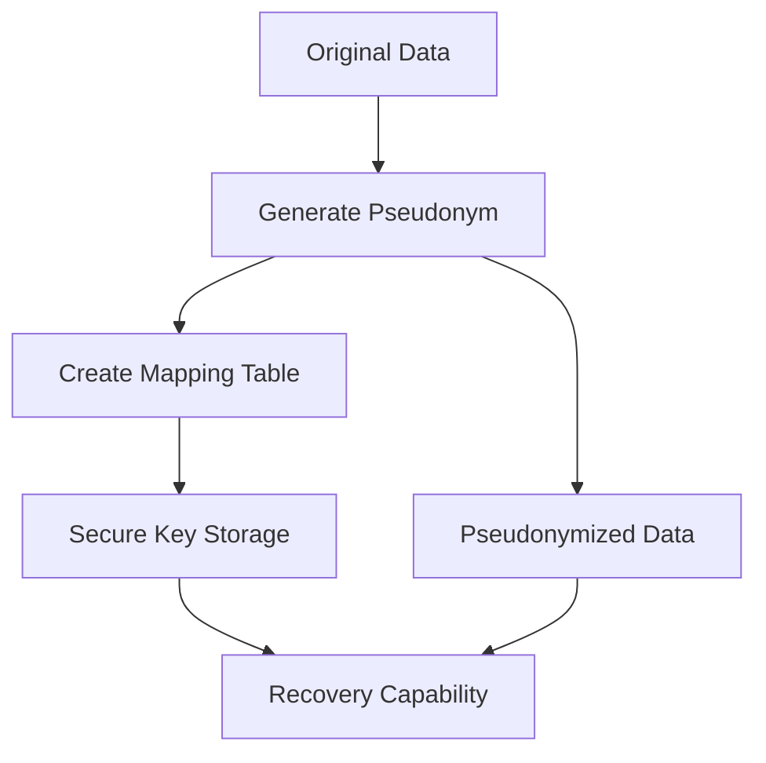
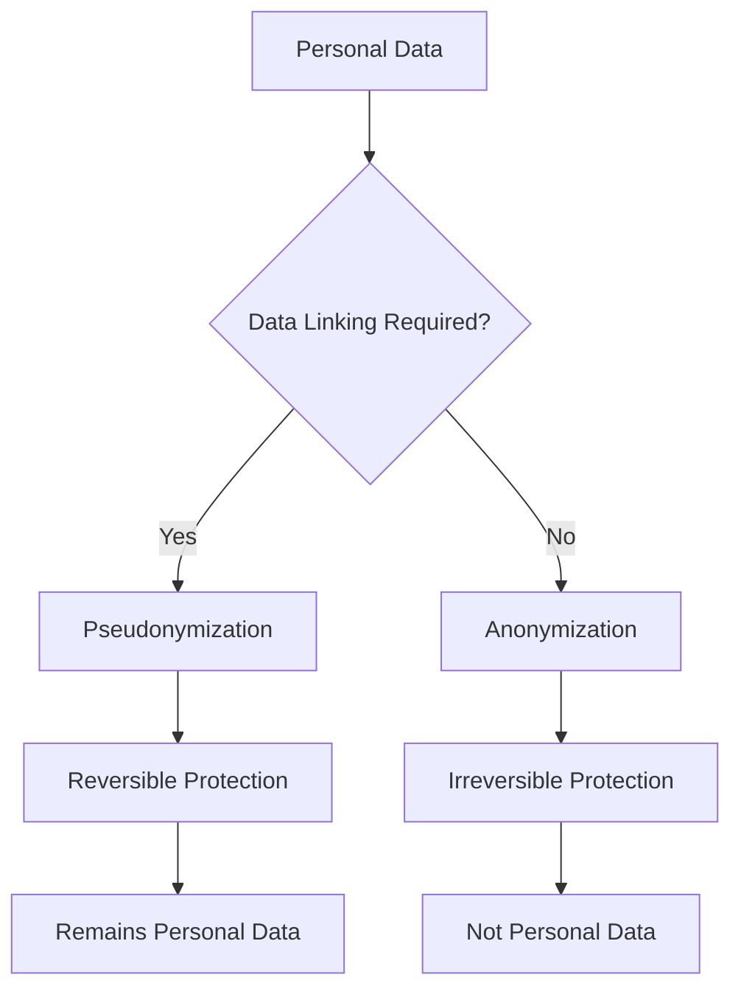

# Pseudonymization vs Anonymization: Reversible and Irreversible Data Protection under GDPR

Pseudonymization and anonymization represent two fundamentally different approaches to personal data protection. Understanding their differences is critically important for GDPR compliance and building an effective web analytics system that balances user privacy and data needs.

## Pseudonymization: Reversible Data Protection

Pseudonymization is the process of replacing identifying information with pseudonyms or artificial identifiers in such a way that data can be restored with additional information stored separately.

!!! info "GDPR Definition"

    According to Article 4(5) GDPR, pseudonymization means "the processing of personal data in such a manner that the personal data can no longer be attributed to a specific data subject without the use of additional information."

### Key Characteristics of Pseudonymization

**Process Reversibility**

The main feature of pseudonymization is the ability to restore original data when the appropriate key or mapping table is available.

**Preservation of Personal Data Status**

Pseudonymized data continues to be considered personal data under GDPR jurisdiction if the controller has means for de-anonymization.

**Technical Implementation**



### Pseudonymization Methods

=== "Tokenization"

    Replacing sensitive data with unique tokens stored in a protected database.

    - Irreversible tokens without mathematical connection to original data
    - High security level
    - Full control over de-anonymization process

=== "Cryptographic Hashing"

    Using cryptographic functions with keys to create pseudonyms.

    - Deterministic results for identical input data
    - Comparison capability without de-anonymization
    - Dependence on key strength

=== "Data Masking"

    Partial concealment of identifying information while preserving structure.

    - Data format preservation
    - Reversible restoration capability
    - Suitable for test environments

!!! example "Pseudonymization Example in Analytics"

    **Original User Data:**
    ```
    Email: user@example.com
    IP: 192.168.1.100
    Device ID: ABC123XYZ
    ```

    **After Pseudonymization:**
    ```
    User Token: USR_789456123
    IP Hash: 4f3d2a1b9c8e7f6a
    Device Hash: DEV_445566778
    ```

    **Mapping Table (stored separately):**
    ```
    USR_789456123 → user@example.com
    4f3d2a1b9c8e7f6a → 192.168.1.100
    DEV_445566778 → ABC123XYZ
    ```

## Anonymization: Irreversible Data Protection

Anonymization is an irreversible process of modifying personal data so that the data subject can no longer be identified directly or indirectly.

### GDPR Anonymization Principles

**Irreversibility Criterion**

Recital 26 GDPR requires that "information does not relate to an identified or identifiable natural person or to personal data rendered anonymous in such a manner that the data subject is not or no longer identifiable."

**GDPR Cessation**

Properly anonymized data falls outside GDPR scope as it's no longer considered personal data.

### Anonymization Techniques

=== "Data Aggregation"

    Combining individual records into groups to obtain statistical indicators.

    **Advantages:**

    - Complete individual information protection
    - Statistical significance preservation
    - Suitable for reporting

    **Disadvantages:**

    - Loss of detailed information
    - Limited analysis capabilities
    - No individual tracking possibility

=== "Data Generalization"

    Replacing specific values with broader categories.

    - Age ranges instead of exact age
    - Regional grouping instead of precise addresses
    - Time intervals instead of exact timestamps

=== "Data Suppression"

    Complete removal of identifying fields or records.

    - Direct identifier removal
    - Unique record exclusion
    - Rare value filtering

!!! warning "Pseudo-anonymization Risks"

    Many techniques considered anonymization actually represent pseudonymization, as data can be re-identified using additional information or modern analysis methods.

## Comparative Method Analysis

| Criteria | Pseudonymization | Anonymization |
|----------|------------------|---------------|
| **Reversibility** | Reversible process | Irreversible process |
| **Status under GDPR** | Personal data | Non-personal data |
| **Re-identification risk** | Low with proper implementation | Theoretically absent |
| **Data utility** | High analytical value | Limited detail |
| **Security requirements** | Key and mapping table protection | Irreversibility verification |

## Application in Web Analytics

### Pseudonymization Use Cases

**User Sessions**

Tracking user behavior across sessions with ability to link data when necessary.

**A/B Testing**

Creating stable user groups for experiments while preserving result analysis capability.

**Personalization**

Providing personalized content without revealing user identity to analytical systems.

### Anonymization Use Cases

**Public Reporting**

Preparing aggregated reports for publication without personal information disclosure risk.

**Research and Development**

Providing data for scientific research or new algorithm development.

**Long-term Storage**

Archiving historical data for trend analysis.

!!! example "Practical Implementation in Analytics"

    **Pseudonymization for User Journeys:**
    ```javascript
    // User receives permanent pseudonym
    const userPseudonym = generatePseudonym(realUserId);
    
    // Events linked to pseudonym
    trackEvent('page_view', {
        user: userPseudonym,
        page: '/products',
        timestamp: Date.now()
    });
    ```

    **Anonymization for Aggregated Reporting:**
    ```javascript
    // Data aggregated without recovery possibility
    const aggregatedStats = {
        timeRange: 'daily',
        totalViews: 15420,
        uniqueVisitors: 8756,
        topPages: ['/home', '/products', '/about'],
        // Individual users not recoverable
    };
    ```

## Legal and Ethical Considerations

### GDPR Requirements for Pseudonymization

**Technical Protection**

- Separate storage of de-anonymization keys
- Limited access to mapping tables
- Additional information encryption

**Organizational Measures**

- Role and responsibility separation
- De-anonymization mechanism access audit
- Key management policies

### Practical Recommendations

=== "Choosing Protection Method"

    **Use Pseudonymization When:**

    - User tracking over time is necessary
    - Personalization or targeting required
    - Longitudinal studies planned

    **Use Anonymization When:**

    - Data intended for public access
    - Strict confidentiality requirements needed
    - Individual identification unnecessary

=== "Technical Implementation"

    **For Pseudonymization:**

    - Use cryptographically strong algorithms
    - Ensure secure key storage
    - Regularly rotate pseudonyms

    **For Anonymization:**

    - Apply multiple techniques simultaneously
    - Conduct regular re-identification risk assessments
    - Document procedures and decisions

We conducted extensive research on the effectiveness of various approaches to user data protection. Our experience shows that choosing between pseudonymization and anonymization should be based on specific business needs, analytics requirements, and acceptable risk levels.



Effective user data protection requires careful planning and understanding of differences between available methods. Proper choice of protection technique ensures privacy compliance while preserving analytical data value.

--8<-- "snippets/ai.md"

!!! success "Need Help with Data Protection?"

    Our analytics platform provides built-in tools for both pseudonymization and anonymization. Get full control over personal information processing with GDPR compliance.