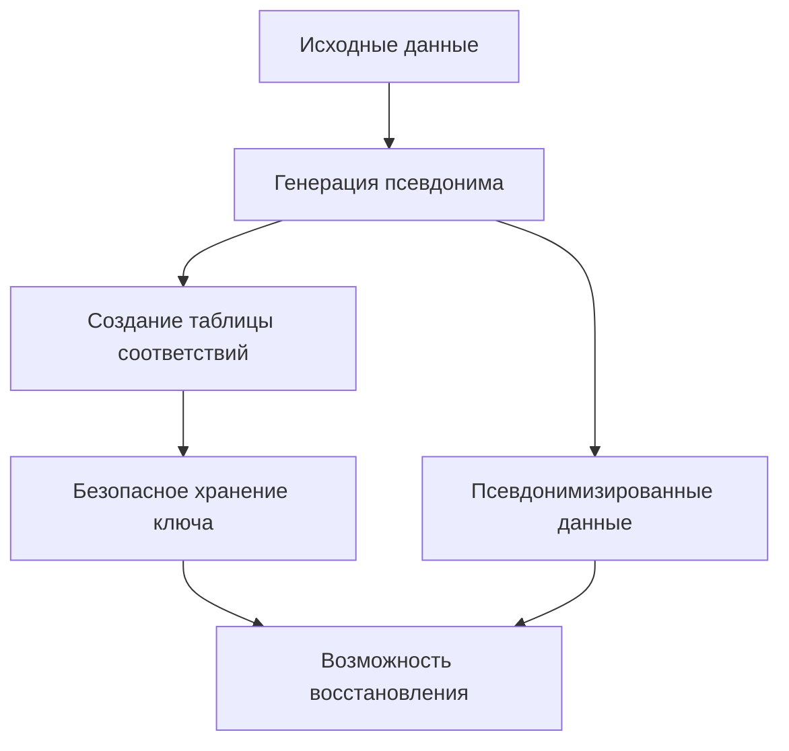
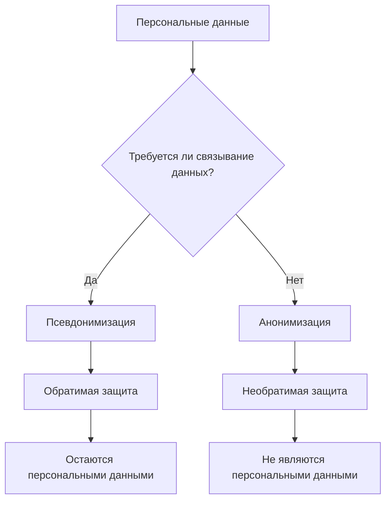

# Псевдонимизация против анонимизации: обратимая и необратимая защита данных в GDPR

Псевдонимизация и анонимизация представляют два фундаментально различных подхода к защите персональных данных. Понимание их различий критически важно для соответствия требованиям GDPR и построения эффективной системы веб-аналитики, которая балансирует конфиденциальность пользователей и потребности в данных.

## Псевдонимизация: обратимая защита данных

Псевдонимизация — это процесс замены идентифицирующей информации псевдонимами или искусственными идентификаторами таким образом, что данные можно восстановить при наличии дополнительной информации, хранящейся отдельно.

!!! info "Определение GDPR"

    Согласно статье 4(5) GDPR, псевдонимизация означает "обработку персональных данных таким образом, что персональные данные больше не могут быть отнесены к конкретному субъекту данных без использования дополнительной информации".

### Ключевые характеристики псевдонимизации

**Обратимость процесса**

Главная особенность псевдонимизации — возможность восстановления исходных данных при наличии соответствующего ключа или таблицы соответствий.

**Сохранение статуса персональных данных**

Псевдонимизированные данные продолжают считаться персональными данными под юрисдикцией GDPR, если у контролера есть средства для их деанонимизации.

**Техническая реализация**



### Методы псевдонимизации

=== "Токенизация"

    Замена чувствительных данных уникальными токенами, хранящимися в защищенной базе данных.

    - Необратимые токены без математической связи с исходными данными
    - Высокий уровень безопасности
    - Полный контроль над процессом деанонимизации

=== "Криптографическое хеширование"

    Использование криптографических функций с ключом для создания псевдонимов.

    - Детерминированные результаты для одинаковых входных данных
    - Возможность сравнения без деанонимизации
    - Зависимость от стойкости ключа

=== "Маскирование данных"

    Частичное сокрытие идентифицирующей информации с сохранением её структуры.

    - Сохранение формата данных
    - Возможность обратного восстановления
    - Подходит для тестовых сред

!!! example "Пример псевдонимизации в аналитике"

    **Исходные данные пользователя:**
    ```
    Email: user@example.com
    IP: 192.168.1.100
    Device ID: ABC123XYZ
    ```

    **После псевдонимизации:**
    ```
    User Token: USR_789456123
    IP Hash: 4f3d2a1b9c8e7f6a
    Device Hash: DEV_445566778
    ```

    **Таблица соответствий (хранится отдельно):**
    ```
    USR_789456123 → user@example.com
    4f3d2a1b9c8e7f6a → 192.168.1.100
    DEV_445566778 → ABC123XYZ
    ```

## Анонимизация: необратимая защита данных

Анонимизация представляет собой необратимый процесс изменения персональных данных таким образом, что субъект данных больше не может быть идентифицирован ни прямо, ни косвенно.

### Принципы анонимизации по GDPR

**Критерий необратимости**

Recital 26 GDPR требует, чтобы "информация не относилась к идентифицированному или идентифицируемому физическому лицу или к персональным данным, обезличенным таким образом, что субъект данных не является или больше не является идентифицируемым".

**Прекращение действия GDPR**

Правильно анонимизированные данные выходят из-под действия GDPR, поскольку больше не считаются персональными данными.

### Техники анонимизации

=== "Агрегация данных"

    Объединение индивидуальных записей в группы для получения статистических показателей.

    **Преимущества:**

    - Полная защита индивидуальной информации
    - Сохранение статистической значимости
    - Подходит для отчетности

    **Недостатки:**

    - Потеря детальной информации
    - Ограниченные возможности анализа
    - Невозможность индивидуального отслеживания

=== "Обобщение данных"

    Замена конкретных значений более широкими категориями.

    - Возрастные диапазоны вместо точного возраста
    - Региональная группировка вместо точных адресов
    - Временные интервалы вместо точных меток времени

=== "Подавление данных"

    Полное удаление идентифицирующих полей или записей.

    - Удаление прямых идентификаторов
    - Исключение уникальных записей
    - Фильтрация редких значений

!!! warning "Риски псевдоанонимизации"

    Многие техники, считающиеся анонимизацией, на самом деле представляют собой псевдонимизацию, поскольку данные могут быть реидентифицированы при помощи дополнительной информации или современных методов анализа.

## Сравнительный анализ методов

| Критерий | Псевдонимизация | Анонимизация |
|----------|------------------|---------------|
| **Обратимость** | Обратимый процесс | Необратимый процесс |
| **Статус под GDPR** | Персональные данные | Не персональные данные |
| **Риск реидентификации** | Низкий при правильной реализации | Теоретически отсутствует |
| **Полезность данных** | Высокая аналитическая ценность | Ограниченная детализация |
| **Требования к безопасности** | Защита ключей и таблиц соответствий | Проверка необратимости |

## Применение в веб-аналитике

### Сценарии использования псевдонимизации

**Пользовательские сессии**

Отслеживание поведения пользователей между сессиями с возможностью связывания данных при необходимости.

**A/B тестирование**

Создание стабильных групп пользователей для экспериментов с сохранением возможности анализа результатов.

**Персонализация**

Предоставление персонализированного контента без раскрытия личности пользователя аналитическим системам.

### Сценарии использования анонимизации

**Публичная отчетность**

Подготовка агрегированных отчетов для публикации без риска раскрытия персональной информации.

**Исследования и развитие**

Предоставление данных для научных исследований или разработки новых алгоритмов.

**Долгосрочное хранение**

Архивирование исторических данных для трендового анализа.

!!! example "Практическая реализация в аналитике"

    **Псевдонимизация для пользовательских путешествий:**
    ```javascript
    // Пользователь получает постоянный псевдоним
    const userPseudonym = generatePseudonym(realUserId);
    
    // События связываются с псевдонимом
    trackEvent('page_view', {
        user: userPseudonym,
        page: '/products',
        timestamp: Date.now()
    });
    ```

    **Анонимизация для агрегированной отчетности:**
    ```javascript
    // Данные агрегируются без возможности восстановления
    const aggregatedStats = {
        timeRange: 'daily',
        totalViews: 15420,
        uniqueVisitors: 8756,
        topPages: ['/home', '/products', '/about'],
        // Индивидуальные пользователи не восстанавливаются
    };
    ```

## Правовые и этические соображения

### Требования GDPR к псевдонимизации

**Техническая защита**

- Отдельное хранение ключей деанонимизации
- Ограниченный доступ к таблицам соответствий
- Шифрование дополнительной информации

**Организационные меры**

- Разделение ролей и ответственности
- Аудит доступа к механизмам деанонимизации
- Политики управления ключами

### Практические рекомендации

=== "Выбор метода защиты"

    **Используйте псевдонимизацию когда:**

    - Необходимо отслеживание пользователей во времени
    - Требуется персонализация или таргетинг
    - Планируются продольные исследования

    **Используйте анонимизацию когда:**

    - Данные предназначены для публичного доступа
    - Требуется соответствие строгим конфиденциальным требованиям
    - Индивидуальная идентификация не нужна

=== "Техническая реализация"

    **Для псевдонимизации:**

    - Используйте криптографически стойкие алгоритмы
    - Обеспечьте защищенное хранение ключей
    - Регулярно ротируйте псевдонимы

    **For анонимизации:**

    - Применяйте множественные техники одновременно
    - Проводите регулярную оценку рисков реидентификации
    - Документируйте процедуры и принятые решения

Мы провели обширные исследования эффективности различных подходов к защите данных пользователей. Наш опыт показывает, что выбор между псевдонимизацией и анонимизацией должен основываться на конкретных потребностях бизнеса, требованиях к аналитике и уровне приемлемого риска.



Эффективная защита пользовательских данных требует тщательного планирования и понимания различий между доступными методами. Правильный выбор техники защиты обеспечивает соблюдение требований конфиденциальности при сохранении аналитической ценности данных.

--8<-- "snippets/ai.ru.md"

!!! success "Нужна помощь с защитой данных?"

    Наша аналитическая платформа предоставляет встроенные инструменты как для псевдонимизации, так и для анонимизации данных. Получите полный контроль над обработкой персональной информации с соблюдением требований GDPR.