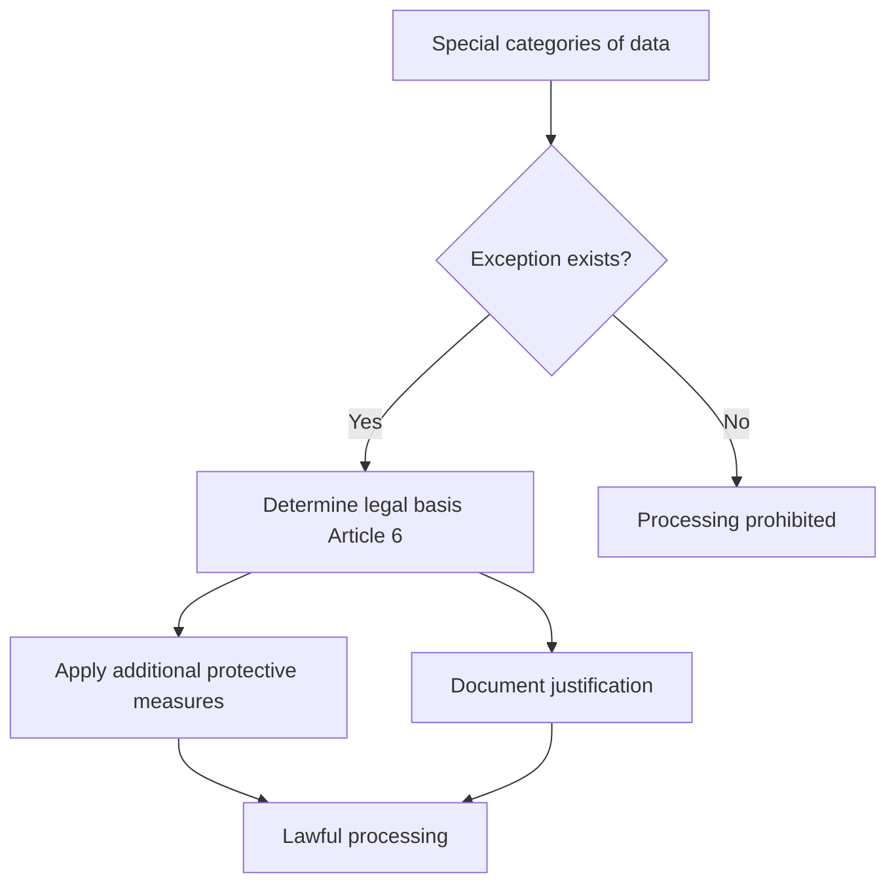

# Special Categories of Personal Data: Rules for Processing Sensitive Information

Special categories of personal data represent the most sensitive information that requires special protection under GDPR. This data has received the status of "special categories" due to high risks of discrimination and violation of fundamental human rights when misused.

## What Constitutes Special Categories of Data

GDPR Article 9 defines eight categories of personal data that are considered particularly sensitive:

### Main Categories

**Racial or ethnic origin**

- Biological ancestry and hereditary characteristics
- Cultural aspects: language, history, traditions
- Shared values and sense of belonging to a group

**Political opinions**

- Political affiliation and views
- Participation in political organizations
- Electoral preferences

**Religious or philosophical beliefs**

- Religious faith and spiritual practices
- Philosophical views and worldview
- Participation in religious organizations

**Trade union membership**

- Trade union activities
- Labor rights and representation
- Collective bargaining

### Biometric and Genetic Data

=== "Genetic data"

    Personal data relating to inherited or acquired genetic characteristics of a natural person which give unique information about the physiology or health:

    - Chromosomal analysis
    - DNA or RNA analysis
    - Biological sample research
    - Genetic testing

=== "Biometric data"

    Personal data resulting from specific technical processing relating to physical, physiological or behavioral characteristics of a natural person:

    - Fingerprints (dactyloscopic data)
    - Facial recognition
    - Retinal scanning
    - Voice characteristics
    - Hand geometry

!!! warning "Important Note on Biometrics"
    
    Photographs are considered biometric data only when they are processed by special means for unique identification of a person. Regular photographs on social networks are not biometric data by default.

### Health Data

Personal data related to the physical or mental health of a natural person, including the provision of healthcare services, which reveal information about health status:

**Medical information**

- Medical history and diagnoses
- Test and examination results
- Prescribed treatments and medications
- Psychological condition

**Indirect health data**

- Frequency of doctor visits
- Insurance case information
- Data from medical devices
- Disability information

### Private Life Data

**Sex life and sexual orientation**

- Sexual preferences and practices
- Information about partners
- Gender transition data
- Information about same-sex marriage registration

!!! info "Broad Interpretation of Categories"
    
    Special categories of data are defined broadly and may include information that doesn't seem particularly sensitive. For example, a broken leg is technically health data, though less sensitive than mental health information.

## General Prohibition on Processing

Article 9(1) GDPR establishes a fundamental prohibition on processing special categories of personal data. This prohibition operates by default to protect fundamental human rights and freedoms.

### Reasons for Special Protection

**High discrimination risks**

- Unequal treatment based on origin
- Health-based discrimination
- Political persecution
- Religious intolerance

**Privacy violations**

- Disclosure of intimate information
- Invasion of personal space
- Creation of detailed personality profiles
- Manipulation based on vulnerabilities

## Exceptions to the Prohibition

Article 9(2) GDPR provides 10 exceptions to the general prohibition on processing special categories of data:

### Consent and Voluntary Grounds

=== "Explicit Consent"

    Consent must be explicit, meaning stricter requirements compared to regular consent:

    **Requirements for explicit consent:**

    - Clear statement (oral or written)
    - Specification of the nature of special category data
    - Specific processing purposes
    - Ability to withdraw at any time

    **Forms of obtaining consent:**

    - Written statement with signature
    - Electronic form with clear wording
    - Oral consent (with documentation)
    - Separate consent for each data category

=== "Made public by data subject"

    Processing of personal data that has been manifestly made public by the data subject:

    **Examples of making public:**

    - Public speeches by politicians
    - Open information on social networks
    - Media publications on person's initiative
    - Participation in public events

    **Application limitations:**

    - Data must be "manifestly" made public
    - Context of making public matters
    - Not all public data falls under this exception

### Vital Interests

Processing is necessary to protect the vital interests of the data subject or another person where the data subject is physically or legally incapable of giving consent:

**Application in emergency situations:**

- Medical assistance for unconscious patients
- Rescue operations
- Protection of life and health
- Prevention of serious harm

!!! warning "Limited Scope of Application"
    
    Vital interests apply only in exceptional cases involving life and death. This exception cannot be used as an alternative to consent if a person is capable of giving it but refuses.

### Employment and Social Protection

**Labor relations**

- Processing in employment law
- Social security and protection
- Authorization by EU or Member State law
- Appropriate protective measures

**Non-profit organizations**

- Foundations, associations, trade unions
- Political, philosophical, religious purposes
- Processing only members and former members
- Appropriate protective measures

### Legal Procedures

**Court proceedings**

- Establishment, exercise or defense of legal claims
- Judicial actions and procedures
- Courts operating within their legal functions

### Public Interest

=== "Substantial public interest"

    **Application conditions:**

    - Proportionality to the aim pursued
    - Respect for the essence of data protection rights
    - Special measures to protect data subject rights
    - Basis in EU or Member State law

=== "Healthcare and social care"

    Processing necessary for preventive medicine, assessment of working capacity, medical diagnosis, provision of healthcare or social care:

    **Medical purposes:**

    - Preventive or occupational medicine
    - Medical diagnosis and treatment
    - Healthcare system management
    - Contract with health professional

=== "Public health"

    **Protection against health threats:**

    - Serious cross-border threats to health
    - High standards of healthcare quality
    - Safety of medicinal products and devices
    - Professional secrecy

### Archiving and Research

**Scientific and historical research**

- Scientific purposes and public interest
- Historical research
- Statistical purposes
- Appropriate guarantees under Article 89

## Additional Protection Requirements

### Dual Basis for Processing

!!! tip "Critically Important"
    
    For lawful processing of special categories of data, it's necessary to determine both a legal basis under Article 6 GDPR and a separate condition under Article 9. These bases don't necessarily need to be linked.

**Example of basis combinations:**

| Article 6 (legal basis) | Article 9 (condition for special categories) | Context |
|-------------------------|-----------------------------------------------|---------|
| Contract | Explicit consent | Private medical services |
| Public task | Healthcare | Public hospitals |
| Legitimate interests | Made public by subject | Journalistic activities |

### Data Protection Impact Assessment (DPIA)

Processing special categories of data, especially on a large scale, requires conducting a data protection impact assessment:

**Mandatory DPIA elements:**

- Description of processing operations
- Assessment of necessity and proportionality
- Risk analysis for rights and freedoms
- Risk mitigation measures

### Appropriate Policy Document

Many exceptions require an appropriate policy document including:

- Procedures for ensuring GDPR principles compliance
- Data subject rights protection measures
- Records of processing activities
- Data security measures

## Automated Decision-Making

Article 22(4) GDPR establishes particularly strict rules for automated decision-making based on special categories of data:

**Permitted grounds:**

- Explicit consent of the data subject
- Substantial public interest
- Appropriate measures to safeguard rights and freedoms

**Prohibited practices:**

- Profiling without consent or public interest
- Automatic decisions with legal consequences
- Discriminatory algorithms

## Sector-Specific Features

### Healthcare

**Medical organizations:**

- Priority of Article 9(2)(h) - medical purposes
- Professional secrecy as additional protection
- Ability to process without patient consent
- Strict data security requirements

**Medical research:**

- Article 9(2)(j) - scientific research
- Additional guarantees under Article 89
- Data pseudonymization
- Restrictions on further use

### Employment Relations

**Employers:**

- Limited processing possibilities
- Need for lawful grounds
- Medical examinations as required by law
- Prohibition of discrimination in hiring

### Marketing and Advertising

**Behavioral advertising:**

- Explicit separate prior consent mandatory
- Prohibition of targeting by sensitive categories
- Impossibility of using opt-out model
- Separate consent for each data category

!!! warning "Advertising Restrictions"
    
    Creating advertising categories based on special data can lead to discrimination and privacy violations. Such practice is only possible with explicit prior consent for each specific category.

## International Transfers

International transfers of special categories of data have additional requirements:

**Additional guarantees:**

- Appropriate protection measures in third countries
- Special contractual conditions
- Certification and codes of conduct
- Supervisory authority approval

**Transfer suspension:**

- Ability to suspend with insufficient protection
- Monitoring protection level in destination country
- Notification of supervisory authorities

## Data Subject Rights

Data subjects have enhanced rights regarding special categories:

**Right to information:**

- Specific categories of processed data
- Processing purposes for each category
- Legal basis and processing condition
- Data retention periods

**Right of access:**

- Detailed processing information
- Copies of processed data
- Information about data sources
- Data recipients

**Right to rectification and erasure:**

- Correction of inaccurate data
- Completion of incomplete data
- Deletion upon consent withdrawal
- Deletion for unlawful processing

## Practical Compliance Recommendations

### Necessity Assessment

**Data minimization:**

- Processing only necessary special categories
- Regular data relevance verification
- Automatic deletion after retention periods
- Pseudonymization and anonymization where possible

### Technical Protection Measures

**Data security:**

- Encryption of special category data
- Access restriction on need-to-know basis
- Auditing of all sensitive data operations
- Encrypted backup storage

### Organizational Measures

**Staff training:**

- Special training for sensitive data handling
- Understanding of legal grounds and exceptions
- Incident response procedures
- Regular knowledge updates

**Documentation:**

- Registry of all special category operations
- Justification for legal basis selection
- Protection measures and guarantees
- Data protection impact assessments

Special categories of personal data require special attention and strict compliance with GDPR requirements. Organizations must carefully assess the necessity of processing such information, choose appropriate legal grounds, and implement reliable protection measures.

We develop analytical solutions considering strict personal data protection requirements. Our approach provides for minimizing sensitive information collection, using modern anonymization methods, and full compliance with GDPR requirements for special categories of data.

--8<-- "snippets/ai.md"

!!! success "Need analytics with personal data protection?"
    
    Register for free testing of our web analytics platform. Get the complete picture of user behavior while complying with all GDPR requirements for personal data protection and without risk of processing special categories of information.