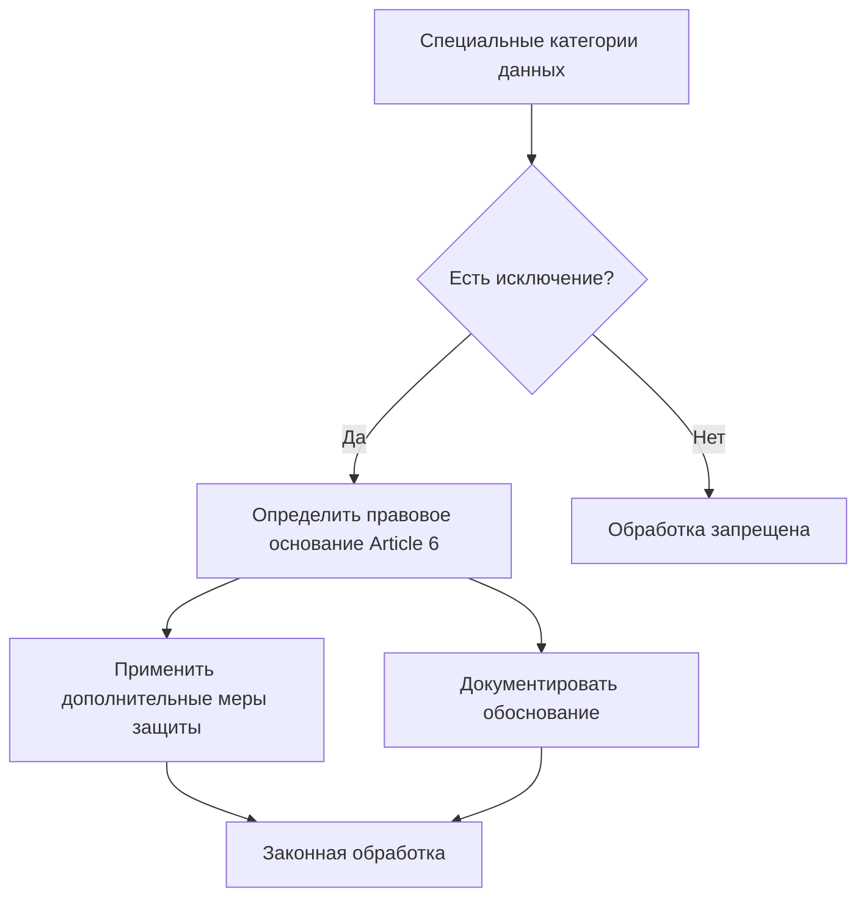

# Специальные категории персональных данных: правила обработки чувствительной информации

Специальные категории персональных данных представляют собой наиболее чувствительную информацию, которая требует особой защиты в рамках GDPR. Эти данные получили статус "особых категорий" из-за высоких рисков дискриминации и нарушения фундаментальных прав человека при их неправомерном использовании.

## Что относится к специальным категориям данных

GDPR в статье 9 определяет восемь категорий персональных данных, которые считаются особо чувствительными:

### Основные категории

**Расовое или этническое происхождение**

- Биологические предки и наследственные характеристики
- Культурные аспекты: язык, история, традиции
- Общие ценности и чувство принадлежности к группе

**Политические убеждения**

- Политическая аффилиация и взгляды
- Участие в политических организациях
- Электоральные предпочтения

**Религиозные или философские убеждения**

- Вероисповедание и духовные практики
- Философские взгляды и мировоззрение
- Участие в религиозных организациях

**Членство в профсоюзах**

- Профсоюзная деятельность
- Трудовые права и представительство
- Коллективные переговоры

### Биометрические и генетические данные

=== "Генетические данные"

    Персональные данные, относящиеся к унаследованным или приобретенным генетическим характеристикам человека, которые дают уникальную информацию о физиологии или здоровье:

    - Хромосомный анализ
    - Анализ ДНК или РНК
    - Исследование биологических образцов
    - Генетическое тестирование

=== "Биометрические данные"

    Персональные данные, полученные в результате специальной технической обработки физических, физиологических или поведенческих характеристик человека:

    - Отпечатки пальцев (дактилоскопические данные)
    - Распознавание лица
    - Сканирование сетчатки глаза
    - Голосовые характеристики
    - Геометрия руки

!!! warning "Важное замечание о биометрии"
    
    Фотографии считаются биометрическими данными только тогда, когда они обрабатываются специальными средствами для уникальной идентификации человека. Обычные фотографии в социальных сетях не являются биометрическими данными по умолчанию.

### Данные о здоровье

Персональные данные, касающиеся физического или психического здоровья человека, включая предоставление медицинских услуг, которые раскрывают информацию о состоянии здоровья:

**Медицинская информация**

- История болезни и диагнозы  
- Результаты анализов и обследований
- Назначенные лечение и лекарства
- Психологическое состояние

**Косвенные данные о здоровье**

- Частота посещений врача
- Информация о страховых случаях
- Данные с медицинских устройств
- Информация о нетрудоспособности

### Данные о частной жизни

**Сексуальная жизнь и сексуальная ориентация**

- Сексуальные предпочтения и практики
- Информация о партнерах
- Данные о смене пола
- Информация о регистрации однополых браков

!!! info "Широкая трактовка категорий"
    
    Специальные категории данных определены широко и могут включать информацию, которая не кажется особенно чувствительной. Например, сломанная нога технически является данными о здоровье, хотя менее чувствительна, чем информация о психическом здоровье.

## Общий запрет на обработку

Статья 9(1) GDPR устанавливает принципиальный запрет на обработку специальных категорий персональных данных. Этот запрет действует по умолчанию для защиты фундаментальных прав и свобод человека.

### Причины особой защиты

**Высокие риски дискриминации**

- Неравное обращение на основе происхождения
- Дискриминация по состоянию здоровья  
- Преследование за политические взгляды
- Религиозная нетерпимость

**Нарушение частной жизни**

- Раскрытие интимной информации
- Вторжение в личное пространство
- Создание детальных профилей личности
- Манипуляции на основе уязвимостей

## Исключения из запрета

Статья 9(2) GDPR предусматривает 10 исключений из общего запрета на обработку специальных категорий данных:

### Согласие и добровольные основания

=== "Явное согласие (Explicit Consent)"

    Согласие должно быть явным, что означает более строгие требования по сравнению с обычным согласием:

    **Требования к явному согласию:**

    - Четкое заявление (устное или письменное)
    - Указание природы специальных категорий данных
    - Конкретные цели обработки
    - Возможность отзыва в любое время

    **Форма получения согласия:**

    - Письменное заявление с подписью
    - Электронная форма с четкими формулировками
    - Устное согласие (с документированием)
    - Отдельное согласие для каждой категории данных

=== "Обнародование субъектом данных"

    Обработка персональных данных, которые явным образом обнародованы самим субъектом данных:

    **Примеры обнародования:**

    - Публичные выступления политиков
    - Открытая информация в социальных сетях
    - Публикации в СМИ по инициативе человека
    - Участие в публичных мероприятиях

    **Ограничения применения:**

    - Данные должны быть "явно" обнародованы
    - Контекст обнародования имеет значение
    - Не все публичные данные подпадают под исключение

### Жизненно важные интересы

Обработка необходима для защиты жизненно важных интересов субъекта данных или другого лица, когда субъект физически или юридически не способен дать согласие:

**Применение в экстренных ситуациях:**

- Медицинская помощь без сознания пациента
- Спасательные операции
- Защита жизни и здоровья
- Предотвращение серьезного вреда

!!! warning "Ограниченная сфера применения"
    
    Жизненно важные интересы применяются только в исключительных случаях, когда речь идет о жизни и смерти. Нельзя использовать это исключение как альтернативу согласию, если человек способен его дать, но отказывается.

### Занятость и социальная защита

**Трудовые отношения**

- Обработка в сфере трудового права
- Социальное обеспечение и защита
- Авторизация законом ЕС или государства-члена
- Соответствующие меры защиты

**Некоммерческие организации**

- Фонды, ассоциации, профсоюзы
- Политические, философские, религиозные цели
- Обработка только членов и бывших членов
- Соответствующие меры защиты

### Правовые процедуры

**Судебные разбирательства**

- Установление, осуществление или защита правовых требований  
- Судебные действия и процедуры
- Работа судов в рамках их юридических функций

### Общественный интерес

=== "Существенный общественный интерес"

    **Условия применения:**

    - Пропорциональность поставленной цели
    - Уважение сущности права на защиту данных
    - Специальные меры защиты прав субъекта данных
    - Основание в праве ЕС или государства-члена

=== "Здравоохранение и социальная помощь"

    Обработка необходима для профилактической медицины, оценки трудоспособности, медицинской диагностики, предоставления медицинской или социальной помощи:

    **Медицинские цели:**

    - Профилактическая или профессиональная медицина
    - Медицинская диагностика и лечение
    - Управление системами здравоохранения
    - Договор с медицинским работником

=== "Общественное здравоохранение"

    **Защита от угроз здоровью:**

    - Серьезные трансграничные угрозы здоровью
    - Высокие стандарты качества медицинских услуг
    - Безопасность лекарственных средств и устройств
    - Профессиональная тайна

### Архивирование и исследования

**Научные и исторические исследования**

- Научные цели и общественный интерес
- Исторические исследования
- Статистические цели
- Соответствующие гарантии согласно статье 89

## Дополнительные требования защиты

### Двойное основание для обработки

!!! tip "Критически важно"
    
    Для законной обработки специальных категорий данных необходимо определить как правовое основание по статье 6 GDPR, так и отдельное условие по статье 9. Эти основания не обязательно должны быть связаны между собой.

**Пример комбинации оснований:**

| Статья 6 (правовое основание) | Статья 9 (условие для специальных категорий) | Контекст |
|-------------------------------|-----------------------------------------------|-----------|
| Договор | Явное согласие | Частные медицинские услуги |
| Общественные задачи | Здравоохранение | Государственные больницы |
| Законные интересы | Обнародование субъектом | Журналистская деятельность |

### Оценка воздействия на защиту данных (DPIA)

Обработка специальных категорий данных, особенно в крупном масштабе, требует проведения оценки воздействия на защиту данных:

**Обязательные элементы DPIA:**

- Описание операций обработки
- Оценка необходимости и пропорциональности
- Анализ рисков для прав и свобод
- Меры по минимизации рисков

### Соответствующий программный документ

Для многих исключений требуется наличие соответствующего программного документа, включающего:

- Процедуры обеспечения соблюдения принципов GDPR
- Меры защиты прав субъектов данных  
- Записи об обработке данных
- Меры безопасности данных

## Автоматизированное принятие решений

Статья 22(4) GDPR устанавливает особо строгие правила для автоматизированного принятия решений на основе специальных категорий данных:

**Разрешенные основания:**

- Явное согласие субъекта данных
- Существенный общественный интерес
- Соответствующие меры защиты прав и свобод

**Запрещенные практики:**

- Профилирование без согласия или общественного интереса
- Автоматические решения с правовыми последствиями  
- Дискриминационные алгоритмы

## Особенности в различных секторах

### Здравоохранение

**Медицинские организации:**

- Приоритет статьи 9(2)(h) - медицинские цели
- Профессиональная тайна как дополнительная защита
- Возможность обработки без согласия пациента
- Строгие требования к безопасности данных

**Медицинские исследования:**

- Статья 9(2)(j) - научные исследования  
- Дополнительные гарантии по статье 89
- Псевдонимизация данных
- Ограничения на дальнейшее использование

### Трудовые отношения

**Работодатели:**

- Ограниченные возможности обработки
- Необходимость в законных основаниях
- Медицинские осмотры по требованиям закона
- Запрет дискриминации при найме

### Маркетинг и реклама

**Поведенческая реклама:**

- Явное отдельное предварительное согласие обязательно
- Запрет на таргетинг по чувствительным категориям
- Невозможность использования opt-out модели
- Отдельное согласие для каждой категории данных

!!! warning "Ограничения в рекламе"
    
    Создание рекламных категорий на основе специальных данных может привести к дискриминации и нарушению приватности. Такая практика возможна только при явном предварительном согласии на каждую конкретную категорию.

## Международные передачи

При международных передачах специальных категорий данных применяются дополнительные требования:

**Дополнительные гарантии:**

- Соответствующие меры защиты в третьих странах
- Специальные договорные условия
- Сертификация и кодексы поведения  
- Одобрение надзорным органом

**Деактивация передач:**

- Возможность приостановки при недостаточной защите
- Мониторинг уровня защиты в стране назначения
- Уведомление надзорных органов

## Права субъектов данных

Субъекты данных имеют усиленные права относительно специальных категорий:

**Право на информацию:**

- Конкретные категории обрабатываемых данных
- Цели обработки для каждой категории
- Правовое основание и условие обработки
- Сроки хранения данных

**Право доступа:**

- Подробная информация об обработке
- Копии обрабатываемых данных
- Информация об источниках данных
- Получатели данных

**Право на исправление и удаление:**

- Исправление неточных данных
- Дополнение неполных данных  
- Удаление при отзыве согласия
- Удаление при незаконной обработке

## Практические рекомендации для соблюдения

### Оценка необходимости

**Минимизация данных:**

- Обработка только необходимых специальных категорий
- Регулярная проверка актуальности данных
- Автоматическое удаление по истечении сроков
- Псевдонимизация и анонимизация где возможно

### Технические меры защиты

**Безопасность данных:**

- Шифрование специальных категорий данных
- Ограничение доступа по принципу необходимости  
- Аудит всех операций с чувствительными данными
- Резервное копирование с шифрованием

### Организационные меры

**Обучение персонала:**

- Специальная подготовка по работе с чувствительными данными
- Понимание правовых основания и исключений
- Процедуры реагирования на инциденты
- Регулярное обновление знаний

**Документирование:**

- Реестр всех операций со специальными категориями
- Обоснование выбора правового основания
- Меры защиты и гарантии
- Оценки воздействия на защиту данных

Специальные категории персональных данных требуют особого внимания и строгого соблюдения требований GDPR. Организации должны тщательно оценивать необходимость обработки такой информации, выбирать подходящие правовые основания и внедрять надежные меры защиты.

Мы разрабатываем аналитические решения с учетом строгих требований к защите персональных данных. Наш подход предусматривает минимизацию сбора чувствительной информации, использование современных методов анонимизации и полное соблюдение требований GDPR к специальным категориям данных.

--8<-- "snippets/ai.ru.md"

!!! success "Нужна аналитика с защитой персональных данных?"
    
    Зарегистрируйтесь для бесплатного тестирования нашей платформы веб-аналитики. Получите полную картину поведения пользователей с соблюдением всех требований GDPR к защите персональных данных и без риска обработки специальных категорий информации.