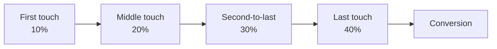
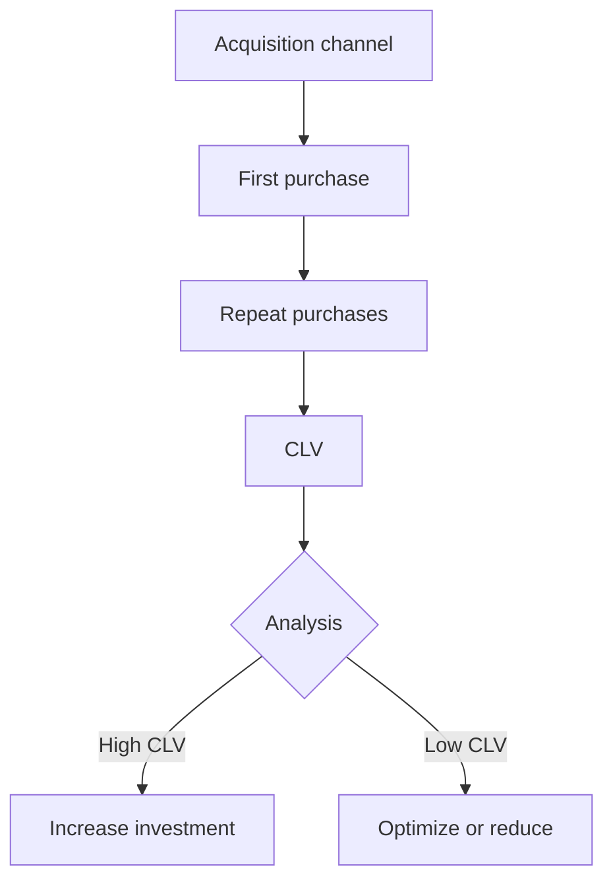

# Traffic Channels: Source Grouping and Attribution Role in Web Analytics

Traffic Channels represent a system for categorizing website visitor sources by types of marketing activity. Unlike detailed traffic sources, channels combine multiple similar sources into logical groups to simplify analysis and strategic decision-making. Understanding how channels work and setting them up correctly is critical for effective marketing budget allocation and conversion optimization.

## Traffic Classification Hierarchy

Web analytics uses a three-level traffic classification system, where each level provides different degrees of detail:

### Source

The specific platform or site where the visitor came from. Examples: google, facebook, newsletter, example.com.

### Medium

The traffic type or delivery method. Examples: organic, cpc, email, referral, social.

### Campaign

The specific marketing initiative. Examples: summer-sale-2025, product-launch, black-friday.

!!! info "Complete Classification Example"
    
    URL with parameters: `example.com/?utm_source=facebook&utm_medium=paid&utm_campaign=q1-promotion`
    
    - **Source:** facebook (where from)
    - **Medium:** paid (how)  
    - **Campaign:** q1-promotion (why)
    - **Channel:** Paid Social (automatic grouping)

## Default Standard Channels

Web analytics systems automatically group traffic sources into predefined channels based on rules. Let's examine the main channels and their formation logic.

### Organic Search

Organic search traffic includes unpaid transitions from search engines. The system identifies this channel when the source is a known search engine and the medium contains "organic" or is missing.

**Entry conditions:**

- Source matches the search engine list (Google, Bing, DuckDuckGo)
- Medium = organic or not specified
- No paid advertising parameters present

### Paid Search

Paid search traffic comes from advertising campaigns in search engines. Correct identification requires two conditions: the source must be a search engine, and the medium must indicate paid traffic.

**Entry conditions:**

- Source = search engine
- Medium contains: cpc, ppc, paidsearch, paid

### Direct

Direct traffic includes visitors without a detectable source. This includes bookmark clicks, direct URL entry, clicks from mobile applications without UTM tags.

!!! warning "Dark Traffic Problem"
    
    Up to 60% of mobile organic traffic can be misclassified as Direct due to technical browser and application limitations. Transitions from messengers, PDF documents, and email clients often lose referral information.

### Referral

Referral traffic is generated by transitions from other sites through regular links. The system automatically assigns all transitions from external domains that don't meet other channel criteria to this channel.

### Social

Social traffic combines transitions from social networks. Modern analytics systems support extended lists of social platforms, including niche and regional networks.

**Recognized platforms:**

- Main: Facebook, Instagram, LinkedIn, Twitter/X
- Video: YouTube, TikTok, Vimeo
- Professional: GitHub, Stack Overflow
- Messengers with social features

### Email

The Email channel requires proper link tagging in newsletters. Without UTM parameters, email traffic often falls into the Direct category, distorting the real picture of email marketing effectiveness.

### Display

The Display channel includes traffic from display advertising - banners, native advertising, programmatic. Correct attribution requires using medium=display or banner.

### Affiliates

Partner traffic from affiliate program participants. Requires explicit tagging with medium=affiliate for proper categorization.

## Creating Custom Channels

Default channels don't always match business specifics. Custom channels allow adapting grouping to unique needs.

### When Custom Channels Are Needed

=== "Unique Sources"
    
    **Problem:** Your business uses specific acquisition channels
    
    **Solution:** Create separate channels for:
    
    - Podcasts and audio advertising
    - Influencer marketing
    - Offline QR codes
    - Internal communications

=== "Detailing Existing"
    
    **Problem:** Default channels are too broad
    
    **Solution:** Split into subcategories:
    
    - Social → Paid Social / Organic Social
    - Search → Brand Search / Non-Brand Search
    - Email → Newsletter / Transactional / Automation

=== "Business Logic"
    
    **Problem:** Grouping by business criteria needed
    
    **Solution:** Channels based on:
    
    - Funnel stages (Awareness / Consideration / Decision)
    - Geography (Local / National / International)
    - Product lines

### Rules for Creating Custom Channels

Effective custom channel setup requires a systematic approach:

!!! tip "Setup Principles"
    
    1. **Order matters**
       
       Rules are processed top-down. Place more specific rules above general ones.
    
    2. **Use RegEx for flexibility**
       ```
       Source matches regex: ^(facebook|instagram|fb|ig)$
       Medium matches regex: ^(paid|cpc|ppc|paidsocial)$
       ```
    
    3. **Test on historical data**
       
       Before implementation, check how new rules will affect existing classification
    
    4. **Document the logic**
       
       Create a reference guide describing each channel and entry conditions

### Processing Unclassified Traffic

The "Unassigned" or "(other)" channel indicates tagging problems. Main causes:

| Cause | Solution |
|-------|----------|
| Missing UTM parameters | Implement mandatory tagging for all campaigns |
| Typos in parameters | Use automatic link generators |
| New sources | Regularly update channel rules |
| Technical issues | Verify correct parameter transmission |

## Attribution and Channel Role in Conversion

Understanding each channel's contribution to conversion requires applying attribution models. Traditional single-touch models are giving way to multi-touch approaches.

### Single-Touch Attribution

The simplest models assigning 100% of value to one touchpoint:

**First-Touch Attribution**

All value is assigned to the first interaction. Suitable for evaluating the effectiveness of new user acquisition channels and brand campaigns.

**Last-Touch Attribution**

Industry standard where all value goes to the last click before conversion. Ignores the influence of previous interactions.

### Multi-Touch Attribution

Distributes conversion value among all touchpoints in the customer journey.

#### Linear Model

Evenly distributes value among all touches. Simple to understand but doesn't account for varying funnel stage importance.

!!! example "Linear Attribution Example"
    
    **Customer Journey:**
    1. Organic Search (blog) → 25%
    2. Paid Social (retargeting) → 25%
    3. Email (newsletter) → 25%
    4. Direct (return) → 25%
    
    **Total:** 100% conversion

#### Time-Decay

Touches closer to conversion receive more value. Logic: recent interactions are more important for decision-making.



#### Position-Based (U-shaped model)

First touch gets 40%, last touch gets 40%, remaining 20% is distributed among intermediate points. Recognizes the importance of acquisition and deal closing.

#### Data-Driven Attribution

Uses machine learning to determine the actual contribution of each channel based on historical data. Most accurate but requires large data volumes.

### Choosing an Attribution Model

Choice depends on business model and marketing goals:

| Business Model | Recommended Model | Rationale |
|----------------|-------------------|-----------|
| E-commerce with short cycle | Last-Touch or Time-Decay | Focus on conversion channels |
| B2B with long cycle | Linear or Position-Based | All funnel stages matter |
| Subscription service | Data-Driven | Complex paths with multiple touches |
| Content project | First-Touch | Priority on audience acquisition |

## Channel Performance Analysis

### Key Channel Metrics

Performance evaluation requires a comprehensive approach using various metrics:

!!! info "Channel Analysis Metrics"
    
    **Volume indicators:**
    
    - Sessions - total traffic
    - Users - unique visitors
    - New Users - new audience acquisition
    
    **Quality indicators:**
    
    - Bounce Rate - traffic relevance
    - Pages/Session - engagement
    - Avg. Session Duration - interaction depth
    
    **Conversion metrics:**
    
    - Conversion Rate - channel effectiveness
    - Revenue/Session - monetization
    - ROAS - return on ad spend

### Segmentation for Deep Analysis

Channel analysis without segmentation provides superficial understanding. Apply multidimensional segmentation:

=== "By Devices"
    
    Mobile and desktop traffic show different behavior patterns:
    
    - Mobile: higher bounce rate, lower conversion
    - Desktop: more pages/session, higher AOV
    - Tablet: intermediate indicators

=== "By Geography"
    
    Channel effectiveness varies by region:
    
    - Local markets: SEO and Direct more important
    - International: greater role of Paid Search
    - Developing: Social dominates

=== "By Cohorts"
    
    Behavior changes depending on first visit time:
    
    - New users: sensitive to Paid
    - Regular: prefer Direct and Email
    - Returning: respond to Retargeting

### Cross-Channel Analysis

Channels rarely work in isolation. Analyze synergy:

!!! success "Cross-channel Optimization Example"
    
    Company discovered the following patterns:
    
    - Users from Organic Search + Email show 8.2% conversion
    - Paid Search + Retargeting achieve 6.7% conversion
    - Social + Email reach only 2.1%
    
    **Result:** Budget reallocation from Social to SEO content increased overall conversion by 23%.

## Traditional System Problems and Our Solutions

Standard analytics platforms impose artificial limitations on channel management. Google Analytics 4 limits the number of custom channels, doesn't allow complete redefinition of grouping logic for historical data.

We're working on a solution that eliminates these limitations. Our approach provides unlimited custom channels with the ability to apply rules retrospectively. We plan to implement dynamic channels that automatically adapt to changes in traffic structure.

We pay special attention to solving the "dark traffic" problem. Our platform will use advanced algorithms to restore lost attribution by analyzing behavior patterns and contextual signals.

## Channel Management Automation

### Dynamic Rule Creation

Manual channel management becomes inefficient as source numbers grow. Automation is critical:

!!! tip "Automation Approaches"
    
    **Rule-based automation:**
    
    - Automatic rule creation based on patterns
    - New source detection and classification suggestions
    - Existing rule validation for anomalies
    
    **ML-driven classification:**
    
    - Source clustering by user behavior
    - Most likely channel prediction for untagged traffic
    - Hidden connection discovery between sources

### Monitoring and Alerts

Effective channel management requires constant monitoring:

| Alert Type | Trigger Condition | Action |
|------------|------------------|--------|
| Unassigned growth | >5% of total traffic | Check new sources |
| Channel anomaly | >30% deviation from average | Analyze campaign changes |
| New source | Unknown source/medium | Add classification rule |
| Attribution change | >20% shift in model | Review channel weights |

## Privacy Regulation Impact on Channels

### iOS App Tracking Transparency

ATT reduced attribution accuracy by 15-25%, especially for mobile traffic. Adaptation requires:

- Transition to probabilistic attribution
- Strengthening first-party data role
- Using SKAdNetwork for iOS campaigns

### Third-party Cookie Removal

Browsers block cross-site tracking, complicating cross-domain attribution:

- Server-side tracking development
- First-party identifier implementation
- Privacy Sandbox API usage

### New Traffic Sources

AI platform emergence creates new classification challenges:

!!! warning "AI System Traffic"
    
    ChatGPT, Claude, Perplexity can recommend sites without traditional referral data. New approaches needed:
    
    - Creating special "AI Referral" channel
    - Tracking through UTM parameters in prompts
    - Analyzing AI traffic behavior patterns

## Channel Integration with Business Metrics

### Customer Lifetime Value by Channels

CLV analysis reveals long-term channel value:



### Contribution Margin Analysis

Evaluating real contribution accounting for all costs:

| Channel | Revenue | Ad Spend | Operational Cost | Contribution Margin |
|---------|---------|----------|-----------------|-------------------|
| Organic Search | $100K | $0 | $15K | 85% |
| Paid Search | $150K | $60K | $10K | 53% |
| Social Paid | $80K | $45K | $8K | 34% |
| Email | $120K | $5K | $5K | 92% |

Proper grouping of traffic sources into channels and understanding their role in the customer journey through the lens of attribution is the foundation for making informed marketing decisions. Modern privacy challenges and emerging new platforms require a flexible approach to channel management and readiness for constant strategy adaptation.

--8<-- "snippets/ai.md"

!!! success "Ready to optimize your traffic channel management?"
    
    Sign up for a free trial of our analytics platform. Get access to advanced channel configuration capabilities, sophisticated attribution models, and tools to solve the "dark traffic" problem without traditional system limitations.