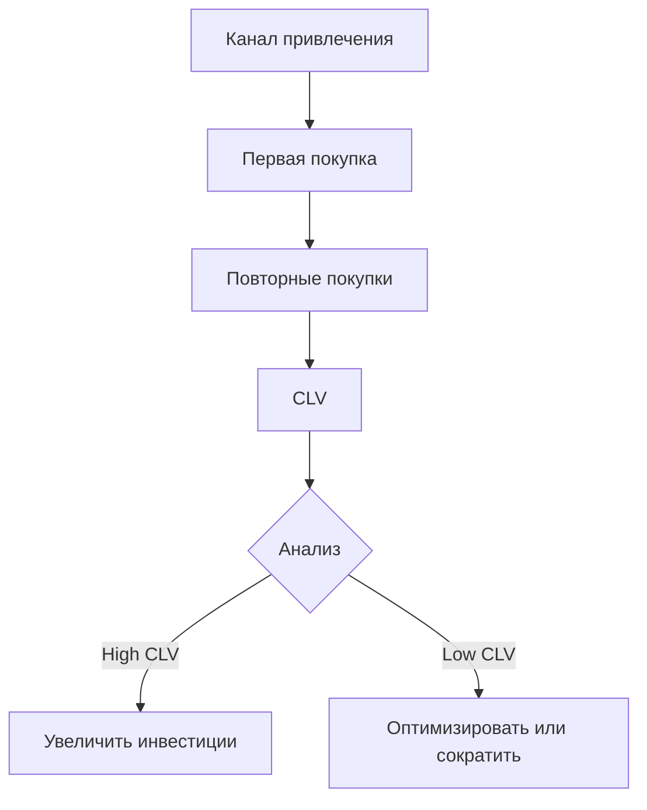

# Каналы трафика: группировка источников и роль атрибуции в веб-аналитике

Каналы трафика (Channels) представляют собой систему категоризации источников посетителей сайта по типам маркетинговой активности. В отличие от детальных источников трафика, каналы объединяют множество похожих источников в логические группы для упрощения анализа и принятия стратегических решений. Понимание работы каналов и их правильная настройка критически важны для эффективного распределения маркетингового бюджета и оптимизации конверсии.

## Иерархия классификации трафика

Веб-аналитика использует трёхуровневую систему классификации трафика, где каждый уровень предоставляет различную степень детализации:

### Source (Источник)

Конкретная платформа или сайт, откуда пришёл посетитель. Примеры: google, facebook, newsletter, example.com.

### Medium (Канал передачи)

Тип трафика или метод доставки. Примеры: organic, cpc, email, referral, social.

### Campaign (Кампания) 

Конкретная маркетинговая инициатива. Примеры: summer-sale-2025, product-launch, black-friday.

!!! info "Пример полной классификации"
    
    URL с параметрами: `example.com/?utm_source=facebook&utm_medium=paid&utm_campaign=q1-promotion`
    
    - **Source:** facebook (откуда)
    - **Medium:** paid (как)  
    - **Campaign:** q1-promotion (зачем)
    - **Channel:** Paid Social (автоматическая группировка)

## Стандартные каналы по умолчанию

Системы веб-аналитики автоматически группируют источники трафика в предопределённые каналы на основе правил. Рассмотрим основные каналы и логику их формирования.

### Organic Search

Органический поисковый трафик включает неоплаченные переходы из поисковых систем. Система определяет этот канал, когда источник является известной поисковой системой, а medium содержит значение "organic" или отсутствует.

**Условия попадания:**

- Source соответствует списку поисковых систем (Google, Bing, DuckDuckGo)
- Medium = organic или не указан
- Отсутствуют параметры платной рекламы

### Paid Search

Платный поисковый трафик формируется из рекламных кампаний в поисковых системах. Для корректного определения необходимо соблюдение двух условий: источник должен быть поисковой системой, а medium должен указывать на платный трафик.

**Условия попадания:**

- Source = поисковая система
- Medium содержит: cpc, ppc, paidsearch, paid

### Direct

Прямой трафик включает посетителей без определяемого источника. Сюда попадают переходы по закладкам, прямой ввод URL, клики из мобильных приложений без UTM-меток.

!!! warning "Проблема "тёмного" трафика"
    
    До 60% мобильного органического трафика может ошибочно классифицироваться как Direct из-за технических ограничений браузеров и приложений. Переходы из мессенджеров, PDF-документов и email-клиентов часто теряют референтную информацию.

### Referral

Реферальный трафик генерируется переходами с других сайтов через обычные ссылки. Система автоматически относит к этому каналу все переходы с внешних доменов, которые не соответствуют критериям других каналов.

### Social

Социальный трафик объединяет переходы из социальных сетей. Современные системы аналитики поддерживают расширенные списки социальных платформ, включая нишевые и региональные сети.

**Распознаваемые платформы:**

- Основные: Facebook, Instagram, LinkedIn, Twitter/X
- Видео: YouTube, TikTok, Vimeo
- Профессиональные: GitHub, Stack Overflow
- Мессенджеры с социальными функциями

### Email

Email-канал требует правильной разметки ссылок в рассылках. Без UTM-параметров email-трафик часто попадает в категорию Direct, искажая реальную картину эффективности email-маркетинга.

### Display

Display-канал включает трафик из медийной рекламы - баннеры, нативная реклама, программатик. Для корректной атрибуции необходимо использование medium=display или banner.

### Affiliates

Партнёрский трафик от участников партнёрских программ. Требует явной разметки с medium=affiliate для правильной категоризации.

## Создание пользовательских каналов

Стандартные каналы не всегда соответствуют специфике бизнеса. Пользовательские каналы позволяют адаптировать группировку под уникальные потребности.

### Когда нужны пользовательские каналы

=== "Уникальные источники"
    
    **Проблема:** Ваш бизнес использует специфические каналы привлечения
    
    **Решение:** Создание отдельных каналов для:
    
    - Подкастов и аудио-рекламы
    - Влияние маркетинга (influencer)
    - QR-коды в офлайне
    - Внутренние коммуникации

=== "Детализация существующих"
    
    **Проблема:** Стандартные каналы слишком широкие
    
    **Решение:** Разделение на подкатегории:
    
    - Social → Paid Social / Organic Social
    - Search → Brand Search / Non-Brand Search
    - Email → Newsletter / Transactional / Automation

=== "Бизнес-логика"
    
    **Проблема:** Необходима группировка по бизнес-критериям
    
    **Решение:** Каналы на основе:
    
    - Этапов воронки (Awareness / Consideration / Decision)
    - Географии (Local / National / International)
    - Продуктовых линеек

### Правила создания пользовательских каналов

Эффективная настройка пользовательских каналов требует системного подхода:

!!! tip "Принципы настройки"
    
    1. **Порядок имеет значение**
       
       Правила обрабатываются сверху вниз. Более специфичные правила размещайте выше общих.
    
    2. **Используйте RegEx для гибкости**
       ```
       Source matches regex: ^(facebook|instagram|fb|ig)$
       Medium matches regex: ^(paid|cpc|ppc|paidsocial)$
       ```
    
    3. **Тестируйте на исторических данных**
       
       Перед внедрением проверьте, как новые правила повлияют на существующую классификацию
    
    4. **Документируйте логику**
       
       Создайте справочник с описанием каждого канала и условий попадания

### Обработка неклассифицированного трафика

Канал "Unassigned" или "(other)" указывает на проблемы с разметкой. Основные причины появления:

| Причина | Решение |
|---------|---------|
| Отсутствие UTM-параметров | Внедрить обязательную разметку всех кампаний |
| Опечатки в параметрах | Использовать автоматические генераторы ссылок |
| Новые источники | Регулярно обновлять правила каналов |
| Технические проблемы | Проверить корректность передачи параметров |

## Атрибуция и роль каналов в конверсии

Понимание вклада каждого канала в конверсию требует применения моделей атрибуции. Традиционные single-touch модели уступают место multi-touch подходам.

### Single-Touch Attribution

Простейшие модели, присваивающие 100% ценности одной точке касания:

**First-Touch Attribution**

Вся ценность присваивается первому взаимодействию. Подходит для оценки эффективности каналов привлечения новых пользователей и брендовых кампаний.

**Last-Touch Attribution**

Стандарт индустрии, где вся ценность достаётся последнему клику перед конверсией. Игнорирует влияние предыдущих взаимодействий.

### Multi-Touch Attribution

Распределяет ценность конверсии между всеми точками касания в customer journey.

#### Linear (Линейная модель)

Равномерно распределяет ценность между всеми касаниями. Простая в понимании, но не учитывает различную важность этапов воронки.

!!! example "Пример линейной атрибуции"
    
    **Customer Journey:**
    1. Organic Search (блог) → 25%
    2. Paid Social (ретаргетинг) → 25%
    3. Email (рассылка) → 25%
    4. Direct (возврат) → 25%
    
    **Итого:** 100% конверсии

#### Time-Decay (Временное затухание)

Больше ценности получают касания ближе к конверсии. Логика: свежие взаимодействия важнее для принятия решения.


#### Position-Based (U-образная модель)

40% ценности получает первое касание, 40% - последнее, оставшиеся 20% распределяются между промежуточными точками. Признаёт важность привлечения и закрытия сделки.

#### Data-Driven Attribution

Использует машинное обучение для определения реального вклада каждого канала на основе исторических данных. Наиболее точная, но требует большого объёма данных.

### Выбор модели атрибуции

Выбор зависит от бизнес-модели и маркетинговых целей:

| Бизнес-модель | Рекомендуемая модель | Обоснование |
|---------------|---------------------|-------------|
| E-commerce с коротким циклом | Last-Touch или Time-Decay | Фокус на конверсионных каналах |
| B2B с длинным циклом | Linear или Position-Based | Важны все этапы воронки |
| Подписочный сервис | Data-Driven | Сложные пути с множественными касаниями |
| Контентный проект | First-Touch | Приоритет на привлечении аудитории |

## Анализ эффективности каналов

### Ключевые метрики по каналам

Оценка эффективности требует комплексного подхода с использованием различных метрик:

!!! info "Метрики для анализа каналов"
    
    **Объёмные показатели:**
    
    - Sessions - общий трафик
    - Users - уникальные посетители
    - New Users - привлечение новой аудитории
    
    **Качественные показатели:**
    
    - Bounce Rate - релевантность трафика
    - Pages/Session - вовлечённость
    - Avg. Session Duration - глубина взаимодействия
    
    **Конверсионные метрики:**
    
    - Conversion Rate - эффективность канала
    - Revenue/Session - монетизация
    - ROAS - возврат на рекламные расходы

### Сегментация для углублённого анализа

Анализ каналов без сегментации даёт поверхностное понимание. Применяйте многомерную сегментацию:

=== "По устройствам"
    
    Мобильный и десктопный трафик показывают разные паттерны поведения:
    
    - Mobile: выше bounce rate, ниже конверсия
    - Desktop: больше pages/session, выше AOV
    - Tablet: промежуточные показатели

=== "По географии"
    
    Эффективность каналов варьируется по регионам:
    
    - Локальные рынки: важнее SEO и Direct
    - Международные: больше роль Paid Search
    - Развивающиеся: доминирует Social

=== "По когортам"
    
    Поведение меняется в зависимости от времени первого визита:
    
    - Новые пользователи: чувствительны к Paid
    - Постоянные: предпочитают Direct и Email
    - Возвращающиеся: реагируют на Retargeting

### Cross-Channel анализ

Каналы редко работают изолированно. Анализируйте синергию:

!!! success "Пример cross-channel оптимизации"
    
    Компания обнаружила следующие закономерности:
    
    - Пользователи из Organic Search + Email показывают конверсию 8.2%
    - Paid Search + Retargeting дают конверсию 6.7%
    - Social + Email достигают только 2.1%
    
    **Результат:** Перераспределение бюджета с Social на SEO-контент увеличило общую конверсию на 23%.

## Проблемы традиционных систем и наши решения

Стандартные платформы аналитики накладывают искусственные ограничения на работу с каналами. Google Analytics 4 ограничивает количество пользовательских каналов, не позволяет полностью переопределить логику группировки для исторических данных.

Мы работаем над решением, которое устраняет эти ограничения. Наш подход предусматривает неограниченное количество пользовательских каналов с возможностью ретроспективного применения правил. Планируется реализация динамических каналов, автоматически адаптирующихся под изменения в структуре трафика.

Особое внимание мы уделяем решению проблемы "тёмного" трафика. Наша платформа будет использовать расширенные алгоритмы для восстановления потерянной атрибуции, анализируя паттерны поведения и контекстные сигналы.

## Автоматизация управления каналами

### Динамическое создание правил

Ручное управление каналами становится неэффективным при росте количества источников. Автоматизация критически важна:

!!! tip "Подходы к автоматизации"
    
    **Rule-based automation:**
    
    - Автоматическое создание правил на основе паттернов
    - Обнаружение новых источников и предложение классификации
    - Валидация существующих правил на аномалии
    
    **ML-driven classification:**
    
    - Кластеризация источников по поведению пользователей
    - Предсказание наиболее вероятного канала для неразмеченного трафика
    - Обнаружение скрытых связей между источниками

### Мониторинг и алерты

Эффективное управление каналами требует постоянного мониторинга:

| Тип алерта | Условие срабатывания | Действие |
|------------|---------------------|----------|
| Рост Unassigned | >5% от общего трафика | Проверить новые источники |
| Аномалия в канале | Отклонение >30% от среднего | Анализ изменений в кампаниях |
| Новый источник | Неизвестный source/medium | Добавить правило классификации |
| Изменение атрибуции | Сдвиг >20% в модели | Пересмотреть веса каналов |

## Влияние privacy-регуляций на каналы

### iOS App Tracking Transparency

ATT снизила точность атрибуции на 15-25%, особенно для мобильного трафика. Адаптация требует:

- Переход на вероятностную атрибуцию
- Усиление роли first-party данных
- Использование SKAdNetwork для iOS-кампаний

### Удаление third-party cookies

Браузеры блокируют межсайтовое отслеживание, усложняя cross-domain атрибуцию:

- Развитие server-side tracking
- Внедрение first-party идентификаторов
- Использование Privacy Sandbox API

### Новые источники трафика

Появление AI-платформ создаёт новые вызовы для классификации:

!!! warning "Трафик из AI-систем"
    
    ChatGPT, Claude, Perplexity могут рекомендовать сайты без традиционных referral-данных. Необходимы новые подходы:
    
    - Создание специального канала "AI Referral"
    - Отслеживание через UTM-параметры в промптах
    - Анализ поведенческих паттернов AI-трафика

## Интеграция каналов с бизнес-метриками

### Customer Lifetime Value по каналам

Анализ CLV раскрывает долгосрочную ценность каналов:



### Contribution Margin Analysis

Оценка реального вклада с учётом всех затрат:

| Канал | Revenue | Ad Spend | Operational Cost | Contribution Margin |
|-------|---------|----------|-----------------|-------------------|
| Organic Search | $100K | $0 | $15K | 85% |
| Paid Search | $150K | $60K | $10K | 53% |
| Social Paid | $80K | $45K | $8K | 34% |
| Email | $120K | $5K | $5K | 92% |

Правильная группировка источников трафика в каналы и понимание их роли в customer journey через призму атрибуции - фундамент для принятия обоснованных маркетинговых решений. Современные вызовы privacy и появление новых платформ требуют гибкого подхода к управлению каналами и готовности к постоянной адаптации стратегий.

--8<-- "snippets/ai.ru.md"

!!! success "Готовы оптимизировать работу с каналами трафика?"
    
    Зарегистрируйтесь для бесплатного тестирования нашей платформы аналитики. Получите доступ к расширенным возможностям настройки каналов, продвинутым моделям атрибуции и инструментам для решения проблемы "тёмного" трафика без ограничений традиционных систем.