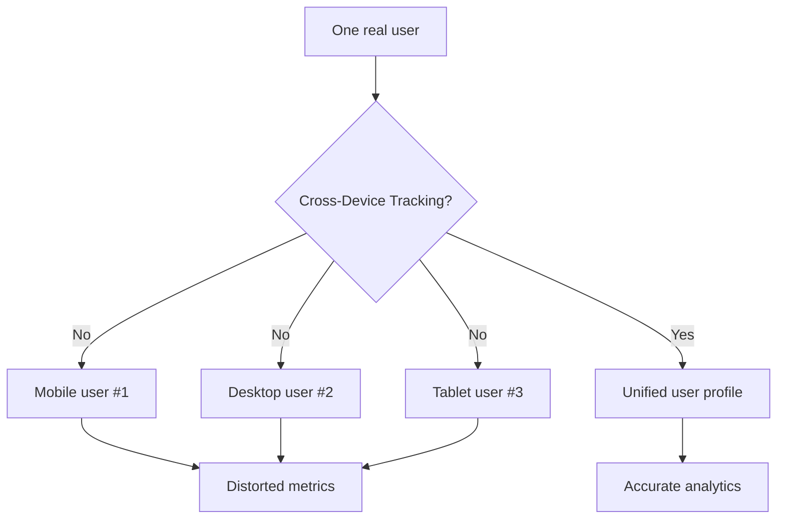
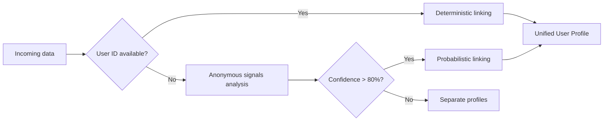
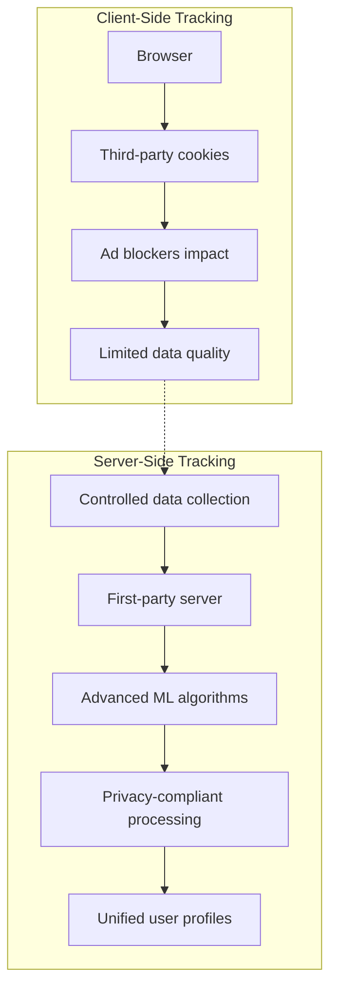

# Cross-Device Tracking: User Identification Across Multiple Devices in Web Analytics

Cross-device tracking is a technology for identifying and monitoring individual users as they interact with web resources across multiple devices. This methodology enables the unification of fragmented behavioral data from a single person using smartphones, tablets, laptops, smart TVs, and other connected devices into a unified profile to gain a complete picture of the customer journey.

## The Problem of Fragmented User Data

In today's digital ecosystem, the average user interacts with web resources through 3-4 devices daily. Without cross-device tracking technologies, each device is perceived by analytics systems as a separate user, creating critical data distortions.

!!! example "Typical Purchase Scenario"
    
    A user researches a product on their mobile phone during lunch break, compares prices on a tablet at home, and makes the purchase from their work computer:
    
    **Without cross-device tracking:**

    - 3 separate users
    - Lost attribution at all stages
    - Inaccurate conversion funnel data
    - Distorted engagement metrics
    
    **With cross-device tracking:**

    - Single user with complete journey picture
    - Accurate conversion attribution
    - Understanding of multichannel behavior

### Scale of the Problem



Research shows that without cross-device tracking, unique user counts can be inflated by 40-70%, and attribution is lost in 60-80% of cross-device conversions.

## User Identification Methods

### Deterministic Tracking

The deterministic method uses explicit identifiers to link user devices with 100% accuracy.

**Primary identifiers:**

=== "User ID"
    
    **Characteristics:**

    - Requires user authentication
    - Maximum identification accuracy
    - Limited audience coverage
    
    **Implementation:**

    - Single account across all devices
    - Email or username synchronization
    - CRM integration for B2B scenarios

=== "Email-based matching"
    
    **Characteristics:**

    - Wide coverage for e-commerce
    - High accuracy for repeat customers
    - Dependency on user behavior
    
    **Application:**

    - Newsletter subscription
    - Checkout process
    - Customer support interactions

=== "Phone number linking"
    
    **Characteristics:**

    - Effective for mobile applications
    - Requires SMS verification
    - Geographic limitations
    
    **Usage:**

    - Two-factor authentication
    - Mobile app onboarding
    - Cross-platform messaging

### Probabilistic Tracking

Probabilistic matching uses machine learning algorithms to determine the likelihood that devices belong to the same user based on anonymous signals.

**Analyzed signals:**

| Category | Parameters | Accuracy |
|----------|------------|----------|
| Network | IP address, ISP, geolocation | 60-75% |
| Device | User Agent, screen resolution, timezone | 45-60% |
| Behavioral | Activity time, navigation patterns | 70-85% |
| Contextual | Simultaneous sessions, shared referrers | 65-80% |

!!! info "Probabilistic Matching Algorithms"
    
    Modern systems use a combination of methods:

    - Machine learning clustering (K-means, DBSCAN)
    - Graph-based connectivity analysis
    - Temporal behavior correlation
    - Bayesian probability models
    
    Accuracy ranges from 75-90% with sufficient data volume.

### Hybrid Approach

Most modern analytics platforms apply a combined strategy, using deterministic data for high-confidence matches and probabilistic methods to expand coverage.



## Privacy Limitations and Regulation

### iOS App Tracking Transparency (ATT)

With the introduction of ATT in iOS 14.5 (April 2021), Apple required explicit opt-in for IDFA (Identifier for Advertisers) access.

**Impact on cross-device tracking:**

- Opt-in rate is approximately 25% in 2025
- Loss of visibility for 75% of iOS users
- Need for alternative identification methods
- SKAdNetwork as privacy-preserving alternative

!!! warning "Compliance Requirements"
    
    ATT requires:

    - Explicit user consent
    - Transparency in tracking purpose descriptions
    - Prohibition of repeated requests after denial
    - No tracking without consent

### GDPR and International Regulation

European regulation imposes strict limitations on personal data collection and processing.

**Key requirements:**

=== "Lawful basis"
    
    **Permitted grounds:**

    - Explicit user consent
    - Contractual necessity
    - Legitimate interests (with balance test)
    - Vital interests protection
    
    **Prohibited practices:**

    - Forced consent through service denial
    - Pre-ticked checkboxes
    - Bundled consent for unrelated purposes

=== "Data minimisation"
    
    **Principles:**

    - Collection of necessary data only
    - Purpose limitation
    - Storage limitation
    - Accuracy requirements
    
    **Practical implementation:**

    - Audit of collected parameters
    - Regular data retention reviews
    - User data access/deletion rights

### Chrome Privacy Sandbox and Third-Party Cookies

Google is phasing out third-party cookies in Chrome, offering Privacy Sandbox APIs as replacement.

**New technologies:**

- **Topics API**: Interest-based advertising without individual tracking
- **FLEDGE**: Remarketing through on-device auctions
- **Attribution Reporting**: Conversion measurement with privacy protection
- **Trust Tokens**: Fraud prevention without fingerprinting

## Technical Challenges and Accuracy

### Cookie-Based Tracking Limitations

Traditional cross-device tracking through cookies faces multiple limitations:

**Browser restrictions:**

- Safari ITP (Intelligent Tracking Prevention)
- Firefox Enhanced Tracking Protection
- Chrome SameSite cookies policy
- Incognito/private browsing modes

**Technical challenges:**

| Problem | Impact | Mitigation |
|---------|--------|------------|
| Cookie blocking | 30-45% tracking loss | First-party data focus |
| Different browsers | Fragmented identity | Server-side unification |
| Mobile app gaps | iOS/Android separation | SDK fingerprinting |
| Cross-domain limits | Subdomain restrictions | CNAME implementation |

### Accuracy of Different Methods

Comparative analysis of cross-device identification accuracy:

!!! info "Identification Methods by Accuracy"
    
    **High accuracy (90-100%):**

    - Authenticated user sessions
    - Email-based deterministic matching
    - Phone number verification
    - CRM system integration
    
    **Medium accuracy (70-89%):**

    - IP + behavioral pattern analysis
    - Device fingerprinting + timing correlation
    - Geolocation + usage patterns
    - Hybrid probabilistic models
    
    **Low accuracy (40-69%):**

    - Pure IP-based matching
    - Single-signal probabilistic
    - Cookie-only identification
    - Basic user agent analysis

## Technology Solutions and Architecture

### Server-Side Tracking Implementation

Server-side approach provides greater control over cross-device identification and privacy compliance.

**Architectural advantages:**



**Implementation considerations:**

- Event streaming through secure APIs
- Real-time identity resolution
- Centralized data governance
- Privacy-by-design architecture

### Machine Learning for Identity Resolution

Advanced algorithms improve probabilistic matching accuracy:

**Feature engineering:**

- Temporal behavioral patterns
- Device capability clustering
- Network topology analysis
- Content consumption similarity

**Model architectures:**

- Graph Neural Networks for device relationships
- LSTM for sequential behavior modeling
- Ensemble methods for confidence scoring
- Active learning for continuous improvement

## Impact on Marketing and Personalization

### Attribution Modeling

Cross-device tracking fundamentally changes attribution analysis:

**Traditional single-device attribution:**
```
Display ad (Mobile) → Direct visit (Desktop) → Conversion
❌ Credit: Direct traffic
```

**Cross-device attribution:**
```
Display ad (Mobile) → Direct visit (Desktop) → Conversion
✅ Credit: Display campaign
```

### Personalization Strategies

Unified user profiles enable sophisticated personalization:

=== "Context-aware personalization"
    
    **Mobile context:**

    - Location-based recommendations
    - Time-sensitive offers
    - Quick checkout options
    - Simplified content format
    
    **Desktop context:**

    - Detailed product comparisons
    - Extended content consumption
    - Complex configuration tools
    - Multi-step processes

=== "Cross-device journey optimization"
    
    **Seamless experience:**

    - Shopping cart synchronization
    - Content bookmarking
    - Progressive onboarding
    - Consistent UI/UX adaptations
    
    **Smart handoff:**

    - Mobile research → Desktop purchase
    - Desktop planning → Mobile execution
    - Context-sensitive notifications

## Future of Cross-Device Tracking

### Privacy-First Innovations

The industry is moving toward privacy-preserving methods:

**Emerging technologies:**

- **Differential privacy**: Mathematical anonymization guarantees
- **Federated learning**: On-device machine learning without data sharing
- **Homomorphic encryption**: Computation on encrypted data
- **Secure multi-party computation**: Collaborative analytics without exposure

### Industry Consolidation Trends

Stricter privacy regulation leads to concentration of cross-device tracking capabilities among major platforms:

- **Walled gardens**: Apple, Google, Meta ecosystem tracking
- **First-party data advantages**: Authenticated user experiences
- **Enterprise solutions**: CDP (Customer Data Platform) adoption
- **Consent management**: Unified privacy frameworks

## Implementation Best Practices

### Privacy-Compliant Setup

!!! tip "Implementation Recommendations"
    
    **Legal compliance:**

    - Transparent privacy policies
    - Granular consent mechanisms
    - Regular compliance audits
    - User data access/deletion workflows
    
    **Technical best practices:**

    - Server-side tracking priority
    - First-party data maximization
    - Probabilistic backup methods
    - Real-time consent enforcement

### Data Quality Optimization

- **Identity resolution QA**: Regular accuracy testing
- **Duplicate detection**: Advanced deduplication algorithms  
- **Cross-device validation**: Multi-signal verification
- **Continuous model training**: Machine learning improvements

Cross-device tracking remains a critical capability for understanding modern user behavior but requires careful balance between business insights and user privacy. Successful implementations focus on transparent, consent-based approaches with strong technical foundations.

We are developing solutions for cross-device analytics that incorporate a privacy-first approach using advanced machine learning for identity resolution. Our platform will provide unified user profiles while complying with all international privacy requirements.

--8<-- "snippets/ai.md"

!!! success "Ready to get the complete picture of user behavior?"
    
    Sign up for a free trial of our analytics platform. Get privacy-compliant cross-device tracking, unified user profiles, and accurate attribution across all touchpoints without technical complexities.