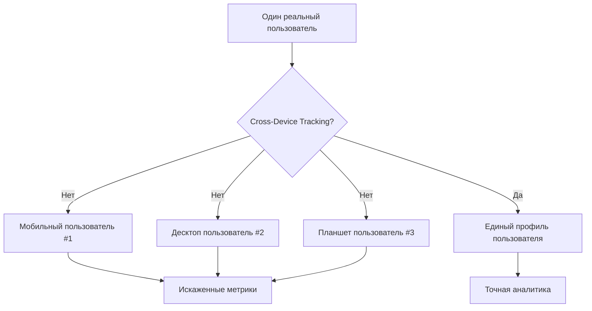
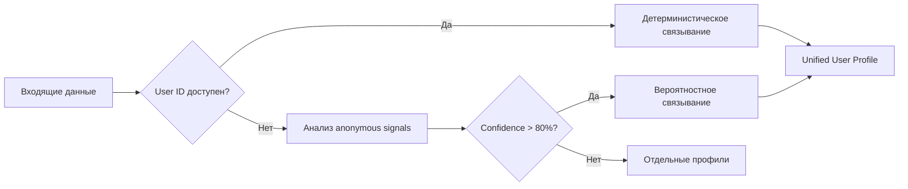
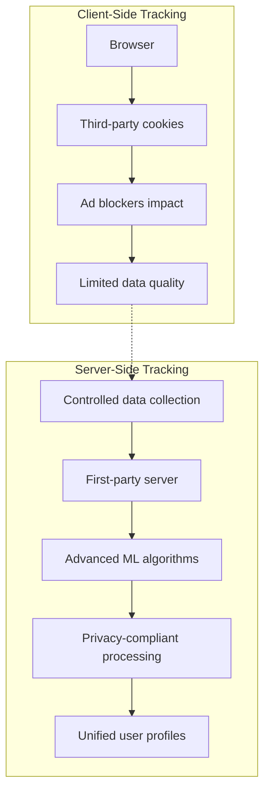

# Cross-Device Tracking: идентификация пользователей между устройствами в веб-аналитике

Cross-device tracking — технология идентификации и отслеживания одного пользователя при его взаимодействии с веб-ресурсами через множественные устройства. Эта методология позволяет объединить фрагментированные данные о поведении одного человека, который использует смартфон, планшет, ноутбук, smart TV и другие подключенные устройства, в единый профиль для получения полной картины customer journey.

## Проблема фрагментации пользовательских данных

В современной цифровой экосистеме среднестатистический пользователь взаимодействует с веб-ресурсами через 3-4 устройства ежедневно. Без технологий cross-device tracking каждое устройство воспринимается аналитическими системами как отдельный пользователь, что создает критические искажения в данных.

!!! example "Типичный сценарий покупки"
    
    Пользователь исследует товар на мобильном телефоне во время обеденного перерыва, сравнивает цены на планшете дома и совершает покупку с рабочего компьютера:
    
    **Без cross-device tracking:**

    - 3 отдельных пользователя
    - Потеря attribution на всех этапах
    - Неточные данные о conversion funnel
    - Искаженные метрики engagement
    
    **С cross-device tracking:**

    - Единый пользователь с полной картиной journey
    - Точная атрибуция конверсии
    - Понимание мультиканального поведения

### Масштаб проблемы



Исследования показывают, что без межустройственного отслеживания количество уникальных пользователей может быть завышено на 40-70%, а attribution теряется в 60-80% cross-device конверсий.

## Методы идентификации пользователей

### Детерминистическое отслеживание

Детерминистический метод использует явные идентификаторы для связывания устройств пользователя с 100% точностью.

**Основные идентификаторы:**

=== "User ID"
    
    **Характеристики:**

    - Требует авторизации пользователя
    - Максимальная точность идентификации
    - Ограниченное покрытие аудитории
    
    **Реализация:**

    - Единый аккаунт для всех устройств
    - Синхронизация через email или username
    - CRM-интеграция для B2B сценариев

=== "Email-based matching"
    
    **Характеристики:**

    - Широкое покрытие для e-commerce
    - Высокая точность для repeat customers
    - Зависимость от пользовательского поведения
    
    **Применение:**

    - Newsletter subscription
    - Checkout процесс
    - Customer support взаимодействия

=== "Phone number linking"
    
    **Характеристики:**

    - Эффективно для мобильных приложений
    - Требует SMS verification
    - Географические ограничения
    
    **Использование:**

    - Two-factor authentication
    - Mobile app onboarding
    - Cross-platform messaging

### Вероятностное отслеживание

Probabilistic matching использует алгоритмы машинного обучения для определения вероятности принадлежности устройств одному пользователю на основе anonymous signals.

**Анализируемые сигналы:**

| Категория | Параметры | Точность |
|-----------|-----------|----------|
| Сетевые | IP-адрес, ISP, геолокация | 60-75% |
| Устройство | User Agent, разрешение экрана, timezone | 45-60% |
| Поведенческие | Время активности, паттерны навигации | 70-85% |
| Контекстуальные | Одновременные сессии, общие referrers | 65-80% |

!!! info "Алгоритмы вероятностного matching"
    
    Современные системы используют комбинацию методов:

    - Machine learning clustering (K-means, DBSCAN)
    - Graph-based connectivity analysis
    - Temporal behavior correlation
    - Bayesian probability models
    
    Точность составляет 75-90% при достаточном объеме данных.

### Гибридный подход

Большинство современных платформ аналитики применяют комбинированную стратегию, используя детерминистические данные для high-confidence matches и probabilistic методы для расширения покрытия.



## Ограничения privacy и регулирование

### iOS App Tracking Transparency (ATT)

С введением ATT в iOS 14.5 (апрель 2021) Apple потребовала explicit opt-in для доступа к IDFA (Identifier for Advertisers).

**Влияние на cross-device tracking:**

- Opt-in rate составляет около 25% в 2025 году
- Потеря visibility для 75% iOS пользователей
- Необходимость альтернативных методов идентификации
- SKAdNetwork как privacy-preserving alternative

!!! warning "Compliance требования"
    
    ATT требует:

    - Explicit пользовательское согласие
    - Прозрачность в описании tracking целей
    - Запрет на повторные запросы после отказа
    - Отсутствие tracking без согласия

### GDPR и международное регулирование

Европейское регулирование накладывает строгие ограничения на сбор и обработку персональных данных.

**Ключевые требования:**

=== "Lawful basis"
    
    **Допустимые основания:**

    - Explicit consent пользователя
    - Contractual necessity
    - Legitimate interests (с balance test)
    - Vital interests защиты
    
    **Запрещенные практики:**

    - Forced consent через service denial
    - Pre-ticked checkboxes
    - Bundled consent для несвязанных целей

=== "Data minimisation"
    
    **Принципы:**

    - Сбор только необходимых данных
    - Purpose limitation
    - Storage limitation
    - Accuracy requirements
    
    **Практическая реализация:**

    - Аудит собираемых parameters
    - Regular data retention reviews
    - User data access/deletion rights

### Chrome Privacy Sandbox и третий party cookies

Google поэтапно отказывается от third-party cookies в Chrome, предлагая Privacy Sandbox API как замену.

**Новые технологии:**

- **Topics API**: Interest-based advertising без individual tracking
- **FLEDGE**: Remarketing через on-device auctions
- **Attribution Reporting**: Conversion measurement с privacy protection
- **Trust Tokens**: Fraud prevention без fingerprinting

## Технические проблемы и точность

### Ограничения cookie-based tracking

Traditional cross-device tracking через cookies сталкивается с множественными ограничениями:

**Browser restrictions:**

- Safari ITP (Intelligent Tracking Prevention)
- Firefox Enhanced Tracking Protection
- Chrome SameSite cookies policy
- Incognito/private browsing modes

**Technical challenges:**

| Проблема | Влияние | Mitigation |
|----------|---------|------------|
| Cookie blocking | 30-45% потеря tracking | First-party data focus |
| Different browsers | Fragmented identity | Server-side unification |
| Mobile app gaps | iOS/Android separation | SDK fingerprinting |
| Cross-domain limits | Subdomain restrictions | CNAME implementation |

### Точность различных методов

Comparative analysis точности cross-device identification:

!!! info "Методы идентификации по точности"
    
    **Высокая точность (90-100%):**

    - Authenticated user sessions
    - Email-based deterministic matching
    - Phone number verification
    - CRM system integration
    
    **Средняя точность (70-89%):**

    - IP + behavioral pattern analysis
    - Device fingerprinting + timing correlation
    - Geolocation + usage patterns
    - Hybrid probabilistic models
    
    **Низкая точность (40-69%):**

    - Pure IP-based matching
    - Single-signal probabilistic
    - Cookie-only identification
    - Basic user agent analysis

## Технологические решения и архитектура

### Server-side tracking реализация

Server-side approach обеспечивает больший контроль над cross-device identification и compliance с privacy требованиями.

**Архитектурные преимущества:**



**Implementation considerations:**

- Event streaming через secure APIs
- Real-time identity resolution
- Centralized data governance
- Privacy-by-design architecture

### Machine Learning для identity resolution

Advanced алгоритмы повышают точность probabilistic matching:

**Feature engineering:**

- Temporal behavioral patterns
- Device capability clustering
- Network topology analysis
- Content consumption similarity

**Model architectures:**

- Graph Neural Networks для device relationships
- LSTM для sequential behavior modeling
- Ensemble методы для confidence scoring
- Active learning для continuous improvement

## Влияние на маркетинг и персонализацию

### Attribution modeling

Cross-device tracking кардинально меняет attribution анализ:

**Traditional single-device attribution:**
```
Display ad (Mobile) → Direct visit (Desktop) → Conversion
❌ Credit: Direct traffic
```

**Cross-device attribution:**
```
Display ad (Mobile) → Direct visit (Desktop) → Conversion
✅ Credit: Display campaign
```

### Personalization strategies

Unified user profiles позволяют создавать sophisticated персонализацию:

=== "Context-aware personalization"
    
    **Мобильный контекст:**

    - Location-based рекомендации
    - Time-sensitive offers
    - Quick checkout options
    - Simplified content format
    
    **Desktop контекст:**

    - Детальные product comparisons
    - Extended content consumption
    - Complex configuration tools
    - Multi-step processes

=== "Cross-device journey optimization"
    
    **Seamless experience:**

    - Shopping cart synchronization
    - Content bookmarking
    - Progressive onboarding
    - Consistent UI/UX adaptations
    
    **Smart handoff:**

    - Mobile research → Desktop purchase
    - Desktop planning → Mobile execution
    - Context-sensitive notifications

## Будущее cross-device tracking

### Privacy-first innovations

Индустрия движется к privacy-preserving методам:

**Emerging technologies:**

- **Differential privacy**: Математические гарантии anonymization
- **Federated learning**: On-device machine learning без data sharing
- **Homomorphic encryption**: Computation on encrypted data
- **Secure multi-party computation**: Collaborative analytics без exposure

### Industry consolidation trends

Ужесточение privacy регулирования ведет к концентрации возможностей cross-device tracking у крупных платформ:

- **Walled gardens**: Apple, Google, Meta ecosystem tracking
- **First-party data advantages**: Authenticated user experiences
- **Enterprise solutions**: CDP (Customer Data Platform) adoption
- **Consent management**: Unified privacy frameworks

## Лучшие практики implementation

### Privacy-compliant setup

!!! tip "Рекомендации по implementation"
    
    **Legal compliance:**

    - Transparent privacy policies
    - Granular consent mechanisms
    - Regular compliance audits
    - User data access/deletion workflows
    
    **Technical best practices:**

    - Server-side tracking priority
    - First-party data maximization
    - Probabilistic backup methods
    - Real-time consent enforcement

### Data quality optimization

- **Identity resolution QA**: Regular accuracy testing
- **Duplicate detection**: Advanced deduplication algorithms  
- **Cross-device validation**: Multi-signal verification
- **Continuous model training**: Machine learning improvements

Cross-device tracking остается critical capability для понимания современного пользовательского поведения, но требует careful balance между business insights и user privacy. Успешные implementation фокусируются на transparent, consent-based approaches с strong technical foundation.

Мы разрабатываем решения для cross-device analytics, которые предусматривают privacy-first подход с использованием advanced machine learning для identity resolution. Наша платформа будет предоставлять unified user profiles с соблюдением всех международных privacy требований.

--8<-- "snippets/ai.ru.md"

!!! success "Готовы получить полную картину пользовательского поведения?"
    
    Зарегистрируйтесь для бесплатного тестирования нашей аналитической платформы. Получите privacy-compliant cross-device tracking, unified user profiles и точную attribution across всех touchpoints без технических сложностей.